

### Universidad Peruana de Ciencias Aplicadas
### Inegeneria de Software
### 2026-1

### NRC: 12029
### Docente: Hugo Allan Mori Paiva
### Informe de Trabajo Final

###  HydroTeam
###  TankIQ

   
|**Code**|**Member**|
|---------------------|--------------------|
|U202310436 |Espinar Martínez Gabriel Ferran|
|U202410772 |Razuri Alvarez Matias Francesco| 
|U202411282 |Montalvan Palomino Bruno Rodolfo| 
|U202414840 |Oroscco Ttamiña Juan Carlos| 
|U202318951 |Guevara Serrano Diego Ismael| 

### Abril 2026

# **Registro de Versiones del Informe**

| Versión | Fecha | Autor | Descripción de modificación |
|-----------|-----------|-----------|-----------|
|-----------|-----------|-----------|-----------|
|-----------|-----------|-----------|-----------|

# **Project Report Collaboration Insights**

**URL del Repositorio**: [https://github.com/hydronex-web-app-1ASI0729-2610-12029/hydro-core](https://github.com/hydronex-web-app-1ASI0729-2610-12029/hydro-core)

# ABET – EAC - Student Outcome 5

**Criterio:** La capacidad de funcionar efectivamente en un equipo cuyos miembros juntos proporcionan liderazgo, crean un entorno de colaboración e inclusivo, establecen objetivos, planifican tareas y cumplen objetivos.

En el siguiente cuadro se describe las acciones realizadas y enunciados de conclusiones por parte del grupo, que permiten sustentar el haber alcanzado el logro del ABET – EAC – Student Outcome 5.

| Criterio específico | Acciones realizadas | Conclusiones |
| :--- | :--- | :--- |
| **Trabaja en equipo para proporcionar liderazgo en forma conjunta** | | |
| **Crea un entorno colaborativo e inclusivo, establece metas, planifica tareas y cumple objetivos.** | | |

## Contenido

- [ Informe Trabajo Final ](#-informe-trabajo-final-)
    - [Universidad Peruana de Ciencias Aplicadas ](#universidad-peruana-de-ciencias-aplicadas-)
    - [Registro de versiones del Informe](#registro-de-versiones-del-informe)
    - [Project Report Collaboration Insights](#project-report-collaboration-insights)
    - [Contenido](#contenido)
    - [Student Outcome](#student-outcome)
- [Capítulo I: Introducción](#capítulo-i-introducción)
    - [1.1. Startup Profile](#11-startup-profile)
    - [1.1.1. Descripción de la Startup](#111-descripción-de-la-startup)
    - [1.1.2 Perfiles de integrantes del equipo](#112-perfiles-de-integrantes-del-equipo)
    - [1.2. Solution Profile](#12-solution-profile)
    - [1.2.1 Antecedentes y problemática](#121-antecedentes-y-problemática)
    - [1.2.2 Lean Ux Process](#122-lean-ux-process)
    - [1.2.2.1. Lean UX Problem Statements](#1221-lean-ux-problem-statements)
    - [1.2.2.2. Lean UX Assumptions](#1222-lean-ux-assumptions)
    - [1.2.2.3. Lean UX Hypothesis Statements](#1223-lean-ux-hypothesis-statements)
    - [1.2.2.4. Lean UX Canvas](#1224-lean-ux-canvas)
    - [Segmentos Objetivos](#segmentos-objetivos)
- [Capítulo II: Requeriments Elicitation \& Analysis](#capítulo-ii-requeriments-elicitation--analysis)
    - [2.1. Competidores](#21-competidores)
    - [2.1.1. Análisis competitivo](#211-análisis-competitivo)
    - [2.1.2. Estrategias y tácticas frente a competidores](#212-estrategias-y-tácticas-frente-a-competidores)
    - [2.2. Entrevistas ](#22-entrevistas-)
    - [2.2.1. Diseño de entrevistas](#221-diseño-de-entrevistas)
    - [2.2.2. Registro de entrevistas](#222-registro-de-entrevistas)
    - [2.2.3. Análisis de entrevistas](#223-análisis-de-entrevistas)
    - [2.3. Needfinding](#23-needfinding)
    - [2.3.1. User Personas](#231-user-personas)
    - [2.3.2. User Task Matrix](#232-user-task-matrix)
    - [2.3.3. User Journey Mapping](#233-user-journey-mapping)
    - [2.3.4. Empathy Mapping](#234-empathy-mapping)
    - [2.4. Big Picture EventStorming](#24-big-picture-evenstorming)
    - [2.5. Ubiquitous Language](#25-ubiquitous-language)
- [Capítulo III: Requeriments Specification](#capítulo-iii-requeriments-specification)
    - [3.1. User Stories](#31-user-stories)
    - [3.2. Impact Mapping](#32-impact-mapping)
    - [3.3. Product Backlog](#33-product-backlog)
- [Capítulo IV: Product Desing](#capítulo-iv-product-desing)
    - [4.1. Style Guidelines](#41-style-guidelines)
    - [4.1.1. General Style Guidelines](#411-general-style-guidelines)
    - [4.1.2. Web Style Guidelines](#412-web-style-guidelines)
    - [4.2. Information Architecture](#42-information-architecture)
    - [4.2.1. Organization Systems](#421-organization-systems)
    - [4.2.2. Labeling Systems](#422-labeling-systems)
    - [4.2.3. SEO Tags and Meta Tags](#423-seo-tags-and-meta-tags)
    - [4.2.4. Searching Systems](#424-searching-systems)
    - [4.2.5. Navigation Systems](#425-navigation-systems)
    - [4.3. Landing Page UI Desing](#43-landing-page-ui-desing)
    - [4.3.1. Landing Page Wireframes](#431-landing-page-wireframes)
    - [4.3.2. Landing Page Mock-Up](#432-landing-page-mock-up)
    - [4.4. Web Applications UX/UI Desing](#44-web-applications-uxui-desing)
    - [4.4.1. Web Applications Wireframes](#441-web-applications-wireframes)
    - [4.4.2. Web Applications Wireflow Diagrams](#442-web-applications-wireflow-diagrams)
    -[4.4.3. Web Applications Mock-ups](#443-web-applications-mock-ups-diagrams)
    - [4.4.4. Web Applications User Flow Diagrams](#444-web-applications-user-flow-diagrams)
    - [4.5. Web Applications Prototyping](#45-web-applications-prototyping)
    - [4.6.1. Design-Level EventStorming](#461-design-level-eventstorming)
    - [4.6.2. Software Architecture Context Diagram](#462-software-architecture-context-diagram)
    - [4.6.3. Software Architecture Container Diagram](#463-software-architecture-container-diagram)
    - [4.6.4. Software Architecture Components Diagram](#464-software-architecture-components-diagram)
    - [4.7. Software Object-Oriented Desing](#47-software-object-oriented-desing)
    - [4.7.1. Class Diagram](#471-class-diagram)
    - [4.8. Database Desing](#48-database-desing)
    - [4.8.1. Database Diagrams](#481-database-diagrams)
- [Capítulo V: Product Implementation, Validation \& Deployment](#capítulo-v-product-implementation-validation--deployment)
    - [5.1. Software Configuration Management](#51-software-configuration-management)
    - [5.1.1. Software Development Environment Configuration](#511-software-development-environment-configuration)
    - [5.1.2. Source Code Management](#512-source-code-management)
    - [5.1.3. Source Code Style Guide \& Conventions](#513-source-code-style-guide--conventions)
    - [5.1.4. Software Deployment Configuration](#514-software-deployment-configuration)
    - [5.2. Landing Page, Service \& Applications Implementation](#52-landing-page-service--applications-implementation)
    - [5.2.1. Sprint](#52x-sprint)
    -  [5.2.1.1. Sprint Planning 1](#5211-Sprint-Planning1)
    -  [5.2.1.2. Aspect Leaders and Collaborators](#5212-Aspect-Leaders-and-Collaborators)
    -  [5.2.1.3. Sprint Backlog 1](#5213-Sprint-Backlog-1)
    -  [5.2.1.4. Development Evidence for Sprint Review](#5214-Development-Evidence-for-Sprint-Review)
    -  [5.2.1.5. Execution Evidence for Sprint Review](#5215-Execution-Evidence-for-Sprint-Review)
    -  [5.2.1.6. Services Documentation Evidence for Sprint Review](#5216-Services-Documentation-Evidence-for-Sprint-Review)
    -  [5.2.1.7. Software Deployment Evidence for Sprint Review](#5217-Software-Deployment-Evidence-for-Sprint-Review)
    -  [5.2.1.8. Team Collaboration Insights during Sprint](#5218-Team-Collaboration-Insights-during-Sprint)
    -  [Conclusiones](#Conclusiones)
    -  [Bibliografía](#Bibliografía)
    -  [Anexos](#Anexos)

# Capítulo 1: Introducción

## 1.1. Startup Profile

### 1.1.1. Descripción de la Startup

### 1.1.2. Perfiles de integrantes del equipo

## 1.2. Solution Profile
    
### 1.2.1 Antecedentes y problemática

    
### 1.2.2 Lean UX Process.
    
### 1.2.2.1. Lean UX Problem Statements.

### 1.2.2.2. Lean UX Assumptions.

### 1.2.2.3. Lean UX Hypothesis Statements.
    
### 1.2.2.4. Lean UX Canvas.
    

## 1.3. Segmentos objetivo.
    
# Capítulo II: Requirements Elicitation & Analysis
    
## 2.1. Competidores.
    
### 2.1.1. Análisis competitivo.
    
### 2.1.2. Estrategias y tácticas frente a competidores.
    
## 2.2. Entrevistas.
    
### 2.2.1. Diseño de entrevistas.
    
### 2.2.2. Registro de entrevistas.
    
### 2.2.3. Análisis de entrevistas.
    
## 2.3. Needfinding.
    
### 2.3.1. User Personas.
    
### 2.3.2. User Task Matrix.

### 2.3.3. User Journey Mapping.

### 2.3.4. Empathy Mapping.
    
## 2.4. Big Picture EventStorming.
    
## 2.5. Ubiquitous Language.
    
# Capítulo III: Requirements Specification
  
## 3.1. User Stories.
   
## 3.2. Impact Mapping.
    
## 3.3. Product Backlog.
    
# Capítulo IV: Product Design
   
## 4.1. Style Guidelines

### 4.1.1. General Style Guidelines

**Branding**

TankIQ es una plataforma orientada a la gestión inteligente del suministro de agua en edificios residenciales. La identidad visual debe transmitir confianza, modernidad y simplicidad, valores esenciales para un producto dirigido a administradores de edificios y propietarios que no necesariamente tienen formación técnica. El nombre TankIQ combina la idea de "tanque" (cisterna) con "IQ" (inteligencia), reflejando la propuesta de valor central: llevar inteligencia a un proceso que hoy se gestiona de forma manual e intuitiva.

**Colores**

La paleta de colores de TankIQ está construida sobre la combinación de gris oscuro y celeste, transmitiendo profesionalismo, modernidad y una asociación directa con el agua como recurso central del producto. Adicionalmente se definen colores de estado que comunican de forma intuitiva el nivel de riesgo del suministro de agua, elemento central de la experiencia de usuario.

A continuación se presentan los colores que conforman la paleta principal:

**Celeste Principal: `#29ABE2`**
Color de marca principal. Se utiliza en botones primarios, íconos destacados, enlaces activos y elementos que requieren llamar la atención del usuario. Representa el agua y la tecnología.

    

**Gris Oscuro: `#2D2D2D`**
Color base para texto principal, encabezados y el fondo del navbar. Aporta seriedad y contraste sin recurrir al negro puro, lo que suaviza la experiencia visual.

    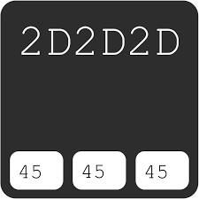

**Gris Medio: `#5A5A5A`**
Se utiliza para texto secundario, subtítulos y etiquetas. Mantiene la jerarquía visual sin competir con el texto principal.

    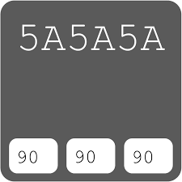

**Gris Claro: `#F4F4F4`**
Color de fondo para secciones, tarjetas y áreas de contenido. Genera separación visual entre bloques sin recurrir a bordes marcados.

    

**Rojo Alerta: `#E53935`**
Reservado exclusivamente para alertas críticas, nivel de cisterna bajo y mensajes de error. Su uso está restringido a situaciones que requieren atención inmediata del usuario.

    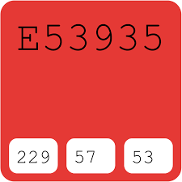

**Verde Estado: `#43A047`**
Se utiliza para indicar estado normal u óptimo del nivel de la cisterna, confirmaciones y acciones completadas exitosamente.

    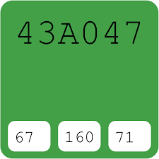

**Tipografía**

Utilizamos **Inter** como tipografía principal para todos los productos digitales. Inter es una fuente sans serif moderna diseñada específicamente para interfaces digitales, con excelente legibilidad en pantallas de distintos tamaños y en contextos de uso con poca luz, característica relevante dado que muchos administradores de edificios consultarán la plataforma desde sus teléfonos en condiciones variadas.

Los títulos principales (H1) se presentan en Inter Bold a 32px, los títulos secundarios (H2) en Inter SemiBold a 24px y los títulos terciarios (H3) en Inter SemiBold a 20px. El cuerpo de texto utiliza Inter Regular a 14px, mientras que las etiquetas y textos de apoyo utilizan Inter Regular a 12px. Los botones utilizan Inter Medium a 14px para mantener legibilidad y diferenciación respecto al texto corrido.

**Espaciado**

El sistema de espaciado de TankIQ está basado en múltiplos de 8px, siguiendo las convenciones de Material Design. Esto garantiza consistencia visual y facilita la implementación por parte del equipo de desarrollo. Los valores definidos van desde 4px para separaciones mínimas entre elementos muy cercanos, hasta 48px para la separación entre secciones principales del Landing Page. El espaciado estándar de padding interno en tarjetas y secciones es de 16px.
 
**Tono de comunicación**

TankIQ adopta un tono **cercano y simple**, orientado a usuarios que no necesariamente tienen formación técnica. El lenguaje se dirige directamente al usuario de forma empática, usando términos del día a día del administrador de edificios en lugar de jerga tecnológica. Aunque el tono es cercano, se mantiene un registro profesional que transmite confianza y seriedad.

Las cuatro dimensiones del tono de TankIQ son las siguientes. Primero, **cercano y no distante**: los mensajes empatizan con la situación cotidiana del usuario, usando "tú" en lugar de "usted". Segundo, **simple y no técnico**: se evita exponer al usuario a términos de ingeniería o IoT; la plataforma habla en términos del problema que resuelve, no de la tecnología que usa. Tercero, **sereno y no alarmista**: incluso en alertas críticas, el lenguaje es claro y orientado a la acción. Cuarto, **profesional y no informal**: se evitan coloquialismos o expresiones demasiado informales que puedan restar credibilidad al producto.

Por ejemplo, cuando la cisterna llega a un nivel crítico, TankIQ no muestra "ERROR CRÍTICO: Nivel de agua insuficiente detectado", sino "Tu cisterna está al 15%. Es momento de pedir una recarga." Cuando el usuario abre el dashboard, en lugar de "Sistema de monitoreo IoT inicializado correctamente", TankIQ muestra "Todo en orden. Aquí está el estado de tu cisterna hoy."
 

### 4.1.2. Web Style Guidelines

**Componentes de UI**

TankIQ utiliza **Angular Material** como biblioteca de componentes de interfaz, adaptando su tema visual a la paleta de colores y tipografía definidas. Los botones primarios tienen fondo celeste (`#29ABE2`), texto blanco y border radius de 8px. Los botones secundarios tienen borde celeste y fondo transparente. Las tarjetas utilizan fondo blanco con sombra suave y border radius de 12px. Los campos de formulario siguen el estilo outlined de Angular Material con color de foco celeste. La iconografía proviene de la biblioteca **Material Icons** de Google en tamaño estándar de 24px.

**Indicadores de estado de cisterna**

Dado que el estado de la cisterna es el elemento central de la experiencia de usuario, se define un sistema de indicadores visuales específico basado en el nivel de agua. Cuando el nivel se encuentra entre 60% y 100% se muestra en verde (`#43A047`) indicando nivel óptimo. Entre 30% y 59% se muestra en celeste (`#29ABE2`) indicando nivel normal. Entre 15% y 29% se muestra en naranja (`#FB8C00`) indicando nivel bajo. Por debajo del 15% se muestra en rojo (`#E53935`) indicando nivel crítico y disparando una alerta automática al administrador.

**Layout y grilla**

Se utiliza el sistema de grilla de 12 columnas de Angular Material. El contenido principal no supera los 1200px de ancho en pantallas grandes, centrado horizontalmente. El navbar tiene una altura fija de 64px en desktop y 56px en mobile. Los márgenes laterales del contenido son de 16px en mobile y 24px en tablet y desktop.

## 4.2. Information Architecture

### 4.2.1. Organization Systems

La arquitectura de información de TankIQ organiza el contenido en función de los dos segmentos objetivo y sus necesidades específicas, diferenciando claramente entre la experiencia del administrador del edificio y la del propietario o inquilino.

Para el **Landing Page**, el contenido se organiza de forma **secuencial**, guiando al visitante a través de un recorrido lógico que va desde la identificación del problema hasta la llamada a la acción. La secuencia es: presentación del problema (el dolor del desabastecimiento), propuesta de solución (TankIQ y el sensor IoT), beneficios concretos por segmento, demostración del producto y finalmente los planes de suscripción con los call to action diferenciados por segmento.

Para la **Web Application**, el contenido se organiza de forma **jerárquica**, con el dashboard principal como punto de entrada que concentra la información más crítica (nivel actual de la cisterna, proyección de días disponibles y alertas activas), desde el cual el usuario puede navegar hacia secciones de mayor detalle como el historial de consumo, el registro de recargas y los reportes para la junta de propietarios. Esta jerarquía responde directamente a la frecuencia de uso: el administrador consulta el nivel de la cisterna varias veces por semana, pero accede al historial de gastos principalmente al preparar la rendición de cuentas mensual.

El contenido de la Web Application se categoriza **por audiencia**, dado que los administradores y los propietarios tienen accesos diferenciados. El administrador accede al panel completo de monitoreo y gestión, mientras que los propietarios acceden a una vista simplificada de solo lectura con el historial de consumo y gastos.
 

### 4.2.2. Labeling Systems

El sistema de etiquetado de TankIQ prioriza la simplicidad y el lenguaje cotidiano, evitando términos técnicos que puedan resultar confusos para administradores de edificios sin formación tecnológica.

En el **navbar** de la Web Application las secciones principales se etiquetan como: **Inicio** (dashboard con el estado actual de la cisterna), **Historial** (registro de consumo y recargas), **Reportes** (documentos para la junta de propietarios) y **Configuración** (datos del edificio y umbrales de alerta).

En las **tarjetas de estado** se usan etiquetas directas como "Nivel actual", "Días estimados", "Última recarga" y "Próxima alerta", evitando términos como "porcentaje de capacidad volumétrica" o "timestamp de última sincronización". Los botones de acción usan verbos en infinitivo que indican claramente la acción: "Pedir recarga", "Ver historial", "Descargar reporte" y "Configurar alerta".

En el **Landing Page**, las secciones se etiquetan por beneficio y no por funcionalidad: "¿Cómo funciona?", "¿Cuánto puedes ahorrar?", "Para administradores" y "Para propietarios", reflejando el tono cercano y orientado al usuario definido en los style guidelines.
 

### 4.2.3. SEO Tags and Meta Tags

**Landing Page**

- **Title:** : TankIQ: Tu monitoreo inteligente de cisternas para edificios en Lima
- **Meta Description:** TankIQ te avisa cuándo tu cisterna está por agotarse. Sensor IoT + plataforma web para administradores de edificios en Lima. Evita el desabastecimiento y reduce gastos innecesarios.
- **Meta Keywords:**: monitoreo cisterna, sensor cisterna Lima, gestión agua edificios, alerta cisterna, administrador edificio Lima, SEDAPAL suministro irregular
- **Meta Author:**: HydroTeam
- **Meta Robots:**: index, follow
- **Open Graph Title:**: TankIQ: Nunca más te quedes sin agua
- **Open Graph Description:**: Plataforma IoT para monitorear el nivel de tu cisterna en tiempo real. Para administradores de edificios en Lima.

**Web Application: Dashboard**

- **Title:**: Dashboard: TankIQ
- **Meta Description:** Monitorea el nivel de tu cisterna en tiempo real, recibe alertas automáticas y gestiona el historial de consumo de tu edificio
- **Meta Robots:** noindex, nofollow
- **Meta Author:** HydroTeam

**Web Application: Reportes**

- **Title:** Reportes de consumo 
- **Meta Description:** Accede al historial de gastos en agua de tu edificio y genera reportes para tu junta de propietarios.
- **Meta Robots:** noindex, nofollow
- **Meta Author:** HydroTeam

### 4.2.4. Searching Systems

En el **Landing Page** no se implementa un sistema de búsqueda, dado que el volumen de contenido es reducido y la navegación secuencial es suficiente para que el visitante encuentre la información que necesita.

En la **Web Application**, se implementan los siguientes mecanismos de búsqueda y filtrado orientados a las tareas principales de cada segmento:

El administrador puede filtrar el **historial de recargas** por rango de fechas (última semana, último mes, últimos 3 meses, rango personalizado) y por monto, lo que le permite identificar meses con mayor gasto y justificar variaciones ante la junta de propietarios. El historial de **alertas** puede filtrarse por tipo (nivel bajo, nivel crítico, consumo anómalo) y por estado (resueltas o pendientes). Los **reportes generados** pueden buscarse por mes y año.

Los resultados de búsqueda se presentan en orden cronológico inverso por defecto (más reciente primero), dado que el usuario generalmente busca información reciente. Cuando una búsqueda no arroja resultados, la plataforma muestra un mensaje contextual que explica el motivo en lenguaje simple, por ejemplo: "No hay recargas registradas en este período. Puedes registrar una nueva recarga desde el botón de arriba."
 

### 4.2.5. Navigation Systems

El sistema de navegación de TankIQ está diseñado para minimizar la cantidad de pasos necesarios para que el administrador llegue a la información más crítica, reconociendo que muchas consultas se realizan de forma rápida desde el teléfono móvil.

En el **Landing Page**, la navegación es lineal con un **navbar fijo** en la parte superior que contiene anclas a las secciones principales de la página. En mobile, el navbar colapsa en un menú hamburguesa. Los call to action de cada segmento en el Landing Page redirigen directamente a la vista correspondiente en la Web Application: el CTA del administrador lleva al formulario de registro de edificio, y el CTA del propietario lleva a la vista de acceso con código de edificio.

En la **Web Application**, la navegación principal se implementa mediante un **sidebar** en desktop y una **bottom navigation bar** en mobile, ambos con las cuatro secciones principales: Inicio, Historial, Reportes y Configuración. Esta decisión responde al patrón de uso móvil donde el pulgar alcanza fácilmente la barra inferior. Se utiliza **navegación por breadcrumbs** en las vistas de detalle para que el usuario siempre sepa en qué parte de la jerarquía se encuentra y pueda regresar sin usar el botón atrás del navegador.

### 4.3.1. Landing Page Wireframe

El diseño de nuestros wireframes sigue la organización secuencial definida en la sección 4.2.1 y el enfoque Mobile First establecido en 4.1.2.  Las secciones de nuestra Landing Page en orden son: navbar fijo con logotipo y CTA de sesión, Hero con titular principal y dos CTAs diferenciados por segmento (administrador y propietario), sección de problemas en tres columnas, sección "¿Cómo funciona?" con tres pasos numerados, beneficios diferenciados por segmento en dos columnas, sección de ahorro estimado con datos reales del mercado limeño, planes de suscripción y footer.

**Desktop:**

**Sección Hero:** Encabezado principal con navbar fijo, titular de beneficio central, dos call to action diferenciados por segmento y vista previa del dashboard de TankIQ.

**Sección Problema:** Tres columnas que presentan los principales problemas que enfrentan los administradores de edificios en Lima con el suministro de agua de SEDAPAL.

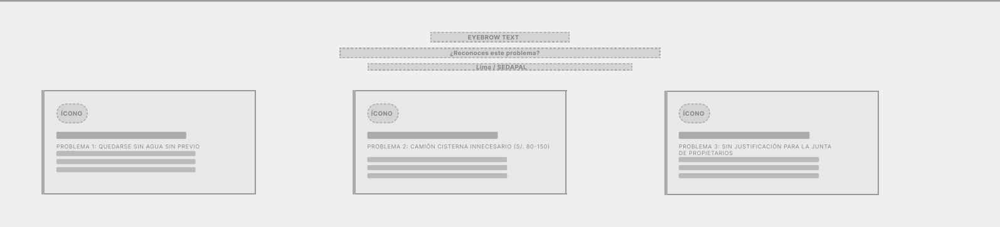

**Sección ¿Cómo funciona?:** Secuencia de tres pasos numerados que explica el funcionamiento de TankIQ, desde la instalación del sensor hasta la recepción de alertas.

**Sección Beneficios por segmento:** Dos columnas diferenciadas, una para administradores de edificios y otra para propietarios e inquilinos, cada una con su respectivo call to action.

**Sección ¿Cuánto puedes ahorrar?:** Bloque con tres métricas clave basadas en datos reales del mercado limeño y un call to action de conversión central.

**Sección Planes:** Dos tarjetas de suscripción (plan básico y plan premium) con sus características y botones de contratación diferenciados.

**Footer:** Logotipo, descripción de HydroTeam, enlaces de navegación, sección legal con términos y condiciones, y datos de contacto.

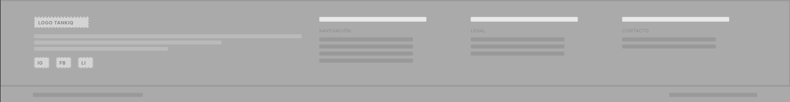

**Mobile:**

**Sección Hero:** 

**Sección Problema:** 

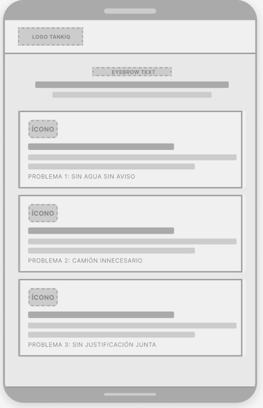

**Sección ¿Cómo funciona?:** 

**Sección Beneficios por segmento:** 

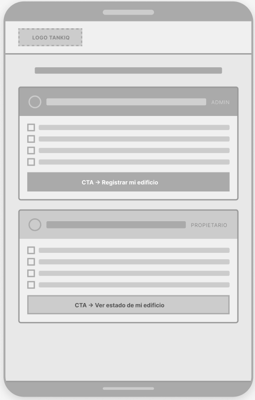

**Sección ¿Cuánto puedes ahorrar?:** 

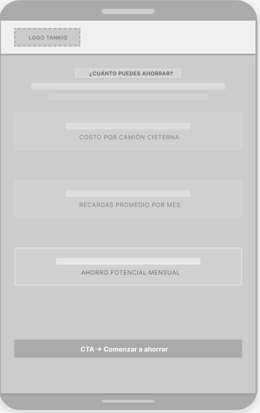

**Sección Planes:** 

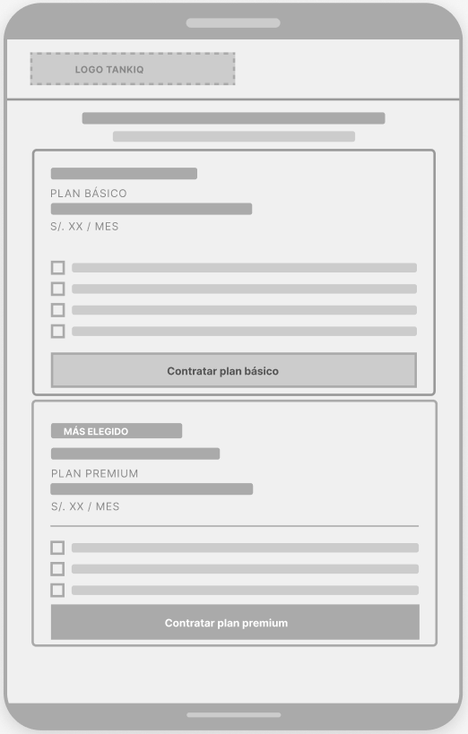

**Footer:** 

### 4.3.2. Landing Page Mock-up

En esta sección se presenta el diseño de alta fidelidad del Landing Page de TankIQ con el Design System completo aplicado: paleta de colores institucional con celeste principal `#29ABE2`, tipografía Inter en sus variantes de peso, espaciado en múltiplos de 8px y componentes de Angular Material con el tema personalizado de HydroTeam. La experiencia visual es consistente con la Web Application, de modo que el usuario que llegue a la aplicación desde el Landing Page reconozca de inmediato la misma identidad visual.

**Desktop:**

**Sección Hero:** Titular principal en Inter Bold 700, subtítulo en Gris Medio `#5A5A5A`, botón primario celeste para administradores y botón secundario con borde celeste para propietarios. Fondo con degradado hacia `#e8f6fc` y preview funcional del dashboard.

**Sección Problema:** Tarjetas con fondo Gris Claro `#F4F4F4`, borde izquierdo celeste de 4px como acento visual, íconos de Material Icons en celeste y texto en Gris Oscuro `#2D2D2D`.

**Sección ¿Cómo funciona?:** Burbujas numeradas con fondo celeste y sombra `rgba(41,171,226,.35)`. Iconos de pasos en cuadros con fondo `#e8f6fc`. Conectados por una línea degradada horizontal en desktop.

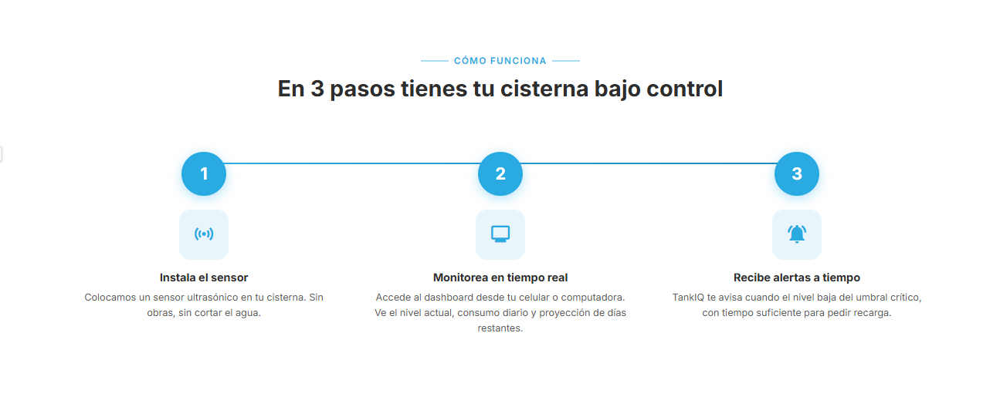

**Sección Beneficios por segmento:** Encabezado oscuro `#2D2D2D` con ícono celeste para la columna de administradores; encabezado celeste `#29ABE2` para la columna de propietarios. Ítems con ícono `check_circle` en Verde Estado `#43A047`.

**Sección ¿Cuánto puedes ahorrar?:** Fondo oscuro `#2D2D2D` con degradado. Métricas en tarjetas con borde sutil. La tarjeta de ahorro máximo lleva borde celeste y texto en `#29ABE2` para destacarla.

**Sección Planes:** Tarjetas con borde estándar para el plan básico y borde celeste de 2px con sombra `rgba(41,171,226,.18)` para el plan premium. Badge "Más elegido" con fondo celeste sobre el plan recomendado.

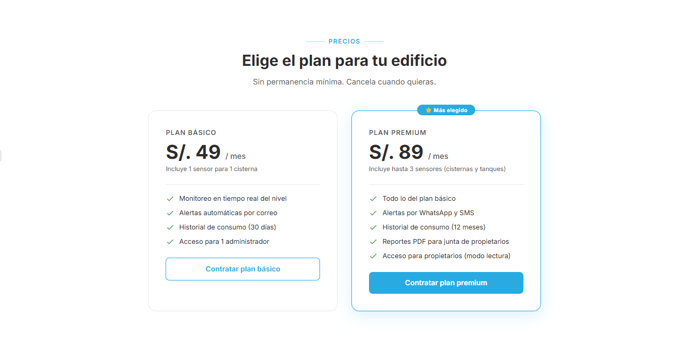

**Footer:** Fondo Gris Oscuro `#2D2D2D`, texto en `rgba(255,255,255,.5)`, logo con variante blanca, íconos de redes sociales con borde sutil y enlaces en hover celeste.

**Mobile:**

**Sección Hero:** 

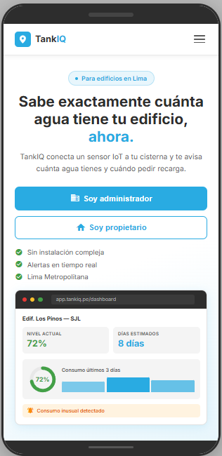

**Sección Problema:** 

**Sección ¿Cómo funciona?:** 

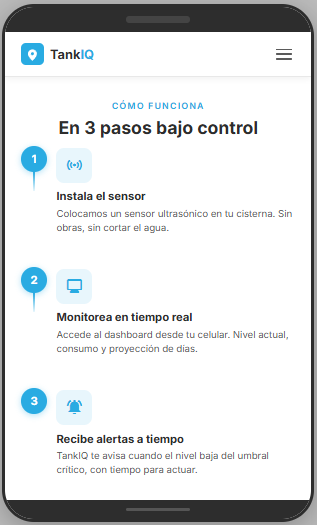

**Sección Beneficios por segmento:** 

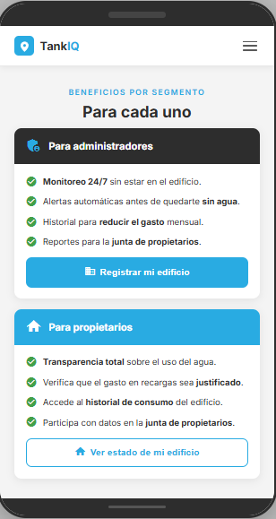

**Sección ¿Cuánto puedes ahorrar?:** 

**Sección Planes:** 

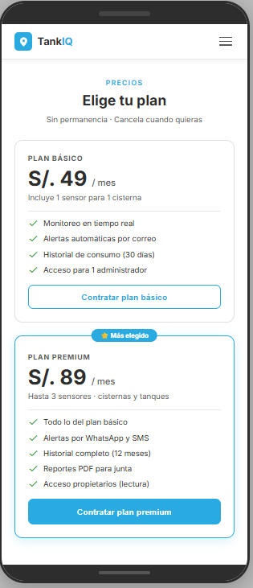

**Footer:** 

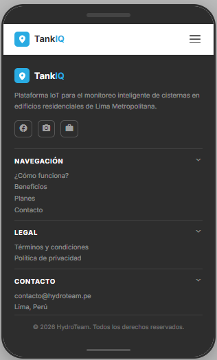

## 4.4. Web Applications UX/UI Design

### 4.4.1. Web Applications Wireframes

Los wireframes representan la estructura y distribución de los elementos de la Web Application de TankIQ en baja fidelidad, sin aplicación de color ni tipografía definitiva. Su propósito es validar la arquitectura de información, la jerarquía de contenido y la navegación antes del diseño de alta fidelidad. La aplicación incluye nueve pantallas principales organizadas bajo un layout con sidebar de 240px para el segmento administrador, y un topbar simplificado para el segmento propietario/inquilino.

**Pantalla 01: Inicio de sesión**

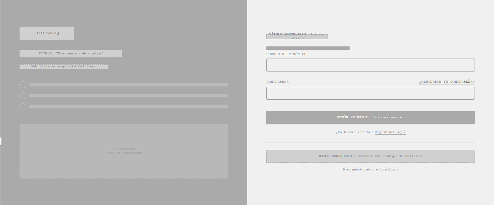

**Pantalla 02: Registro de administrador**

**Pantalla 03: Dashboard administrador**

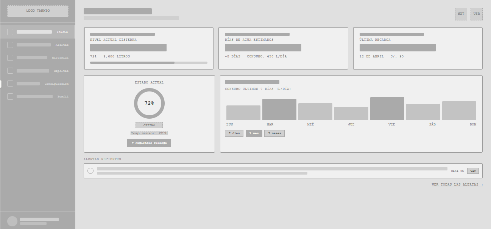

**Pantalla 04: Alertas**

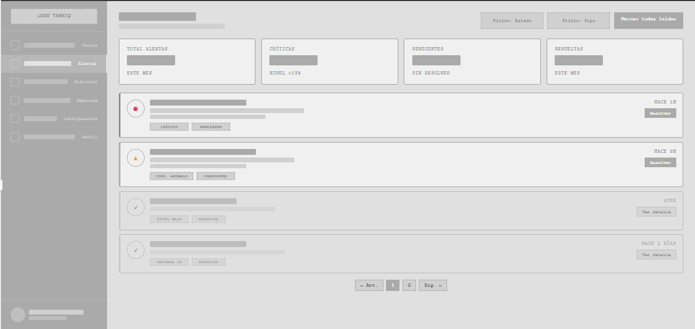

**Pantalla 05: Perfil del administrador**

**Pantalla 06: Reportes para junta de propietarios**

**Pantalla 07: Historial de recargas y consumo**

**Pantalla 08: Configuración de edificio y alertas**

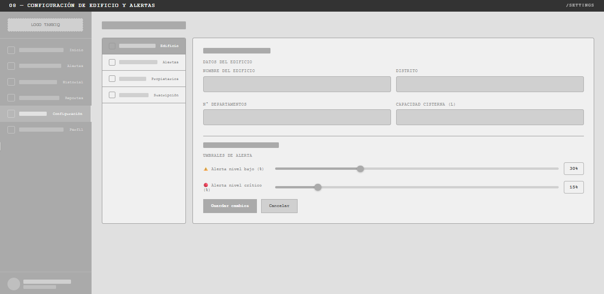

**Pantalla 09: Vista de solo lectura (propietario / inquilino)**

---

### 4.4.2. Web Applications Wireflow Diagrams

Los Wireflow Diagrams muestran la secuencia de pantallas que recorre el usuario para cumplir cada User Goal, conectadas mediante flechas que indican la dirección del flujo. Se presentan diez User Goals, seis correspondientes al segmento administrador y cuatro al segmento propietario/inquilino.

**Segmento: Administrador de edificio**

***User Goal 1:*** Como administrador del edificio, quiero visualizar el nivel actual de agua de la cisterna en tiempo real, para conocer cuánta agua disponible hay en cada momento y tomar decisiones oportunas.

*Descripción:* El administrador inicia sesión desde la Pantalla 01 (Login), ingresa sus credenciales y es redirigido directamente a la Pantalla 03 (Dashboard), donde visualiza el nivel actual en el indicador circular, las tres tarjetas de estado y el gráfico de consumo diario actualizado en tiempo real.

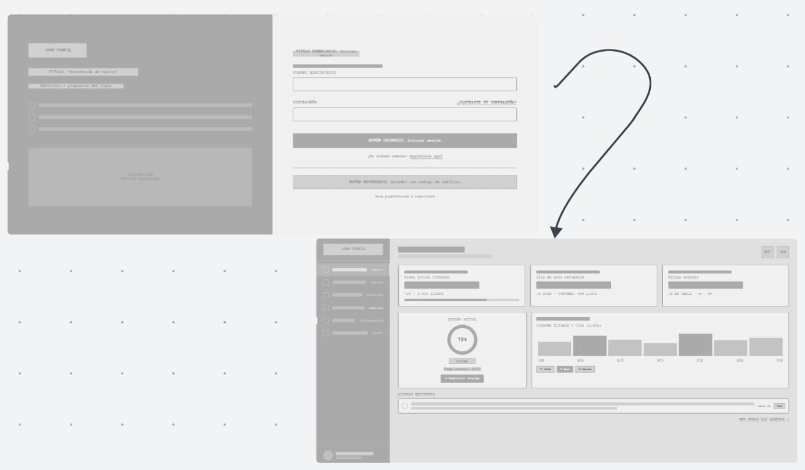

***User Goal 2:*** Como administrador del edificio, quiero recibir alertas cuando el nivel de la cisterna sea crítico, para evitar quedarme sin agua y actuar antes de que ocurra un desabastecimiento.

*Descripción:* Cuando el sensor detecta que el nivel bajó del umbral crítico configurado, aparece un badge de notificación en el ícono de campana del navbar. El administrador hace clic en el badge desde cualquier pantalla y es dirigido a la Pantalla 04 (Alertas), donde ve la alerta crítica destacada en rojo con su descripción y botón "Resolver".

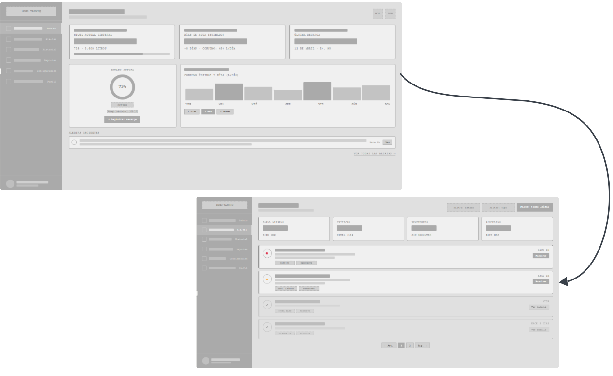

***User Goal 3:*** Como administrador del edificio, quiero visualizar una estimación de los días restantes de agua, para anticipar cuándo será necesario solicitar una recarga.

*Descripción:* Desde la Pantalla 03 (Dashboard), el administrador observa la tarjeta "Días de agua estimados" con la proyección calculada en base al consumo histórico. Para mayor detalle, navega a la Pantalla 07 (Historial), donde puede revisar el consumo diario de los últimos periodos y validar la estimación.

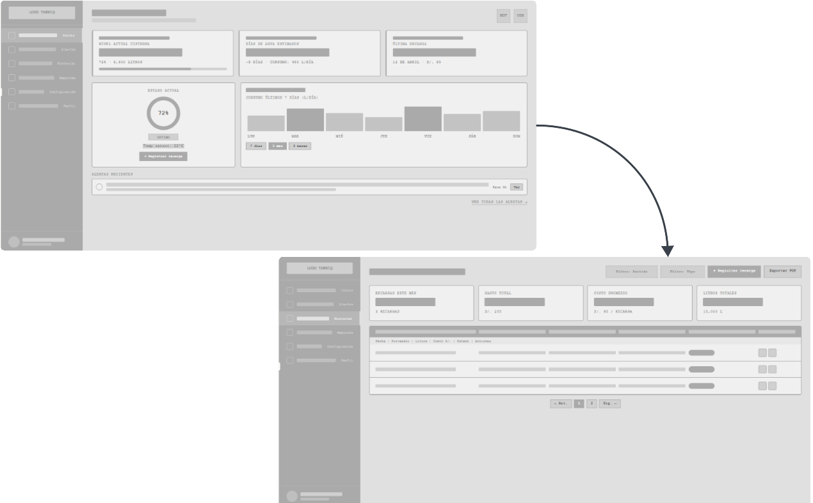

***User Goal 4:*** Como administrador del edificio, quiero contar con información clara sobre consumo y nivel actual, para decidir el momento adecuado para solicitar una recarga y evitar gastos innecesarios.

*Descripción:* El administrador consulta el Dashboard (Pantalla 03) para ver el nivel actual y los días estimados. Luego navega al Historial (Pantalla 07) para revisar el consumo de las últimas semanas y comparar con meses anteriores. Con esa información decide si solicitar o posponer la recarga.

***User Goal 5:*** Como administrador del edificio, quiero registrar cada recarga de agua realizada, para mantener un historial actualizado del consumo y abastecimiento.

*Descripción:* Desde el Dashboard (Pantalla 03) o el Historial (Pantalla 07), el administrador hace clic en "+ Registrar recarga". Se abre un modal con campos de fecha, proveedor, litros y costo. Al confirmar, el nivel de la cisterna se actualiza en el indicador circular y el registro queda guardado en la Pantalla 07 (Historial).

***User Goal 6:*** Como administrador del edificio, quiero definir el porcentaje de nivel en el que se generan alertas, para adaptar las notificaciones a las necesidades específicas del edificio.

*Descripción:* El administrador navega a la Pantalla 08 (Configuración) desde el sidebar. En la sección "Alertas" ajusta los sliders de "Alerta nivel bajo" y "Alerta nivel crítico" a los porcentajes deseados y presiona "Guardar cambios". Las alertas de la Pantalla 04 se dispararán a partir de ese momento con los nuevos umbrales.

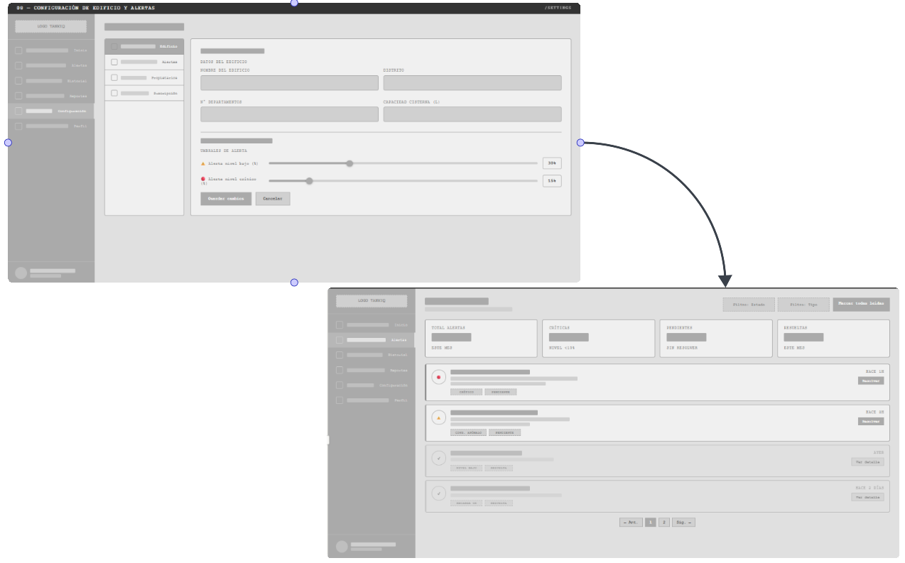

**Segmento: Propietario / Inquilino**

***User Goal 7:*** Como propietario o inquilino, quiero consultar el estado actual del nivel de agua de la cisterna, para saber si el edificio cuenta con suministro suficiente.

*Descripción:* El propietario accede desde el Landing Page haciendo clic en "Soy propietario" o desde el Login usando el código de edificio (Pantalla 01). Es redirigido directamente a la Pantalla 09 (Vista propietario), donde visualiza el nivel actual y los días de agua estimados en modo solo lectura.

***User Goal 8:*** Como propietario o inquilino, quiero visualizar el consumo histórico de agua del edificio, para entender cómo se está utilizando el recurso a lo largo del tiempo.

*Descripción:* Desde la Pantalla 09 (Vista propietario), el propietario observa el gráfico de consumo de las últimas 4 semanas. Puede cambiar el período del gráfico seleccionando entre semanas o meses para ver la evolución histórica del consumo.

***User Goal 9:*** Como propietario o inquilino, quiero revisar los gastos asociados a las recargas de agua, para comprender en qué se está invirtiendo el dinero del mantenimiento.

*Descripción:* En la Pantalla 09 (Vista propietario), el propietario consulta la tarjeta de "Gastos del mes" con el desglose de recargas, proveedor y costo de cada una. Esta información le permite verificar que los cobros en la cuota de mantenimiento son coherentes con el uso real registrado.

***User Goal 10:*** Como propietario o inquilino, quiero recibir notificaciones sobre eventos relevantes del suministro de agua, para estar informado ante posibles problemas o cortes.

*Descripción:* Cuando ocurre un evento relevante (nivel crítico, recarga realizada, consumo anómalo), el propietario recibe una notificación visible en el badge de la campana en la Pantalla 09. Al hacer clic, ve la lista de sus notificaciones personales con la descripción del evento y la fecha.

---

### 4.4.3. Web Applications Mock-ups

Los mock-ups aplican el Design System completo de TankIQ sobre la estructura definida en los wireframes. El sidebar usa el Gris Oscuro `#2D2D2D` con ítem activo resaltado en celeste `#29ABE2` y borde derecho de 3px. Las tarjetas de estado llevan borde izquierdo de color según el indicador de estado. Los botones primarios tienen fondo celeste con border radius de 8px. Los indicadores circulares SVG cambian de color según el nivel: verde `#43A047` (óptimo), celeste `#29ABE2` (normal), naranja `#FB8C00` (bajo), rojo `#E53935` (crítico).

**Pantalla 01: Inicio de sesión**

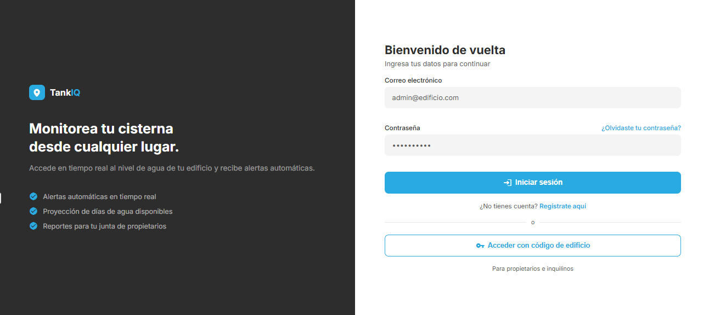

**Pantalla 02: Registro de administrador**

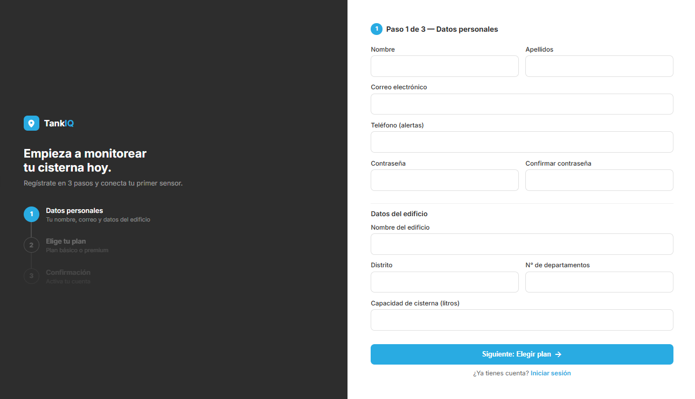

**Pantalla 03: Dashboard administrador**

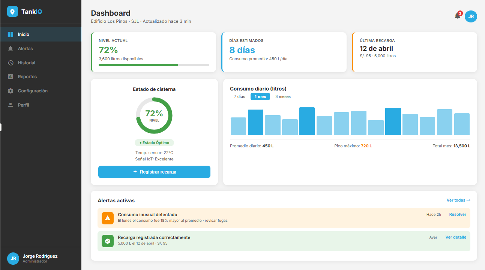

**Pantalla 04: Alertas**

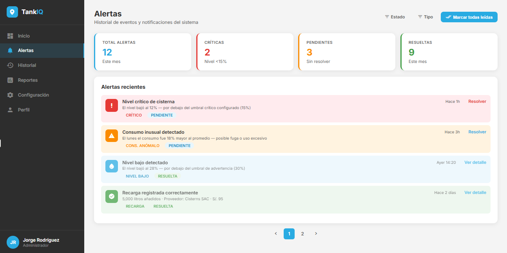

**Pantalla 05: Perfil del administrador**

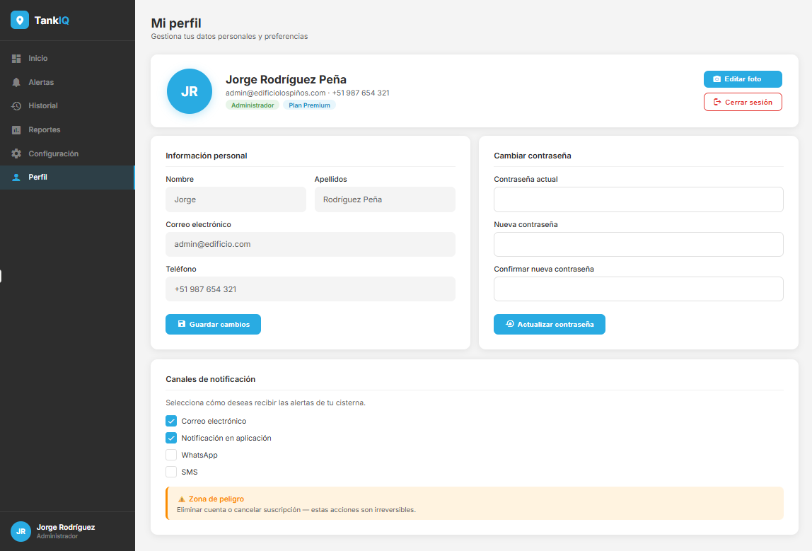

**Pantalla 06: Reportes para junta de propietarios**

**Pantalla 07: Historial de recargas y consumo**

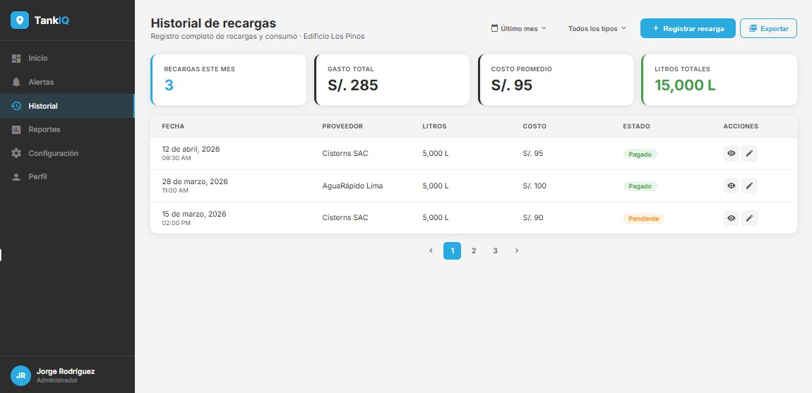

**Pantalla 08: Configuración de edificio y alertas**

**Pantalla 09: Vista de solo lectura (propietario / inquilino)**

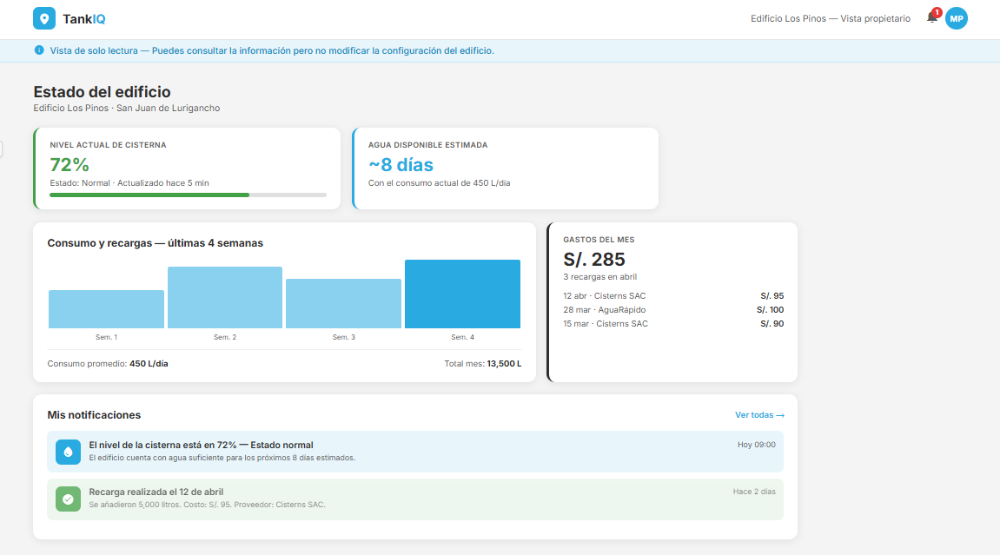

### 4.4.4. Web Applications Wireflow Diagrams

Los Wireflow Diagrams muestran la secuencia de pantallas que recorre el usuario para cumplir cada User Goal, conectadas mediante flechas que indican la dirección del flujo. Se presentan diez User Goals, seis correspondientes al segmento administrador y cuatro al segmento propietario/inquilino.

**Segmento: Administrador de edificio**

***User Goal 1:*** Como administrador del edificio, quiero visualizar el nivel actual de agua de la cisterna en tiempo real, para conocer cuánta agua disponible hay en cada momento y tomar decisiones oportunas.

*Descripción:* El administrador inicia sesión desde la Pantalla 01 (Login), ingresa sus credenciales y es redirigido directamente a la Pantalla 03 (Dashboard), donde visualiza el nivel actual en el indicador circular, las tres tarjetas de estado y el gráfico de consumo diario actualizado en tiempo real.

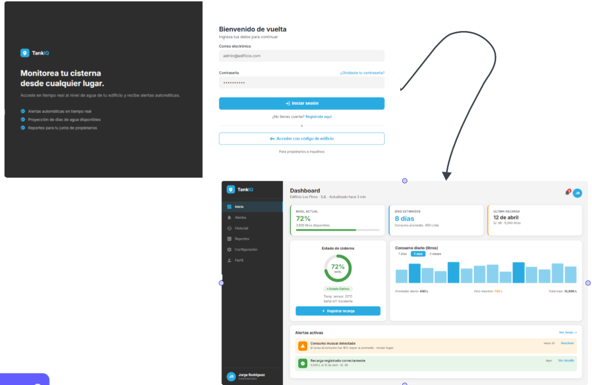

***User Goal 2:*** Como administrador del edificio, quiero recibir alertas cuando el nivel de la cisterna sea crítico, para evitar quedarme sin agua y actuar antes de que ocurra un desabastecimiento.

*Descripción:* Cuando el sensor detecta que el nivel bajó del umbral crítico configurado, aparece un badge de notificación en el ícono de campana del navbar. El administrador hace clic en el badge desde cualquier pantalla y es dirigido a la Pantalla 04 (Alertas), donde ve la alerta crítica destacada en rojo con su descripción y botón "Resolver".

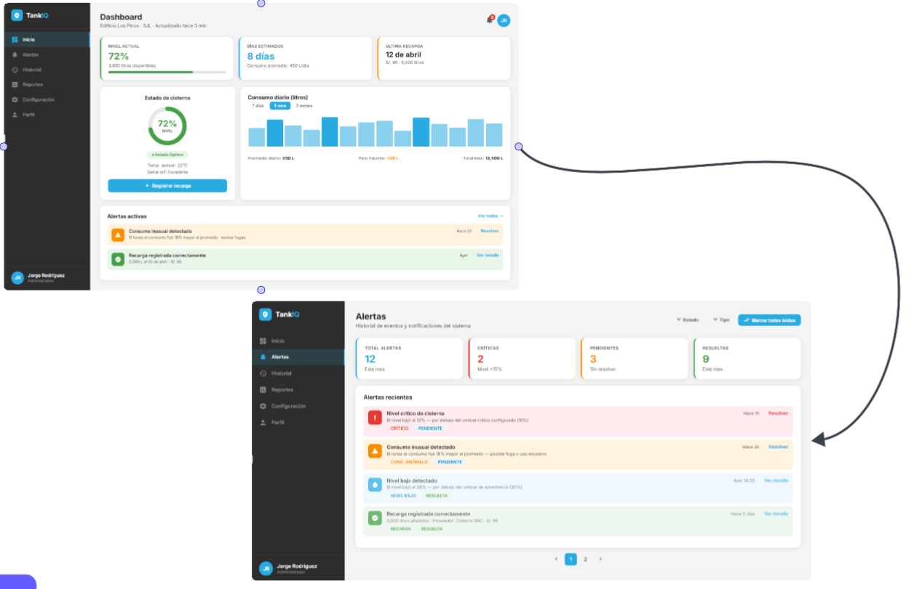

***User Goal 3:*** Como administrador del edificio, quiero visualizar una estimación de los días restantes de agua, para anticipar cuándo será necesario solicitar una recarga.

*Descripción:* Desde la Pantalla 03 (Dashboard), el administrador observa la tarjeta "Días de agua estimados" con la proyección calculada en base al consumo histórico. Para mayor detalle, navega a la Pantalla 07 (Historial), donde puede revisar el consumo diario de los últimos periodos y validar la estimación.

***User Goal 4:*** Como administrador del edificio, quiero contar con información clara sobre consumo y nivel actual, para decidir el momento adecuado para solicitar una recarga y evitar gastos innecesarios.

*Descripción:* El administrador consulta el Dashboard (Pantalla 03) para ver el nivel actual y los días estimados. Luego navega al Historial (Pantalla 07) para revisar el consumo de las últimas semanas y comparar con meses anteriores. Con esa información decide si solicitar o posponer la recarga.

***User Goal 5:*** Como administrador del edificio, quiero registrar cada recarga de agua realizada, para mantener un historial actualizado del consumo y abastecimiento.

*Descripción:* Desde el Dashboard (Pantalla 03) o el Historial (Pantalla 07), el administrador hace clic en "+ Registrar recarga". Se abre un modal con campos de fecha, proveedor, litros y costo. Al confirmar, el nivel de la cisterna se actualiza en el indicador circular y el registro queda guardado en la Pantalla 07 (Historial).

***User Goal 6:*** Como administrador del edificio, quiero definir el porcentaje de nivel en el que se generan alertas, para adaptar las notificaciones a las necesidades específicas del edificio.

*Descripción:* El administrador navega a la Pantalla 08 (Configuración) desde el sidebar. En la sección "Alertas" ajusta los sliders de "Alerta nivel bajo" y "Alerta nivel crítico" a los porcentajes deseados y presiona "Guardar cambios". Las alertas de la Pantalla 04 se dispararán a partir de ese momento con los nuevos umbrales.

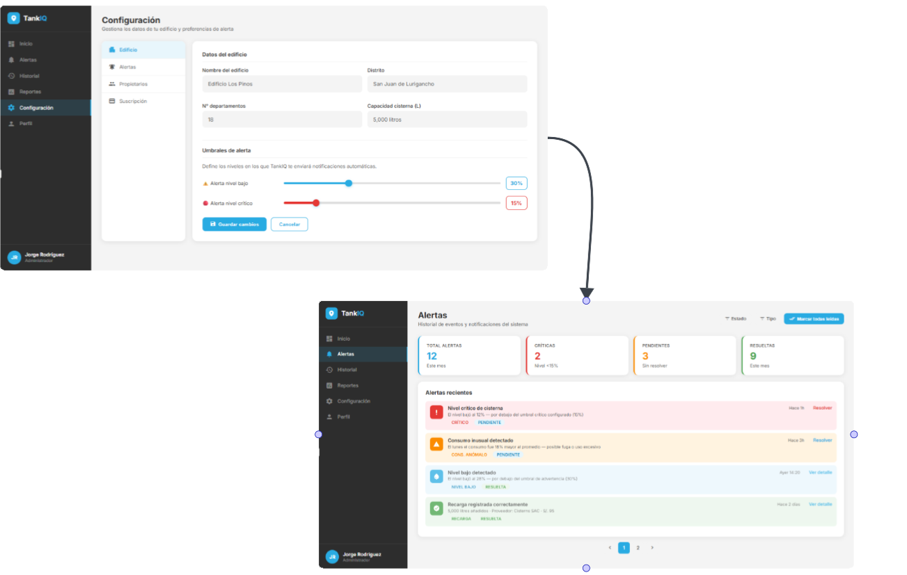

**Segmento: Propietario / Inquilino**

***User Goal 7:*** Como propietario o inquilino, quiero consultar el estado actual del nivel de agua de la cisterna, para saber si el edificio cuenta con suministro suficiente.

*Descripción:* El propietario accede desde el Landing Page haciendo clic en "Soy propietario" o desde el Login usando el código de edificio (Pantalla 01). Es redirigido directamente a la Pantalla 09 (Vista propietario), donde visualiza el nivel actual y los días de agua estimados en modo solo lectura.

***User Goal 8:*** Como propietario o inquilino, quiero visualizar el consumo histórico de agua del edificio, para entender cómo se está utilizando el recurso a lo largo del tiempo.

*Descripción:* Desde la Pantalla 09 (Vista propietario), el propietario observa el gráfico de consumo de las últimas 4 semanas. Puede cambiar el período del gráfico seleccionando entre semanas o meses para ver la evolución histórica del consumo.

***User Goal 9:*** Como propietario o inquilino, quiero revisar los gastos asociados a las recargas de agua, para comprender en qué se está invirtiendo el dinero del mantenimiento.

*Descripción:* En la Pantalla 09 (Vista propietario), el propietario consulta la tarjeta de "Gastos del mes" con el desglose de recargas, proveedor y costo de cada una. Esta información le permite verificar que los cobros en la cuota de mantenimiento son coherentes con el uso real registrado.

***User Goal 10:*** Como propietario o inquilino, quiero recibir notificaciones sobre eventos relevantes del suministro de agua, para estar informado ante posibles problemas o cortes.

*Descripción:* Cuando ocurre un evento relevante (nivel crítico, recarga realizada, consumo anómalo), el propietario recibe una notificación visible en el badge de la campana en la Pantalla 09. Al hacer clic, ve la lista de sus notificaciones personales con la descripción del evento y la fecha.

    
## 4.5. Web Applications Prototyping.

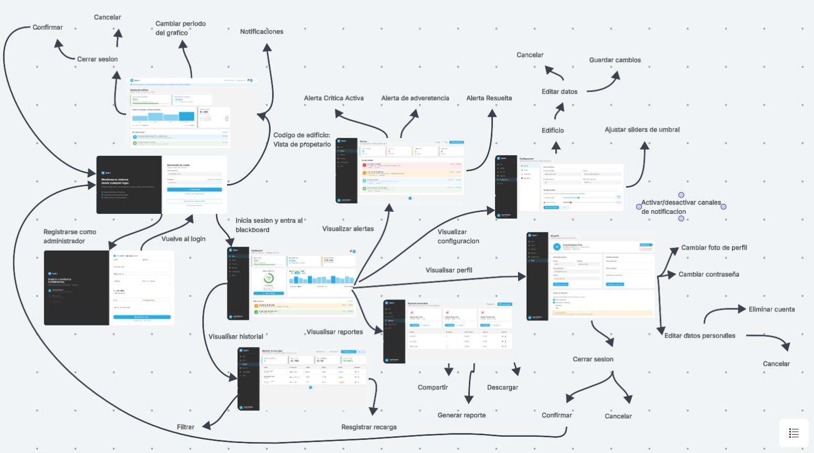

   
## 4.6. Domain-Driven Software Architecture.

Para modelar la arquitectura de TankIQ se aplicó Domain-Driven Design, partiendo de los resultados del Big Picture Event Storming para identificar Bounded Contexts, aggregates, eventos y comandos. A partir de ese modelo se derivaron los diagramas de arquitectura utilizando el C4 Model.

### 4.6.1. Design-Level EventStorming.

El equipo realizó una sesión de Design-Level Event Storming de 90 minutos para refinar el modelo de dominio de TankIQ. Se identificaron Domain Events, Commands, Aggregates, Policies, Read Models, External Systems y Actors. Se modelaron seis flujos: monitoreo de cisterna con proyección de días, gestión de recargas con cálculo de costo mensual, generación de reportes con exportación PDF, envío de alertas vía SendGrid, activación de suscripción y vinculación de sensor, y registro y autenticación de usuarios. Como resultado, se definieron seis Bounded Contexts: Monitoring Context Tank, Refill Management Context Refill, Reporting Context Report, Notification Context SendGrid/SMTP, Subscription & Billing Context Subscription e Identity & Access Management Context User.

  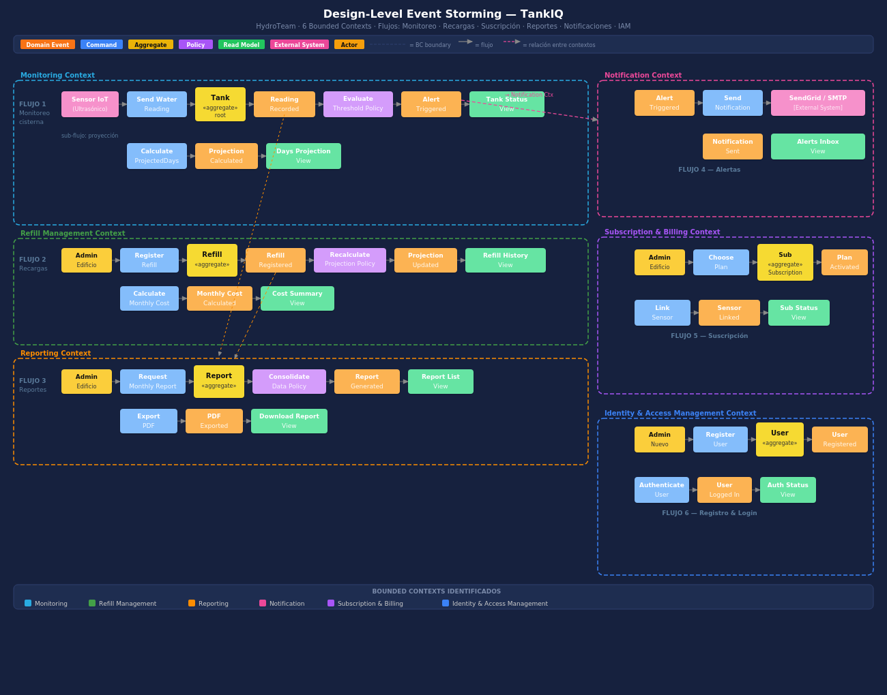

    
### 4.6.2. Software Architecture Context Diagram.

El Context Diagram muestra a TankIQ como sistema central rodeado por sus actores y sistemas externos, correspondiendo al nivel 1 del C4 Model. Los actores son el Administrador de Edificio y el Propietario / Inquilino. Los sistemas externos son el Sensor IoT Ultrasónico (simula lecturas vía HTTP en el contexto académico) y el Servicio de Correo SendGrid / SMTP (envío de alertas automáticas ante niveles críticos).

  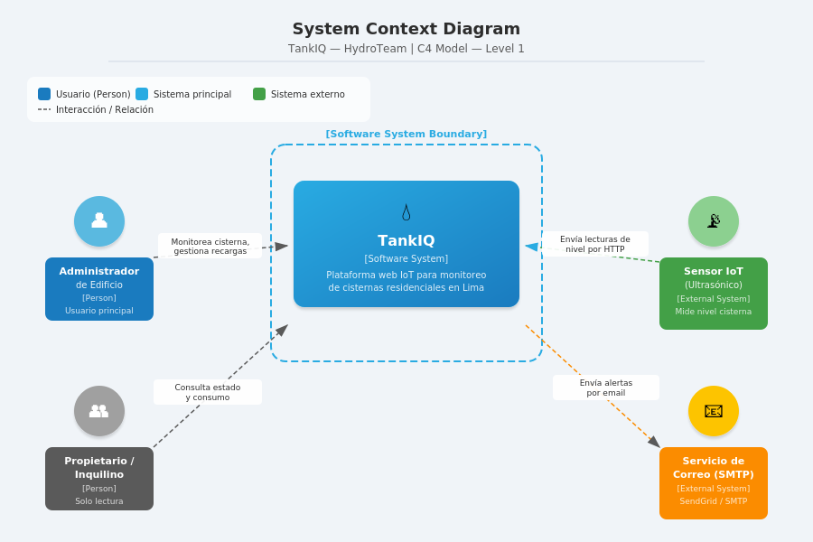

    
### 4.6.3. Software Architecture Container Diagrams.

El Container Diagram corresponde al nivel 2 del C4 Model y muestra los contenedores de TankIQ con sus tecnologías y comunicaciones. Los contenedores son: Landing Page (HTML/CSS/JS estático), Web Application (Angular SPA, comunica con la API vía HTTPS/JSON), RESTful API (Spring Boot, implementa todos los Bounded Contexts), Base de Datos, IoT Simulator (envía lecturas HTTP al API) y SendGrid / SMTP (sistema externo para notificaciones por correo).

  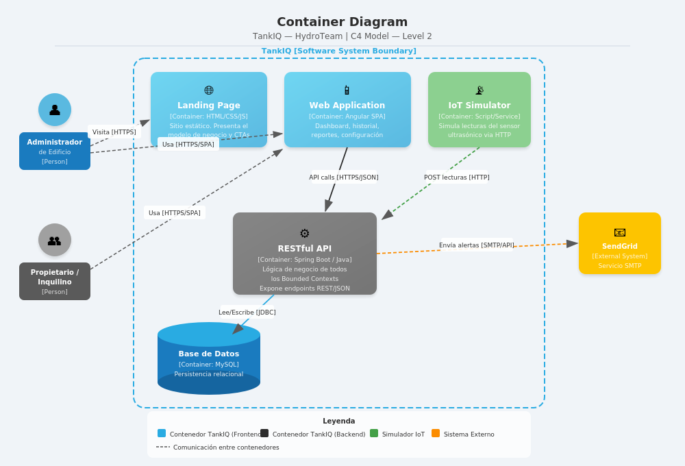

    
### 4.6.4. Software Architecture Components Diagrams.

Los Component Diagrams corresponden al nivel 3 del C4 Model y descomponen los dos contenedores con lógica interna compleja. Los demás contenedores (Landing Page, IoT Simulator y base de datos) no presentan componentes que ameriten este nivel de detalle.

**Componentes del RESTful API (Spring Boot)**

El API se organiza en seis componentes por Bounded Context: IAM Component (AuthController, UserService, JwtTokenProvider), Monitoring Component (TankController, TankService, AlertThresholdEvaluator), Refill Management Component** (RefillController, RefillService), Reporting Component (ReportController, ReportService), Subscription Component (SubscriptionController, SubscriptionService) y Notification Component (NotificationService, EmailGateway). Todos persisten datos en MySQL vía JPA/Hibernate.

  

**Componentes de la Web Application (Angular)**

La Web Application se organiza en cinco módulos lazy-loaded: Auth Module (LoginComponent, AuthService, AuthGuard), Dashboard Module (TankStatusCardComponent, DaysProjectionComponent, AlertBannerComponent), Refill Module** (RefillListComponent, RefillFormComponent), Reports Module** (ReportGeneratorComponent) y Settings Module (AlertThresholdComponent). El Shared Module provee componentes transversales: NavbarComponent, SidebarComponent, interceptor HTTP para JWT y servicio i18n.

  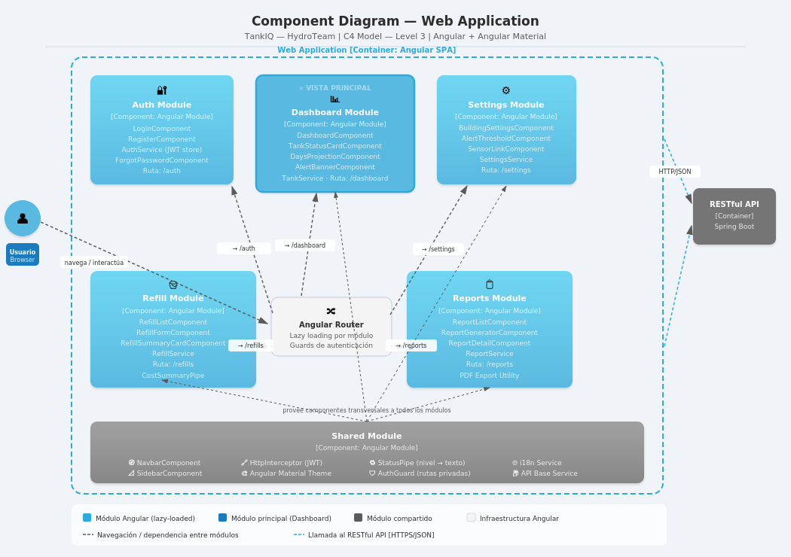

    
## 4.7. Software Object-Oriented Design.

El diseño orientado a objetos de TankIQ se deriva directamente de los Bounded Contexts identificados en el proceso de DDD. El diagrama de clase presentado a continuación describen las entidades, interfaces, enumeraciones y relaciones de cada contexto del dominio, con el nivel de detalle necesario para guiar la implementación en Spring Boot.

### 4.7.1. Class Diagrams.

El Class Diagram de TankIQ está organizado por Bounded Context e incluye clases, interfaces, enumeraciones, atributos con scope y tipo, métodos con parámetros y tipo de retorno, y relaciones con nombre, dirección y multiplicidad. Los contextos modelados son: User Management, Building Monitoring, Water Management, Alerting y Subscription.

  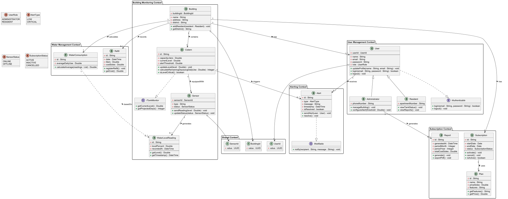

    
## 4.8. Database Design.

El diseño de base de datos de TankIQ Cada Bounded Context identificado en el proceso de Domain-Driven Design se traduce en un conjunto de tablas relacionadas. Las claves primarias son de tipo UUID para garantizar unicidad global entre servicios. Las claves foráneas refuerzan la integridad referencial entre tablas. Los campos numéricos críticos como niveles de cisterna y costos en soles usan tipo DECIMAL para precisión. Se aplican restricciones NOT NULL en todos los campos obligatorios del negocio.

    
### 4.8.1. Database Diagrams.

El diagrama muestra las 11 tablas del sistema agrupadas por Bounded Context. El IAM Context contiene la tabla users con discriminación de rol como ADMINISTRATOR o RESIDENT y la tabla junction building_users para la relación muchos a muchos entre edificios y residentes. El Building Monitoring Context encadena buildings - cisterns - sensors - water_level_readings, reflejando la jerarquía física del hardware IoT. El Water Management Context agrupa refills y water_consumption, ambas con FK a buildings. El Alerting Context contiene alerts con FK tanto a cisterns como a users. El Subscription Context agrupa plans, subscriptions y reports, donde subscriptions conecta un edificio con un plan contratado.

  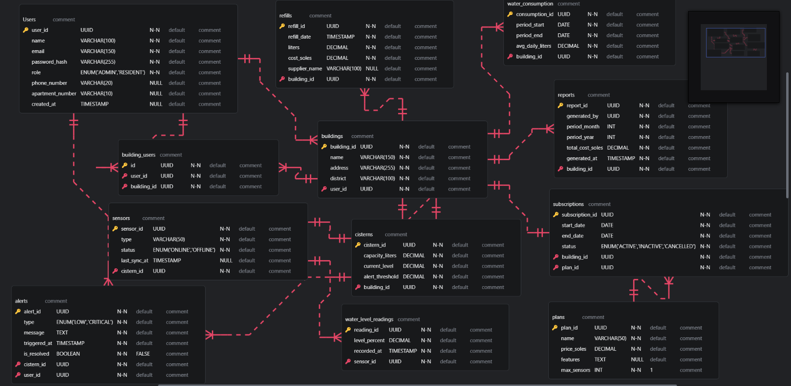

    
# Capítulo V: Product Implementation, Validation & Deployment
    
## 5.1. Software Configuration Management.
    
### 5.1.1. Software Development Environment Configuration.
    
### 5.1.2. Source Code Management.
    
### 5.1.3. Source Code Style Guide & Conventions.
    
### 5.1.4. Software Deployment Configuration.
    
## 5.2. Landing Page, Services & Applications Implementation.
    
## 5.2.1. Sprint n
    
### 5.2.1.1. Sprint Planning n.
    
### 5.2.1.2. Aspect Leaders and Collaborators.
    
### 5.2.1.3. Sprint Backlog n.
    
### 5.2.1.4. Development Evidence for Sprint Review.
    
### 5.2.1.5. Execution Evidence for Sprint Review.
    
### 5.2.1.6. Services Documentation Evidence for Sprint Review.
    
### 5.2.1.7. Software Deployment Evidence for Sprint Review.
    
### 5.2.1.8. Team Collaboration Insights during Sprint.

## Conclusiones

## Bibliografía

## Anexos
