

### Universidad Peruana de Ciencias Aplicadas
### Ingeniería de Software
### 2026-1

### NRC: 12029
### Docente: Hugo Allan Mori Paiva
### Informe de Trabajo Final - TB1

###  HydroTeam
###  TankIQ

   
|**Code**|**Member**|
|---------------------|--------------------|
|U202310436 |Espinar Martínez Gabriel Ferran|
|U202318951 |Guevara Serrano Diego Ismael| 
|U202411282 |Montalvan Palomino Bruno Rodolfo| 
|U202414840 |Orosco Ttamiña Juan Carlos| 
|U202410772 |Razuri Alvarez Matias Francesco| 

### Mayo 2026

# **Registro de Versiones del Informe**

<table style="width: 100%; border-collapse: collapse;">
  <!-- ROW 0 -->
  <tr>
    <th style="text-align: center;">Versión</th>
    <th style="text-align: center;">Fecha</th>
    <th style="text-align: center;">Autor</th>
    <th style="text-align: center;">Descripción de modificación</th>
  </tr>

  <!-- ROW 1 -->
  <tr>
    <td style="text-align: center;">
      1.0.0
    </td>
    <td style="text-align: center;">
      24/04/2026
    </td>
    <td style="text-align: center;">
      Espinar Martínez, Gabriel Ferran
    </td>
    <td style="text-align: justify;">
      Se realizó la estructuración inicial del documento del proyecto TankIQ, incluyendo la definición de la problemática, la propuesta de valor y la descripción de la startup. Asimismo, se estableció la organización general del informe y las secciones a desarrollar.
    </td>
  </tr>
  <!-- ROW 2 -->
  <tr>
    <td style="text-align: center;">
      1.0.1
    </td>
    <td style="text-align: center;">
      24/04/2026
    </td>
    <td style="text-align: center;">
      Guevara Serrano, Diego Ismael
    </td>
    <td style="text-align: justify;">
      Se desarrolló el análisis de usuarios mediante la elaboración de entrevistas y la identificación de necesidades, pains y gains. Además, se contribuyó en la definición de los User Personas representativos de los segmentos objetivo.
    </td>
  </tr>
  <!-- ROW 3 -->
  <tr>
    <td style="text-align: center;">
      1.0.2
    </td>
    <td style="text-align: center;">
      24/04/2026
    </td>
    <td style="text-align: center;">
      Montalvan Palomino, Bruno Rodolfo
    </td>
    <td style="text-align: justify;">
      Se elaboraron los artefactos de análisis como User Journey Maps, Empathy Maps y User Task Matrix, permitiendo comprender el comportamiento de los usuarios y sus interacciones en el contexto del problema identificado.
    </td>
 <!-- ROW 4 -->
<tr>
  <td style="text-align: center;">
    1.0.3
  </td>
  <td style="text-align: center;">
    24/04/2026
  </td>
  <td style="text-align: center;">
    Razuri Alvarez, Matias Francesco
  </td>
  <td style="text-align: justify;">
    Se definieron las épicas y las historias de usuario del sistema, incluyendo sus criterios de aceptación bajo la estructura Gherkin. También se participó en la identificación de funcionalidades clave alineadas a los objetivos del negocio.
  </td>
</tr>
  <!-- ROW 5 -->
  <tr>
    <td style="text-align: center;">
      1.0.4
    </td>
    <td style="text-align: center;">
      24/04/2026
    </td>
    <td style="text-align: center;">
      Orosco Ttamiña, Juan Carlos
    </td>
    <td style="text-align: justify;">
      Se completó la etapa de especificación de requisitos. En esta fase se definieron historias de usuario para representar las principales funcionalidades según las necesidades de los usuarios. También se hizo un impact mapping para relacionar los objetivos del negocio con los usuarios y las funcionalidades del sistema. Finalmente, se organizó y priorizó el Product Backlog, estimándolo con la escala de Fibonacci para apoyar el desarrollo.
    </td>
  </tr>
    <!-- ROW 1 - TB1 -->
  <tr>
    <td style="text-align: center;">
      2.0.0
    </td>
    <td style="text-align: center;">
      13/05/2026
    </td>
    <td style="text-align: center;">
      Espinar Martínez, Gabriel Ferran
    </td>
    <td style="text-align: justify;">
      Se trabajó en la estructura inicial del módulo Water Monitoring, definiendo las rutas y componentes necesarios para representar la información relacionada con el monitoreo de agua. Además, se preparó la integración visual con el dashboard siguiendo el diseño y la arquitectura general del proyecto.
    </td>
  </tr>
  <!-- ROW 2 -->
  <tr>
    <td style="text-align: center;">
      2.0.1
    </td>
    <td style="text-align: center;">
      12/05/2026
    </td>
    <td style="text-align: center;">
      Guevara Serrano, Diego Ismael
    </td>
    <td style="text-align: justify;">
      Se avanzó con el desarrollo del Landing Page del sistema, implementando las principales secciones informativas y la estructura visual inicial de la aplicación. Además, se trabajó en la navegación pública, el soporte de idiomas y la adaptación del diseño tomando como referencia los mockups y lineamientos definidos para el proyecto.
    </td>
  </tr>
  <!-- ROW 3 -->
  <tr>
    <td style="text-align: center;">
      2.0.2
    </td>
    <td style="text-align: center;">
      13/05/2026
    </td>
    <td style="text-align: center;">
      Montalvan Palomino, Bruno Rodolfo
    </td>
    <td style="text-align: justify;">
      Se desarrolló la estructura inicial del módulo IAM, organizando las rutas y componentes relacionados con el acceso y autenticación de usuarios. Asimismo, se preparó la base necesaria para futuras funcionalidades de login y control de acceso dentro de la aplicación frontend.
    </td>
 <!-- ROW 4 -->
<tr>
  <td style="text-align: center;">
    2.0.3
  </td>
  <td style="text-align: center;">
    12/05/2026
  </td>
  <td style="text-align: center;">
    Razuri Alvarez, Matias Francesco
  </td>
  <td style="text-align: justify;">
    Se desarrolló la base frontend del módulo Alerts & Notifications, organizando las vistas y rutas relacionadas con las alertas del sistema. Asimismo, se preparó la estructura necesaria para futuras funcionalidades de notificaciones y visualización de eventos dentro de la aplicación.
  </td>
</tr>
  <!-- ROW 5 -->
  <tr>
    <td style="text-align: center;">
      2.0.4
    </td>
    <td style="text-align: center;">
      13/05/2026
    </td>
    <td style="text-align: center;">
      Orosco Ttamiña, Juan Carlos
    </td>
    <td style="text-align: justify;">
      Se implementó la primera versión visual del Dashboard Overview, incorporando la estructura principal del panel y las vistas base del sistema. También se desarrolló la navegación interna, los componentes iniciales y las pantallas “Under Construction” para mantener la integración entre módulos durante el desarrollo frontend.
    </td>
  </tr>
  
</table>

# **Project Report Collaboration Insights**

**URL del Repositorio**: [https://github.com/hydronex-web-app-1ASI0729-2610-12029/hydro-core](https://github.com/hydronex-web-app-1ASI0729-2610-12029/hydro-core)

# ABET – EAC - Student Outcome 3

  Criterio: La capacidad de trabajar de manera efectiva en un equipo cuyos integrantes aportan liderazgo, crean un ambiente colaborativo e inclusivo, establecen objetivos, planifican tareas y logran cumplirlos.

<table style="width: 100%; border-collapse: collapse;">
  <!-- ROW 0 -->
  <tr>
    <th style="text-align: center;">Criterio específico</th>
    <th style="text-align: center;">Acciones realizadas</th>
    <th style="text-align: center;">Conclusiones</th>
  </tr>
  
  <!-- ROW 1 -->
  <tr>
    <td style="text-align: justify; vertical-align: top;">
      <b>
        Comunica oralmente con efectividad a diferentes rangos de audiencia.
      </b>
    </td>
    <td style="text-align: justify;">
      <b>
        Espinar Martínez Gabriel Ferran
      </b>
        
      <b><i>
        AV1
      </i></b>
       
        
        Durante el desarrollo del proyecto, expliqué al equipo la estructura y el alcance del informe para que todos pudieran entender mejor cómo organizar la información y trabajar de manera más coordinada. Además, presenté y sustenté la propuesta visual del Landing Page UI, buscando que tanto el equipo como los docentes comprendieran de forma clara la idea y los objetivos principales del proyecto.
        
        
        ------------------------------------
        
      <b>
        Guevara Serrano Diego Ismael
      </b>
      <b><i>
        AV1
      </i></b>
       
        Colaboré en la exposición de avances del proyecto frente al equipo y docentes, comunicando de forma sencilla las decisiones tomadas sobre el diseño y funcionamiento de la aplicación. Asimismo, participé en las discusiones relacionadas con la estructura del sistema y aporté sugerencias para mejorar la organización del trabajo en equipo.
        
        ------------------------------------
        
        <b>
          Montalvan Palomino Bruno Rodolfo
        </b>
        
      <b><i>
        AV1
      </i></b>
       
        Participé en la explicación de los mockups y diseños de interfaz desarrollados para el proyecto, ayudando a transmitir visualmente las ideas principales del sistema. Además, mantuve comunicación constante con el equipo para coordinar cambios y resolver dudas relacionadas con el desarrollo de las funcionalidades implementadas.
        
        ------------------------------------
        
      <b>
        Orosco Ttamiña Juan Carlos
      </b>
        
      <b><i>
        AV1
      </i></b>
       
         Apoyé en la organización y explicación de las principales secciones del sistema durante las reuniones de coordinación del proyecto. También colaboré en la sustentación de avances, respondiendo preguntas y compartiendo ideas sobre la funcionalidad y experiencia de usuario de la aplicación desarrollada.
        
        ------------------------------------
        
      <b>
        Razuri Alvarez Matias Francesco
      </b>
        
      <b><i>
        AV1
      </i></b>
       
        Participé en las conversaciones y presentaciones realizadas durante el desarrollo del proyecto, aportando opiniones y propuestas relacionadas con el diseño y las funcionalidades del sistema. Asimismo, colaboré en la coordinación entre los integrantes del equipo para mantener una comunicación más clara y ordenada durante el trabajo realizado.
        
            <b>
        Espinar Martínez Gabriel Ferran
      </b>
        
        ------------------------------------
        
      <b><i>
        TB1
      </i></b>
       
        
        Durante el TB1, participé en la coordinación del desarrollo frontend del proyecto, comunicando con el equipo las ideas relacionadas con la estructura de la aplicación y el diseño de las interfaces. Además, colaboré en la explicación de los avances realizados en la Landing Page y en las funcionalidades principales implementadas durante esta etapa.
        
      <b>
        Guevara Serrano Diego Ismael
      </b>
        
        ------------------------------------
        
      <b><i>
        TB1
      </i></b>
       
        Durante las reuniones de trabajo, apoyé en la presentación de propuestas relacionadas con el diseño visual y la organización de los componentes frontend del sistema. Asimismo, colaboré en la explicación de los avances desarrollados para que el equipo y los docentes comprendieran mejor el funcionamiento de la aplicación.
        
        ------------------------------------
        
        <b>
          Montalvan Palomino Bruno Rodolfo
        </b>
        
      <b><i>
        TB1
      </i></b>
       
        Colaboré en la comunicación de ideas y decisiones relacionadas con la implementación del frontend del proyecto, especialmente en aspectos de navegación y experiencia de usuario. También participé en la coordinación de tareas y en la revisión de cambios realizados durante el desarrollo de las interfaces.
        
        ------------------------------------
        
      <b>
        Orosco Ttamiña Juan Carlos
      </b>
        
      <b><i>
        TB1
      </i></b>
       
         Participé en la explicación de las principales vistas desarrolladas para el sistema, compartiendo propuestas relacionadas con el diseño y la estructura visual de la aplicación. Además, mantuve una comunicación constante con el equipo para coordinar mejoras y resolver dudas durante el desarrollo frontend.
        
        ------------------------------------
        
      <b>
        Razuri Alvarez Matias Francesco
      </b>
        
      <b><i>
        TB1
      </i></b>
       
        Apoyé en la organización y presentación de las funcionalidades frontend implementadas en el proyecto, aportando ideas relacionadas con el diseño y la distribución del contenido en las interfaces. Asimismo, participé en las reuniones de coordinación y sustentación de avances, ayudando a comunicar de forma clara los resultados obtenidos por el equipo.
        
    </td>
    <td style="text-align: justify; vertical-align: top;">
      <b><i>
        AV1
      </i></b>
       
        Durante el AV1, el equipo participó activamente en reuniones y presentaciones del proyecto, comunicando de manera clara las ideas, avances y propuestas relacionadas con el diseño y las funcionalidades del sistema. Además, se mantuvo una coordinación constante entre los integrantes para explicar el desarrollo de las diferentes secciones del proyecto, facilitando que tanto el equipo como los docentes comprendieran los objetivos y resultados alcanzados durante cada etapa del trabajo.
        
        ------------------------------------
        
      <b><i>
        TB1
      </i></b>
       
        Durante el TB2, el equipo participó activamente en reuniones, coordinaciones y presentaciones relacionadas con el desarrollo del proyecto, comunicando de manera clara los avances, propuestas y decisiones tomadas sobre el sistema. Asimismo, los integrantes colaboraron en la explicación de las funcionalidades, diseños y objetivos del proyecto, facilitando la comprensión de la propuesta tanto para el equipo de trabajo como para los docentes durante las revisiones y sustentaciones realizadas.
    </td>
  </tr>
  
  <!-- ROW 2 -->
  <tr>
    <td style="text-align: justify; vertical-align: top;">
      <b>
        Comunica por escrito con efectividad a diferentes rangos de audiencia.
      </b>
    </td>
    <td style="text-align: justify;">
      <b>
        Espinar Martínez Gabriel Ferran
      </b>
        
      <b><i>
        AV1
      </i></b>
       
        Mantuvimos una comunicación constante, lo que sumado al uso de GitHub, nos permitió avanzar de forma simultánea y eficiente. Nos enfocamos en cumplir las metas establecidas mediante una distribución clara de tareas.
        
        ------------------------------------
        
      <b>
        Guevara Serrano Diego Ismael
      </b>
        
      <b><i>
        AV1
      </i></b>
       
        Colaboré activamente con el equipo mediante la coordinación constante y el uso de herramientas digitales, participando en la organización de tareas y en la implementación de funcionalidades. Esto permitió avanzar de manera ordenada y cumplir con los objetivos establecidos.
        
        ------------------------------------
        
        <b>
          Montalvan Palomino Bruno Rodolfo
        </b>
        
      <b><i>
        AV1
      </i></b>
       
        En este periodo, el equipo mantuvo una comunicación constante a través de WhatsApp y Discord para coordinar las tareas del Capítulo IV. En particular,  junto con Matias realize llamadas por Discord para alinear los diseños de la interfaz con la arquitectura de software definida, asegurando que las pantallas reflejaran correctamente los bounded contexts y componentes identificados. Además, participó en la organización de las tareas del equipo, ayudando a definir qué secciones debía asumir cada integrante y verificando que los avances fueran coherentes entre sí antes de consolidarlos en el repositorio.
        
        ------------------------------------
        
      <b>
        Orosco Ttamiña Juan Carlos
      </b>
        
      <b><i>
        AV1
      </i></b>
       
         Durante esta fase, mantuvimos un ambiente de trabajo colaborativo, usando WhatsApp y Discord para coordinarnos y GitHub para trabajar en paralelo. Desde el inicio definimos objetivos, organizamos las tareas y trabajamos en equipo para cumplirlos. Además, mi apoyo en la elaboración del informe ayudó a que el proceso fuera más ordenado y a mantener al equipo alineado.
        
        ------------------------------------
        
      <b>
        Razuri Alvarez Matias Francesco
      </b>
        
      <b><i>
        AV1
      </i></b>
       
        Para esta entrega, junto al equipo mantuve una comunicación constante a través de WhatsApp y Discord para coordinar las tareas del Capítulo IV. En particular, con  Bruno para alinear los diseños de la interfaz con la arquitectura de software definida, asegurando que las pantallas reflejaran correctamente los bounded contexts y componentes identificados.
        
        
        ------------------------------------
        
      <b>
        Espinar Martínez Gabriel Ferran
      </b>
        
      <b><i>
        TB1
      </i></b>
       
        Participé en la elaboración y organización del informe relacionado con el desarrollo frontend del sistema, redactando información sobre las funcionalidades implementadas y la estructura de la aplicación. Además, colaboré en la descripción de los avances realizados en la Landing Page y las
        
        ------------------------------------
        
      <b>
        Guevara Serrano Diego Ismael
      </b>
        
      <b><i>
        TB1
      </i></b>
       
        Apoyé en la documentación de las funcionalidades desarrolladas durante el TB2, redactando descripciones relacionadas con el dashboard, las rutas y la experiencia de usuario del sistema. Además, participé en la revisión del contenido escrito para mejorar la claridad y comprensión de la propuesta presentada.
        
        ------------------------------------
        
        <b>
          Montalvan Palomino Bruno Rodolfo
        </b>
        
      <b><i>
        TB1
      </i></b>
       
        Colaboré en la elaboración de documentos y reportes relacionados con el avance frontend del proyecto, aportando información sobre el diseño de las interfaces y la implementación de las principales vistas del sistema. Asimismo, participé en la organización de los contenidos escritos utilizados durante las sustentaciones y revisiones del proyecto.
        
        ------------------------------------
        
      <b>
        Orosco Ttamiña Juan Carlos
      </b>
        
      <b><i>
        TB1
      </i></b>
       
         Colaboré en la redacción de la documentación del proyecto, explicando las decisiones tomadas sobre el diseño visual, la navegación y la organización de los componentes frontend. Asimismo, apoyé en la revisión de los contenidos escritos para mantener una presentación clara y ordenada de la información.
        
        ------------------------------------
        
      <b>
        Razuri Alvarez Matias Francesco
      </b>
        
      <b><i>
        TB1
      </i></b>
       
        Colaboré en la redacción de la documentación del proyecto, explicando las decisiones tomadas sobre el diseño visual, la navegación y la organización de los componentes frontend. Asimismo, apoyé en la revisión de los contenidos escritos para mantener una presentación clara y ordenada de la información.
        
    </td>
    <td style="text-align: justify; vertical-align: top;">
      <b><i>
        AV1
      </i></b>
       
        Durante el AV1, el equipo trabajó de manera colaborativa, manteniendo una comunicación constante y compartiendo ideas y retroalimentación de forma continua. Se utilizaron herramientas como GitHub, Trello, WhatsApp y Discord para coordinar las actividades. Asimismo, se establecieron objetivos y etapas claras para el diseño, la arquitectura, la documentación y la investigación, asignando responsabilidades según las habilidades de cada integrante. Gracias a esta organización y al trabajo en equipo, fue posible integrar adecuadamente todos los entregables y cumplir con los objetivos planteados para el primer avance del proyecto.
        
        ------------------------------------
        
      <b><i>
        TB1
      </i></b>
       
        Durante el TB1, el equipo participó en la elaboración y organización de la documentación del proyecto, redactando información relacionada con el problema, los objetivos y las primeras propuestas del sistema. Asimismo, los integrantes colaboraron en la preparación de los avances escritos y en la revisión de los contenidos para asegurar una presentación clara, ordenada y comprensible durante las entregas y sustentaciones realizadas.
    </td>
  </tr>
</table>

## Contenido

- [ Informe Trabajo Final ](#-informe-trabajo-final-)
    - [Universidad Peruana de Ciencias Aplicadas ](#universidad-peruana-de-ciencias-aplicadas-)
    - [Registro de versiones del Informe](#registro-de-versiones-del-informe)
    - [Project Report Collaboration Insights](#project-report-collaboration-insights)
    - [Contenido](#contenido)
    - [Student Outcome](#student-outcome)
- [Capítulo I: Introducción](#capítulo-i-introducción)
    - [1.1. Startup Profile](#11-startup-profile)
    - [1.1.1. Descripción de la Startup](#111-descripción-de-la-startup)
    - [1.1.2 Perfiles de integrantes del equipo](#112-perfiles-de-integrantes-del-equipo)
    - [1.2. Solution Profile](#12-solution-profile)
    - [1.2.1 Antecedentes y problemática](#121-antecedentes-y-problemática)
    - [1.2.2 Lean Ux Process](#122-lean-ux-process)
    - [1.2.2.1. Lean UX Problem Statements](#1221-lean-ux-problem-statements)
    - [1.2.2.2. Lean UX Assumptions](#1222-lean-ux-assumptions)
    - [1.2.2.3. Lean UX Hypothesis Statements](#1223-lean-ux-hypothesis-statements)
    - [1.2.2.4. Lean UX Canvas](#1224-lean-ux-canvas)
    - [Segmentos Objetivos](#segmentos-objetivos)
- [Capítulo II: Requeriments Elicitation \& Analysis](#capítulo-ii-requeriments-elicitation--analysis)
    - [2.1. Competidores](#21-competidores)
    - [2.1.1. Análisis competitivo](#211-análisis-competitivo)
    - [2.1.2. Estrategias y tácticas frente a competidores](#212-estrategias-y-tácticas-frente-a-competidores)
    - [2.2. Entrevistas ](#22-entrevistas-)
    - [2.2.1. Diseño de entrevistas](#221-diseño-de-entrevistas)
    - [2.2.2. Registro de entrevistas](#222-registro-de-entrevistas)
    - [2.2.3. Análisis de entrevistas](#223-análisis-de-entrevistas)
    - [2.3. Needfinding](#23-needfinding)
    - [2.3.1. User Personas](#231-user-personas)
    - [2.3.2. User Task Matrix](#232-user-task-matrix)
    - [2.3.3. User Journey Mapping](#233-user-journey-mapping)
    - [2.3.4. Empathy Mapping](#234-empathy-mapping)
    - [2.4. Big Picture EventStorming](#24-big-picture-evenstorming)
    - [2.5. Ubiquitous Language](#25-ubiquitous-language)
- [Capítulo III: Requeriments Specification](#capítulo-iii-requeriments-specification)
    - [3.1. User Stories](#31-user-stories)
    - [3.2. Impact Mapping](#32-impact-mapping)
    - [3.3. Product Backlog](#33-product-backlog)
- [Capítulo IV: Product Desing](#capítulo-iv-product-desing)
    - [4.1. Style Guidelines](#41-style-guidelines)
    - [4.1.1. General Style Guidelines](#411-general-style-guidelines)
    - [4.1.2. Web Style Guidelines](#412-web-style-guidelines)
    - [4.2. Information Architecture](#42-information-architecture)
    - [4.2.1. Organization Systems](#421-organization-systems)
    - [4.2.2. Labeling Systems](#422-labeling-systems)
    - [4.2.3. SEO Tags and Meta Tags](#423-seo-tags-and-meta-tags)
    - [4.2.4. Searching Systems](#424-searching-systems)
    - [4.2.5. Navigation Systems](#425-navigation-systems)
    - [4.3. Landing Page UI Desing](#43-landing-page-ui-desing)
    - [4.3.1. Landing Page Wireframes](#431-landing-page-wireframes)
    - [4.3.2. Landing Page Mock-Up](#432-landing-page-mock-up)
    - [4.4. Web Applications UX/UI Desing](#44-web-applications-uxui-desing)
    - [4.4.1. Web Applications Wireframes](#441-web-applications-wireframes)
    - [4.4.2. Web Applications Wireflow Diagrams](#442-web-applications-wireflow-diagrams)
    -[4.4.3. Web Applications Mock-ups](#443-web-applications-mock-ups-diagrams)
    - [4.4.4. Web Applications User Flow Diagrams](#444-web-applications-user-flow-diagrams)
    - [4.5. Web Applications Prototyping](#45-web-applications-prototyping)
    - [4.6.1. Design-Level EventStorming](#461-design-level-eventstorming)
    - [4.6.2. Software Architecture Context Diagram](#462-software-architecture-context-diagram)
    - [4.6.3. Software Architecture Container Diagram](#463-software-architecture-container-diagram)
    - [4.6.4. Software Architecture Components Diagram](#464-software-architecture-components-diagram)
    - [4.7. Software Object-Oriented Desing](#47-software-object-oriented-desing)
    - [4.7.1. Class Diagram](#471-class-diagram)
    - [4.8. Database Desing](#48-database-desing)
    - [4.8.1. Database Diagrams](#481-database-diagrams)
- [Capítulo V: Product Implementation, Validation \& Deployment](#capítulo-v-product-implementation-validation--deployment)
    - [5.1. Software Configuration Management](#51-software-configuration-management)
    - [5.1.1. Software Development Environment Configuration](#511-software-development-environment-configuration)
    - [5.1.2. Source Code Management](#512-source-code-management)
    - [5.1.3. Source Code Style Guide \& Conventions](#513-source-code-style-guide--conventions)
    - [5.1.4. Software Deployment Configuration](#514-software-deployment-configuration)
    - [5.2. Landing Page, Service \& Applications Implementation](#52-landing-page-service--applications-implementation)
    - [5.2.1. Sprint](#52x-sprint)
    -  [5.2.1.1. Sprint Planning 1](#5211-Sprint-Planning1)
    -  [5.2.1.2. Aspect Leaders and Collaborators](#5212-Aspect-Leaders-and-Collaborators)
    -  [5.2.1.3. Sprint Backlog 1](#5213-Sprint-Backlog-1)
    -  [5.2.1.4. Development Evidence for Sprint Review](#5214-Development-Evidence-for-Sprint-Review)
    -  [5.2.1.5. Execution Evidence for Sprint Review](#5215-Execution-Evidence-for-Sprint-Review)
    -  [5.2.1.6. Services Documentation Evidence for Sprint Review](#5216-Services-Documentation-Evidence-for-Sprint-Review)
    -  [5.2.1.7. Software Deployment Evidence for Sprint Review](#5217-Software-Deployment-Evidence-for-Sprint-Review)
    -  [5.2.1.8. Team Collaboration Insights during Sprint](#5218-Team-Collaboration-Insights-during-Sprint)
    -  [Conclusiones](#Conclusiones)
    -  [Bibliografía](#Bibliografía)
    -  [Anexos](#Anexos)

## 1.1. Startup Profile

### 1.1.1. Descripción de la Startup

Nos encargamos de brindar una solución tecnológica accesible para la gestión inteligente del suministro de agua en edificios residenciales que dependen de cisternas ante el servicio irregular de SEDAPAL. Nuestro objetivo es eliminar el desabastecimiento imprevisto y el gasto innecesario en recargas de agua, dos problemas que afectan cotidianamente a miles de edificios en Lima Metropolitana.

- **Nombre:** HydroTeam
- **Rubro:** Desarrollo de software / IoT
- **Visión:** Convertirnos en la plataforma de referencia para la gestión inteligente de recursos hídricos en edificios residenciales de Lima Metropolitana.
- **Misión:** Brindar a los administradores y propietarios de edificios una herramienta accesible y confiable que les permita tomar decisiones informadas sobre la gestión del agua, reduciendo costos innecesarios y garantizando el suministro continuo.

### 1.1.2. Perfiles de integrantes del equipo

<table align="center" border="1" width="70%" style="text-align:center;">
    <tr align="center">
        <td rowspan="3">
            
        </td>
        <td align="left">
            <b>Nombre y Apellido:</b>
             
            Guevara, Diego
        </td>
    </tr>
    <tr>
        <td align="left">
        <b>Carrera:</b>
         
        Ingeniería de Software
        </td>
    </tr>
    <tr>
        <td align="left">
        <b>Acerca de:</b>
         
        Soy estudiante de Ingeniería de Software y me considero una persona responsable y enfocada en mejorar constantemente mis habilidades. Me interesa el desarrollo frontend y la construcción de sistemas funcionales. Tengo conocimientos en Java y bases de datos MySQL, lo cual puede aportar en la lógica y estructura del proyecto.
        </td>
    </tr>
    <tr align="center">
        <td rowspan="3">
            
        </td>
        <td align="left">
            <b>Nombre y Apellido:</b>
             
            Montalván, Bruno
        </td>
    </tr>
    <tr>
        <td align="left">
        <b>Carrera:</b>
         
        Ingeniería de Software
        </td>
    </tr>
    <tr>
        <td align="left">
        <b>Acerca de:</b>
         
        Soy estudiante de Ingeniería de Software y me caracterizo por ser una persona responsable y constante en lo que hago. Me interesa seguir aprendiendo sobre desarrollo web y mejorar mis habilidades técnicas. Tengo conocimientos en HTML, CSS, JavaScript y SQL, los cuales puedo aplicar en el desarrollo del proyecto.
        </td>
    </tr>
    <tr align="center">
        <td rowspan="3">
            
        </td>
        <td align="left">
            <b>Nombre y Apellido:</b>
             
            Espinar, Gabriel
        </td>
    </tr>
    <tr>
        <td align="left">
        <b>Carrera:</b>
         
        Ingeniería de Software
        </td>
    </tr>
    <tr>
        <td align="left">
        <b>Acerca de:</b>
         
        Soy estudiante de la carrera de Ingeniería de Software, Me considero una persona trabajadora. Me interesa aprender constantemente en especial en áreas relacionadas a la tecnología y cuento con conocimientos en HTML, CSS, Javascript y SQL, lo cual puede servir en el desarrollo del proyecto.
        </td>
    </tr>
    <tr align="center">
        <td rowspan="3">
            
        </td>
        <td align="left">
            <b>Nombre y Apellido:</b>
             
            Orosco, Juan
        </td>
    </tr>
    <tr>
        <td align="left">
        <b>Carrera:</b>
         
        Ingeniería de Software
        </td>
    </tr>
    <tr>
        <td align="left">
        <b>Acerca de:</b>
         
        Soy Juan Orosco, tengo 21 años y soy estudiante de Ingeniería de Software, interesado en la creación de aplicaciones y el desarrollo de soluciones tecnológicas. Me motiva enfrentar nuevos retos técnicos que me permitan seguir aprendiendo.
        </td>
    </tr>
    <tr align="center">
        <td rowspan="3">
            
        </td>
        <td align="left">
            <b>Nombre y Apellido:</b>
             
            Razuri, Matias
        </td>
    </tr>
    <tr>
        <td align="left">
        <b>Carrera:</b>
         
        Ingeniería de Software
        </td>
    </tr>
    <tr>
        <td align="left">
        <b>Acerca de:</b>
         
        Soy Matias Razuri, tengo 19 años a la fecha, y soy un estudiante de la carrera de Ing. de Software. Me considero una persona responsable y participativa en lo que respecta a cualquier proyecto de trabajo. Todos mis conocimientos de programacion se basan en C++, CSS, HTML, y Python.
        </td>
    </tr>
</table>

## 1.2. Solution Profile

### 1.2.1 Antecedentes y problemática

El acceso irregular al agua es una realidad cotidiana para millones de limeños. Según el Instituto Nacional de Estadística e Informática (INEI), más del 30% de los hogares de Lima Metropolitana no reciben agua potable las 24 horas del día. Esta situación es especialmente crítica en distritos de Lima Norte, Lima Este y Lima Sur —como San Juan de Lurigancho, Ate, Villa María del Triunfo, Carabayllo y Comas— donde el servicio de SEDAPAL puede interrumpirse entre uno y cuatro días por semana.

Ante esta realidad, los edificios residenciales de estas zonas dependen de cisternas como reservorio principal de agua. Sin embargo, la gestión de estas cisternas se realiza de manera completamente manual e informal: el administrador del edificio revisa físicamente el nivel del agua, estima cuántos días quedan de suministro y decide —muchas veces por intuición— cuándo llamar al servicio de camión cisterna. Este proceso genera dos tipos de pérdidas económicas recurrentes: quedarse sin agua antes de la recarga, o llamar al camión cisterna cuando aún hay reserva suficiente, pagando una recarga innecesaria que incrementa los gastos comunes del edificio.

A nivel tecnológico, no existe en el mercado peruano una plataforma accesible, en español, orientada a edificios de entre 6 y 40 departamentos, que combine monitoreo IoT con proyección de consumo y transparencia financiera para las juntas de propietarios.

**5 'W's + 2 'H's**

- **What?**

¿Cuál es el problema?

Los administradores de edificios residenciales en Lima no cuentan con ninguna herramienta para monitorear en tiempo real el nivel de su cisterna. Gestionan el agua de forma manual e intuitiva, lo que genera recargas innecesarias (gasto excesivo) o desabastecimiento imprevisto (pérdida de calidad de servicio y conflictos entre vecinos). Adicionalmente, las juntas de propietarios no tienen visibilidad sobre el gasto mensual en agua, lo que genera desconfianza hacia el administrador.

- **When?**

¿Cuándo sucede el problema?

El problema se manifiesta de manera recurrente cada semana. Ocurre cuando SEDAPAL no abastece con normalidad, cuando el nivel de la cisterna baja sin que nadie lo note a tiempo, y al momento de rendir cuentas en las juntas de propietarios, cuando no hay registros claros del gasto en agua.

- **Where?**

¿Dónde ocurre el problema?

En edificios residenciales de distritos de Lima con suministro de agua irregular de SEDAPAL, principalmente en Lima Norte (Los Olivos, Comas, Carabayllo, Independencia), Lima Este (San Juan de Lurigancho, Ate, Santa Anita) y Lima Sur (Villa María del Triunfo, Villa El Salvador), así como en zonas intermedias como Breña, Jesús María, Lince y Pueblo Libre donde los edificios en pisos altos sufren presión insuficiente.

- **Why?**

¿Por qué ocurre el problema?

Ocurre porque la gestión de cisternas en edificios residenciales pequeños y medianos no ha sido digitalizada. No existen herramientas económicamente accesibles para este segmento. Los administradores muchas veces vecinos del mismo edificio sin formación técnica recurren a métodos manuales como varas de medición o golpear el tanque para escuchar cuánto queda. La ausencia de datos históricos impide cualquier tipo de planificación del consumo.

- **Who?**

¿Quiénes están involucrados?

Administradores de edificios residenciales en zonas de Lima con suministro de agua irregular, responsables de garantizar el suministro y gestionar el presupuesto de mantenimiento.

Propietarios e inquilinos de los mismos edificios, quienes sufren directamente el desabastecimiento y pagan las cuotas de mantenimiento sin acceso a información sobre en qué se gasta su dinero.

- **How?**

¿Cómo se presenta el problema?

El proceso actual funciona de la siguiente manera: SEDAPAL corta o reduce el suministro la cisterna comienza a vaciarse el administrador no tiene alerta hasta que un vecino se queja o él mismo hace una revisión física el administrador llama al servicio de camión cisterna en muchos casos el camión tarda entre 12 y 48 horas en llegar el edificio se queda sin agua. Alternativamente, el administrador llama al camión por precaución cuando aún hay reserva suficiente, generando un gasto innecesario que se cobra en las cuotas de mantenimiento.

- **How much?**

¿Qué tan severo es el problema?

El precio promedio de un camión cisterna de 5,000 litros en Lima oscila entre S/. 80 y S/. 150 soles. Un edificio de 15 a 20 departamentos puede requerir entre 2 y 6 recargas al mes dependiendo de la frecuencia de cortes de SEDAPAL. Una sola recarga innecesaria al mes representa entre S/. 80 y S/. 150 soles desperdiciados del fondo de mantenimiento. Multiplicado por los meses del año, esto equivale a entre S/. 960 y S/. 1,800 soles anuales en gastos evitables por edificio. A ello se suma el impacto en la convivencia vecinal: el desabastecimiento imprevisto es una de las principales fuentes de conflicto en edificios residenciales, con consecuencias directas en la morosidad de cuotas y la rotación de administradores.

### 1.2.2 Lean UX Process.

### 1.2.2.1. Lean UX Problem Statements.

Hemos notado que los administradores de edificios residenciales en Lima que dependen de cisternas no cuentan con ninguna herramienta digital para monitorear el nivel del agua en tiempo real. Un factor crítico que agrava este problema es la total ausencia de datos históricos de consumo, lo que impide al administrador anticipar cuándo será necesaria una recarga y lo obliga a tomar decisiones reactivas que generan desabastecimiento o gasto innecesario.

¿Cómo podemos brindar a los administradores de edificios una solución accesible que les permita monitorear su cisterna en tiempo real y anticipar la necesidad de recarga antes de que el edificio se quede sin agua?

Hemos notado que los propietarios e inquilinos de edificios residenciales en zonas con suministro irregular de agua no tienen ninguna visibilidad sobre el estado del suministro de su edificio ni sobre el gasto mensual en recargas de agua. Un factor crítico es que este déficit de transparencia genera desconfianza hacia el administrador, conflictos en las juntas de propietarios y dificultades para aprobar el presupuesto de mantenimiento.

¿Cómo podemos ofrecer a los propietarios e inquilinos acceso claro y actualizado a la información sobre el suministro de agua y los gastos asociados, fortaleciendo la transparencia y la convivencia en el edificio?

### 1.2.2.2. Lean UX Assumptions.

**Assumptions Worksheet**

- ¿Quién es el usuario?

*Tenemos dos tipos de usuario: los administradores de edificios residenciales y los propietarios e inquilinos de dichos edificios.*

- ¿Dónde encaja nuestro producto en su trabajo o vida?

*Nuestro producto se integra en la rutina semanal del administrador para la gestión del mantenimiento del edificio, y en las reuniones mensuales de la junta de propietarios cuando se rinden cuentas sobre los gastos comunes.*

- ¿Qué problemas resuelve nuestro producto?

*El producto resuelve el problema de la falta de control sobre el nivel de la cisterna, eliminando el desabastecimiento imprevisto y las recargas innecesarias que afectan el presupuesto del edificio.*

- ¿Cuándo y cómo es usado nuestro producto?

*El administrador consulta la plataforma diariamente o recibe alertas automáticas cuando el nivel de la cisterna baja del umbral crítico. Los propietarios la consultan mensualmente para revisar el historial de gastos en agua.*

- ¿Qué características son importantes?

    - *Para el segmento administradores: monitoreo en tiempo real del nivel de la cisterna, alertas automáticas, proyección de días de agua disponibles según consumo histórico y registro de recargas.*
    - *Para el segmento propietarios: acceso al historial de consumo y gastos en agua, reportes mensuales para la junta de propietarios.*

- ¿Cómo debe verse nuestro producto y cómo comportarse?

*Nuestro producto deberá transmitir confianza y simplicidad. Debe ser accesible desde cualquier dispositivo móvil, con una interfaz clara que pueda ser utilizada sin dificultad por personas sin formación técnica.*

**Business Assumptions**

- Creemos que nuestros clientes necesitan una manera de monitorear en tiempo real el nivel de la cisterna de su edificio para anticipar la recarga y evitar el desabastecimiento.
- Estas necesidades se pueden resolver mediante una plataforma web integrada con un sensor IoT ultrasónico instalado en la cisterna, que envía datos en tiempo real a un dashboard accesible desde cualquier dispositivo.
- Nuestros clientes iniciales serán administradores de edificios residenciales de entre 6 y 40 departamentos, ubicados en distritos de Lima con suministro de agua irregular.
- El valor #1 que nuestros clientes obtendrán es la capacidad de anticipar la necesidad de recarga y evitar quedarse sin agua, eliminando el principal dolor de cabeza de la gestión del edificio.
- Los clientes también obtendrán como beneficio adicional un registro histórico de consumo y gastos en agua que les permitirá rendir cuentas de forma transparente ante la junta de propietarios.
- Obtendremos la mayoría de nuestros clientes mediante recomendación entre administradores de edificios y difusión en grupos de WhatsApp de juntas vecinales y de propietarios.
- Haremos dinero a través de un modelo de suscripción mensual por edificio, con un plan básico y un plan premium que incluye reportes avanzados y notificaciones por WhatsApp.
- Nuestra competencia principal son las soluciones manuales actuales (revisión física, vara de medición) y soluciones industriales de monitoreo de tanques que no están adaptadas al contexto de edificios residenciales pequeños en Lima.
- Los superaremos al ofrecer una solución económicamente accesible, en español, simple de instalar y de usar, diseñada específicamente para el contexto de los edificios residenciales de Lima.
- Nuestro mayor riesgo es que los administradores no estén dispuestos a instalar un sensor físico en la cisterna por desconfianza hacia la tecnología o resistencia al cambio.
- Lo resolveremos ofreciendo una instalación sencilla, sin necesidad de obras ni conocimientos técnicos, acompañada de soporte y una prueba gratuita del servicio durante el primer mes.

### 1.2.2.3. Lean UX Hypothesis Statements.

- "Creemos que reducir los episodios de desabastecimiento de agua en edificios residenciales se logrará si los administradores de edificios obtienen alertas automáticas en tiempo real sobre el nivel crítico de la cisterna con el módulo de monitoreo y alertas de nuestra plataforma."

- "Creemos que reducir el gasto mensual en recargas innecesarias de camión cisterna se logrará si los administradores de edificios obtienen una proyección de días de agua disponibles basada en el consumo histórico del edificio con el módulo de proyección de consumo de nuestra plataforma."

- "Creemos que mejorar la transparencia y la confianza en la gestión del edificio se logrará si los propietarios e inquilinos obtienen acceso a un historial claro de consumo y gastos en agua con el módulo de reportes para juntas de propietarios de nuestra plataforma."

- "Creemos que lograr la adopción del producto por parte de administradores sin formación técnica se logrará si dichos administradores pueden instalar el sensor y usar la plataforma sin asistencia técnica con una guía de instalación paso a paso y una interfaz simple e intuitiva. Sabremos que estamos teniendo éxito cuando el 80% de los administradores entrevistados logren completar las tareas principales en su primera sesión de uso sin ayuda."

- "Creemos que el modelo de suscripción mensual es viable si los administradores de edificios perciben que el ahorro generado por evitar recargas innecesarias supera el costo de la suscripción. Sabremos que estamos teniendo éxito cuando al menos el 60% de los administradores entrevistados en validación afirmen que estarían dispuestos a pagar una suscripción mensual por el servicio."

### 1.2.2.4. Lean UX Canvas.

    

## 1.3. Segmentos objetivo.

Nuestra aplicación está dirigida a dos segmentos objetivos los cuales son:

- **Administradores de edificios residenciales:** son aquellas personas responsables de la gestión y mantenimiento de edificios multifamiliares de entre 6 y 40 departamentos, ubicados en distritos de Lima Metropolitana con suministro de agua irregular o insuficiente por parte de SEDAPAL. Pueden ser administradores contratados o vecinos del mismo edificio elegidos por la junta de propietarios. Se trata principalmente de personas entre los 30 y 65 años, de nivel socioeconómico B y C, con un nivel de digitalización básico a intermedio.

- **Propietarios e inquilinos de edificios residenciales:** son aquellas personas que residen en edificios multifamiliares en zonas de Lima con suministro de agua irregular, que pagan cuotas de mantenimiento y tienen derecho a participar en las juntas de propietarios. Se trata de personas entre los 25 y 60 años, de nivel socioeconómico B y C, usuarios habituales de smartphones, que buscan transparencia en la gestión del presupuesto del edificio y confiabilidad en el suministro de agua.

    
# Capítulo II: Requirements Elicitation & Analysis

## 2.1. Competidores.

A continuación, se presentan las principales soluciones existentes en el mercado que guardan relación con la problemática que TankIQ busca resolver. Si bien no existe en el mercado peruano una plataforma orientada exactamente al mismo segmento, se han identificado competidores indirectos que abordan parcialmente el problema del monitoreo de agua o la gestión de edificios residenciales.

**Hidrosid:**
Es una empresa peruana que comercializa equipos de automatización para cisternas y tanques elevados, incluyendo sensores de nivel y tableros de control eléctrico. Sus soluciones están orientadas principalmente a instalaciones industriales y edificios comerciales de gran escala. Si bien resuelve el problema del monitoreo de nivel de agua, lo hace mediante hardware especializado que requiere instalación por técnicos calificados, sin ofrecer una plataforma web de visualización de datos, historial de consumo ni reportes para juntas de propietarios. Su costo y complejidad lo hacen inaccesible para el segmento de edificios residenciales pequeños y medianos.

**Siemens Building Technologies:**
Es una división de Siemens especializada en sistemas de automatización y gestión de edificios (BMS - Building Management Systems). Ofrece soluciones integrales para el monitoreo de agua, energía, climatización y seguridad en edificios. Sus plataformas permiten visualizar en tiempo real el consumo de recursos y generar reportes detallados. Sin embargo, están diseñadas para grandes edificios corporativos, hoteles y centros comerciales, con costos de implementación que superan ampliamente el presupuesto de un edificio residencial de Lima. No existe una versión accesible ni adaptada al contexto socioeconómico de los edificios de los conos o zonas intermedias de Lima.

**AquaCloud (internacional):**
Es una plataforma SaaS de monitoreo remoto de tanques y depósitos de agua orientada a empresas de distribución de agua y municipios. Permite a los operadores visualizar en tiempo real el nivel de múltiples tanques, recibir alertas y optimizar rutas de reabastecimiento. Si bien su tecnología es similar a la que TankIQ propone, su modelo de negocio está orientado a operadores industriales y municipios, no a administradores de edificios residenciales. No está disponible en el mercado peruano ni cuenta con interfaz en español adaptada al contexto local.

### 2.1.1. Análisis competitivo.

<table>
<tr>
    <th colspan="6" valign="top">Competitive Analysis Landscape</th>
</tr>
<tr>
    <td colspan="1" rowspan="2" valign="top">¿Por qué llevar a cabo este análisis?</td>
    <td colspan="5" valign="top">¿Cómo identificar a nuestros principales competidores?</td>
</tr>
<tr>
    <td colspan="5" valign="top">Con este análisis usando el FODA, es decir, las fortalezas, oportunidades, debilidades y amenazas de nuestros competidores, se evalúa su participación en el mercado y qué estrategias se pueden desarrollar para que TankIQ surja como referente en la gestión inteligente de cisternas residenciales en Lima. Para identificar a los principales competidores, se estudió el mercado de soluciones de monitoreo de agua y gestión de edificios, tanto a nivel nacional como internacional, concluyendo que los principales competidores indirectos son:</td>
</tr>
<tr>
    <td colspan="2" valign="top">Nombre y logo</td>
    <td colspan="1" valign="top">TankIQ</td>
    <td colspan="1" valign="top">Hidrosid</td>
    <td colspan="1" valign="top">Siemens Building Technologies</td>
    <td colspan="1" valign="top">AquaCloud</td>
</tr>
<tr>
    <td colspan="1" rowspan="2" valign="top">PERFIL</td>
    <td colspan="1" valign="top">Overview</td>
    <td colspan="1" valign="top">Plataforma web con sensor IoT ultrasónico que monitorea en tiempo real el nivel de cisternas en edificios residenciales de Lima, proyecta días de agua disponibles y genera reportes de gasto para juntas de propietarios.</td>
    <td colspan="1" valign="top">Empresa peruana que comercializa equipos eléctricos y sensores de nivel para cisternas y tanques. Orientada a instalaciones industriales y comerciales de gran escala, sin plataforma web de visualización de datos.</td>
    <td colspan="1" valign="top">División de Siemens que ofrece sistemas integrales de gestión de edificios (BMS), incluyendo monitoreo de agua, energía y climatización. Orientada a grandes edificios corporativos y centros comerciales.</td>
    <td colspan="1" valign="top">Plataforma SaaS internacional de monitoreo remoto de tanques de agua orientada a empresas distribuidoras de agua y municipios. No disponible en el mercado peruano.</td>
</tr>
<tr>
    <td colspan="1" valign="top">Ventaja competitiva ¿Qué valor ofrece a los clientes?</td>
    <td colspan="1" valign="top">Es la única solución accesible, en español y diseñada específicamente para edificios residenciales pequeños y medianos de Lima. Combina monitoreo IoT en tiempo real con proyección de consumo y transparencia financiera hacia la junta de propietarios, a un costo mensual accesible por suscripción.</td>
    <td colspan="1" valign="top">Solución hardware local con respaldo técnico en Perú. Resuelve el problema del control automático de llenado de cisterna, pero sin visibilidad remota ni reportes de consumo o gasto.</td>
    <td colspan="1" valign="top">Solución integral y robusta para edificios de gran escala. Permite monitorear múltiples recursos simultáneamente con alta precisión y confiabilidad.</td>
    <td colspan="1" valign="top">Plataforma escalable para el monitoreo de múltiples tanques en simultáneo. Útil para operadores con grandes redes de distribución de agua.</td>
</tr>
<tr>
    <td colspan="1" rowspan="2" valign="top">Perfil de marketing</td>
    <td colspan="1" valign="top">Mercado objetivo</td>
    <td colspan="1" valign="top">Administradores de edificios residenciales de 6 a 40 departamentos en distritos de Lima con suministro irregular de SEDAPAL. Propietarios e inquilinos de dichos edificios.</td>
    <td colspan="1" valign="top">Empresas constructoras, industrias y edificios comerciales que requieren automatización de cisternas y tanques a gran escala.</td>
    <td colspan="1" valign="top">Grandes edificios corporativos, hoteles, hospitales y centros comerciales que requieren gestión integral de recursos.</td>
    <td colspan="1" valign="top">Empresas municipales de agua, distribuidoras y operadores industriales con redes de tanques distribuidos geográficamente.</td>
</tr>
<tr>
    <td colspan="1" valign="top">Estrategias de marketing</td>
    <td colspan="1" valign="top">Difusión en grupos de WhatsApp de juntas de propietarios, recomendación entre administradores de edificios y publicidad en redes sociales orientada a distritos con mayor déficit hídrico en Lima.</td>
    <td colspan="1" valign="top">Venta directa a través de distribuidores técnicos y contratistas de instalaciones eléctricas.</td>
    <td colspan="1" valign="top">Fuerza de ventas B2B, licitaciones corporativas y alianzas con empresas constructoras de edificios comerciales.</td>
    <td colspan="1" valign="top">Marketing digital B2B orientado a municipios y empresas de utilities, con demostraciones técnicas y pilotos gratuitos.</td>
</tr>
<tr>
    <td colspan="1" valign="top">Perfil del producto</td>
    <td colspan="1" valign="top">Productos & Servicios</td>
    <td colspan="1" valign="top">Sensor IoT ultrasónico instalado en la cisterna + plataforma web con dashboard en tiempo real, alertas automáticas, proyección de consumo y reportes de gasto para la junta de propietarios.</td>
    <td colspan="1" valign="top">Tableros de control eléctrico, sensores de nivel flotantes y equipos de automatización para llenado automático de cisternas y tanques.</td>
    <td colspan="1" valign="top">Sistemas BMS integrales que incluyen monitoreo de agua, energía, climatización, accesos y seguridad para edificios de gran escala.</td>
    <td colspan="1" valign="top">Plataforma SaaS de monitoreo remoto de tanques con alertas, reportes y optimización de rutas de reabastecimiento para operadores industriales.</td>
</tr>
<tr>
    <td colspan="1" valign="top"></td>
    <td colspan="1" valign="top">Precios y Costos</td>
    <td colspan="1" valign="top">Costos: desarrollo de software y hardware del sensor. Precios: suscripción mensual accesible por edificio (plan básico y plan premium).</td>
    <td colspan="1" valign="top">Costos: fabricación e instalación de hardware especializado. Precios: venta de equipos con costos de instalación técnica adicionales.</td>
    <td colspan="1" valign="top">Costos: desarrollo, implementación y mantenimiento de sistemas BMS. Precios: proyectos a medida con inversión inicial elevada.</td>
    <td colspan="1" valign="top">Costos: infraestructura cloud y desarrollo de plataforma SaaS. Precios: suscripción B2B con tarifas según número de tanques monitoreados.</td>
</tr>
<tr>
    <td colspan="1" valign="top"></td>
    <td colspan="1" valign="top">Canales de distribución (Web y/o Móvil)</td>
    <td colspan="1" valign="top">Web</td>
    <td colspan="1" valign="top">Presencial / Distribuidores técnicos</td>
    <td colspan="1" valign="top">Web y presencial</td>
    <td colspan="1" valign="top">Web</td>
</tr>
<tr>
    <td colspan="1" rowspan="4" valign="top">Análisis FODA</td>
    <td colspan="1" valign="top">Fortalezas</td>
    <td colspan="1" valign="top">
        Única solución diseñada para el contexto residencial de Lima. 
        Precio accesible mediante suscripción mensual. 
        Interfaz simple sin necesidad de formación técnica. 
        Módulo de transparencia financiera para juntas de propietarios.
    </td>
    <td colspan="1" valign="top">
        Presencia local en el mercado peruano. 
        Experiencia técnica en instalaciones de cisternas. 
        Solución hardware probada y confiable.
    </td>
    <td colspan="1" valign="top">
        Marca reconocida a nivel mundial. 
        Solución integral que cubre múltiples recursos del edificio. 
        Alta confiabilidad y soporte técnico especializado.
    </td>
    <td colspan="1" valign="top">
        Plataforma escalable para múltiples tanques. 
        Tecnología cloud robusta. 
        Experiencia en el sector utilities a nivel internacional.
    </td>
</tr>
<tr>
    <td colspan="1" valign="top">Oportunidades</td>
    <td colspan="1" valign="top">
        Gran mercado desatendido en Lima (miles de edificios sin monitoreo digital). 
        Creciente déficit hídrico que aumenta la urgencia del problema. 
        Posibilidad de expandirse a otras ciudades del Perú con déficit hídrico.
    </td>
    <td colspan="1" valign="top">
        Posibilidad de digitalizar su oferta añadiendo conectividad IoT a sus equipos. 
        Creciente demanda de automatización en el sector construcción.
    </td>
    <td colspan="1" valign="top">
        Crecimiento del mercado de edificios inteligentes en Latinoamérica. 
        Posibilidad de desarrollar versiones más accesibles para el segmento residencial.
    </td>
    <td colspan="1" valign="top">
        Expansión a mercados emergentes con problemas de gestión hídrica. 
        Alianzas con municipios y empresas de agua en Latinoamérica.
    </td>
</tr>
<tr>
    <td colspan="1" valign="top">Debilidades</td>
    <td colspan="1" valign="top">
        Startup sin historial ni reputación en el mercado. 
        Dependencia de la correcta instalación del sensor por parte del administrador. 
        Recursos limitados para escalar rápidamente.
    </td>
    <td colspan="1" valign="top">
        Sin plataforma digital de visualización remota de datos. 
        No ofrece historial de consumo ni reportes de gasto. 
        Costo de instalación elevado para edificios residenciales pequeños.
    </td>
    <td colspan="1" valign="top">
        Costo de implementación muy elevado, inaccesible para el segmento residencial. 
        Requiere técnicos especializados para instalación y mantenimiento. 
        Solución sobredimensionada para edificios de menos de 40 departamentos.
    </td>
    <td colspan="1" valign="top">
        No disponible en el mercado peruano. 
        Sin versión en español adaptada al contexto local. 
        Modelo orientado a grandes operadores, no a administradores residenciales.
    </td>
</tr>
<tr>
    <td colspan="1" valign="top">Amenazas</td>
    <td colspan="1" valign="top">
        Riesgo de que competidores existentes desarrollen una versión accesible para el segmento residencial. 
        Resistencia al cambio tecnológico por parte de administradores tradicionales. 
        Riesgo de ciberataques o fallas en la conectividad del sensor.
    </td>
    <td colspan="1" valign="top">
        Aparición de startups IoT que digitalicen el monitoreo de cisternas a bajo costo. 
        Cambios regulatorios en el sector de automatización eléctrica.
    </td>
    <td colspan="1" valign="top">
        Competencia de startups más ágiles y económicas en el segmento residencial. 
        Cambios en las prioridades de inversión de grandes corporaciones.
    </td>
    <td colspan="1" valign="top">
        Regulaciones de privacidad de datos que afecten el modelo SaaS. 
        Competencia de soluciones locales más económicas en mercados emergentes.
    </td>
</tr>
</table>

### 2.1.2. Estrategias y tácticas frente a competidores.

- Nos enfocaremos en el nicho específico de edificios residenciales de Lima con suministro irregular de agua, un segmento completamente desatendido por los competidores actuales, lo que nos permite ofrecer una solución a medida sin enfrentar competencia directa en el corto plazo.
- Mantendremos un precio de suscripción mensual accesible que esté claramente por debajo del costo de una recarga innecesaria de camión cisterna, haciendo que el valor económico del producto sea evidente e inmediato para el administrador.
- Ofreceremos una experiencia de instalación y uso sin necesidad de conocimientos técnicos, diferenciándonos de soluciones como Hidrosid o Siemens que requieren técnicos especializados y procesos de instalación complejos.
- Desarrollaremos el módulo de transparencia financiera para juntas de propietarios como diferenciador exclusivo, ya que ningún competidor actual ofrece esta funcionalidad orientada al contexto de los edificios residenciales peruanos.
- Implementaremos una estrategia de crecimiento basada en la recomendación entre administradores de edificios y la difusión en grupos de WhatsApp de juntas vecinales, aprovechando las redes de comunicación que este segmento ya utiliza activamente.

## 2.2. Entrevistas.

### 2.2.1. Diseño de entrevistas.

**Preguntas para administradores de edificios residenciales**

- ¿Cuál es su nombre, edad y ocupación principal?
- ¿Qué aplicaciones o marcas usa para organizar su trabajo o vida personal?
- ¿A través de qué canales prefiere comunicarse con los vecinos (Email, grupos de WhatsApp, avisos físicos)?
- ¿Qué dispositivos usa más en su día a día (iPhone, Android, Laptop)?
- ¿Hace cuánto tiempo administra este edificio? ¿Es usted vecino del mismo edificio o fue contratado externamente?
- ¿Cuántos departamentos tiene el edificio que administra?
- ¿Con qué frecuencia SEDAPAL corta o reduce el suministro de agua en su zona?
- ¿Cómo sabe actualmente cuánta agua queda en la cisterna? ¿Qué método utiliza para medirlo?
- ¿Con qué frecuencia solicita el servicio de camión cisterna al mes? ¿Cuánto paga aproximadamente por cada recarga?
- ¿Ha tenido episodios en los que el edificio se quedó sin agua antes de que usted pudiera llamar al camión cisterna? ¿Qué pasó?
- ¿Ha llamado alguna vez al camión cisterna y al llegar había agua suficiente todavía? ¿Cómo se sintió al respecto?
- ¿Cómo registra actualmente los gastos en agua del edificio? ¿Lleva algún tipo de historial o registro?
- ¿Ha tenido conflictos con los propietarios o inquilinos por temas relacionados al suministro de agua? ¿Cómo los resolvió?
- ¿La junta de propietarios le pide rendir cuentas sobre el gasto en agua? ¿Cómo lo hace actualmente?
- ¿Estaría dispuesto a instalar un sensor en la cisterna si eso le permitiera saber en todo momento cuánta agua queda y recibir alertas automáticas?
- ¿Pagaría una suscripción mensual por un servicio así? ¿Cuánto consideraría un precio justo?

---

**Preguntas para propietarios e inquilinos de edificios residenciales**

- ¿Cuál es su nombre, edad y ocupación principal?
- ¿En qué distrito vive? ¿Hace cuánto tiempo reside en ese edificio?
- ¿Cuáles son sus marcas favoritas de tecnología o servicios que usa a diario?
- ¿Qué redes sociales o canales digitales usa más para interactuar con su comunidad o servicios?
- ¿Con qué frecuencia su edificio se queda sin agua?
- ¿Cómo se entera de que no habrá agua en el edificio? ¿Le avisan con anticipación?
- ¿Qué hace cuando el edificio se queda sin agua? ¿Cómo le afecta en su día a día?
- ¿Sabe cuánto paga el edificio mensualmente por las recargas de camión cisterna?
- ¿El administrador de su edificio le informa sobre los gastos en agua en las juntas de propietarios?
- ¿Confía en que el administrador gestiona bien el presupuesto destinado al agua? ¿Por qué?
- ¿Ha tenido conflictos con el administrador o con otros vecinos por temas relacionados al suministro de agua?
- ¿Le gustaría tener acceso a una aplicación donde pueda ver en tiempo real cuánta agua queda en la cisterna de su edificio y cuánto se gasta mensualmente en recargas?
- ¿Qué tan importante es para usted tener transparencia sobre los gastos comunes de su edificio?

    
### 2.2.2. Registro de entrevistas.

##### Segmento objetivo #1 Administradores de edificio residencial

#### Entrevista 1:

- **Nombres y apellidos:** Henry Paul Salinas Vásquez  
- **Edad:** 43  
- **Distrito:** Comas 

- **Inicio:** 0:00  
- **Duración:** 7:19  
- **URL:** 
- **Resumen:** Henry Paul Salinas Vásquez, de 43 años, se desempeña como administrador de un edificio residencial de aproximadamente 24 departamentos, donde fue contratado para gestionar las operaciones y servicios del inmueble. Actualmente utiliza herramientas como Excel, correo electrónico y WhatsApp para organizar información, comunicarse con los vecinos y llevar el control de gastos, incluyendo el consumo de agua. La supervisión del nivel de agua en la cisterna se realiza mediante revisión física, lo que impide contar con información en tiempo real. Esto genera una gestión reactiva, especialmente durante los fines de semana, cuando suelen presentarse cortes o baja presión, obligándolo a solicitar camiones cisterna de manera urgente. Esta situación ha ocasionado episodios de desabastecimiento y conflictos con algunos vecinos, además de dificultar la toma de decisiones al no contar con datos precisos. Para rendir cuentas, realiza un cálculo mensual del consumo de agua, aunque reconoce que el proceso podría ser más eficiente. Henry considera que una solución que permita monitorear el nivel de agua en tiempo real y enviar alertas automáticas le ayudaría a ahorrar tiempo y mejorar la gestión, y estaría dispuesto a pagar entre 20 y 30 soles mensuales por una herramienta de este tipo.

#### Entrevista 2:

- **Nombres y apellidos:** Giancarlo Aparicio
- **Edad:** 24
- **Distrito:** Comas
- **Inicio:** 0:00  
- **Duración:** 9:23  
- **URL:** [Entrevista](https://www.youtube.com/watch?v=X00zt8gJRis)
- **Resumen:** Giancarlos Jesús Aparicio, un ingeniero eléctrico de 23 años que administra un edificio de 15 departamentos en Comas, describe una gestión crítica del agua marcada por la falta de medición individual, ya que el edificio solo cuenta con un medidor general de Sedapal. Esta carencia lo obliga a realizar repartos de costos poco equitativos basados únicamente en el número de personas, lo que genera conflictos constantes con residentes que, a pesar de estar fuera de casa todo el día, terminan pagando lo mismo que familias con mayor consumo. Además, relata que la falta de monitoreo técnico provocó que el tanque de reserva se agotara en solo dos horas durante los cortes de suministro en verano, evidenciando una vulnerabilidad operativa que lo lleva a validar con entusiasmo la implementación de un sistema de sensores con alertas automáticas. Giancarlos considera que una suscripción mensual no mayor a 100 soles sería un precio justo y aceptable para la junta de propietarios, ya que permitiría transparentar los gastos, economizar y, sobre todo, eliminar las tensiones vecinales derivadas de una distribución de costos subjetiva.

---

##### Segmento objetivo #2 Propietarios e inquilinos de edificios residenciales

#### Entrevista 1:

- **Nombres y apellidos:** Matías Mamani  
- **Edad:** 23  
- **Distrito:** San Juan de Lurigancho 

- **Inicio:** 0:00  
- **Duración:** 9:51  
- **URL:** https://youtu.be/s_uc-kXXUTQ
- **Resumen:** Matías Mamani, de 23 años, trabaja en un call center con horarios extendidos, lo que hace que pase poco tiempo en su hogar y valore especialmente la comodidad y el buen funcionamiento de los servicios básicos. Reside desde hace casi 4 años en un edificio en San Juan de Lurigancho, donde ha experimentado constantes problemas relacionados con el suministro de agua. El edificio presenta cortes de agua con una frecuencia aproximada de 3 a 4 veces al mes, muchas veces sin previo aviso, lo que genera desorganización en su rutina diaria, afectando actividades esenciales como aseo personal y puntualidad laboral. La comunicación sobre estos cortes se realiza principalmente a través de WhatsApp, aunque de forma tardía o insuficiente. Además, Matías señala una falta de transparencia por parte del administrador respecto a los gastos asociados al consumo de agua y recargas de camiones cisterna, lo que ha generado desconfianza generalizada entre los vecinos. Esta situación ha derivado en constantes reclamos y conflictos con la administración, sin soluciones concretas. Actualmente, no cuenta con información clara ni en tiempo real sobre el nivel de agua disponible ni sobre los gastos del edificio, lo que dificulta la planificación y la toma de decisiones. Ante este contexto, considera que una aplicación que permita monitorear el nivel de agua en la cisterna y visualizar los gastos mensuales sería de gran utilidad, ya que ayudaría a mejorar la organización entre vecinos y reducir la incertidumbre. Asimismo, resalta que la transparencia en los gastos comunes es un aspecto esencial para evitar conflictos y fomentar una convivencia más armoniosa dentro del edificio.

#### Entrevista 2:

 

- **Nombres y apellidos:** Tagwa Moharam
- **Edad:** 20  
- **Distrito:** Magdalena del Mar

- **Inicio:** 0:00  
- **Duración:** 3:18 
- **URL:** [entrevista](https://upcedupe-my.sharepoint.com/personal/u202310436_upc_edu_pe/_layouts/15/stream.aspx?id=%2Fpersonal%2Fu202310436%5Fupc%5Fedu%5Fpe%2FDocuments%2Fapp%20web%2FVideo%20Project%203%2Emp4&nav=eyJyZWZlcnJhbEluZm8iOnsicmVmZXJyYWxBcHAiOiJPbmVEcml2ZUZvckJ1c2luZXNzIiwicmVmZXJyYWxBcHBQbGF0Zm9ybSI6IldlYiIsInJlZmVycmFsTW9kZSI6InZpZXciLCJyZWZlcnJhbFZpZXciOiJNeUZpbGVzTGlua0NvcHkifX0&ga=1&referrer=StreamWebApp%2EWeb&referrerScenario=AddressBarCopied%2Eview%2Ebaf336ea%2Df84e%2D4cdf%2Dbaeb%2Da4dbbec7026a)
- **Resumen:** Tagwa, una estudiante de la UPC de 20 años que reside en Magdalena del Mar desde hace cuatro años, vive en un entorno donde los cortes de agua son poco comunes, ocurriendo aproximadamente solo dos veces al año y siendo comunicados con antelación vía WhatsApp. A pesar de esta previsibilidad, la falta de suministro afecta significativamente su rutina, especialmente en la preparación de alimentos y la higiene personal, lo que se suma a un desconocimiento sobre los costos específicos de las recargas de cisternas. Aunque no ha tenido conflictos con la administración, mantiene una actitud de cautela sobre la gestión del presupuesto y valora profundamente la honestidad en los gastos comunes, por lo que considera que una aplicación de monitoreo en tiempo real sería una solución innovadora y necesaria para garantizar la transparencia, optimizar el consumo y fortalecer la confianza entre los propietarios de su edificio.

#### Entrevista 3:

 

- **Nombres y apellidos:** Manolo Tapia
- **Edad:** 23  
- **Distrito:** San Juan de Lurigancho

- **Inicio:** 0:00  
- **Duración:** 7:22 
- **URL:** [entrevista](https://youtu.be/dVSnzXYoaSE)
- **Resumen:** Manolo, es un joven de 23 años que trabaja en Plaza Vea y vive en San Juan de Lurigancho desde hace aproximadamente un año, enfrenta frecuentes cortes de agua en su edificio, los cuales ocurren entre dos y tres veces al mes y suelen ser comunicados tarde, generalmente cuando el problema ya ocurrió. Esta situación afecta su rutina diaria, dificultando actividades básicas como bañarse o cocinar, especialmente después del trabajo. Además, no cuenta con información clara sobre los gastos de recargas de agua, lo que genera desconfianza hacia la administración y conflictos entre vecinos. Por ello, considera muy importante la transparencia en los gastos comunes y ve con buenos ojos una aplicación que le permita conocer en tiempo real el nivel de agua y los costos asociados, para anticiparse a problemas y tener mayor claridad sobre el uso del dinero.
    
### 2.2.3. Análisis de entrevistas.

<h3>Segmento 1: Administradores de edificios</h3>

<ul>
  <li>
    <strong>Rol principal:</strong> 
    100% gestiona el edificio, coordina el abastecimiento de agua y controla gastos.
  </li>

  <li>
    <strong>Contexto:</strong> 
    Edificios de 6 a 40 departamentos en zonas con suministro irregular de agua.
  </li>

  <li>
    <strong>Herramientas actuales:</strong>
    <ul>
      <li>100% usa métodos manuales</li>
      <li>66% usa cuadernos o Excel</li>
      <li>100% usa WhatsApp</li>
    </ul>
  </li>

  <li>
    <strong>Problemas comunes:</strong>
    <ul>
      <li>100%: no saben con exactitud cuánta agua queda en la cisterna</li>
      <li>66%: dificultad para llevar control de consumo y gastos</li>
      <li>66%: falta de información en tiempo real</li>
      <li>33%: compras innecesarias de agua</li>
      <li>33%: riesgo de quedarse sin agua por mala estimación</li>
    </ul>
  </li>

  <li>
    <strong>Frecuencia de revisión:</strong> 
    33% semanal · 33% reactiva · 33% sin frecuencia fija
  </li>

  <li>
    <strong>Datos deseados automáticamente:</strong> 
    100% quiere ver nivel de agua, consumo, días restantes e historial.
  </li>

  <li>
    <strong>Transparencia:</strong>
    <ul>
      <li>100% debe rendir cuentas</li>
      <li>66% considera que su método actual no es claro</li>
    </ul>
  </li>

  <li>
    <strong>Adopción de app:</strong> 
    100% dispuesto si es simple, económica y fácil de usar.
  </li>

  <li>
    <strong>Presupuesto estimado:</strong> 
    S/ 20 – S/ 100 mensual por edificio
  </li>
</ul>

<h3>Segmento 2: Residentes</h3>

<ul>
  <li>
    <strong>Perfil:</strong> 
    Residentes de edificios con problemas frecuentes de abastecimiento de agua.
  </li>

  <li>
    <strong>Acceso a información:</strong>
    <ul>
      <li>100% depende del administrador</li>
      <li>100% usa WhatsApp para comunicarse</li>
    </ul>
  </li>

  <li>
    <strong>Problemas comunes:</strong>
    <ul>
      <li>100%: falta de aviso previo cuando no hay agua</li>
      <li>66%: no saben cuánta agua queda realmente</li>
      <li>66%: desconocimiento de los gastos en agua</li>
      <li>33%: desconfianza hacia la administración</li>
    </ul>
  </li>

  <li>
    <strong>Impacto:</strong> 
    Afecta actividades diarias como bañarse, cocinar y limpiar.
  </li>

  <li>
    <strong>Transparencia:</strong>
    <ul>
      <li>100% considera importante conocer los gastos</li>
      <li>66% no confía totalmente en la gestión</li>
    </ul>
  </li>

  <li>
    <strong>Preferencias de la app:</strong> 
    Interfaz simple, clara y fácil de entender.
  </li>

  <li>
    <strong>Alertas:</strong> 
    100% considera útil recibir notificaciones en tiempo real.
  </li>

  <li>
    <strong>Interés en app:</strong> 
    100% quiere ver nivel de agua, gastos y recibir avisos.
  </li>
</ul>
    
## 2.3. Needfinding.
    
### 2.3.1. User Personas.

Un user persona es una representación de un tipo de usuario con características y necesidades similares. Sirve para entender mejor qué problemas tiene y cómo interactúa con un producto o servicio. Se basa en información real de entrevistas, pero se resume de forma sencilla para apoyar el diseño.

A continuación, se presentan las User Personas de nuestro proyecto:

#####  Segmento 1: Administrador de edificio

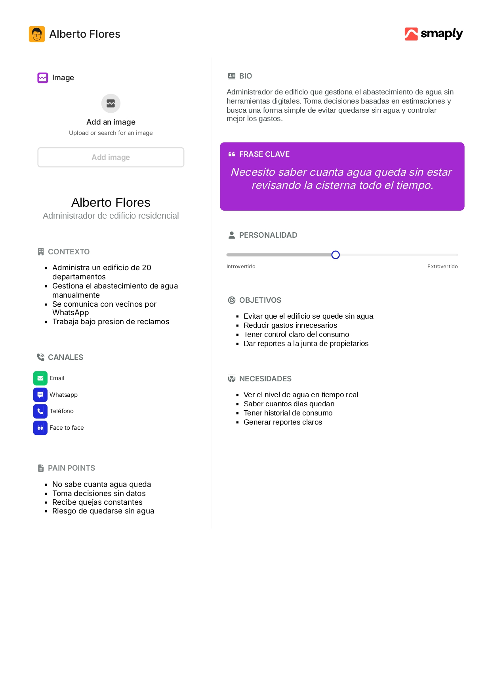

#####  Segmento 2: Residente

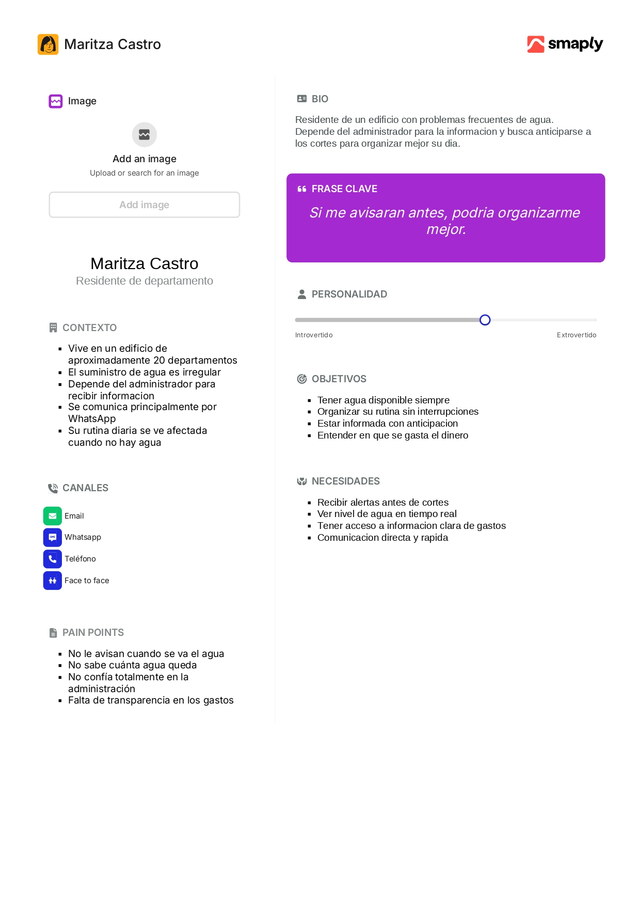

    
### 2.3.2. User Task Matrix.

A continuación se presenta el User Task Matrix, elaborado a partir del análisis de las entrevistas realizadas a los dos segmentos clave del proyecto TankIQ. Este artefacto permite identificar las actividades principales que realiza cada tipo de usuario, la frecuencia con que las ejecutan y la importancia que les otorgan. Los resultados sirven para priorizar las funcionalidades de la solución, asegurando que responda a las necesidades reales de ambos perfiles.

| N° | Tarea (Task) | Administrador de Edificio | | Propietario / Inquilino | |
| :---: | :--- | :---: | :---: | :---: | :---: |
| | | **Frequency** | **Importance** | **Frequency** | **Importance** |
| 1 | Verificar el nivel de agua disponible en la cisterna | Daily | High | Monthly | Medium |
| 2 | Revisar el historial de consumo de agua del edificio | Weekly | High | Monthly | Medium |
| 3 | Coordinar o solicitar recargas de camión cisterna | Sometimes | High | Never | Low |
| 4 | Registrar y controlar los gastos relacionados al agua | Monthly | High | Never | Low |
| 5 | Rendir cuentas ante la junta de propietarios sobre el gasto en agua | Monthly | High | Never | Low |
| 6 | Recibir alertas o notificaciones sobre nivel crítico de agua | Always | High | Always | High |
| 7 | Consultar la proyección de días de agua disponibles | Weekly | High | Sometimes | Medium |
| 8 | Comunicar a los vecinos sobre cortes o problemas de agua | Sometimes | High | Never | Low |
| 9 | Consultar el gasto mensual en agua del edificio | Monthly | High | Monthly | High |
| 10 | Planificar rutinas considerando la disponibilidad de agua | Daily | High | Daily | High |
### 2.3.3. User Journey Mapping.

User Journey Mapping Segmento 1: Alberto Flores (Administrador de edificio residencial)

| | **Etapa 1:** Detecta posible falta de agua | **Etapa 2:** Baja a revisar la cisterna | **Etapa 3:** Llama al camión cisterna | **Etapa 4:** Gestiona quejas de vecinos | **Etapa 5:** Rinde cuentas a la junta |
|---|---|---|---|---|---|
| **Acciones** | Recibe mensajes en WhatsApp o una queja directa sobre baja presión de agua | Baja al sótano y golpea la pared de la cisterna para estimar el nivel por el sonido | Llama al proveedor de camión cisterna y espera horas para confirmar disponibilidad | Responde mensajes en WhatsApp, pide paciencia e informa cuándo llegará el camión | Busca anotaciones en cuaderno o Excel y calcula el gasto manualmente para la reunión |
| **Sentimientos** | Preocupado | Inseguro | Bajo presión | Agobiado | Inseguro |
| **Dolores** | No hay sistema de alerta. Se entera cuando ya es demasiado tarde. | La revisión manual es imprecisa. No puede cuantificar el nivel real. | Sin historial de consumo, no sabe si el camión es realmente necesario en ese momento. | No tiene datos concretos para responder con información objetiva a los vecinos. | Los registros manuales son incompletos y generan desconfianza en la junta. |
| **Oportunidades** | Enviar alertas automáticas cuando el nivel baje del umbral definido | Mostrar el nivel exacto en tiempo real desde el dashboard sin bajar a la cisterna | Proyectar los días de agua disponibles para anticipar la recarga con tiempo | Dar acceso a los vecinos a una vista del nivel actual para reducir quejas | Generar reportes automáticos de consumo y gasto mensual listos para la junta |

User Journey Mapping Segmento 2: Maritza Castro (Residente de departamento)

| | **Etapa 1:** Inicia su día cotidiano | **Etapa 2:** Descubre que no hay agua | **Etapa 3:** Busca información del problema | **Etapa 4:** Improvisa y gestiona el día | **Etapa 5:** Reclama y cuestiona los gastos |
|---|---|---|---|---|---|
| **Acciones** | Se levanta e intenta usar el grifo para bañarse o preparar el desayuno | Abre el grifo y no hay presión. Revisa el grupo de WhatsApp sin encontrar aviso previo | Escribe al grupo preguntando qué pasó. Espera respuesta del administrador | Usa agua embotellada. Sale antes de lo habitual. Pide a alguien que le avise cuando vuelva el agua | Pregunta en la junta cuánto se gasta en recargas y cuestiona la gestión del presupuesto |
| **Sentimientos** | Tranquila | Frustrada | Ansiosa | Resignada | Desconfiada |
| **Dolores** | No tiene forma de saber si habrá agua antes de que el problema ocurra. | El grupo de WhatsApp avisa tarde o no avisa. No hay comunicación proactiva. | Depende completamente del administrador. No tiene acceso directo a ningún dato. | No puede planificar su rutina. Solo reacciona cuando el problema ya ocurrió. | No hay registros claros de gastos. Los conflictos en la junta no se resuelven con datos. |
| **Oportunidades** | Mostrar el nivel de la cisterna en tiempo real accesible para todos los residentes | Enviar notificaciones anticipadas cuando el nivel baje a un nivel de advertencia | Ofrecer una vista de solo lectura del estado del edificio sin depender del administrador | Proyectar cuándo se normalizará el suministro para que el residente pueda organizarse | Publicar el historial de gastos en agua para que la junta pueda auditarlo con datos reales |

### 2.3.4. Empathy Mapping.

Empathy Map Segmento 1: Alberto Flores (Administrador de edificio residencial)

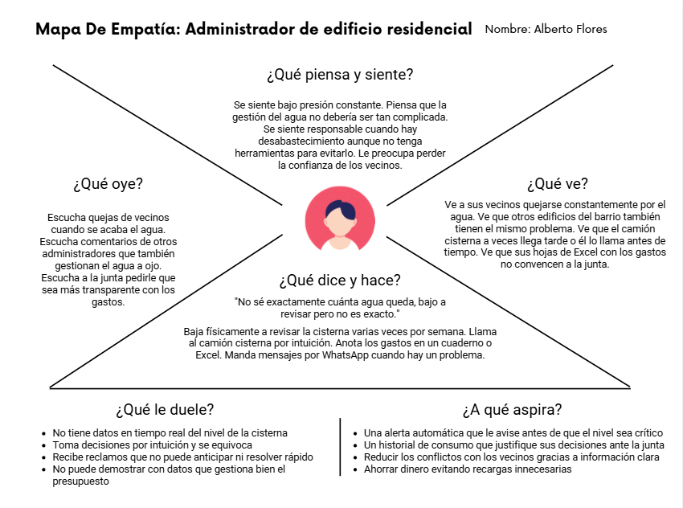

Empathy Map Segmento 2: Maritza Castro (Residente de departamento)

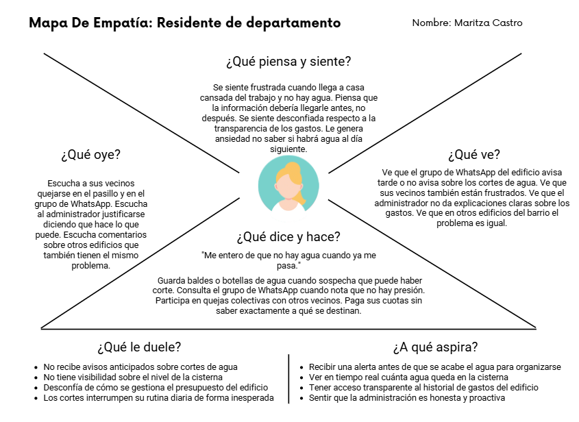

    
## 2.4. Big Picture EventStorming.

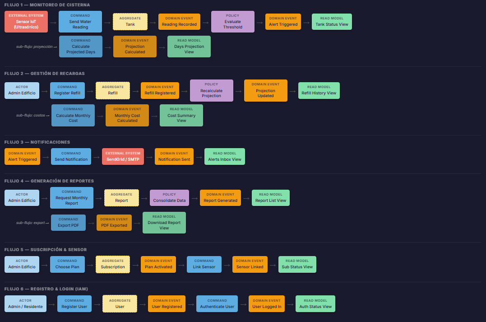

    
## 2.5. Ubiquitous Language.

El **Lenguaje Ubicuo** se refiere a un vocabulario común y compartido que emplean tanto los miembros del equipo de desarrollo como los stakeholders y usuarios finales. Su propósito es garantizar una comunicación clara y coherente sobre los conceptos, términos y procesos del dominio de gestión hídrica en el que se desarrolla **TankIQ**.

### Glosario de Términos

| **Término (Inglés / Español)** | **Definición** |
|--------------------------------|----------------|
| **Cistern Monitoring (Monitoreo de Cisterna)** | Supervisión continua de los depósitos de agua (subterráneos o elevados) mediante sensores de nivel. |
| **Water Level Threshold (Umbral de Nivel)** | Valores críticos configurados (mínimo/máximo) que disparan acciones o notificaciones en el sistema. |
| **Real-time Telemetry (Telemetría en Tiempo Real)** | Transmisión constante de datos desde el hardware IoT hacia la plataforma sobre el estado del recurso. |
| **Consumption Analytics (Analítica de Consumo)** | Procesamiento de datos históricos para identificar patrones de uso y detectar posibles fugas o anomalías. |
| **Sensor Calibration (Calibración de Sensor)** | Ajuste técnico de los dispositivos (ultrasónicos/presión) para asegurar una lectura precisa según la geometría del tanque. |
| **Critical Level Alert (Alerta de Nivel Crítico)** | Notificación automática enviada cuando el volumen de agua está por debajo de la reserva operativa de seguridad. |
| **Flow Rate Measurement (Medición de Caudal)** | Cálculo de la velocidad con la que el agua entra o sale del sistema para determinar la eficiencia de llenado. |
| **IoT Node Status (Estado de Nodo IoT)** | Indicador de salud del hardware (conectividad, batería, señal) encargado de la lectura en campo. |
| **Automated Supply Log (Registro de Suministro)** | Historial digital que documenta cuándo y cuánto agua ha ingresado al sistema (ej. descarga de camiones cisterna). |
| **Predictive Maintenance (Mantenimiento Predictivo)** | Estimación de fallos en sensores o bombas basada en el comportamiento inusual de los datos recopilados. |
    
# Capítulo III: Requirements Specification
  
## 3.1. User Stories.

En esta sección se presentan los requisitos funcionales del sistema TankIQ definidos mediante User Stories y agrupados en Epics a partir del análisis realizado en el Capítulo II.

#### Epics

| Epic ID | Título | Descripción |
|--------|--------|------------|
| EP01 | Autenticación y gestión de usuarios | Permite a los usuarios registrarse, iniciar sesión, cerrar sesión y acceder al sistema según su rol (administrador o propietario) |
| EP02 | Monitoreo y proyección de cisterna | Permite visualizar el nivel actual de agua, indicadores en tiempo real y la proyección de días disponibles para la toma de decisiones |
| EP03 | Alertas y notificaciones | Permite generar y enviar alertas automáticas y notificaciones sobre niveles críticos y eventos relevantes del suministro de agua |
| EP04 | Gestión de recargas | Permite registrar recargas de agua para mantener actualizado el nivel de la cisterna y asegurar la continuidad del servicio |
| EP05 | Historial y consumo | Permite visualizar el historial de consumo de agua y analizar el comportamiento a lo largo del tiempo |
| EP06 | Reportes y transparencia | Permite generar y consultar reportes de consumo y gastos para la toma de decisiones y rendición de cuentas ante la junta de propietarios |
| EP07 | Configuración del sistema | Permite configurar parámetros del sistema como umbrales de alertas y datos del edificio |
| EP08 | Visualización para propietarios | Permite a propietarios e inquilinos acceder a información relevante del estado de la cisterna, consumo y gastos en modo solo lectura |

#### User Stories

| ID | Título | Descripción | Épica |
|----|--------|------------|----------|
| US01 | Ver nivel de agua | Como administrador, deseo visualizar el nivel de agua en tiempo real para tomar decisiones | EP02 |
| US02 | Ver estado de cisterna | Como administrador, deseo conocer el estado de la cisterna para evitar desabastecimiento | EP02 |
| US03 | Ver días estimados | Como administrador, deseo conocer los días de agua disponibles para anticipar recargas | EP02 |
| US04 | Visualizar dashboard | Como administrador, deseo ver indicadores clave para gestionar el suministro de agua | EP02 |
| US05 | Recibir alerta crítica | Como administrador, deseo recibir alertas cuando el nivel sea crítico para actuar a tiempo | EP03 |
| US06 | Ver alertas | Como administrador, deseo visualizar alertas para gestionar riesgos | EP03 |
| US07 | Recibir notificaciones | Como usuario, deseo recibir notificaciones para estar informado sobre el estado del agua | EP03 |
| US08 | Ver notificaciones | Como usuario, deseo revisar notificaciones para conocer eventos recientes | EP03 |
| US09 | Registrar recarga | Como administrador, deseo registrar recargas para mantener actualizado el nivel de agua | EP04 |
| US10 | Ver historial de recargas | Como administrador, deseo visualizar recargas para llevar control del abastecimiento | EP04 |
| US11 | Editar recarga | Como administrador, deseo modificar recargas para corregir errores | EP04 |
| US12 | Eliminar recarga | Como administrador, deseo eliminar recargas para mantener información correcta | EP04 |
| US13 | Ver historial de consumo | Como administrador, deseo visualizar el consumo de agua para análisis | EP05 |
| US14 | Analizar consumo | Como administrador, deseo analizar consumo para mejorar la gestión | EP05 |
| US15 | Ver consumo mensual | Como administrador, deseo visualizar consumo mensual para evaluar gasto | EP05 |
| US16 | Ver consumo diario | Como administrador, deseo visualizar consumo diario para control | EP05 |
| US17 | Filtrar historial de consumo | Como administrador, deseo filtrar consumo para análisis específico | EP05 |
| US18 | Ver tendencias de consumo | Como administrador, deseo visualizar tendencias para planificación | EP05 |
| US19 | Comparar consumo entre periodos | Como administrador, deseo comparar consumo para tomar decisiones | EP05 |
| US20 | Generar reportes | Como administrador, deseo generar reportes para informar a la junta | EP06 |
| US21 | Descargar reportes | Como administrador, deseo descargar reportes para compartirlos | EP06 |
| US22 | Ver reportes históricos | Como administrador, deseo revisar reportes anteriores | EP06 |
| US23 | Compartir reportes | Como administrador, deseo compartir reportes para transparencia | EP06 |
| US24 | Filtrar reportes | Como administrador, deseo filtrar reportes para consultas | EP06 |
| US25 | Registrar gasto de recarga | Como administrador, deseo registrar el costo de recargas para control financiero | EP06 |
| US26 | Consultar gasto mensual | Como administrador, deseo ver gasto mensual para evaluar presupuesto | EP06 |
| US27 | Ver gastos de agua | Como propietario, deseo visualizar los gastos para entender el uso del dinero | EP08 |
| US28 | Ver estado de cisterna (propietario) | Como propietario, deseo conocer el estado del agua para planificar su uso | EP08 |
| US29 | Ver consumo histórico (propietario) | Como propietario, deseo visualizar consumo para entender el uso del recurso | EP08 |
| US30 | Ver alertas (propietario) | Como propietario, deseo ver alertas para anticiparse a problemas | EP08 |
| US31 | Ver reportes (propietario) | Como propietario, deseo revisar reportes para transparencia | EP08 |
| US32 | Configurar umbrales de alerta | Como administrador, deseo definir límites para alertas | EP07 |
| US33 | Configurar datos del edificio | Como administrador, deseo registrar datos del edificio | EP07 |
| US34 | Iniciar sesión | Como usuario, deseo iniciar sesión para acceder al sistema | EP01 |
| US35 | Registrar administrador | Como administrador, deseo registrarme para gestionar el sistema | EP01 |
| US36 | Cerrar sesión | Como usuario, deseo cerrar sesión para proteger su cuenta | EP01 |
| US37 | Recuperar contraseña | Como usuario, deseo recuperar acceso al sistema | EP01 |
| US38 | Visualizar información clara | Como usuario, deseo entender la información del sistema | EP02 |
| US39 | Acceder desde dispositivo móvil | Como usuario, deseo usar el sistema desde su celular | EP02 |
| US40 | Recibir alerta de consumo alto | Como administrador, deseo detectar consumo alto para actuar | EP03 |
| US41 | Recibir alerta de consumo inusual | Como administrador, deseo detectar anomalías en el consumo | EP03 |
| US42 | Ver notificación de corte programado | Como usuario, deseo recibir avisos de cortes programados | EP03 |
| US43 | Consultar disponibilidad de agua | Como usuario, deseo saber si hay agua disponible | EP02 |
| US44 | Visualizar resumen general | Como administrador, deseo ver un resumen del sistema | EP02 |
| US45 | Revisar información actualizada | Como usuario, deseo ver datos actualizados | EP02 |
| US46 | Navegar por secciones del landing | Como visitante, deseo navegar por la página para conocer la solución | EP01 |
| US47 | Visualizar propuesta de valor | Como visitante, deseo entender qué hace el sistema | EP01 |
| US48 | Identificar problemas del sistema | Como visitante, deseo conocer qué problemas resuelve | EP01 |
| US49 | Comprender funcionamiento | Como visitante, deseo entender cómo funciona el sistema | EP01 |
| US50 | Visualizar beneficios | Como visitante, deseo conocer los beneficios del sistema | EP01 |
| US51 | Consultar planes | Como visitante, deseo conocer los planes disponibles | EP01 |
| US52 | Enviar contacto | Como visitante, deseo enviar mis datos para recibir información | EP01 |
| US53 | Acceder a contacto desde botones | Como visitante, deseo acceder rápidamente al formulario de contacto | EP01 |

### HU01 - Ver nivel de agua

<table>
<tr>
<td><b>Número:</b></td>
<td>HU01</td>
<td><b>Usuario:</b></td>
<td>Administrador</td>
</tr>

<tr>
<td><b>Nombre HU:</b></td>
<td colspan="3">Ver nivel de agua</td>
</tr>

<tr>
<td><b>Prioridad en el negocio:</b></td>
<td colspan="3">Alta</td>
</tr>

<tr>
<td><b>Responsable:</b></td>
<td colspan="3">Pendiente</td>
</tr>

<tr>
<td><b>Descripción:</b></td>
<td colspan="3">
Como administrador, quiero visualizar el nivel de agua en tiempo real para tomar decisiones
</td>
</tr>

<tr>
<td><b>Criterios de aceptación:</b></td>
<td colspan="3">

<b>Escenario 1: Visualización del nivel</b> 
Dado que existe una medición registrada del nivel de agua 
Cuando el administrador accede al sistema 
Entonces el sistema muestra el nivel actual de la cisterna  

<b>Escenario 2: Sin medición registrada</b> 
Dado que no existe ninguna medición registrada 
Cuando el administrador accede 
Entonces el sistema muestra un mensaje indicando que no hay información disponible

</td>
</tr>
</table>

### HU02 - Ver estado de cisterna

<table>
<tr>
<td><b>Número:</b></td>
<td>HU02</td>
<td><b>Usuario:</b></td>
<td>Administrador</td>
</tr>

<tr>
<td><b>Nombre HU:</b></td>
<td colspan="3">Ver estado de cisterna</td>
</tr>

<tr>
<td><b>Prioridad en el negocio:</b></td>
<td colspan="3">Alta</td>
</tr>

<tr>
<td><b>Responsable:</b></td>
<td colspan="3">Pendiente</td>
</tr>

<tr>
<td><b>Descripción:</b></td>
<td colspan="3">
Como administrador, quiero conocer el estado de la cisterna para evitar desabastecimiento
</td>
</tr>

<tr>
<td><b>Criterios de aceptación:</b></td>
<td colspan="3">

<b>Escenario 1: Estado calculado</b> 
Dado que existe una medición del nivel de agua 
Cuando accede al dashboard 
Entonces el sistema muestra el estado (normal, medio o crítico)  

<b>Escenario 2: Nivel crítico</b> 
Dado que el nivel está por debajo del umbral mínimo configurado 
Cuando el sistema evalúa 
Entonces muestra el estado como crítico

</td>
</tr>
</table>

### HU03 - Ver días estimados

<table>
<tr>
<td><b>Número:</b></td>
<td>HU03</td>
<td><b>Usuario:</b></td>
<td>Administrador</td>
</tr>

<tr>
<td><b>Nombre HU:</b></td>
<td colspan="3">Ver días estimados</td>
</tr>

<tr>
<td><b>Prioridad en el negocio:</b></td>
<td colspan="3">Alta</td>
</tr>

<tr>
<td><b>Responsable:</b></td>
<td colspan="3">Pendiente</td>
</tr>

<tr>
<td><b>Descripción:</b></td>
<td colspan="3">
Como administrador, quiero conocer los días de agua disponibles para anticipar recargas
</td>
</tr>

<tr>
<td><b>Criterios de aceptación:</b></td>
<td colspan="3">

<b>Escenario 1: Cálculo de proyección</b> 
Dado que existen registros históricos de consumo de agua 
Cuando consulta la proyección 
Entonces el sistema muestra los días estimados de disponibilidad  

<b>Escenario 2: Historial insuficiente</b> 
Dado que no existen registros suficientes de consumo 
Cuando consulta la proyección 
Entonces el sistema indica que no puede calcularla

</td>
</tr>
</table>

### HU04 - Visualizar dashboard

<table>
<tr>
<td><b>Número:</b></td>
<td>HU04</td>
<td><b>Usuario:</b></td>
<td>Administrador</td>
</tr>

<tr>
<td><b>Nombre HU:</b></td>
<td colspan="3">Visualizar dashboard</td>
</tr>

<tr>
<td><b>Prioridad en el negocio:</b></td>
<td colspan="3">Alta</td>
</tr>

<tr>
<td><b>Responsable:</b></td>
<td colspan="3">Pendiente</td>
</tr>

<tr>
<td><b>Descripción:</b></td>
<td colspan="3">
Como administrador, quiero visualizar indicadores clave para gestionar el suministro de agua
</td>
</tr>

<tr>
<td><b>Criterios de aceptación:</b></td>
<td colspan="3">

<b>Escenario 1: Visualización completa</b> 
Dado que existen registros de nivel de agua y consumo 
Cuando accede al dashboard 
Entonces el sistema muestra indicadores principales  

<b>Escenario 2: Información parcial</b> 
Dado que falta información de consumo o nivel 
Cuando accede al dashboard 
Entonces el sistema muestra los indicadores disponibles y un mensaje informativo

</td>
</tr>
</table>

### HU05 - Recibir alerta crítica

<table>
<tr>
<td><b>Número:</b></td>
<td>HU05</td>
<td><b>Usuario:</b></td>
<td>Administrador</td>
</tr>

<tr>
<td><b>Nombre HU:</b></td>
<td colspan="3">Recibir alerta crítica</td>
</tr>

<tr>
<td><b>Prioridad en el negocio:</b></td>
<td colspan="3">Alta</td>
</tr>

<tr>
<td><b>Responsable:</b></td>
<td colspan="3">Pendiente</td>
</tr>

<tr>
<td><b>Descripción:</b></td>
<td colspan="3">
Como administrador, quiero recibir alertas cuando el nivel sea crítico para actuar a tiempo
</td>
</tr>

<tr>
<td><b>Criterios de aceptación:</b></td>
<td colspan="3">

<b>Escenario 1: Generación de alerta</b> 
Dado que el nivel de agua está por debajo del umbral mínimo configurado 
Cuando el sistema evalúa el nivel 
Entonces genera una alerta crítica  

<b>Escenario 2: Notificación enviada</b> 
Dado que se genera una alerta crítica 
Cuando ocurre el evento 
Entonces el sistema envía una notificación al usuario

</td>
</tr>
</table>

### HU06 - Ver alertas

<table>
<tr>
<td><b>Número:</b></td>
<td>HU06</td>
<td><b>Usuario:</b></td>
<td>Administrador</td>
</tr>

<tr>
<td><b>Nombre HU:</b></td>
<td colspan="3">Ver alertas</td>
</tr>

<tr>
<td><b>Prioridad en el negocio:</b></td>
<td colspan="3">Alta</td>
</tr>

<tr>
<td><b>Responsable:</b></td>
<td colspan="3">Pendiente</td>
</tr>

<tr>
<td><b>Descripción:</b></td>
<td colspan="3">
Como administrador, quiero visualizar alertas para gestionar riesgos
</td>
</tr>

<tr>
<td><b>Criterios de aceptación:</b></td>
<td colspan="3">

<b>Escenario 1: Lista de alertas</b> 
Dado que existen alertas generadas 
Cuando accede a la sección 
Entonces el sistema muestra el listado de alertas  

<b>Escenario 2: Sin alertas</b> 
Dado que no existen alertas registradas 
Cuando accede 
Entonces el sistema muestra un mensaje indicando que no hay alertas

</td>
</tr>
</table>

### HU07 - Recibir notificaciones

<table>
<tr>
<td><b>Número:</b></td>
<td>HU07</td>
<td><b>Usuario:</b></td>
<td>Usuario</td>
</tr>

<tr>
<td><b>Nombre HU:</b></td>
<td colspan="3">Recibir notificaciones</td>
</tr>

<tr>
<td><b>Prioridad en el negocio:</b></td>
<td colspan="3">Alta</td>
</tr>

<tr>
<td><b>Responsable:</b></td>
<td colspan="3">Pendiente</td>
</tr>

<tr>
<td><b>Descripción:</b></td>
<td colspan="3">
Como usuario, quiero recibir notificaciones para estar informado sobre eventos del sistema
</td>
</tr>

<tr>
<td><b>Criterios de aceptación:</b></td>
<td colspan="3">

<b>Escenario 1: Notificación generada</b> 
Dado que ocurre un evento relevante 
Cuando el sistema lo detecta 
Entonces envía una notificación al usuario  

<b>Escenario 2: Visualización de notificación</b> 
Dado que el usuario tiene notificaciones 
Cuando accede al sistema 
Entonces puede visualizarlas

</td>
</tr>
</table>

### HU08 - Ver notificaciones

<table>
<tr>
<td><b>Número:</b></td>
<td>HU08</td>
<td><b>Usuario:</b></td>
<td>Usuario</td>
</tr>

<tr>
<td><b>Nombre HU:</b></td>
<td colspan="3">Ver notificaciones</td>
</tr>

<tr>
<td><b>Prioridad en el negocio:</b></td>
<td colspan="3">Alta</td>
</tr>

<tr>
<td><b>Responsable:</b></td>
<td colspan="3">Pendiente</td>
</tr>

<tr>
<td><b>Descripción:</b></td>
<td colspan="3">
Como usuario, quiero revisar notificaciones para conocer eventos recientes
</td>
</tr>

<tr>
<td><b>Criterios de aceptación:</b></td>
<td colspan="3">

<b>Escenario 1: Lista de notificaciones</b> 
Dado que existen notificaciones 
Cuando accede a la sección 
Entonces el sistema muestra la lista  

<b>Escenario 2: Sin notificaciones</b> 
Dado que no existen notificaciones 
Cuando accede 
Entonces el sistema muestra un mensaje informativo

</td>
</tr>
</table>

### HU09 - Registrar recarga

<table>
<tr>
<td><b>Número:</b></td>
<td>HU09</td>
<td><b>Usuario:</b></td>
<td>Administrador</td>
</tr>

<tr>
<td><b>Nombre HU:</b></td>
<td colspan="3">Registrar recarga</td>
</tr>

<tr>
<td><b>Prioridad en el negocio:</b></td>
<td colspan="3">Media</td>
</tr>

<tr>
<td><b>Responsable:</b></td>
<td colspan="3">Pendiente</td>
</tr>

<tr>
<td><b>Descripción:</b></td>
<td colspan="3">
Como administrador, quiero registrar recargas para actualizar el nivel de agua
</td>
</tr>

<tr>
<td><b>Criterios de aceptación:</b></td>
<td colspan="3">

<b>Escenario 1: Registro exitoso</b> 
Dado que ingresa datos válidos de recarga 
Cuando guarda la información 
Entonces el sistema actualiza el nivel de agua  

<b>Escenario 2: Datos incompletos</b> 
Dado que faltan datos obligatorios 
Cuando intenta registrar 
Entonces el sistema solicita completar la información

</td>
</tr>
</table>

### HU10 - Ver historial de recargas

<table>
<tr>
<td><b>Número:</b></td>
<td>HU10</td>
<td><b>Usuario:</b></td>
<td>Administrador</td>
</tr>

<tr>
<td><b>Nombre HU:</b></td>
<td colspan="3">Ver historial de recargas</td>
</tr>

<tr>
<td><b>Prioridad en el negocio:</b></td>
<td colspan="3">Media</td>
</tr>

<tr>
<td><b>Responsable:</b></td>
<td colspan="3">Pendiente</td>
</tr>

<tr>
<td><b>Descripción:</b></td>
<td colspan="3">
Como administrador, quiero visualizar el historial de recargas para llevar control del abastecimiento
</td>
</tr>

<tr>
<td><b>Criterios de aceptación:</b></td>
<td colspan="3">

<b>Escenario 1: Visualización de historial</b> 
Dado que existen registros de recargas 
Cuando accede a la sección 
Entonces el sistema muestra la lista de recargas  

<b>Escenario 2: Sin registros</b> 
Dado que no existen recargas registradas 
Cuando accede 
Entonces el sistema muestra un mensaje indicando que no hay datos

</td>
</tr>
</table>

### HU11 - Ver historial de consumo

<table>
<tr>
<td><b>Número:</b></td>
<td>HU11</td>
<td><b>Usuario:</b></td>
<td>Administrador</td>
</tr>

<tr>
<td><b>Nombre HU:</b></td>
<td colspan="3">Ver historial de consumo</td>
</tr>

<tr>
<td><b>Prioridad en el negocio:</b></td>
<td colspan="3">Alta</td>
</tr>

<tr>
<td><b>Responsable:</b></td>
<td colspan="3">Pendiente</td>
</tr>

<tr>
<td><b>Descripción:</b></td>
<td colspan="3">
Como administrador, quiero visualizar el historial de consumo de agua para analizar su comportamiento
</td>
</tr>

<tr>
<td><b>Criterios de aceptación:</b></td>
<td colspan="3">

<b>Escenario 1: Visualización del historial</b> 
Dado que existen registros de consumo de agua 
Cuando accede a la sección de historial 
Entonces el sistema muestra la lista de consumos registrados  

<b>Escenario 2: Sin registros de consumo</b> 
Dado que no existen registros de consumo 
Cuando accede a la sección 
Entonces el sistema muestra un mensaje indicando que no hay datos disponibles

</td>
</tr>
</table>

### HU12 - Analizar consumo

<table>
<tr>
<td><b>Número:</b></td>
<td>HU12</td>
<td><b>Usuario:</b></td>
<td>Administrador</td>
</tr>

<tr>
<td><b>Nombre HU:</b></td>
<td colspan="3">Analizar consumo</td>
</tr>

<tr>
<td><b>Prioridad en el negocio:</b></td>
<td colspan="3">Alta</td>
</tr>

<tr>
<td><b>Responsable:</b></td>
<td colspan="3">Pendiente</td>
</tr>

<tr>
<td><b>Descripción:</b></td>
<td colspan="3">
Como administrador, quiero analizar el consumo de agua para tomar decisiones eficientes
</td>
</tr>

<tr>
<td><b>Criterios de aceptación:</b></td>
<td colspan="3">

<b>Escenario 1: Visualización de análisis</b> 
Dado que existen registros de consumo 
Cuando accede a la sección de análisis 
Entonces el sistema muestra gráficos o indicadores de consumo  

<b>Escenario 2: Sin datos para análisis</b> 
Dado que no existen registros suficientes 
Cuando accede a la sección 
Entonces el sistema muestra un mensaje informativo

</td>
</tr>
</table>

### HU13 - Ver consumo mensual

<table>
<tr>
<td><b>Número:</b></td>
<td>HU13</td>
<td><b>Usuario:</b></td>
<td>Administrador</td>
</tr>

<tr>
<td><b>Nombre HU:</b></td>
<td colspan="3">Ver consumo mensual</td>
</tr>

<tr>
<td><b>Prioridad en el negocio:</b></td>
<td colspan="3">Media</td>
</tr>

<tr>
<td><b>Responsable:</b></td>
<td colspan="3">Pendiente</td>
</tr>

<tr>
<td><b>Descripción:</b></td>
<td colspan="3">
Como administrador, quiero visualizar el consumo mensual para evaluar el gasto de agua
</td>
</tr>

<tr>
<td><b>Criterios de aceptación:</b></td>
<td colspan="3">

<b>Escenario 1: Consumo mensual disponible</b> 
Dado que existen registros de consumo en el mes 
Cuando selecciona el periodo mensual 
Entonces el sistema muestra el total de consumo  

<b>Escenario 2: Sin datos del mes</b> 
Dado que no existen registros en el periodo seleccionado 
Cuando consulta 
Entonces el sistema muestra un mensaje informativo

</td>
</tr>
</table>

### HU14 - Ver consumo diario

<table>
<tr>
<td><b>Número:</b></td>
<td>HU14</td>
<td><b>Usuario:</b></td>
<td>Administrador</td>
</tr>

<tr>
<td><b>Nombre HU:</b></td>
<td colspan="3">Ver consumo diario</td>
</tr>

<tr>
<td><b>Prioridad en el negocio:</b></td>
<td colspan="3">Media</td>
</tr>

<tr>
<td><b>Responsable:</b></td>
<td colspan="3">Pendiente</td>
</tr>

<tr>
<td><b>Descripción:</b></td>
<td colspan="3">
Como administrador, quiero visualizar el consumo diario para un control más detallado
</td>
</tr>

<tr>
<td><b>Criterios de aceptación:</b></td>
<td colspan="3">

<b>Escenario 1: Consumo diario disponible</b> 
Dado que existen registros diarios de consumo 
Cuando consulta el detalle 
Entonces el sistema muestra el consumo por día  

<b>Escenario 2: Sin registros diarios</b> 
Dado que no existen datos diarios registrados 
Cuando consulta 
Entonces el sistema muestra un mensaje informativo

</td>
</tr>
</table>

### HU15 - Filtrar historial de consumo

<table>
<tr>
<td><b>Número:</b></td>
<td>HU15</td>
<td><b>Usuario:</b></td>
<td>Administrador</td>
</tr>

<tr>
<td><b>Nombre HU:</b></td>
<td colspan="3">Filtrar historial de consumo</td>
</tr>

<tr>
<td><b>Prioridad en el negocio:</b></td>
<td colspan="3">Media</td>
</tr>

<tr>
<td><b>Responsable:</b></td>
<td colspan="3">Pendiente</td>
</tr>

<tr>
<td><b>Descripción:</b></td>
<td colspan="3">
Como administrador, quiero filtrar el historial de consumo para analizar periodos específicos
</td>
</tr>

<tr>
<td><b>Criterios de aceptación:</b></td>
<td colspan="3">

<b>Escenario 1: Aplicación de filtros</b> 
Dado que existen registros de consumo 
Cuando aplica un rango de fechas 
Entonces el sistema muestra los resultados filtrados  

<b>Escenario 2: Sin resultados</b> 
Dado que no existen datos en el rango seleccionado 
Cuando aplica el filtro 
Entonces el sistema muestra un mensaje indicando que no hay resultados

</td>
</tr>
</table>

### HU16 - Ver tendencias de consumo

<table>
<tr>
<td><b>Número:</b></td>
<td>HU16</td>
<td><b>Usuario:</b></td>
<td>Administrador</td>
</tr>

<tr>
<td><b>Nombre HU:</b></td>
<td colspan="3">Ver tendencias de consumo</td>
</tr>

<tr>
<td><b>Prioridad en el negocio:</b></td>
<td colspan="3">Media</td>
</tr>

<tr>
<td><b>Responsable:</b></td>
<td colspan="3">Pendiente</td>
</tr>

<tr>
<td><b>Descripción:</b></td>
<td colspan="3">
Como administrador, quiero visualizar tendencias de consumo para mejorar la planificación
</td>
</tr>

<tr>
<td><b>Criterios de aceptación:</b></td>
<td colspan="3">

<b>Escenario 1: Visualización de tendencia</b> 
Dado que existen registros históricos de consumo 
Cuando accede a la sección de tendencias 
Entonces el sistema muestra la evolución del consumo  

<b>Escenario 2: Sin historial suficiente</b> 
Dado que no existen suficientes datos históricos 
Cuando accede 
Entonces el sistema muestra un mensaje informativo

</td>
</tr>
</table>

### HU17 - Comparar consumo entre periodos

<table>
<tr>
<td><b>Número:</b></td>
<td>HU17</td>
<td><b>Usuario:</b></td>
<td>Administrador</td>
</tr>

<tr>
<td><b>Nombre HU:</b></td>
<td colspan="3">Comparar consumo entre periodos</td>
</tr>

<tr>
<td><b>Prioridad en el negocio:</b></td>
<td colspan="3">Media</td>
</tr>

<tr>
<td><b>Responsable:</b></td>
<td colspan="3">Pendiente</td>
</tr>

<tr>
<td><b>Descripción:</b></td>
<td colspan="3">
Como administrador, quiero comparar el consumo entre distintos periodos para tomar mejores decisiones
</td>
</tr>

<tr>
<td><b>Criterios de aceptación:</b></td>
<td colspan="3">

<b>Escenario 1: Comparación de periodos</b> 
Dado que existen datos en los periodos seleccionados 
Cuando realiza la comparación 
Entonces el sistema muestra la diferencia de consumo  

<b>Escenario 2: Periodo sin datos</b> 
Dado que uno de los periodos no tiene registros 
Cuando intenta comparar 
Entonces el sistema muestra un mensaje informativo

</td>
</tr>
</table>

### HU18 - Generar reportes

<table>
<tr>
<td><b>Número:</b></td>
<td>HU18</td>
<td><b>Usuario:</b></td>
<td>Administrador</td>
</tr>

<tr>
<td><b>Nombre HU:</b></td>
<td colspan="3">Generar reportes</td>
</tr>

<tr>
<td><b>Prioridad en el negocio:</b></td>
<td colspan="3">Alta</td>
</tr>

<tr>
<td><b>Responsable:</b></td>
<td colspan="3">Pendiente</td>
</tr>

<tr>
<td><b>Descripción:</b></td>
<td colspan="3">
Como administrador, quiero generar reportes para informar a la junta de propietarios
</td>
</tr>

<tr>
<td><b>Criterios de aceptación:</b></td>
<td colspan="3">

<b>Escenario 1: Generación de reporte</b> 
Dado que existen datos de consumo y gastos 
Cuando solicita generar un reporte 
Entonces el sistema genera el documento  

<b>Escenario 2: Sin datos disponibles</b> 
Dado que no existen datos suficientes 
Cuando solicita el reporte 
Entonces el sistema muestra un mensaje informativo

</td>
</tr>
</table>

### HU19 - Descargar reportes

<table>
<tr>
<td><b>Número:</b></td>
<td>HU19</td>
<td><b>Usuario:</b></td>
<td>Administrador</td>
</tr>

<tr>
<td><b>Nombre HU:</b></td>
<td colspan="3">Descargar reportes</td>
</tr>

<tr>
<td><b>Prioridad en el negocio:</b></td>
<td colspan="3">Media</td>
</tr>

<tr>
<td><b>Responsable:</b></td>
<td colspan="3">Pendiente</td>
</tr>

<tr>
<td><b>Descripción:</b></td>
<td colspan="3">
Como administrador, quiero descargar reportes para compartir información
</td>
</tr>

<tr>
<td><b>Criterios de aceptación:</b></td>
<td colspan="3">

<b>Escenario 1: Descarga exitosa</b> 
Dado que existe un reporte generado 
Cuando solicita la descarga 
Entonces el sistema descarga el archivo  

<b>Escenario 2: Sin reporte generado</b> 
Dado que no existe un reporte previo 
Cuando intenta descargar 
Entonces el sistema muestra un mensaje informativo

</td>
</tr>
</table>

### HU20 - Ver reportes históricos

<table>
<tr>
<td><b>Número:</b></td>
<td>HU20</td>
<td><b>Usuario:</b></td>
<td>Administrador</td>
</tr>

<tr>
<td><b>Nombre HU:</b></td>
<td colspan="3">Ver reportes históricos</td>
</tr>

<tr>
<td><b>Prioridad en el negocio:</b></td>
<td colspan="3">Media</td>
</tr>

<tr>
<td><b>Responsable:</b></td>
<td colspan="3">Pendiente</td>
</tr>

<tr>
<td><b>Descripción:</b></td>
<td colspan="3">
Como administrador, quiero visualizar reportes anteriores para análisis histórico
</td>
</tr>

<tr>
<td><b>Criterios de aceptación:</b></td>
<td colspan="3">

<b>Escenario 1: Visualización de reportes</b> 
Dado que existen reportes generados 
Cuando accede a la sección 
Entonces el sistema muestra la lista de reportes  

<b>Escenario 2: Sin reportes</b> 
Dado que no existen reportes almacenados 
Cuando accede 
Entonces el sistema muestra un mensaje informativo

</td>
</tr>
</table>

### HU21 - Compartir reportes

<table>
<tr>
<td><b>Número:</b></td>
<td>HU21</td>
<td><b>Usuario:</b></td>
<td>Administrador</td>
</tr>

<tr>
<td><b>Nombre HU:</b></td>
<td colspan="3">Compartir reportes</td>
</tr>

<tr>
<td><b>Prioridad en el negocio:</b></td>
<td colspan="3">Media</td>
</tr>

<tr>
<td><b>Responsable:</b></td>
<td colspan="3">Pendiente</td>
</tr>

<tr>
<td><b>Descripción:</b></td>
<td colspan="3">
Como administrador, quiero compartir reportes con los propietarios para garantizar transparencia
</td>
</tr>

<tr>
<td><b>Criterios de aceptación:</b></td>
<td colspan="3">

<b>Escenario 1: Compartir exitoso</b> 
Dado que existe un reporte generado 
Cuando el administrador selecciona la opción de compartir 
Entonces el sistema envía el reporte a los destinatarios  

<b>Escenario 2: Sin reporte disponible</b> 
Dado que no existe un reporte generado 
Cuando intenta compartir 
Entonces el sistema muestra un mensaje informativo

</td>
</tr>
</table>

### HU22 - Filtrar reportes

<table>
<tr>
<td><b>Número:</b></td>
<td>HU22</td>
<td><b>Usuario:</b></td>
<td>Administrador</td>
</tr>

<tr>
<td><b>Nombre HU:</b></td>
<td colspan="3">Filtrar reportes</td>
</tr>

<tr>
<td><b>Prioridad en el negocio:</b></td>
<td colspan="3">Media</td>
</tr>

<tr>
<td><b>Responsable:</b></td>
<td colspan="3">Pendiente</td>
</tr>

<tr>
<td><b>Descripción:</b></td>
<td colspan="3">
Como administrador, quiero filtrar reportes para consultar información específica
</td>
</tr>

<tr>
<td><b>Criterios de aceptación:</b></td>
<td colspan="3">

<b>Escenario 1: Aplicación de filtros</b> 
Dado que existen reportes registrados 
Cuando aplica un filtro por fecha 
Entonces el sistema muestra los reportes correspondientes  

<b>Escenario 2: Sin resultados</b> 
Dado que no existen reportes en el rango seleccionado 
Cuando aplica el filtro 
Entonces el sistema muestra un mensaje informativo

</td>
</tr>
</table>

### HU23 - Registrar gasto de recarga

<table>
<tr>
<td><b>Número:</b></td>
<td>HU23</td>
<td><b>Usuario:</b></td>
<td>Administrador</td>
</tr>

<tr>
<td><b>Nombre HU:</b></td>
<td colspan="3">Registrar gasto de recarga</td>
</tr>

<tr>
<td><b>Prioridad en el negocio:</b></td>
<td colspan="3">Alta</td>
</tr>

<tr>
<td><b>Responsable:</b></td>
<td colspan="3">Pendiente</td>
</tr>

<tr>
<td><b>Descripción:</b></td>
<td colspan="3">
Como administrador, quiero registrar el costo de cada recarga para llevar control financiero
</td>
</tr>

<tr>
<td><b>Criterios de aceptación:</b></td>
<td colspan="3">

<b>Escenario 1: Registro exitoso</b> 
Dado que ingresa el monto y la fecha de la recarga 
Cuando guarda la información 
Entonces el sistema registra el gasto correctamente  

<b>Escenario 2: Datos incompletos</b> 
Dado que faltan datos obligatorios 
Cuando intenta registrar 
Entonces el sistema solicita completar la información

</td>
</tr>
</table>

### HU24 - Consultar gasto mensual

<table>
<tr>
<td><b>Número:</b></td>
<td>HU24</td>
<td><b>Usuario:</b></td>
<td>Administrador</td>
</tr>

<tr>
<td><b>Nombre HU:</b></td>
<td colspan="3">Consultar gasto mensual</td>
</tr>

<tr>
<td><b>Prioridad en el negocio:</b></td>
<td colspan="3">Alta</td>
</tr>

<tr>
<td><b>Responsable:</b></td>
<td colspan="3">Pendiente</td>
</tr>

<tr>
<td><b>Descripción:</b></td>
<td colspan="3">
Como administrador, quiero visualizar el gasto mensual de agua para evaluar el presupuesto
</td>
</tr>

<tr>
<td><b>Criterios de aceptación:</b></td>
<td colspan="3">

<b>Escenario 1: Gasto mensual calculado</b> 
Dado que existen registros de gastos en el mes 
Cuando consulta el periodo mensual 
Entonces el sistema muestra el total gastado  

<b>Escenario 2: Sin registros de gasto</b> 
Dado que no existen gastos registrados en el mes 
Cuando consulta 
Entonces el sistema muestra un mensaje informativo

</td>
</tr>
</table>

### HU25 - Ver gastos de agua

<table>
<tr>
<td><b>Número:</b></td>
<td>HU25</td>
<td><b>Usuario:</b></td>
<td>Propietario</td>
</tr>

<tr>
<td><b>Nombre HU:</b></td>
<td colspan="3">Ver gastos de agua</td>
</tr>

<tr>
<td><b>Prioridad en el negocio:</b></td>
<td colspan="3">Alta</td>
</tr>

<tr>
<td><b>Responsable:</b></td>
<td colspan="3">Pendiente</td>
</tr>

<tr>
<td><b>Descripción:</b></td>
<td colspan="3">
Como propietario, quiero visualizar los gastos de agua para entender el uso del dinero
</td>
</tr>

<tr>
<td><b>Criterios de aceptación:</b></td>
<td colspan="3">

<b>Escenario 1: Visualización de gastos</b> 
Dado que existen registros de gastos 
Cuando accede a la sección 
Entonces el sistema muestra los gastos registrados  

<b>Escenario 2: Sin gastos registrados</b> 
Dado que no existen gastos registrados 
Cuando accede 
Entonces el sistema muestra un mensaje informativo

</td>
</tr>
</table>

### HU26 - Ver estado de cisterna (propietario)

<table>
<tr>
<td><b>Número:</b></td>
<td>HU26</td>
<td><b>Usuario:</b></td>
<td>Propietario</td>
</tr>

<tr>
<td><b>Nombre HU:</b></td>
<td colspan="3">Ver estado de cisterna (propietario)</td>
</tr>

<tr>
<td><b>Prioridad en el negocio:</b></td>
<td colspan="3">Alta</td>
</tr>

<tr>
<td><b>Responsable:</b></td>
<td colspan="3">Pendiente</td>
</tr>

<tr>
<td><b>Descripción:</b></td>
<td colspan="3">
Como propietario, quiero conocer el estado de la cisterna para planificar el uso del agua
</td>
</tr>

<tr>
<td><b>Criterios de aceptación:</b></td>
<td colspan="3">

<b>Escenario 1: Estado visible</b> 
Dado que existe una medición del nivel de agua 
Cuando accede al sistema 
Entonces el sistema muestra el estado actual de la cisterna  

<b>Escenario 2: Sin información disponible</b> 
Dado que no existe medición registrada 
Cuando accede 
Entonces el sistema muestra un mensaje informativo

</td>
</tr>
</table>

### HU27 - Ver consumo histórico (propietario)

<table>
<tr>
<td><b>Número:</b></td>
<td>HU27</td>
<td><b>Usuario:</b></td>
<td>Propietario</td>
</tr>

<tr>
<td><b>Nombre HU:</b></td>
<td colspan="3">Ver consumo histórico (propietario)</td>
</tr>

<tr>
<td><b>Prioridad en el negocio:</b></td>
<td colspan="3">Media</td>
</tr>

<tr>
<td><b>Responsable:</b></td>
<td colspan="3">Pendiente</td>
</tr>

<tr>
<td><b>Descripción:</b></td>
<td colspan="3">
Como propietario, quiero visualizar el consumo histórico para entender el uso del recurso
</td>
</tr>

<tr>
<td><b>Criterios de aceptación:</b></td>
<td colspan="3">

<b>Escenario 1: Historial disponible</b> 
Dado que existen registros de consumo 
Cuando accede a la sección 
Entonces el sistema muestra el historial  

<b>Escenario 2: Sin historial</b> 
Dado que no existen registros 
Cuando accede 
Entonces el sistema muestra un mensaje informativo

</td>
</tr>
</table>

### HU28 - Ver alertas (propietario)

<table>
<tr>
<td><b>Número:</b></td>
<td>HU28</td>
<td><b>Usuario:</b></td>
<td>Propietario</td>
</tr>

<tr>
<td><b>Nombre HU:</b></td>
<td colspan="3">Ver alertas (propietario)</td>
</tr>

<tr>
<td><b>Prioridad en el negocio:</b></td>
<td colspan="3">Alta</td>
</tr>

<tr>
<td><b>Responsable:</b></td>
<td colspan="3">Pendiente</td>
</tr>

<tr>
<td><b>Descripción:</b></td>
<td colspan="3">
Como propietario, quiero ver alertas para anticiparme a problemas de suministro
</td>
</tr>

<tr>
<td><b>Criterios de aceptación:</b></td>
<td colspan="3">

<b>Escenario 1: Visualización de alertas</b> 
Dado que existen alertas generadas 
Cuando accede a la sección 
Entonces el sistema muestra las alertas  

<b>Escenario 2: Sin alertas</b> 
Dado que no existen alertas 
Cuando accede 
Entonces el sistema muestra un mensaje informativo

</td>
</tr>
</table>

### HU29 - Ver reportes (propietario)

<table>
<tr>
<td><b>Número:</b></td>
<td>HU29</td>
<td><b>Usuario:</b></td>
<td>Propietario</td>
</tr>

<tr>
<td><b>Nombre HU:</b></td>
<td colspan="3">Ver reportes (propietario)</td>
</tr>

<tr>
<td><b>Prioridad en el negocio:</b></td>
<td colspan="3">Media</td>
</tr>

<tr>
<td><b>Responsable:</b></td>
<td colspan="3">Pendiente</td>
</tr>

<tr>
<td><b>Descripción:</b></td>
<td colspan="3">
Como propietario, quiero visualizar reportes para conocer la gestión del agua
</td>
</tr>

<tr>
<td><b>Criterios de aceptación:</b></td>
<td colspan="3">

<b>Escenario 1: Visualización de reportes</b> 
Dado que existen reportes generados 
Cuando accede a la sección 
Entonces el sistema muestra los reportes  

<b>Escenario 2: Sin reportes disponibles</b> 
Dado que no existen reportes 
Cuando accede 
Entonces el sistema muestra un mensaje informativo

</td>
</tr>
</table>

### HU30 - Configurar umbrales de alerta

<table>
<tr>
<td><b>Número:</b></td>
<td>HU30</td>
<td><b>Usuario:</b></td>
<td>Administrador</td>
</tr>

<tr>
<td><b>Nombre HU:</b></td>
<td colspan="3">Configurar umbrales de alerta</td>
</tr>

<tr>
<td><b>Prioridad en el negocio:</b></td>
<td colspan="3">Alta</td>
</tr>

<tr>
<td><b>Responsable:</b></td>
<td colspan="3">Pendiente</td>
</tr>

<tr>
<td><b>Descripción:</b></td>
<td colspan="3">
Como administrador, quiero definir los niveles mínimos de agua para generar alertas
</td>
</tr>

<tr>
<td><b>Criterios de aceptación:</b></td>
<td colspan="3">

<b>Escenario 1: Configuración guardada</b> 
Dado que ingresa un valor de umbral válido 
Cuando guarda la configuración 
Entonces el sistema actualiza el umbral  

<b>Escenario 2: Valor inválido</b> 
Dado que el valor ingresado es incorrecto o vacío 
Cuando intenta guardar 
Entonces el sistema muestra un mensaje de error

</td>
</tr>
</table>

### HU31 - Configurar datos del edificio

<table>
<tr>
<td><b>Número:</b></td>
<td>HU31</td>
<td><b>Usuario:</b></td>
<td>Administrador</td>
</tr>

<tr>
<td><b>Nombre HU:</b></td>
<td colspan="3">Configurar datos del edificio</td>
</tr>

<tr>
<td><b>Prioridad en el negocio:</b></td>
<td colspan="3">Media</td>
</tr>

<tr>
<td><b>Responsable:</b></td>
<td colspan="3">Pendiente</td>
</tr>

<tr>
<td><b>Descripción:</b></td>
<td colspan="3">
Como administrador, quiero registrar y actualizar los datos del edificio para una gestión adecuada
</td>
</tr>

<tr>
<td><b>Criterios de aceptación:</b></td>
<td colspan="3">

<b>Escenario 1: Registro exitoso</b> 
Dado que el administrador ingresa datos válidos del edificio 
Cuando guarda la información 
Entonces el sistema registra los datos correctamente  

<b>Escenario 2: Datos incompletos</b> 
Dado que faltan campos obligatorios 
Cuando intenta guardar 
Entonces el sistema solicita completar la información

</td>
</tr>
</table>

### HU32 - Iniciar sesión

<table>
<tr>
<td><b>Número:</b></td>
<td>HU32</td>
<td><b>Usuario:</b></td>
<td>Usuario</td>
</tr>

<tr>
<td><b>Nombre HU:</b></td>
<td colspan="3">Iniciar sesión</td>
</tr>

<tr>
<td><b>Prioridad en el negocio:</b></td>
<td colspan="3">Alta</td>
</tr>

<tr>
<td><b>Responsable:</b></td>
<td colspan="3">Pendiente</td>
</tr>

<tr>
<td><b>Descripción:</b></td>
<td colspan="3">
Como usuario, quiero iniciar sesión para acceder a la plataforma
</td>
</tr>

<tr>
<td><b>Criterios de aceptación:</b></td>
<td colspan="3">

<b>Escenario 1: Inicio exitoso</b> 
Dado que el usuario ingresa credenciales válidas 
Cuando inicia sesión 
Entonces el sistema le permite acceder  

<b>Escenario 2: Credenciales incorrectas</b> 
Dado que el usuario ingresa datos inválidos 
Cuando intenta iniciar sesión 
Entonces el sistema muestra un mensaje de error

</td>
</tr>
</table>

### HU33 - Registrar administrador

<table>
<tr>
<td><b>Número:</b></td>
<td>HU33</td>
<td><b>Usuario:</b></td>
<td>Administrador</td>
</tr>

<tr>
<td><b>Nombre HU:</b></td>
<td colspan="3">Registrar administrador</td>
</tr>

<tr>
<td><b>Prioridad en el negocio:</b></td>
<td colspan="3">Media</td>
</tr>

<tr>
<td><b>Responsable:</b></td>
<td colspan="3">Pendiente</td>
</tr>

<tr>
<td><b>Descripción:</b></td>
<td colspan="3">
Como administrador, quiero registrar una cuenta para gestionar el sistema
</td>
</tr>

<tr>
<td><b>Criterios de aceptación:</b></td>
<td colspan="3">

<b>Escenario 1: Registro exitoso</b> 
Dado que ingresa datos válidos 
Cuando completa el formulario 
Entonces el sistema crea la cuenta  

<b>Escenario 2: Datos inválidos</b> 
Dado que los datos ingresados son incorrectos o incompletos 
Cuando intenta registrarse 
Entonces el sistema muestra un mensaje de error

</td>
</tr>
</table>

### HU34 - Cerrar sesión

<table>
<tr>
<td><b>Número:</b></td>
<td>HU34</td>
<td><b>Usuario:</b></td>
<td>Usuario</td>
</tr>

<tr>
<td><b>Nombre HU:</b></td>
<td colspan="3">Cerrar sesión</td>
</tr>

<tr>
<td><b>Prioridad en el negocio:</b></td>
<td colspan="3">Media</td>
</tr>

<tr>
<td><b>Responsable:</b></td>
<td colspan="3">Pendiente</td>
</tr>

<tr>
<td><b>Descripción:</b></td>
<td colspan="3">
Como usuario, quiero cerrar sesión para proteger mi cuenta
</td>
</tr>

<tr>
<td><b>Criterios de aceptación:</b></td>
<td colspan="3">

<b>Escenario 1: Cierre exitoso</b> 
Dado que el usuario tiene una sesión activa 
Cuando selecciona cerrar sesión 
Entonces el sistema finaliza la sesión  

<b>Escenario 2: Sesión no activa</b> 
Dado que no existe sesión activa 
Cuando intenta cerrar sesión 
Entonces el sistema muestra un mensaje informativo

</td>
</tr>
</table>

### HU35 - Recuperar contraseña

<table>
<tr>
<td><b>Número:</b></td>
<td>HU35</td>
<td><b>Usuario:</b></td>
<td>Usuario</td>
</tr>

<tr>
<td><b>Nombre HU:</b></td>
<td colspan="3">Recuperar contraseña</td>
</tr>

<tr>
<td><b>Prioridad en el negocio:</b></td>
<td colspan="3">Media</td>
</tr>

<tr>
<td><b>Responsable:</b></td>
<td colspan="3">Pendiente</td>
</tr>

<tr>
<td><b>Descripción:</b></td>
<td colspan="3">
Como usuario, quiero recuperar mi contraseña para acceder nuevamente al sistema
</td>
</tr>

<tr>
<td><b>Criterios de aceptación:</b></td>
<td colspan="3">

<b>Escenario 1: Solicitud válida</b> 
Dado que el usuario ingresa un correo registrado 
Cuando solicita recuperación 
Entonces el sistema envía instrucciones  

<b>Escenario 2: Correo no registrado</b> 
Dado que el correo no existe en el sistema 
Cuando solicita recuperación 
Entonces el sistema muestra un mensaje informativo

</td>
</tr>
</table>

### HU36 - Visualizar información clara

<table>
<tr>
<td><b>Número:</b></td>
<td>HU36</td>
<td><b>Usuario:</b></td>
<td>Usuario</td>
</tr>

<tr>
<td><b>Nombre HU:</b></td>
<td colspan="3">Visualizar información clara</td>
</tr>

<tr>
<td><b>Prioridad en el negocio:</b></td>
<td colspan="3">Media</td>
</tr>

<tr>
<td><b>Responsable:</b></td>
<td colspan="3">Pendiente</td>
</tr>

<tr>
<td><b>Descripción:</b></td>
<td colspan="3">
Como usuario, quiero visualizar información clara para entender el estado del sistema
</td>
</tr>

<tr>
<td><b>Criterios de aceptación:</b></td>
<td colspan="3">

<b>Escenario 1: Información comprensible</b> 
Dado que el sistema muestra datos 
Cuando el usuario accede 
Entonces la información es clara y entendible  

<b>Escenario 2: Información no disponible</b> 
Dado que no existen datos 
Cuando accede 
Entonces el sistema muestra un mensaje informativo

</td>
</tr>
</table>

### HU37 - Acceder desde dispositivo móvil

<table>
<tr>
<td><b>Número:</b></td>
<td>HU37</td>
<td><b>Usuario:</b></td>
<td>Usuario</td>
</tr>

<tr>
<td><b>Nombre HU:</b></td>
<td colspan="3">Acceder desde dispositivo móvil</td>
</tr>

<tr>
<td><b>Prioridad en el negocio:</b></td>
<td colspan="3">Media</td>
</tr>

<tr>
<td><b>Responsable:</b></td>
<td colspan="3">Pendiente</td>
</tr>

<tr>
<td><b>Descripción:</b></td>
<td colspan="3">
Como usuario, quiero acceder al sistema desde mi celular para consultar información en cualquier momento
</td>
</tr>

<tr>
<td><b>Criterios de aceptación:</b></td>
<td colspan="3">

<b>Escenario 1: Acceso desde móvil</b> 
Dado que el usuario accede desde un dispositivo móvil 
Cuando ingresa al sistema 
Entonces puede visualizar y usar las funcionalidades  

<b>Escenario 2: Error de acceso</b> 
Dado que ocurre un problema al cargar la página 
Cuando intenta acceder 
Entonces el sistema muestra un mensaje de error

</td>
</tr>
</table>

### HU38 - Recibir alerta de consumo alto

<table>
<tr>
<td><b>Número:</b></td>
<td>HU38</td>
<td><b>Usuario:</b></td>
<td>Administrador</td>
</tr>

<tr>
<td><b>Nombre HU:</b></td>
<td colspan="3">Recibir alerta de consumo alto</td>
</tr>

<tr>
<td><b>Prioridad en el negocio:</b></td>
<td colspan="3">Alta</td>
</tr>

<tr>
<td><b>Responsable:</b></td>
<td colspan="3">Pendiente</td>
</tr>

<tr>
<td><b>Descripción:</b></td>
<td colspan="3">
Como administrador, quiero recibir alertas cuando el consumo sea alto para detectar anomalías
</td>
</tr>

<tr>
<td><b>Criterios de aceptación:</b></td>
<td colspan="3">

<b>Escenario 1: Consumo alto detectado</b> 
Dado que el consumo supera el valor esperado 
Cuando el sistema evalúa 
Entonces genera una alerta  

<b>Escenario 2: Notificación enviada</b> 
Dado que se genera la alerta 
Cuando ocurre el evento 
Entonces el sistema notifica al usuario

</td>
</tr>
</table>

### HU39 - Recibir alerta de consumo inusual

<table>
<tr>
<td><b>Número:</b></td>
<td>HU39</td>
<td><b>Usuario:</b></td>
<td>Administrador</td>
</tr>

<tr>
<td><b>Nombre HU:</b></td>
<td colspan="3">Recibir alerta de consumo inusual</td>
</tr>

<tr>
<td><b>Prioridad en el negocio:</b></td>
<td colspan="3">Alta</td>
</tr>

<tr>
<td><b>Responsable:</b></td>
<td colspan="3">Pendiente</td>
</tr>

<tr>
<td><b>Descripción:</b></td>
<td colspan="3">
Como administrador, quiero detectar consumos inusuales para prevenir problemas
</td>
</tr>

<tr>
<td><b>Criterios de aceptación:</b></td>
<td colspan="3">

<b>Escenario 1: Consumo anómalo detectado</b> 
Dado que el consumo difiere del comportamiento habitual 
Cuando el sistema analiza los datos 
Entonces genera una alerta  

<b>Escenario 2: Sin anomalías</b> 
Dado que el consumo es normal 
Cuando el sistema evalúa 
Entonces no genera ninguna alerta

</td>
</tr>
</table>

### HU40 - Ver notificación de corte programado

<table>
<tr>
<td><b>Número:</b></td>
<td>HU40</td>
<td><b>Usuario:</b></td>
<td>Usuario</td>
</tr>

<tr>
<td><b>Nombre HU:</b></td>
<td colspan="3">Ver notificación de corte programado</td>
</tr>

<tr>
<td><b>Prioridad en el negocio:</b></td>
<td colspan="3">Alta</td>
</tr>

<tr>
<td><b>Responsable:</b></td>
<td colspan="3">Pendiente</td>
</tr>

<tr>
<td><b>Descripción:</b></td>
<td colspan="3">
Como usuario, quiero recibir avisos de cortes programados para planificar mis actividades
</td>
</tr>

<tr>
<td><b>Criterios de aceptación:</b></td>
<td colspan="3">

<b>Escenario 1: Notificación de corte</b> 
Dado que existe un corte programado 
Cuando el sistema lo registra 
Entonces envía una notificación al usuario  

<b>Escenario 2: Sin cortes programados</b> 
Dado que no existen cortes 
Cuando el usuario consulta 
Entonces no se muestran notificaciones

</td>
</tr>
</table>

### HU41 - Consultar disponibilidad de agua

<table>
<tr>
<td><b>Número:</b></td>
<td>HU41</td>
<td><b>Usuario:</b></td>
<td>Usuario</td>
</tr>

<tr>
<td><b>Nombre HU:</b></td>
<td colspan="3">Consultar disponibilidad de agua</td>
</tr>

<tr>
<td><b>Prioridad en el negocio:</b></td>
<td colspan="3">Alta</td>
</tr>

<tr>
<td><b>Responsable:</b></td>
<td colspan="3">Pendiente</td>
</tr>

<tr>
<td><b>Descripción:</b></td>
<td colspan="3">
Como usuario, quiero conocer si hay disponibilidad de agua para planificar su uso
</td>
</tr>

<tr>
<td><b>Criterios de aceptación:</b></td>
<td colspan="3">

<b>Escenario 1: Disponibilidad visible</b> 
Dado que existe una medición del nivel de agua 
Cuando el usuario accede al sistema 
Entonces el sistema muestra si hay disponibilidad de agua  

<b>Escenario 2: Sin información disponible</b> 
Dado que no existe medición registrada 
Cuando el usuario accede 
Entonces el sistema muestra un mensaje informativo

</td>
</tr>
</table>

### HU42 - Visualizar resumen general

<table>
<tr>
<td><b>Número:</b></td>
<td>HU42</td>
<td><b>Usuario:</b></td>
<td>Administrador</td>
</tr>

<tr>
<td><b>Nombre HU:</b></td>
<td colspan="3">Visualizar resumen general</td>
</tr>

<tr>
<td><b>Prioridad en el negocio:</b></td>
<td colspan="3">Media</td>
</tr>

<tr>
<td><b>Responsable:</b></td>
<td colspan="3">Pendiente</td>
</tr>

<tr>
<td><b>Descripción:</b></td>
<td colspan="3">
Como administrador, quiero ver un resumen del sistema para evaluar rápidamente la situación del agua
</td>
</tr>

<tr>
<td><b>Criterios de aceptación:</b></td>
<td colspan="3">

<b>Escenario 1: Resumen disponible</b> 
Dado que existen datos de nivel y consumo 
Cuando accede al dashboard 
Entonces el sistema muestra un resumen general  

<b>Escenario 2: Información incompleta</b> 
Dado que faltan datos 
Cuando accede 
Entonces el sistema muestra los datos disponibles y un mensaje informativo

</td>
</tr>
</table>

### HU43 - Revisar información actualizada

<table>
<tr>
<td><b>Número:</b></td>
<td>HU43</td>
<td><b>Usuario:</b></td>
<td>Usuario</td>
</tr>

<tr>
<td><b>Nombre HU:</b></td>
<td colspan="3">Revisar información actualizada</td>
</tr>

<tr>
<td><b>Prioridad en el negocio:</b></td>
<td colspan="3">Alta</td>
</tr>

<tr>
<td><b>Responsable:</b></td>
<td colspan="3">Pendiente</td>
</tr>

<tr>
<td><b>Descripción:</b></td>
<td colspan="3">
Como residente, quiero consultar la disponibilidad de agua en tiempo real para saber si habrá suministro.
</td>
</tr>

<tr>
<td><b>Criterios de aceptación:</b></td>
<td colspan="3">

<b>Escenario 1: Información reciente</b> 
Dado que existen mediciones actualizadas del sistema 
Cuando el usuario accede 
Entonces el sistema muestra los datos más recientes  

<b>Escenario 2: Información desactualizada</b> 
Dado que no hay actualización reciente 
Cuando accede 
Entonces el sistema indica que la información puede no estar actualizada

</td>
</tr>
</table>

### HU44 - Navegar por secciones del landing

<table>
<tr>
<td><b>Número:</b></td>
<td>HU44</td>
<td><b>Usuario:</b></td>
<td>Visitante</td>
</tr>

<tr>
<td><b>Nombre HU:</b></td>
<td colspan="3">Navegar por secciones del landing</td>
</tr>

<tr>
<td><b>Prioridad en el negocio:</b></td>
<td colspan="3">Alta</td>
</tr>

<tr>
<td><b>Responsable:</b></td>
<td colspan="3">Pendiente</td>
</tr>

<tr>
<td><b>Descripción:</b></td>
<td colspan="3">
Como visitante, quiero navegar por las secciones del landing para conocer la solución
</td>
</tr>

<tr>
<td><b>Criterios de aceptación:</b></td>
<td colspan="3">

<b>Escenario 1: Navegación mediante menú</b> 
Dado que el visitante accede al sitio 
Cuando hace clic en una opción del menú 
Entonces la página se desplaza a la sección correspondiente  

<b>Escenario 2: Navegación por scroll</b> 
Dado que el visitante se encuentra en el landing 
Cuando hace scroll 
Entonces puede visualizar las diferentes secciones

</td>
</tr>
</table>

### HU45 - Visualizar propuesta de valor

<table>
<tr>
<td><b>Número:</b></td>
<td>HU45</td>
<td><b>Usuario:</b></td>
<td>Visitante</td>
</tr>

<tr>
<td><b>Nombre HU:</b></td>
<td colspan="3">Visualizar propuesta de valor</td>
</tr>

<tr>
<td><b>Prioridad en el negocio:</b></td>
<td colspan="3">Alta</td>
</tr>

<tr>
<td><b>Responsable:</b></td>
<td colspan="3">Pendiente</td>
</tr>

<tr>
<td><b>Descripción:</b></td>
<td colspan="3">
Como residente, quiero ver información actualizada de la cisterna para conocer el estado del suministro de agua.
</td>
</tr>

<tr>
<td><b>Criterios de aceptación:</b></td>
<td colspan="3">

<b>Escenario 1: Visualización del mensaje principal</b> 
Dado que el visitante accede al inicio 
Cuando visualiza el contenido principal 
Entonces comprende el propósito del sistema  

<b>Escenario 2: Contenido no visible</b> 
Dado que ocurre un error de carga 
Cuando accede al sitio 
Entonces el sistema muestra un mensaje informativo

</td>
</tr>
</table>

### HU46 - Identificar problemas que resuelve el sistema

<table>
<tr>
<td><b>Número:</b></td>
<td>HU46</td>
<td><b>Usuario:</b></td>
<td>Visitante</td>
</tr>

<tr>
<td><b>Nombre HU:</b></td>
<td colspan="3">Identificar problemas que resuelve el sistema</td>
</tr>

<tr>
<td><b>Descripción:</b></td>
<td colspan="3">
Como visitante, quiero conocer los problemas que soluciona TankIQ para validar su utilidad
</td>
</tr>

<tr>
<td><b>Criterios de aceptación:</b></td>
<td colspan="3">

<b>Escenario 1: Visualización de problemas</b> 
Dado que el visitante accede a la sección correspondiente 
Cuando revisa el contenido 
Entonces visualiza problemas reales del suministro de agua  

<b>Escenario 2: Sección no disponible</b> 
Dado que la sección no carga correctamente 
Cuando accede 
Entonces el sistema muestra un mensaje informativo

</td>
</tr>
</table>

### HU47 - Comprender cómo funciona el sistema

<table>
<tr>
<td><b>Número:</b></td>
<td>HU47</td>
<td><b>Usuario:</b></td>
<td>Visitante</td>
</tr>

<tr>
<td><b>Nombre HU:</b></td>
<td colspan="3">Comprender cómo funciona el sistema</td>
</tr>

<tr>
<td><b>Descripción:</b></td>
<td colspan="3">
Como visitante, quiero entender cómo funciona TankIQ para conocer su implementación
</td>
</tr>

<tr>
<td><b>Criterios de aceptación:</b></td>
<td colspan="3">

<b>Escenario 1: Visualización del proceso</b> 
Dado que el visitante accede a la sección “cómo funciona” 
Cuando revisa el contenido 
Entonces visualiza los pasos del funcionamiento  

<b>Escenario 2: Contenido no disponible</b> 
Dado que la sección no carga correctamente 
Cuando accede 
Entonces el sistema muestra un mensaje informativo

</td>
</tr>
</table>

### HU48 - Visualizar beneficios del sistema

<table>
<tr>
<td><b>Número:</b></td>
<td>HU48</td>
<td><b>Usuario:</b></td>
<td>Visitante</td>
</tr>

<tr>
<td><b>Nombre HU:</b></td>
<td colspan="3">Visualizar beneficios del sistema</td>
</tr>

<tr>
<td><b>Descripción:</b></td>
<td colspan="3">
Como visitante, quiero conocer los beneficios del sistema para evaluar su valor
</td>
</tr>

<tr>
<td><b>Criterios de aceptación:</b></td>
<td colspan="3">

<b>Escenario 1: Beneficios visibles</b> 
Dado que el visitante accede a la sección de beneficios 
Cuando revisa el contenido 
Entonces visualiza ventajas del sistema  

<b>Escenario 2: Sin contenido</b> 
Dado que la sección no carga 
Cuando accede 
Entonces el sistema muestra un mensaje informativo

</td>
</tr>
</table>

### HU49 - Consultar planes del servicio

<table>
<tr>
<td><b>Número:</b></td>
<td>HU49</td>
<td><b>Usuario:</b></td>
<td>Visitante</td>
</tr>

<tr>
<td><b>Nombre HU:</b></td>
<td colspan="3">Consultar planes del servicio</td>
</tr>

<tr>
<td><b>Descripción:</b></td>
<td colspan="3">
Como visitante, quiero conocer los planes disponibles para evaluar la contratación
</td>
</tr>

<tr>
<td><b>Criterios de aceptación:</b></td>
<td colspan="3">

<b>Escenario 1: Visualización de planes</b> 
Dado que el visitante accede a la sección de planes 
Cuando revisa el contenido 
Entonces visualiza las opciones disponibles  

<b>Escenario 2: Sin planes disponibles</b> 
Dado que no existen planes configurados 
Cuando accede 
Entonces el sistema muestra un mensaje informativo

</td>
</tr>
</table>

### HU50 - Enviar solicitud de contacto

<table>
<tr>
<td><b>Número:</b></td>
<td>HU50</td>
<td><b>Usuario:</b></td>
<td>Visitante</td>
</tr>

<tr>
<td><b>Nombre HU:</b></td>
<td colspan="3">Enviar solicitud de contacto</td>
</tr>

<tr>
<td><b>Descripción:</b></td>
<td colspan="3">
Como visitante, quiero enviar mis datos para recibir información del servicio
</td>
</tr>

<tr>
<td><b>Criterios de aceptación:</b></td>
<td colspan="3">

<b>Escenario 1: Envío exitoso</b> 
Dado que el visitante completa el formulario correctamente 
Cuando envía la información 
Entonces el sistema registra la solicitud  

<b>Escenario 2: Datos incompletos</b> 
Dado que faltan campos obligatorios 
Cuando intenta enviar 
Entonces el sistema solicita completar la información

</td>
</tr>
</table>

### HU51 - Acceder al formulario de contacto desde botones

<table>
<tr>
<td><b>Número:</b></td>
<td>HU51</td>
<td><b>Usuario:</b></td>
<td>Visitante</td>
</tr>

<tr>
<td><b>Nombre HU:</b></td>
<td colspan="3">Acceder al formulario de contacto desde botones</td>
</tr>

<tr>
<td><b>Prioridad en el negocio:</b></td>
<td colspan="3">Alta</td>
</tr>

<tr>
<td><b>Responsable:</b></td>
<td colspan="3">Pendiente</td>
</tr>

<tr>
<td><b>Descripción:</b></td>
<td colspan="3">
Como visitante, quiero acceder rápidamente al formulario de contacto para solicitar información del servicio
</td>
</tr>

<tr>
<td><b>Criterios de aceptación:</b></td>
<td colspan="3">

<b>Escenario 1: Redirección al formulario</b> 
Dado que el visitante se encuentra en el landing 
Cuando hace clic en un botón de acción 
Entonces la página se desplaza a la sección de contacto  

<b>Escenario 2: Botón no funcional</b> 
Dado que ocurre un error en la navegación 
Cuando hace clic en el botón 
Entonces el sistema muestra un mensaje informativo

</td>
</tr>
</table>

### HU52 - Navegar entre secciones mediante enlaces internos

<table>
<tr>
<td><b>Número:</b></td>
<td>HU52</td>
<td><b>Usuario:</b></td>
<td>Visitante</td>
</tr>

<tr>
<td><b>Nombre HU:</b></td>
<td colspan="3">Navegar entre secciones mediante enlaces internos</td>
</tr>

<tr>
<td><b>Prioridad en el negocio:</b></td>
<td colspan="3">Media</td>
</tr>

<tr>
<td><b>Responsable:</b></td>
<td colspan="3">Pendiente</td>
</tr>

<tr>
<td><b>Descripción:</b></td>
<td colspan="3">
Como visitante, quiero navegar entre secciones mediante enlaces para revisar la información de forma ordenada
</td>
</tr>

<tr>
<td><b>Criterios de aceptación:</b></td>
<td colspan="3">

<b>Escenario 1: Navegación correcta</b> 
Dado que el visitante selecciona un enlace del menú 
Cuando hace clic 
Entonces el sistema lo dirige a la sección correspondiente  

<b>Escenario 2: Enlace no disponible</b> 
Dado que el enlace no funciona correctamente 
Cuando el visitante hace clic 
Entonces el sistema muestra un mensaje informativo

</td>
</tr>
</table>

### HU53 - Visualizar contenido estructurado del landing

<table>
<tr>
<td><b>Número:</b></td>
<td>HU53</td>
<td><b>Usuario:</b></td>
<td>Visitante</td>
</tr>

<tr>
<td><b>Nombre HU:</b></td>
<td colspan="3">Visualizar contenido estructurado del landing</td>
</tr>

<tr>
<td><b>Prioridad en el negocio:</b></td>
<td colspan="3">Media</td>
</tr>

<tr>
<td><b>Responsable:</b></td>
<td colspan="3">Pendiente</td>
</tr>

<tr>
<td><b>Descripción:</b></td>
<td colspan="3">
Como visitante, quiero visualizar el contenido organizado del landing para entender la información fácilmente
</td>
</tr>

<tr>
<td><b>Criterios de aceptación:</b></td>
<td colspan="3">

<b>Escenario 1: Contenido organizado</b> 
Dado que el visitante accede al landing 
Cuando revisa la página 
Entonces visualiza secciones organizadas (problema, solución, beneficios, contacto)  

<b>Escenario 2: Contenido no cargado</b> 
Dado que ocurre un error en la carga 
Cuando accede al sitio 
Entonces el sistema muestra un mensaje informativo

</td>
</tr>
</table>
   
## 3.2. Impact Mapping.

En esta sección se presenta el Impact Mapping del sistema, donde se muestra cómo los objetivos del negocio se relacionan con los usuarios, los cambios que se buscan en su comportamiento y las funcionalidades del sistema. Esto permite entender de manera clara cómo cada parte del producto aporta valor y responde a las necesidades identificadas.

Impact Mapping – Administrador

Impact Mapping – Residente

    
## 3.3. Product Backlog.

Product Backlog para el sistema TankIQ orientado a la gestión inteligente del suministro de agua en edificios.

<table>
<thead>
<tr>
<th># Orden</th>
<th>User Story ID</th>
<th>Título</th>
<th>Descripción</th>
<th>Story Points (1/2/3/5/8)</th>
</tr>
</thead>

<tbody>

<tr><td>1</td><td>US46</td><td>Navegar por secciones del landing</td><td>Como visitante, quiero navegar por la página para conocer la solución.</td><td>3</td></tr>
<tr><td>2</td><td>US47</td><td>Visualizar propuesta de valor</td><td>Como visitante, quiero entender qué hace el sistema.</td><td>3</td></tr>
<tr><td>3</td><td>US48</td><td>Identificar problemas del sistema</td><td>Como visitante, quiero conocer qué problemas resuelve.</td><td>3</td></tr>
<tr><td>4</td><td>US49</td><td>Comprender funcionamiento</td><td>Como visitante, quiero entender cómo funciona el sistema.</td><td>3</td></tr>
<tr><td>5</td><td>US50</td><td>Visualizar beneficios</td><td>Como visitante, quiero conocer los beneficios del sistema.</td><td>3</td></tr>
<tr><td>6</td><td>US52</td><td>Enviar contacto</td><td>Como visitante, quiero enviar mis datos para recibir información.</td><td>5</td></tr>
<tr><td>7</td><td>US53</td><td>Acceder a contacto desde botones</td><td>Como visitante, quiero acceder rápidamente al formulario de contacto.</td><td>2</td></tr>
<tr><td>8</td><td>US51</td><td>Consultar planes</td><td>Como visitante, quiero conocer los planes disponibles.</td><td>3</td></tr>

<tr><td>9</td><td>US01</td><td>Ver nivel de agua</td><td>Como administrador, quiero visualizar el nivel de agua para tomar decisiones.</td><td>5</td></tr>
<tr><td>10</td><td>US02</td><td>Ver estado de cisterna</td><td>Como administrador, quiero conocer el estado de la cisterna.</td><td>3</td></tr>
<tr><td>11</td><td>US03</td><td>Ver días estimados</td><td>Como administrador, quiero conocer los días de agua disponibles.</td><td>5</td></tr>
<tr><td>12</td><td>US04</td><td>Visualizar dashboard</td><td>Como administrador, quiero ver indicadores del sistema.</td><td>8</td></tr>

<tr><td>13</td><td>US05</td><td>Recibir alerta crítica</td><td>Como administrador, quiero recibir alertas para evitar desabastecimiento.</td><td>5</td></tr>
<tr><td>14</td><td>US06</td><td>Ver alertas</td><td>Como administrador, quiero visualizar alertas.</td><td>3</td></tr>
<tr><td>15</td><td>US07</td><td>Recibir notificaciones</td><td>Como residente, quiero recibir notificaciones sobre cortes o niveles críticos de agua para anticiparme.</td><td>5</td></tr>
<tr><td>16</td><td>US08</td><td>Ver notificaciones</td><td>Como residente, quiero ver el historial de notificaciones para revisar alertas anteriores.</td><td>3</td></tr>

<tr><td>17</td><td>US09</td><td>Registrar recarga</td><td>Como administrador, quiero registrar recargas.</td><td>5</td></tr>
<tr><td>18</td><td>US10</td><td>Ver historial de recargas</td><td>Como administrador, quiero visualizar recargas.</td><td>3</td></tr>
<tr><td>19</td><td>US11</td><td>Editar recarga</td><td>Como administrador, quiero modificar recargas.</td><td>3</td></tr>
<tr><td>20</td><td>US12</td><td>Eliminar recarga</td><td>Como administrador, quiero eliminar recargas.</td><td>2</td></tr>

<tr><td>21</td><td>US13</td><td>Ver historial de consumo</td><td>Como administrador, quiero visualizar consumo.</td><td>5</td></tr>
<tr><td>22</td><td>US14</td><td>Analizar consumo</td><td>Como administrador, quiero analizar consumo.</td><td>8</td></tr>
<tr><td>23</td><td>US15</td><td>Ver consumo mensual</td><td>Como administrador, quiero visualizar consumo mensual.</td><td>3</td></tr>
<tr><td>24</td><td>US16</td><td>Ver consumo diario</td><td>Como administrador, quiero visualizar consumo diario.</td><td>3</td></tr>
<tr><td>25</td><td>US17</td><td>Filtrar historial de consumo</td><td>Como administrador, quiero filtrar consumo.</td><td>3</td></tr>
<tr><td>26</td><td>US18</td><td>Ver tendencias de consumo</td><td>Como administrador, quiero ver tendencias.</td><td>5</td></tr>
<tr><td>27</td><td>US19</td><td>Comparar consumo</td><td>Como administrador, quiero comparar consumo.</td><td>5</td></tr>

<tr><td>28</td><td>US20</td><td>Generar reportes</td><td>Como administrador, quiero generar reportes.</td><td>8</td></tr>
<tr><td>29</td><td>US21</td><td>Descargar reportes</td><td>Como administrador, quiero descargar reportes.</td><td>3</td></tr>
<tr><td>30</td><td>US22</td><td>Ver reportes históricos</td><td>Como administrador, quiero revisar reportes.</td><td>3</td></tr>
<tr><td>31</td><td>US23</td><td>Compartir reportes</td><td>Como administrador, quiero compartir reportes.</td><td>3</td></tr>
<tr><td>32</td><td>US24</td><td>Filtrar reportes</td><td>Como administrador, quiero filtrar reportes.</td><td>3</td></tr>
<tr><td>33</td><td>US25</td><td>Registrar gasto de recarga</td><td>Como administrador, quiero registrar gastos.</td><td>5</td></tr>
<tr><td>34</td><td>US26</td><td>Consultar gasto mensual</td><td>Como administrador, quiero evaluar presupuesto.</td><td>5</td></tr>

<tr><td>35</td><td>US27</td><td>Ver gastos de agua</td><td>Como propietario, quiero visualizar gastos.</td><td>3</td></tr>
<tr><td>36</td><td>US28</td><td>Ver estado de cisterna</td><td>Como propietario, quiero conocer el estado del agua.</td><td>3</td></tr>
<tr><td>37</td><td>US29</td><td>Ver consumo histórico</td><td>Como propietario, quiero visualizar consumo.</td><td>3</td></tr>
<tr><td>38</td><td>US30</td><td>Ver alertas</td><td>Como propietario, quiero ver alertas.</td><td>3</td></tr>
<tr><td>39</td><td>US31</td><td>Ver reportes</td><td>Como propietario, quiero revisar reportes.</td><td>3</td></tr>

<tr><td>40</td><td>US32</td><td>Configurar umbrales</td><td>Como administrador, quiero configurar alertas.</td><td>5</td></tr>
<tr><td>41</td><td>US33</td><td>Configurar datos del edificio</td><td>Como administrador, quiero registrar datos.</td><td>3</td></tr>

<tr><td>42</td><td>US34</td><td>Iniciar sesión</td><td>Como usuario, quiero acceder al sistema.</td><td>3</td></tr>
<tr><td>43</td><td>US35</td><td>Registrar administrador</td><td>Como administrador, quiero registrarme.</td><td>5</td></tr>
<tr><td>44</td><td>US36</td><td>Cerrar sesión</td><td>Como usuario, quiero cerrar sesión.</td><td>2</td></tr>
<tr><td>45</td><td>US37</td><td>Recuperar contraseña</td><td>Como usuario, quiero recuperar acceso.</td><td>3</td></tr>

<tr><td>46</td><td>US38</td><td>Visualizar información clara</td><td>Como usuario, quiero entender la información.</td><td>2</td></tr>
<tr><td>47</td><td>US39</td><td>Acceder desde móvil</td><td>Como usuario, quiero usar el sistema desde el celular.</td><td>3</td></tr>

<tr><td>48</td><td>US40</td><td>Alerta consumo alto</td><td>Como administrador, quiero detectar consumo alto.</td><td>5</td></tr>
<tr><td>49</td><td>US41</td><td>Alerta consumo inusual</td><td>Como administrador, quiero detectar anomalías.</td><td>5</td></tr>
<tr><td>50</td><td>US42</td><td>Notificación de corte</td><td>Como usuario, quiero recibir avisos de cortes.</td><td>3</td></tr>

<tr><td>51</td><td>US43</td><td>Consultar disponibilidad</td><td>Como residente, quiero consultar la disponibilidad de agua en tiempo real para saber si habrá suministro.</td><td>3</td></tr>
<tr><td>52</td><td>US44</td><td>Resumen general</td><td>Como administrador, quiero ver un resumen.</td><td>3</td></tr>
<tr><td>53</td><td>US45</td><td>Información actualizada</td><td>Como residente, quiero ver información actualizada de la cisterna para conocer el estado del suministro de agua.</td><td>3</td></tr>

</tbody>
</table>
    
# Capítulo IV: Product Design
   
## 4.1. Style Guidelines

### 4.1.1. General Style Guidelines

**Branding**

TankIQ es una plataforma orientada a la gestión inteligente del suministro de agua en edificios residenciales. La identidad visual debe transmitir confianza, modernidad y simplicidad, valores esenciales para un producto dirigido a administradores de edificios y propietarios que no necesariamente tienen formación técnica. El nombre TankIQ combina la idea de "tanque" (cisterna) con "IQ" (inteligencia), reflejando la propuesta de valor central: llevar inteligencia a un proceso que hoy se gestiona de forma manual e intuitiva.

    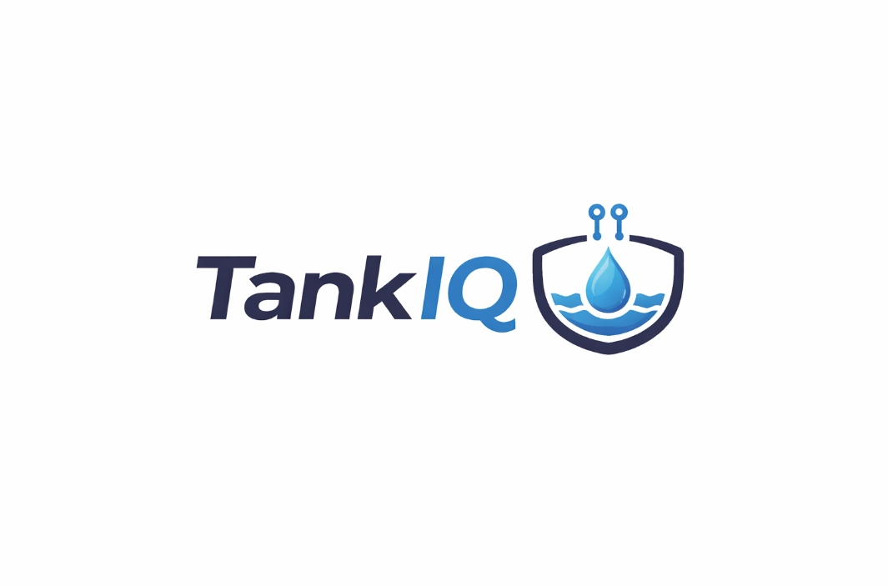

**Colores**

La paleta de colores de TankIQ está construida sobre la combinación de gris oscuro y celeste, transmitiendo profesionalismo, modernidad y una asociación directa con el agua como recurso central del producto. Adicionalmente se definen colores de estado que comunican de forma intuitiva el nivel de riesgo del suministro de agua, elemento central de la experiencia de usuario.

A continuación se presentan los colores que conforman la paleta principal:

**Celeste Principal: `#29ABE2`**
Color de marca principal. Se utiliza en botones primarios, íconos destacados, enlaces activos y elementos que requieren llamar la atención del usuario. Representa el agua y la tecnología.

    

**Gris Oscuro: `#2D2D2D`**
Color base para texto principal, encabezados y el fondo del navbar. Aporta seriedad y contraste sin recurrir al negro puro, lo que suaviza la experiencia visual.

    

**Gris Medio: `#5A5A5A`**
Se utiliza para texto secundario, subtítulos y etiquetas. Mantiene la jerarquía visual sin competir con el texto principal.

    

**Gris Claro: `#F4F4F4`**
Color de fondo para secciones, tarjetas y áreas de contenido. Genera separación visual entre bloques sin recurrir a bordes marcados.

    

**Rojo Alerta: `#E53935`**
Reservado exclusivamente para alertas críticas, nivel de cisterna bajo y mensajes de error. Su uso está restringido a situaciones que requieren atención inmediata del usuario.

    

**Verde Estado: `#43A047`**
Se utiliza para indicar estado normal u óptimo del nivel de la cisterna, confirmaciones y acciones completadas exitosamente.

    

**Tipografía**

Utilizamos **Inter** como tipografía principal para todos los productos digitales. Inter es una fuente sans serif moderna diseñada específicamente para interfaces digitales, con excelente legibilidad en pantallas de distintos tamaños y en contextos de uso con poca luz, característica relevante dado que muchos administradores de edificios consultarán la plataforma desde sus teléfonos en condiciones variadas.

Los títulos principales (H1) se presentan en Inter Bold a 32px, los títulos secundarios (H2) en Inter SemiBold a 24px y los títulos terciarios (H3) en Inter SemiBold a 20px. El cuerpo de texto utiliza Inter Regular a 14px, mientras que las etiquetas y textos de apoyo utilizan Inter Regular a 12px. Los botones utilizan Inter Medium a 14px para mantener legibilidad y diferenciación respecto al texto corrido.

**Espaciado**

El sistema de espaciado de TankIQ está basado en múltiplos de 8px, siguiendo las convenciones de Material Design. Esto garantiza consistencia visual y facilita la implementación por parte del equipo de desarrollo. Los valores definidos van desde 4px para separaciones mínimas entre elementos muy cercanos, hasta 48px para la separación entre secciones principales del Landing Page. El espaciado estándar de padding interno en tarjetas y secciones es de 16px.
 
**Tono de comunicación**

TankIQ adopta un tono **cercano y simple**, orientado a usuarios que no necesariamente tienen formación técnica. El lenguaje se dirige directamente al usuario de forma empática, usando términos del día a día del administrador de edificios en lugar de jerga tecnológica. Aunque el tono es cercano, se mantiene un registro profesional que transmite confianza y seriedad.

Las cuatro dimensiones del tono de TankIQ son las siguientes. Primero, **cercano y no distante**: los mensajes empatizan con la situación cotidiana del usuario, usando "tú" en lugar de "usted". Segundo, **simple y no técnico**: se evita exponer al usuario a términos de ingeniería o IoT; la plataforma habla en términos del problema que resuelve, no de la tecnología que usa. Tercero, **sereno y no alarmista**: incluso en alertas críticas, el lenguaje es claro y orientado a la acción. Cuarto, **profesional y no informal**: se evitan coloquialismos o expresiones demasiado informales que puedan restar credibilidad al producto.

Por ejemplo, cuando la cisterna llega a un nivel crítico, TankIQ no muestra "ERROR CRÍTICO: Nivel de agua insuficiente detectado", sino "Tu cisterna está al 15%. Es momento de pedir una recarga." Cuando el usuario abre el dashboard, en lugar de "Sistema de monitoreo IoT inicializado correctamente", TankIQ muestra "Todo en orden. Aquí está el estado de tu cisterna hoy."
 

### 4.1.2. Web Style Guidelines

**Componentes de UI**

TankIQ utiliza **Angular Material** como biblioteca de componentes de interfaz, adaptando su tema visual a la paleta de colores y tipografía definidas. Los botones primarios tienen fondo celeste (`#29ABE2`), texto blanco y border radius de 8px. Los botones secundarios tienen borde celeste y fondo transparente. Las tarjetas utilizan fondo blanco con sombra suave y border radius de 12px. Los campos de formulario siguen el estilo outlined de Angular Material con color de foco celeste. La iconografía proviene de la biblioteca **Material Icons** de Google en tamaño estándar de 24px.

**Indicadores de estado de cisterna**

Dado que el estado de la cisterna es el elemento central de la experiencia de usuario, se define un sistema de indicadores visuales específico basado en el nivel de agua. Cuando el nivel se encuentra entre 60% y 100% se muestra en verde (`#43A047`) indicando nivel óptimo. Entre 30% y 59% se muestra en celeste (`#29ABE2`) indicando nivel normal. Entre 15% y 29% se muestra en naranja (`#FB8C00`) indicando nivel bajo. Por debajo del 15% se muestra en rojo (`#E53935`) indicando nivel crítico y disparando una alerta automática al administrador.

**Layout y grilla**

Se utiliza el sistema de grilla de 12 columnas de Angular Material. El contenido principal no supera los 1200px de ancho en pantallas grandes, centrado horizontalmente. El navbar tiene una altura fija de 64px en desktop y 56px en mobile. Los márgenes laterales del contenido son de 16px en mobile y 24px en tablet y desktop.

## 4.2. Information Architecture

### 4.2.1. Organization Systems

La arquitectura de información de TankIQ organiza el contenido en función de los dos segmentos objetivo y sus necesidades específicas, diferenciando claramente entre la experiencia del administrador del edificio y la del propietario o inquilino.

Para el **Landing Page**, el contenido se organiza de forma **secuencial**, guiando al visitante a través de un recorrido lógico que va desde la identificación del problema hasta la llamada a la acción. La secuencia es: presentación del problema (el dolor del desabastecimiento), propuesta de solución (TankIQ y el sensor IoT), beneficios concretos por segmento, demostración del producto y finalmente los planes de suscripción con los call to action diferenciados por segmento.

Para la **Web Application**, el contenido se organiza de forma **jerárquica**, con el dashboard principal como punto de entrada que concentra la información más crítica (nivel actual de la cisterna, proyección de días disponibles y alertas activas), desde el cual el usuario puede navegar hacia secciones de mayor detalle como el historial de consumo, el registro de recargas y los reportes para la junta de propietarios. Esta jerarquía responde directamente a la frecuencia de uso: el administrador consulta el nivel de la cisterna varias veces por semana, pero accede al historial de gastos principalmente al preparar la rendición de cuentas mensual.

El contenido de la Web Application se categoriza **por audiencia**, dado que los administradores y los propietarios tienen accesos diferenciados. El administrador accede al panel completo de monitoreo y gestión, mientras que los propietarios acceden a una vista simplificada de solo lectura con el historial de consumo y gastos.
 

### 4.2.2. Labeling Systems

El sistema de etiquetado de TankIQ prioriza la simplicidad y el lenguaje cotidiano, evitando términos técnicos que puedan resultar confusos para administradores de edificios sin formación tecnológica.

En el **navbar** de la Web Application las secciones principales se etiquetan como: **Inicio** (dashboard con el estado actual de la cisterna), **Historial** (registro de consumo y recargas), **Reportes** (documentos para la junta de propietarios) y **Configuración** (datos del edificio y umbrales de alerta).

En las **tarjetas de estado** se usan etiquetas directas como "Nivel actual", "Días estimados", "Última recarga" y "Próxima alerta", evitando términos como "porcentaje de capacidad volumétrica" o "timestamp de última sincronización". Los botones de acción usan verbos en infinitivo que indican claramente la acción: "Pedir recarga", "Ver historial", "Descargar reporte" y "Configurar alerta".

En el **Landing Page**, las secciones se etiquetan por beneficio y no por funcionalidad: "¿Cómo funciona?", "¿Cuánto puedes ahorrar?", "Para administradores" y "Para propietarios", reflejando el tono cercano y orientado al usuario definido en los style guidelines.
 

### 4.2.3. SEO Tags and Meta Tags

**Landing Page**

- **Title:** : TankIQ: Tu monitoreo inteligente de cisternas para edificios en Lima
- **Meta Description:** TankIQ te avisa cuándo tu cisterna está por agotarse. Sensor IoT + plataforma web para administradores de edificios en Lima. Evita el desabastecimiento y reduce gastos innecesarios.
- **Meta Keywords:**: monitoreo cisterna, sensor cisterna Lima, gestión agua edificios, alerta cisterna, administrador edificio Lima, SEDAPAL suministro irregular
- **Meta Author:**: HydroTeam
- **Meta Robots:**: index, follow
- **Open Graph Title:**: TankIQ: Nunca más te quedes sin agua
- **Open Graph Description:**: Plataforma IoT para monitorear el nivel de tu cisterna en tiempo real. Para administradores de edificios en Lima.

**Web Application: Dashboard**

- **Title:**: Dashboard: TankIQ
- **Meta Description:** Monitorea el nivel de tu cisterna en tiempo real, recibe alertas automáticas y gestiona el historial de consumo de tu edificio
- **Meta Robots:** noindex, nofollow
- **Meta Author:** HydroTeam

**Web Application: Reportes**

- **Title:** Reportes de consumo 
- **Meta Description:** Accede al historial de gastos en agua de tu edificio y genera reportes para tu junta de propietarios.
- **Meta Robots:** noindex, nofollow
- **Meta Author:** HydroTeam

### 4.2.4. Searching Systems

En el **Landing Page** no se implementa un sistema de búsqueda, dado que el volumen de contenido es reducido y la navegación secuencial es suficiente para que el visitante encuentre la información que necesita.

En la **Web Application**, se implementan los siguientes mecanismos de búsqueda y filtrado orientados a las tareas principales de cada segmento:

El administrador puede filtrar el **historial de recargas** por rango de fechas (última semana, último mes, últimos 3 meses, rango personalizado) y por monto, lo que le permite identificar meses con mayor gasto y justificar variaciones ante la junta de propietarios. El historial de **alertas** puede filtrarse por tipo (nivel bajo, nivel crítico, consumo anómalo) y por estado (resueltas o pendientes). Los **reportes generados** pueden buscarse por mes y año.

Los resultados de búsqueda se presentan en orden cronológico inverso por defecto (más reciente primero), dado que el usuario generalmente busca información reciente. Cuando una búsqueda no arroja resultados, la plataforma muestra un mensaje contextual que explica el motivo en lenguaje simple, por ejemplo: "No hay recargas registradas en este período. Puedes registrar una nueva recarga desde el botón de arriba."
 

### 4.2.5. Navigation Systems

El sistema de navegación de TankIQ está diseñado para minimizar la cantidad de pasos necesarios para que el administrador llegue a la información más crítica, reconociendo que muchas consultas se realizan de forma rápida desde el teléfono móvil.

En el **Landing Page**, la navegación es lineal con un **navbar fijo** en la parte superior que contiene anclas a las secciones principales de la página. En mobile, el navbar colapsa en un menú hamburguesa. Los call to action de cada segmento en el Landing Page redirigen directamente a la vista correspondiente en la Web Application: el CTA del administrador lleva al formulario de registro de edificio, y el CTA del propietario lleva a la vista de acceso con código de edificio.

En la **Web Application**, la navegación principal se implementa mediante un **sidebar** en desktop y una **bottom navigation bar** en mobile, ambos con las cuatro secciones principales: Inicio, Historial, Reportes y Configuración. Esta decisión responde al patrón de uso móvil donde el pulgar alcanza fácilmente la barra inferior. Se utiliza **navegación por breadcrumbs** en las vistas de detalle para que el usuario siempre sepa en qué parte de la jerarquía se encuentra y pueda regresar sin usar el botón atrás del navegador.

### 4.3.1. Landing Page Wireframe

El diseño de nuestros wireframes sigue la organización secuencial definida en la sección 4.2.1 y el enfoque Mobile First establecido en 4.1.2.  Las secciones de nuestra Landing Page en orden son: navbar fijo con logotipo y CTA de sesión, Hero con titular principal y dos CTAs diferenciados por segmento (administrador y propietario), sección de problemas en tres columnas, sección "¿Cómo funciona?" con tres pasos numerados, beneficios diferenciados por segmento en dos columnas, sección de ahorro estimado con datos reales del mercado limeño, planes de suscripción y footer.

**Desktop:**

**Sección Hero:** Encabezado principal con navbar fijo, titular de beneficio central, dos call to action diferenciados por segmento y vista previa del dashboard de TankIQ.

**Sección Problema:** Tres columnas que presentan los principales problemas que enfrentan los administradores de edificios en Lima con el suministro de agua de SEDAPAL.

**Sección ¿Cómo funciona?:** Secuencia de tres pasos numerados que explica el funcionamiento de TankIQ, desde la instalación del sensor hasta la recepción de alertas.

**Sección Beneficios por segmento:** Dos columnas diferenciadas, una para administradores de edificios y otra para propietarios e inquilinos, cada una con su respectivo call to action.

**Sección ¿Cuánto puedes ahorrar?:** Bloque con tres métricas clave basadas en datos reales del mercado limeño y un call to action de conversión central.

**Sección Planes:** Dos tarjetas de suscripción (plan básico y plan premium) con sus características y botones de contratación diferenciados.

**Footer:** Logotipo, descripción de HydroTeam, enlaces de navegación, sección legal con términos y condiciones, y datos de contacto.

**Mobile:**

**Sección Hero:** 

**Sección Problema:** 

**Sección ¿Cómo funciona?:** 

**Sección Beneficios por segmento:** 

**Sección ¿Cuánto puedes ahorrar?:** 

**Sección Planes:** 

**Footer:** 

### 4.3.2. Landing Page Mock-up

En esta sección se presenta el diseño de alta fidelidad del Landing Page de TankIQ con el Design System completo aplicado: paleta de colores institucional con celeste principal `#29ABE2`, tipografía Inter en sus variantes de peso, espaciado en múltiplos de 8px y componentes de Angular Material con el tema personalizado de HydroTeam. La experiencia visual es consistente con la Web Application, de modo que el usuario que llegue a la aplicación desde el Landing Page reconozca de inmediato la misma identidad visual.

**Desktop:**

**Sección Hero:** Titular principal en Inter Bold 700, subtítulo en Gris Medio `#5A5A5A`, botón primario celeste para administradores y botón secundario con borde celeste para propietarios. Fondo con degradado hacia `#e8f6fc` y preview funcional del dashboard.

**Sección Problema:** Tarjetas con fondo Gris Claro `#F4F4F4`, borde izquierdo celeste de 4px como acento visual, íconos de Material Icons en celeste y texto en Gris Oscuro `#2D2D2D`.

**Sección ¿Cómo funciona?:** Burbujas numeradas con fondo celeste y sombra `rgba(41,171,226,.35)`. Iconos de pasos en cuadros con fondo `#e8f6fc`. Conectados por una línea degradada horizontal en desktop.

**Sección Beneficios por segmento:** Encabezado oscuro `#2D2D2D` con ícono celeste para la columna de administradores; encabezado celeste `#29ABE2` para la columna de propietarios. Ítems con ícono `check_circle` en Verde Estado `#43A047`.

**Sección ¿Cuánto puedes ahorrar?:** Fondo oscuro `#2D2D2D` con degradado. Métricas en tarjetas con borde sutil. La tarjeta de ahorro máximo lleva borde celeste y texto en `#29ABE2` para destacarla.

**Sección Planes:** Tarjetas con borde estándar para el plan básico y borde celeste de 2px con sombra `rgba(41,171,226,.18)` para el plan premium. Badge "Más elegido" con fondo celeste sobre el plan recomendado.

**Footer:** Fondo Gris Oscuro `#2D2D2D`, texto en `rgba(255,255,255,.5)`, logo con variante blanca, íconos de redes sociales con borde sutil y enlaces en hover celeste.

**Mobile:**

**Sección Hero:** 

**Sección Problema:** 

**Sección ¿Cómo funciona?:** 

**Sección Beneficios por segmento:** 

**Sección ¿Cuánto puedes ahorrar?:** 

**Sección Planes:** 

**Footer:** 

## 4.4. Web Applications UX/UI Design

### 4.4.1. Web Applications Wireframes

Los wireframes representan la estructura y distribución de los elementos de la Web Application de TankIQ en baja fidelidad, sin aplicación de color ni tipografía definitiva. Su propósito es validar la arquitectura de información, la jerarquía de contenido y la navegación antes del diseño de alta fidelidad. La aplicación incluye nueve pantallas principales organizadas bajo un layout con sidebar de 240px para el segmento administrador, y un topbar simplificado para el segmento propietario/inquilino.

**Pantalla 01: Inicio de sesión**

**Pantalla 02: Registro de administrador**

**Pantalla 03: Dashboard administrador**

**Pantalla 04: Alertas**

**Pantalla 05: Perfil del administrador**

**Pantalla 06: Reportes para junta de propietarios**

**Pantalla 07: Historial de recargas y consumo**

**Pantalla 08: Configuración de edificio y alertas**

**Pantalla 09: Vista de solo lectura (propietario / inquilino)**

---

### 4.4.2. Web Applications Wireflow Diagrams

Los Wireflow Diagrams muestran la secuencia de pantallas que recorre el usuario para cumplir cada User Goal, conectadas mediante flechas que indican la dirección del flujo. Se presentan diez User Goals, seis correspondientes al segmento administrador y cuatro al segmento propietario/inquilino.

**Segmento: Administrador de edificio**

***User Goal 1:*** Como administrador del edificio, quiero visualizar el nivel actual de agua de la cisterna en tiempo real, para conocer cuánta agua disponible hay en cada momento y tomar decisiones oportunas.

*Descripción:* El administrador inicia sesión desde la Pantalla 01 (Login), ingresa sus credenciales y es redirigido directamente a la Pantalla 03 (Dashboard), donde visualiza el nivel actual en el indicador circular, las tres tarjetas de estado y el gráfico de consumo diario actualizado en tiempo real.

***User Goal 2:*** Como administrador del edificio, quiero recibir alertas cuando el nivel de la cisterna sea crítico, para evitar quedarme sin agua y actuar antes de que ocurra un desabastecimiento.

*Descripción:* Cuando el sensor detecta que el nivel bajó del umbral crítico configurado, aparece un badge de notificación en el ícono de campana del navbar. El administrador hace clic en el badge desde cualquier pantalla y es dirigido a la Pantalla 04 (Alertas), donde ve la alerta crítica destacada en rojo con su descripción y botón "Resolver".

***User Goal 3:*** Como administrador del edificio, quiero visualizar una estimación de los días restantes de agua, para anticipar cuándo será necesario solicitar una recarga.

*Descripción:* Desde la Pantalla 03 (Dashboard), el administrador observa la tarjeta "Días de agua estimados" con la proyección calculada en base al consumo histórico. Para mayor detalle, navega a la Pantalla 07 (Historial), donde puede revisar el consumo diario de los últimos periodos y validar la estimación.

***User Goal 4:*** Como administrador del edificio, quiero contar con información clara sobre consumo y nivel actual, para decidir el momento adecuado para solicitar una recarga y evitar gastos innecesarios.

*Descripción:* El administrador consulta el Dashboard (Pantalla 03) para ver el nivel actual y los días estimados. Luego navega al Historial (Pantalla 07) para revisar el consumo de las últimas semanas y comparar con meses anteriores. Con esa información decide si solicitar o posponer la recarga.

***User Goal 5:*** Como administrador del edificio, quiero registrar cada recarga de agua realizada, para mantener un historial actualizado del consumo y abastecimiento.

*Descripción:* Desde el Dashboard (Pantalla 03) o el Historial (Pantalla 07), el administrador hace clic en "+ Registrar recarga". Se abre un modal con campos de fecha, proveedor, litros y costo. Al confirmar, el nivel de la cisterna se actualiza en el indicador circular y el registro queda guardado en la Pantalla 07 (Historial).

***User Goal 6:*** Como administrador del edificio, quiero definir el porcentaje de nivel en el que se generan alertas, para adaptar las notificaciones a las necesidades específicas del edificio.

*Descripción:* El administrador navega a la Pantalla 08 (Configuración) desde el sidebar. En la sección "Alertas" ajusta los sliders de "Alerta nivel bajo" y "Alerta nivel crítico" a los porcentajes deseados y presiona "Guardar cambios". Las alertas de la Pantalla 04 se dispararán a partir de ese momento con los nuevos umbrales.

**Segmento: Propietario / Inquilino**

***User Goal 7:*** Como propietario o inquilino, quiero consultar el estado actual del nivel de agua de la cisterna, para saber si el edificio cuenta con suministro suficiente.

*Descripción:* El propietario accede desde el Landing Page haciendo clic en "Soy propietario" o desde el Login usando el código de edificio (Pantalla 01). Es redirigido directamente a la Pantalla 09 (Vista propietario), donde visualiza el nivel actual y los días de agua estimados en modo solo lectura.

***User Goal 8:*** Como propietario o inquilino, quiero visualizar el consumo histórico de agua del edificio, para entender cómo se está utilizando el recurso a lo largo del tiempo.

*Descripción:* Desde la Pantalla 09 (Vista propietario), el propietario observa el gráfico de consumo de las últimas 4 semanas. Puede cambiar el período del gráfico seleccionando entre semanas o meses para ver la evolución histórica del consumo.

***User Goal 9:*** Como propietario o inquilino, quiero revisar los gastos asociados a las recargas de agua, para comprender en qué se está invirtiendo el dinero del mantenimiento.

*Descripción:* En la Pantalla 09 (Vista propietario), el propietario consulta la tarjeta de "Gastos del mes" con el desglose de recargas, proveedor y costo de cada una. Esta información le permite verificar que los cobros en la cuota de mantenimiento son coherentes con el uso real registrado.

***User Goal 10:*** Como propietario o inquilino, quiero recibir notificaciones sobre eventos relevantes del suministro de agua, para estar informado ante posibles problemas o cortes.

*Descripción:* Cuando ocurre un evento relevante (nivel crítico, recarga realizada, consumo anómalo), el propietario recibe una notificación visible en el badge de la campana en la Pantalla 09. Al hacer clic, ve la lista de sus notificaciones personales con la descripción del evento y la fecha.

---

### 4.4.3. Web Applications Mock-ups

Los mock-ups aplican el Design System completo de TankIQ sobre la estructura definida en los wireframes. El sidebar usa el Gris Oscuro `#2D2D2D` con ítem activo resaltado en celeste `#29ABE2` y borde derecho de 3px. Las tarjetas de estado llevan borde izquierdo de color según el indicador de estado. Los botones primarios tienen fondo celeste con border radius de 8px. Los indicadores circulares SVG cambian de color según el nivel: verde `#43A047` (óptimo), celeste `#29ABE2` (normal), naranja `#FB8C00` (bajo), rojo `#E53935` (crítico).

**Pantalla 01: Inicio de sesión**

**Pantalla 02: Registro de administrador**

**Pantalla 03: Dashboard administrador**

**Pantalla 04: Alertas**

**Pantalla 05: Perfil del administrador**

**Pantalla 06: Reportes para junta de propietarios**

**Pantalla 07: Historial de recargas y consumo**

**Pantalla 08: Configuración de edificio y alertas**

**Pantalla 09: Vista de solo lectura (propietario / inquilino)**

### 4.4.4. Web Applications Wireflow Diagrams

Los Wireflow Diagrams muestran la secuencia de pantallas que recorre el usuario para cumplir cada User Goal, conectadas mediante flechas que indican la dirección del flujo. Se presentan diez User Goals, seis correspondientes al segmento administrador y cuatro al segmento propietario/inquilino.

**Segmento: Administrador de edificio**

***User Goal 1:*** Como administrador del edificio, quiero visualizar el nivel actual de agua de la cisterna en tiempo real, para conocer cuánta agua disponible hay en cada momento y tomar decisiones oportunas.

*Descripción:* El administrador inicia sesión desde la Pantalla 01 (Login), ingresa sus credenciales y es redirigido directamente a la Pantalla 03 (Dashboard), donde visualiza el nivel actual en el indicador circular, las tres tarjetas de estado y el gráfico de consumo diario actualizado en tiempo real.

***User Goal 2:*** Como administrador del edificio, quiero recibir alertas cuando el nivel de la cisterna sea crítico, para evitar quedarme sin agua y actuar antes de que ocurra un desabastecimiento.

*Descripción:* Cuando el sensor detecta que el nivel bajó del umbral crítico configurado, aparece un badge de notificación en el ícono de campana del navbar. El administrador hace clic en el badge desde cualquier pantalla y es dirigido a la Pantalla 04 (Alertas), donde ve la alerta crítica destacada en rojo con su descripción y botón "Resolver".

***User Goal 3:*** Como administrador del edificio, quiero visualizar una estimación de los días restantes de agua, para anticipar cuándo será necesario solicitar una recarga.

*Descripción:* Desde la Pantalla 03 (Dashboard), el administrador observa la tarjeta "Días de agua estimados" con la proyección calculada en base al consumo histórico. Para mayor detalle, navega a la Pantalla 07 (Historial), donde puede revisar el consumo diario de los últimos periodos y validar la estimación.

***User Goal 4:*** Como administrador del edificio, quiero contar con información clara sobre consumo y nivel actual, para decidir el momento adecuado para solicitar una recarga y evitar gastos innecesarios.

*Descripción:* El administrador consulta el Dashboard (Pantalla 03) para ver el nivel actual y los días estimados. Luego navega al Historial (Pantalla 07) para revisar el consumo de las últimas semanas y comparar con meses anteriores. Con esa información decide si solicitar o posponer la recarga.

***User Goal 5:*** Como administrador del edificio, quiero registrar cada recarga de agua realizada, para mantener un historial actualizado del consumo y abastecimiento.

*Descripción:* Desde el Dashboard (Pantalla 03) o el Historial (Pantalla 07), el administrador hace clic en "+ Registrar recarga". Se abre un modal con campos de fecha, proveedor, litros y costo. Al confirmar, el nivel de la cisterna se actualiza en el indicador circular y el registro queda guardado en la Pantalla 07 (Historial).

***User Goal 6:*** Como administrador del edificio, quiero definir el porcentaje de nivel en el que se generan alertas, para adaptar las notificaciones a las necesidades específicas del edificio.

*Descripción:* El administrador navega a la Pantalla 08 (Configuración) desde el sidebar. En la sección "Alertas" ajusta los sliders de "Alerta nivel bajo" y "Alerta nivel crítico" a los porcentajes deseados y presiona "Guardar cambios". Las alertas de la Pantalla 04 se dispararán a partir de ese momento con los nuevos umbrales.

**Segmento: Propietario / Inquilino**

***User Goal 7:*** Como propietario o inquilino, quiero consultar el estado actual del nivel de agua de la cisterna, para saber si el edificio cuenta con suministro suficiente.

*Descripción:* El propietario accede desde el Landing Page haciendo clic en "Soy propietario" o desde el Login usando el código de edificio (Pantalla 01). Es redirigido directamente a la Pantalla 09 (Vista propietario), donde visualiza el nivel actual y los días de agua estimados en modo solo lectura.

***User Goal 8:*** Como propietario o inquilino, quiero visualizar el consumo histórico de agua del edificio, para entender cómo se está utilizando el recurso a lo largo del tiempo.

*Descripción:* Desde la Pantalla 09 (Vista propietario), el propietario observa el gráfico de consumo de las últimas 4 semanas. Puede cambiar el período del gráfico seleccionando entre semanas o meses para ver la evolución histórica del consumo.

***User Goal 9:*** Como propietario o inquilino, quiero revisar los gastos asociados a las recargas de agua, para comprender en qué se está invirtiendo el dinero del mantenimiento.

*Descripción:* En la Pantalla 09 (Vista propietario), el propietario consulta la tarjeta de "Gastos del mes" con el desglose de recargas, proveedor y costo de cada una. Esta información le permite verificar que los cobros en la cuota de mantenimiento son coherentes con el uso real registrado.

***User Goal 10:*** Como propietario o inquilino, quiero recibir notificaciones sobre eventos relevantes del suministro de agua, para estar informado ante posibles problemas o cortes.

*Descripción:* Cuando ocurre un evento relevante (nivel crítico, recarga realizada, consumo anómalo), el propietario recibe una notificación visible en el badge de la campana en la Pantalla 09. Al hacer clic, ve la lista de sus notificaciones personales con la descripción del evento y la fecha.

    
## 4.5. Web Applications Prototyping.

   
## 4.6. Domain-Driven Software Architecture.

Para modelar la arquitectura de TankIQ se aplicó Domain-Driven Design, partiendo de los resultados del Big Picture Event Storming para identificar Bounded Contexts, aggregates, eventos y comandos. A partir de ese modelo se derivaron los diagramas de arquitectura utilizando el C4 Model.

### 4.6.1. Design-Level EventStorming.

El equipo realizó una sesión de Design-Level Event Storming de 90 minutos para refinar el modelo de dominio de TankIQ. Se identificaron Domain Events, Commands, Aggregates, Policies, Read Models, External Systems y Actors. Se modelaron seis flujos: monitoreo de cisterna con proyección de días, gestión de recargas con cálculo de costo mensual, generación de reportes con exportación PDF, envío de alertas vía SendGrid, activación de suscripción y vinculación de sensor, y registro y autenticación de usuarios. Como resultado, se definieron seis Bounded Contexts: Monitoring Context Tank, Refill Management Context Refill, Reporting Context Report, Notification Context SendGrid/SMTP, Subscription & Billing Context Subscription e Identity & Access Management Context User.

  

    
### 4.6.2. Software Architecture Context Diagram.

El Context Diagram muestra a TankIQ como sistema central rodeado por sus actores y sistemas externos, correspondiendo al nivel 1 del C4 Model. Los actores son el Administrador de Edificio y el Propietario / Inquilino. Los sistemas externos son el Sensor IoT Ultrasónico (simula lecturas vía HTTP en el contexto académico) y el Servicio de Correo SendGrid / SMTP (envío de alertas automáticas ante niveles críticos).

  

    
### 4.6.3. Software Architecture Container Diagrams.

El Container Diagram corresponde al nivel 2 del C4 Model y muestra los contenedores de TankIQ con sus tecnologías y comunicaciones. Los contenedores son: Landing Page (HTML/CSS/JS estático), Web Application (Angular SPA, comunica con la API vía HTTPS/JSON), RESTful API (Spring Boot, implementa todos los Bounded Contexts), Base de Datos, IoT Simulator (envía lecturas HTTP al API) y SendGrid / SMTP (sistema externo para notificaciones por correo).

  

    
### 4.6.4. Software Architecture Components Diagrams.

Los Component Diagrams corresponden al nivel 3 del C4 Model y descomponen los dos contenedores con lógica interna compleja. Los demás contenedores (Landing Page, IoT Simulator y base de datos) no presentan componentes que ameriten este nivel de detalle.

**Componentes del RESTful API (Spring Boot)**

El API se organiza en seis componentes por Bounded Context: IAM Component (AuthController, UserService, JwtTokenProvider), Monitoring Component (TankController, TankService, AlertThresholdEvaluator), Refill Management Component** (RefillController, RefillService), Reporting Component (ReportController, ReportService), Subscription Component (SubscriptionController, SubscriptionService) y Notification Component (NotificationService, EmailGateway). Todos persisten datos en MySQL vía JPA/Hibernate.

  

**Componentes de la Web Application (Angular)**

La Web Application se organiza en cinco módulos lazy-loaded: Auth Module (LoginComponent, AuthService, AuthGuard), Dashboard Module (TankStatusCardComponent, DaysProjectionComponent, AlertBannerComponent), Refill Module** (RefillListComponent, RefillFormComponent), Reports Module** (ReportGeneratorComponent) y Settings Module (AlertThresholdComponent). El Shared Module provee componentes transversales: NavbarComponent, SidebarComponent, interceptor HTTP para JWT y servicio i18n.

  

    
## 4.7. Software Object-Oriented Design.

El diseño orientado a objetos de TankIQ se deriva directamente de los Bounded Contexts identificados en el proceso de DDD. El diagrama de clase presentado a continuación describen las entidades, interfaces, enumeraciones y relaciones de cada contexto del dominio, con el nivel de detalle necesario para guiar la implementación en Spring Boot.

### 4.7.1. Class Diagrams.

El Class Diagram de TankIQ está organizado por Bounded Context e incluye clases, interfaces, enumeraciones, atributos con scope y tipo, métodos con parámetros y tipo de retorno, y relaciones con nombre, dirección y multiplicidad. Los contextos modelados son: User Management, Building Monitoring, Water Management, Alerting y Subscription.

  

#### Diccionario de Clases

<table>
<thead>
  <tr>
    <th>N</th><th>Entidad</th><th>Atributo</th><th>Definición</th>
    <th>Tipo de Dato</th><th>Rango</th><th>Unidad</th>
    <th>Valores Restringidos</th>
  </tr>
</thead>
<tbody>

  <tr><td rowspan="5">1</td><td rowspan="5">User</td>
    <td>userId</td><td>Identificador único del usuario en el sistema</td>
    <td>UserId (UUID)</td><td>—</td><td>—</td><td>No nulo, único</td></tr>
  <tr><td>name</td><td>Nombre completo del usuario</td>
    <td>String</td><td>—</td><td>—</td><td>Sin caracteres especiales</td></tr>
  <tr><td>email</td><td>Correo electrónico usado para autenticación</td>
    <td>String</td><td>—</td><td>—</td><td>Formato válido, único en el sistema</td></tr>
  <tr><td>password</td><td>Contraseña de acceso a la cuenta</td>
    <td>String</td><td>—</td><td>—</td><td>Mínimo 8 caracteres</td></tr>
  <tr><td>role</td><td>Rol del usuario dentro de la plataforma</td>
    <td>UserRole</td><td>—</td><td>—</td><td>ADMINISTRATOR, RESIDENT</td></tr>

  <tr><td rowspan="1">2</td><td rowspan="1">Administrator</td>
    <td>phoneNumber</td><td>Número de teléfono de contacto del administrador</td>
    <td>String</td><td>—</td><td>—</td><td>Formato numérico, no nulo</td></tr>

  <tr><td rowspan="1">3</td><td rowspan="1">Resident</td>
    <td>apartmentNumber</td><td>Número de departamento del residente en el edificio</td>
    <td>String</td><td>—</td><td>—</td><td>Alfanumérico, no nulo</td></tr>

  <tr><td rowspan="4">4</td><td rowspan="4">Building</td>
    <td>buildingId</td><td>Identificador único del edificio</td>
    <td>BuildingId (UUID)</td><td>—</td><td>—</td><td>No nulo, único</td></tr>
  <tr><td>name</td><td>Nombre o alias del edificio residencial</td>
    <td>String</td><td>—</td><td>—</td><td>No nulo</td></tr>
  <tr><td>address</td><td>Dirección física completa del edificio</td>
    <td>String</td><td>—</td><td>—</td><td>No nulo</td></tr>
  <tr><td>district</td><td>Distrito de Lima donde se ubica el edificio</td>
    <td>String</td><td>—</td><td>—</td><td>Distritos válidos de Lima</td></tr>

  <tr><td rowspan="4">5</td><td rowspan="4">Cistern</td>
    <td>id</td><td>Identificador único de la cisterna</td>
    <td>String</td><td>—</td><td>—</td><td>No nulo, único</td></tr>
  <tr><td>capacityLiters</td><td>Capacidad máxima de almacenamiento de la cisterna</td>
    <td>Double</td><td>500 – 50000</td><td>Litros</td><td>Valores negativos no permitidos</td></tr>
  <tr><td>currentLevel</td><td>Nivel actual de agua en la cisterna expresado en porcentaje</td>
    <td>Double</td><td>0 – 100</td><td>%</td><td>Fuera del rango 0–100</td></tr>
  <tr><td>alertThreshold</td><td>Umbral mínimo configurado por el administrador para disparar alertas</td>
    <td>Double</td><td>0 – 100</td><td>%</td><td>Fuera del rango 0–100</td></tr>

  <tr><td rowspan="3">6</td><td rowspan="3">Sensor</td>
    <td>sensorId</td><td>Identificador único del sensor ultrasónico IoT</td>
    <td>SensorId (UUID)</td><td>—</td><td>—</td><td>No nulo, único</td></tr>
  <tr><td>type</td><td>Tipo de sensor instalado en la cisterna</td>
    <td>String</td><td>—</td><td>—</td><td>No nulo</td></tr>
  <tr><td>status</td><td>Estado de conexión actual del sensor</td>
    <td>SensorStatus</td><td>—</td><td>—</td><td>ONLINE, OFFLINE</td></tr>

  <tr><td rowspan="3">7</td><td rowspan="3">WaterLevelReading</td>
    <td>id</td><td>Identificador único de la lectura registrada</td>
    <td>String</td><td>—</td><td>—</td><td>No nulo, único</td></tr>
  <tr><td>levelPercent</td><td>Porcentaje de nivel de agua medido por el sensor</td>
    <td>Double</td><td>0 – 100</td><td>%</td><td>Fuera del rango 0–100</td></tr>
  <tr><td>recordedAt</td><td>Fecha y hora exacta en que se registró la lectura</td>
    <td>DateTime</td><td>—</td><td>—</td><td>No puede ser fecha futura</td></tr>

  <tr><td rowspan="4">8</td><td rowspan="4">Refill</td>
    <td>id</td><td>Identificador único del registro de recarga</td>
    <td>String</td><td>—</td><td>—</td><td>No nulo, único</td></tr>
  <tr><td>date</td><td>Fecha y hora en que se realizó la recarga de agua</td>
    <td>DateTime</td><td>—</td><td>—</td><td>No puede ser fecha futura</td></tr>
  <tr><td>liters</td><td>Volumen de agua cargado en la cisterna</td>
    <td>Double</td><td>100 – 50000</td><td>Litros</td><td>Valores negativos no permitidos</td></tr>
  <tr><td>costSoles</td><td>Costo pagado por la recarga en soles peruanos</td>
    <td>Double</td><td>80 – 500</td><td>S/.</td><td>Valores negativos no permitidos</td></tr>

  <tr><td rowspan="2">9</td><td rowspan="2">WaterConsumption</td>
    <td>id</td><td>Identificador único del registro de consumo</td>
    <td>String</td><td>—</td><td>—</td><td>No nulo, único</td></tr>
  <tr><td>averageDailyUse</td><td>Promedio de litros consumidos por día en el período calculado</td>
    <td>Double</td><td>0 – 10000</td><td>Litros/día</td><td>Valores negativos no permitidos</td></tr>

  <tr><td rowspan="5">10</td><td rowspan="5">Alert</td>
    <td>id</td><td>Identificador único de la alerta generada</td>
    <td>String</td><td>—</td><td>—</td><td>No nulo, único</td></tr>
  <tr><td>type</td><td>Nivel de criticidad de la alerta según el umbral alcanzado</td>
    <td>AlertType</td><td>—</td><td>—</td><td>LOW, CRITICAL</td></tr>
  <tr><td>message</td><td>Mensaje descriptivo de la alerta enviado al usuario</td>
    <td>String</td><td>—</td><td>—</td><td>No nulo</td></tr>
  <tr><td>timestamp</td><td>Fecha y hora en que se generó la alerta</td>
    <td>DateTime</td><td>—</td><td>—</td><td>No puede ser fecha futura</td></tr>
  <tr><td>isResolved</td><td>Indica si la alerta fue atendida y resuelta por el administrador</td>
    <td>boolean</td><td>—</td><td>—</td><td>true / false</td></tr>

  <tr><td rowspan="4">11</td><td rowspan="4">Plan</td>
    <td>id</td><td>Identificador único del plan de suscripción</td>
    <td>String</td><td>—</td><td>—</td><td>No nulo, único</td></tr>
<tr><td>name</td><td>Nombre comercial del plan</td>
    <td>String</td><td>—</td><td>—</td><td>BASIC, PREMIUM</td></tr>
<tr><td>priceSoles</td><td>Precio mensual del plan expresado en soles peruanos</td>
    <td>Double</td><td>0 – 999</td><td>S/.</td><td>Valores negativos no permitidos</td></tr>
<tr><td>features</td><td>Descripción de las funcionalidades incluidas en el plan</td>
    <td>String</td><td>—</td><td>—</td><td>No nulo</td></tr>

  <tr><td rowspan="4">12</td><td rowspan="4">Subscription</td>
    <td>id</td><td>Identificador único de la suscripción</td>
    <td>String</td><td>—</td><td>—</td><td>No nulo, único</td></tr>
  <tr><td>startDate</td><td>Fecha de inicio de la suscripción activa</td>
    <td>Date</td><td>—</td><td>—</td><td>No nulo</td></tr>
  <tr><td>endDate</td><td>Fecha de vencimiento de la suscripción</td>
    <td>Date</td><td>—</td><td>—</td><td>Debe ser posterior a startDate</td></tr>
  <tr><td>status</td><td>Estado actual de la suscripción del edificio</td>
    <td>SubscriptionStatus</td><td>—</td><td>—</td><td>ACTIVE, INACTIVE, CANCELLED</td></tr>

  <tr><td rowspan="5">13</td><td rowspan="5">Report</td>
    <td>id</td><td>Identificador único del reporte generado</td>
    <td>String</td><td>—</td><td>—</td><td>No nulo, único</td></tr>
  <tr><td>generatedAt</td><td>Fecha y hora en que se generó el reporte</td>
    <td>DateTime</td><td>—</td><td>—</td><td>No puede ser fecha futura</td></tr>
  <tr><td>periodMonth</td><td>Mes del período cubierto por el reporte</td>
    <td>Integer</td><td>1 – 12</td><td>—</td><td>Fuera del rango 1–12</td></tr>
  <tr><td>periodYear</td><td>Año del período cubierto por el reporte</td>
    <td>Integer</td><td>2024 – 2099</td><td>—</td><td>Años anteriores al inicio del sistema</td></tr>
  <tr><td>totalCostSoles</td><td>Suma total del costo de recargas en el período del reporte</td>
    <td>Double</td><td>0 – 99999</td><td>S/.</td><td>Valores negativos no permitidos</td></tr>

</tbody>
</table>

    
## 4.8. Database Design.

En el diseño de base de datos de TankIQ, cada Bounded Context identificado en el proceso de Domain-Driven Design se traduce en un conjunto de tablas relacionadas. Las claves primarias son de tipo UUID para garantizar unicidad global entre servicios. Las claves foráneas refuerzan la integridad referencial entre tablas. Los campos numéricos críticos, como niveles de cisterna, consumo de agua y costos en soles, utilizan el tipo DECIMAL para asegurar precisión. Se aplican restricciones NOT NULL en todos los atributos obligatorios del negocio, mientras que algunos campos opcionales permiten valores NULL según las reglas del dominio.

    
### 4.8.1. Database Diagrams.

El diagrama muestra las tablas del sistema agrupadas por Bounded Context junto con sus relaciones estructurales. El IAM Context contiene la tabla users con discriminación de rol ADMIN o RESIDENT, y la tabla intermedia building_users que implementa la relación muchos a muchos entre usuarios y edificios mediante las relaciones users a buildings de tipo uno a muchos y su descomposición a través de building_users. El Building Monitoring Context incluye las tablas buildings, cisterns, sensors y water_level_readings, representando la jerarquía física del sistema IoT. Un edificio se relaciona de forma uno a uno con una cisterna, la cual a su vez se relaciona uno a uno con un sensor, y este genera múltiples lecturas de nivel de agua mediante una relación uno a muchos. El Water Management Context agrupa las tablas refills y water_consumption, ambas relacionadas con buildings mediante relaciones uno a muchos, permitiendo registrar recargas de agua y métricas de consumo por periodos. El Alerting Context contiene la tabla alerts, la cual se relaciona con cisterns y users mediante relaciones uno a muchos, permitiendo gestionar eventos como niveles bajos o críticos de agua y su notificación a los usuarios. El Subscription Context incluye las tablas plans, subscriptions y reports. La tabla subscriptions se relaciona con buildings mediante una relación uno a uno y con plans mediante una relación uno a muchos, mientras que reports se relaciona con buildings mediante una relación uno a muchos, permitiendo almacenar reportes generados sobre consumo y costos.

  

En el diagrama de base de datos, las llaves amarillas representan las claves primarias, las cuales identifican de forma única cada registro dentro de su respectiva tabla. Las llaves rojas representan las claves foráneas, que establecen las relaciones entre tablas y garantizan la integridad referencial del sistema.
    

# Capítulo V: Product Implementation, Validation & Deployment

## 5.1. Software Configuration Management.

### 5.1.1. Software Development Environment Configuration.

En este punto detallaremos todas las herramientas de software usadas para el desarrollo
del proyecto TankIQ:

**Gestión del proyecto**

- **WhatsApp**: [LINK WhatsApp](https://www.whatsapp.com/)  
  Usamos WhatsApp como nuestro principal canal para comunicarnos, la coordinación de
  tareas, los tiempos de entrega, las nuevas ideas y brindar soporte a otros miembros
  que tengan dificultades.

- **Google Meet**: [LINK Google Meet](https://meet.google.com/)  
  Utilizado para las reuniones virtuales de planificación de sprints y coordinación
  general del equipo.

- **Jira**: [LINK Jira](https://hydroteam12.atlassian.net/jira/software/projects/SCRUM/boards/1)  
  Usamos Jira para seguir y evaluar el progreso y flujo de las actividades del proyecto
  entre todos los miembros durante todo el proceso del trabajo.

**Diseño UX/UI del Producto**

- **Figma**: [LINK Figma](https://www.figma.com/es-es/)  
  Plataforma para crear nuestros diseños, principalmente los wireframes, mockups y
  prototipo interactivo de la Landing Page.

- **UXPressia**: [LINK UXPressia](https://uxpressia.com/)  
  Se utilizó esta herramienta para la creación del Impact Mapping, Empathy Mapping y
  el User Journey Mapping.

**Software Development**

- **IntelliJ IDEA**: [LINK IntelliJ IDEA](https://www.jetbrains.com/idea/)  
  IDE principal para el desarrollo del backend en Spring Boot (Java).

- **HTML**: [Más información sobre HTML](https://developer.mozilla.org/es/docs/Web/HTML)  
  Lenguaje de marcado estándar utilizado para estructurar el contenido de la Landing
  Page, compatible con todos los navegadores modernos.

- **CSS**: [Más información sobre CSS](https://developer.mozilla.org/es/docs/Web/CSS)  
  Lenguaje de hojas de estilo que define la apariencia visual de la Landing Page,
  permitiendo controlar diseño, colores y tipografías.

- **JavaScript**: [Más información sobre JavaScript](https://developer.mozilla.org/es/docs/Web/JavaScript)  
  Lenguaje de programación que añade interactividad y lógica a la Landing Page,
  incluyendo el sistema de idiomas y las animaciones de scroll.

**Despliegue del software**

- **Git**: [LINK Git](https://git-scm.com/)  
  Sistema de control de versiones distribuido que permite gestionar cambios en el
  código, colaborar en equipo y mantener un historial completo del proyecto.

**Documentación del proyecto**

- **GitHub**: [LINK GitHub](https://github.com/)  
  Plataforma para alojar repositorios, colaborar y revisar contribuciones del equipo
  mediante Pull Requests y el flujo Git Flow.

### 5.1.2. Source Code Management.

El proyecto TankIQ se desarrolla bajo un enfoque profesional que prioriza las buenas prácticas
de control de versiones, la colaboración estructurada en equipo y la trazabilidad del código
fuente a lo largo de cada sprint. La gestión del código se realiza mediante **GitHub**, dentro
de la organización
[hydronex-web-app-1ASI0729-2610-12029](https://github.com/hydronex-web-app-1ASI0729-2610-12029),
donde se alojan los repositorios correspondientes a cada artefacto del sistema: el backend
desarrollado en Spring Boot, la Web Application en Angular y la Landing Page estática.

Para la gestión de ramas, el equipo adoptó **Git Flow** como modelo de ramificación. La rama
**`main`** contiene únicamente el código estable desplegado en producción y solo recibe merges
al cierre de cada sprint tras revisión grupal. La rama **`develop`** funciona como rama de
integración continua, donde todos los integrantes consolidan sus avances mediante Pull Requests
antes de pasar a producción. Las ramas **`feature/<nombre>`** se crean desde `develop` para el
desarrollo de cada funcionalidad de forma aislada y se integran mediante Pull Request con revisión
mínima de un compañero, como `feature/tank-monitoring`, `feature/alert-system` o
`feature/jwt-auth`. Las ramas **`fix/<nombre>`** se utilizan para la corrección de errores,
como `fix/estimated-days-formula`, y las ramas **`release/<versión>`** se crean al cierre de
cada sprint para preparar la entrega antes del merge a `main`.

Para la redacción de los mensajes de commit, el equipo siguió la convención
**Conventional Commits**, lo que permitió mantener un historial claro y semánticamente
significativo. Los prefijos utilizados fueron: `feat:` para nuevas funcionalidades, `fix:`
para corrección de errores, `chore:` para tareas de mantenimiento, `docs:` para documentación,
`refactor:` para reestructuración de código y `test:` para adición de pruebas. Ejemplos de
commits del proyecto incluyen: `feat: add cistern water level monitoring endpoint`,
`feat: implement JWT authentication for admin users` y
`fix: correct estimated days calculation formula`.

### 5.1.3. Source Code Style Guide & Conventions.

El uso de un estilo de código unificado es clave para asegurar la consistencia, legibilidad y
colaboración efectiva durante el desarrollo de TankIQ. Para la entrega del Sprint 1, el trabajo
se centró en la implementación de la Landing Page estática, por lo que las convenciones
establecidas en esta sección corresponden a las tecnologías utilizadas: HTML, CSS y JavaScript.

**HTML**

La estructura del HTML sigue las convenciones del Google HTML/CSS Style Guide. Se utiliza
sangría de 2 espacios, todos los atributos se escriben en minúsculas y entre comillas dobles,
y todos los elementos de imagen incluyen el atributo `alt` para garantizar accesibilidad. Los
identificadores y clases se nombran en inglés y de forma descriptiva, reflejando el propósito
del elemento. Se utilizan atributos personalizados `data-lang` para gestionar el sistema de
internacionalización y `data-placeholder-es` para los inputs con soporte bilingüe.

**CSS**

Las clases CSS se nombran siguiendo la convención kebab-case (`.hero-section`, `.plan-card`,
`.navbar-fixed`, `.problema-card`), en concordancia con las recomendaciones del Google
HTML/CSS Style Guide. El diseño sigue un enfoque **Mobile First**, definiendo primero los
estilos base para dispositivos móviles y luego aplicando media queries para pantallas más
grandes. La paleta de colores, tipografía y espaciado respetan el Design System definido en
el Capítulo IV: color principal celeste `#29ABE2`, gris oscuro `#2D2D2D`, tipografía Inter
y espaciado en múltiplos de 8px. Las animaciones de entrada se gestionan mediante las clases
`.fade-in` y `.visible`, controladas por JavaScript al detectar visibilidad en el viewport.

**JavaScript**

El código JavaScript sigue las convenciones del Google JavaScript Style Guide y se organiza
en módulos funcionales claramente delimitados mediante comentarios de sección. Las funciones
se nombran en camelCase con nombres descriptivos que reflejan su responsabilidad:
`initLanguageSystem()`, `initMobileMenu()`, `initScrollAnimations()`, `initContactForm()`.
Se utiliza `const` y `let` en lugar de `var`, y cada función tiene una única responsabilidad
definida. El sistema de idiomas gestiona inglés y español mediante la clase `lang-es` sobre
el `body`, persistiendo la preferencia del usuario en `localStorage`. Para optimizar el
rendimiento, los eventos de scroll utilizan una función `throttle()` que limita la frecuencia
de ejecución. El código se escribe en inglés para todos los identificadores y comentarios
técnicos, a excepción de los textos visibles al usuario que forman parte del sistema bilingüe.

### 5.1.4. Software Deployment Configuration.

Para el despliegue de la Landing Page de TankIQ, el equipo HydroTeam utilizó **GitHub Pages**
como plataforma de publicación, aprovechando su integración directa con el repositorio de
GitHub. Esta decisión permite que cada actualización consolidada en la rama `main` se refleje
de forma automática en el entorno público, sin necesidad de configuración adicional de
infraestructura.

El proceso de configuración seguido fue el siguiente: en primer lugar, se accedió a la
configuración del repositorio de la Landing Page desde GitHub. Posteriormente, en la sección
**Pages**, se seleccionó la rama `main` como fuente de despliegue y se indicó la carpeta raíz
(`/root`) como directorio de publicación. GitHub Pages procesó automáticamente los archivos
estáticos (`index.html`, `styles.css`, `script.js`) y habilitó HTTPS por defecto mediante
sus certificados propios.

El entorno de producción de la Landing Page de TankIQ está accesible públicamente en la
siguiente URL: https://hydronex-web-app-1asi0729-2610-12029.github.io/Landing-Page/

## 5.2. Landing Page, Services & Applications Implementation.

### 5.2.1. Sprint 1

Durante el Sprint 1, el equipo HydroTeam centró sus esfuerzos en establecer la presencia
inicial del producto TankIQ mediante la implementación de la Landing Page. El trabajo incluyó
la estructuración de las secciones principales, el diseño visual alineado con el Design System
definido en el Capítulo IV, la responsividad Mobile First y la integración de los
call-to-action diferenciados por segmento objetivo. A continuación se detallan la planificación
del Sprint, el backlog trabajado, las evidencias de desarrollo y los aspectos de colaboración
del equipo.

#### 5.2.1.1. Sprint Planning 1.

| **Sprint #** | Sprint 1 |
|---|---|
| **Sprint Planning Background** | |
| **Fecha** | 23/04/2026 |
| **Hora** | 20:00 pm (GMT-5) |
| **Ubicación** | Reunión virtual por Google Meet |
| **Preparado por** | HydroTeam |
| **Participantes (reunión de planificación)** | - Espinar Martínez, Gabriel Ferran   - Guevara Serrano, Diego Ismael   - Montalvan Palomino, Bruno Rodolfo   - Orosco Ttamiña, Juan Carlos   - Razuri Alvarez, Matias Francesco |
| **Sprint Goal & User Stories** | Nuestro enfoque está en entregar la Landing Page de TankIQ con diseño completo, responsivo y alineado con la identidad visual del producto. Creemos que esto establecerá la presencia pública del producto y comunicará la propuesta de valor a ambos segmentos objetivo. Esto se confirmará cuando los visitantes puedan navegar todas las secciones, identificar los beneficios por segmento y acceder al formulario de contacto desde cualquier dispositivo. |
| **Velocidad del Sprint 1** | 25 |
| **Suma de Story Points** | 25 |

#### 5.2.1.2. Aspect Leaders and Collaborators.

En este apartado se describen los aspectos funcionales trabajados durante el Sprint 1 del
proyecto TankIQ. Cada aspecto representa una sección clave de la Landing Page, desde la
estructura de navegación y el hero hasta el footer y la responsividad. Para cada aspecto se
designó un **Líder (L)**, responsable de la dirección técnica y la implementación principal,
y **Colaboradores (C)**, encargados de apoyar en el desarrollo, revisión e integración.

La **Matriz LACX** (Leadership and Collaboration Matrix) permite visualizar de manera clara
la distribución de responsabilidades del equipo durante el Sprint 1.

| Team Member | GitHub Username    | Navbar & Hero | Problema & Cómo funciona | Beneficios & Ahorro | Planes & Integrantes | Contacto & Footer | Responsividad |
|---|--------------------|---|---|---|---|---|---|
| Espinar Martínez, Gabriel Ferran | zzZero14           | C | C | C | L | C | C |
| Guevara Serrano, Diego Ismael | digetto            | L | C | C | C | C | C |
| Montalvan Palomino, Bruno Rodolfo | br1rodolfo         | C | L | C | C | C | C |
| Orosco Ttamiña, Juan Carlos | juancarlosorosco59 | C | C | C | C | L | C |
| Razuri Alvarez, Matias Francesco | u202410772         | C | C | L | C | C | L |

#### 5.2.1.2. Aspect Leaders and Collaborators.

En este apartado se describen los aspectos funcionales más relevantes trabajados durante el
Sprint 1 en el desarrollo de la Landing Page de TankIQ. Cada uno de ellos representa un
bloque significativo dentro del alcance funcional de la solución, abarcando la estructura de
navegación, las secciones de contenido, el sistema de contacto y la responsividad del diseño.

Para cada aspecto se asignó un responsable principal, denominado **Líder (L)**, encargado de
la dirección técnica y la implementación principal. De igual manera, se identificaron
**Colaboradores (C)**, miembros del equipo que participaron activamente en el desarrollo,
validación o soporte de cada aspecto.

La **Matriz LACX** (Leadership and Collaboration Matrix) ofrece una representación clara y
organizada de la distribución de responsabilidades, favoreciendo la trazabilidad y visibilidad
del trabajo colaborativo desarrollado a lo largo del Sprint.

| Team Member | GitHub Username | Navbar & Hero | Problema & Cómo funciona | Beneficios & Ahorro | Planes & Integrantes | Contacto & Footer | Responsividad |
|---|---|---|---|---|---|---|---|
| Espinar Martínez, Gabriel Ferran | zzZero14   | C | C | C | L | C | C |
| Guevara Serrano, Diego Ismael |  digetto    | L | C | C | C | C | C |
| Montalvan Palomino, Bruno Rodolfo | br1rodolfo  | C | L | C | C | C | C |
| Orosco Ttamiña, Juan Carlos | juancarlosorosco59| C | C | C | C | L | C |
| Razuri Alvarez, Matias Francesco | u202410772   | C | C | L | C | C | L |

#### 5.2.1.3. Sprint Backlog 1.

El Sprint Backlog 1 se orienta a implementar la Landing Page completa de TankIQ, garantizando
que comunique la propuesta de valor de forma clara y diferenciada para los segmentos de
administradores de edificios y propietarios/inquilinos. El objetivo es que la primera versión
publicada sea responsive, visualmente alineada con el Design System definido en el Capítulo IV
y funcional en todos los navegadores modernos.

| **Sprint 1** | | | | | | | |
|---|---|---|---|---|---|---|---|
| **User Story** | | **Work-Item / Task** | | | | | |
| **User Story ID** | **Título** | **Task ID** | **Task Title** | **Description** | **Estimation (Hours)** | **Assigned To** | **Status** |
| US46 | Navegar por secciones del landing | T01 | Implementar navbar con navegación por anclas | Desarrollar la barra de navegación fija con enlaces a todas las secciones de la Landing Page y menú hamburguesa para mobile. | 3 | Guevara Serrano, Diego | Done |
| US47 | Visualizar propuesta de valor | T02 | Implementar sección Hero con CTAs | Diseñar e implementar el hero con titular principal, descripción, botones diferenciados por segmento y dashboard preview animado. | 4 | Guevara Serrano, Diego | Done |
| US48 | Identificar problemas del sistema | T03 | Implementar sección Problema | Desarrollar la sección con tres tarjetas que presentan los problemas principales del suministro de agua irregular en Lima. | 3 | Montalvan Palomino, Bruno | Done |
| US49 | Comprender funcionamiento | T04 | Implementar sección Cómo funciona | Crear la sección con tres pasos numerados (sensor → plataforma → alertas) con íconos y conectores visuales. | 3 | Montalvan Palomino, Bruno | Done |
| US50 | Visualizar beneficios | T05 | Implementar sección Beneficios y Ahorro | Desarrollar la sección con dos columnas diferenciadas por segmento y el bloque de métricas de ahorro estimado. | 4 | Razuri Alvarez, Matias | Done |
| US51 | Consultar planes | T06 | Implementar sección Planes | Diseñar las tarjetas de plan Básico y Premium con características, precios y botones de contratación. | 3 | Espinar Martínez, Gabriel | Done |
| US52 | Enviar contacto | T07 | Implementar formulario de contacto | Desarrollar el formulario con validación de campos, integración de toast notifications y soporte bilingüe. | 5 | Orosco Ttamiña, Juan Carlos | Done |
| US53 | Acceder a contacto desde botones | T08 | Implementar CTAs con scroll suave | Conectar todos los botones de la Landing Page al formulario de contacto mediante scroll suave con JavaScript. | 2 | Orosco Ttamiña, Juan Carlos | Done |

#### 5.2.1.4. Development Evidence for Sprint Review.

A continuación se presenta el registro de commits realizados en el repositorio de la Landing
Page de TankIQ durante el Sprint 1. Cada entrada incluye el identificador del commit, su
mensaje descriptivo y la fecha de consolidación, reflejando la evolución del proyecto desde
la estructura base hasta la versión publicada. Los commits siguen la convención Conventional
Commits y evidencian cómo la Landing Page fue construida sección por sección mediante un
flujo de trabajo basado en ramas por feature, Pull Requests y revisión entre compañeros.

| Repository | Branch | Commit Id | Commit Message | Committed on (Date) |
|---|---|---|---|---|
| hydronex-web-app.../Landing-Page | feature/navbar | f10e69c | feat: add navbar with logo, navigation links and language toggle | Apr 25, 2026 |
| hydronex-web-app.../Landing-Page | feature/hero | c4faaf8 | feat: add hero section with dual CTA buttons for admin and resident | Apr 25, 2026 |
| hydronex-web-app.../Landing-Page | feature/navbar | 5807bc3 | feat: add primary, secondary and size button styles | Apr 25, 2026 |
| hydronex-web-app.../Landing-Page | feature/navbar | fdd7b62 | feat: add section headers and highlight styles | Apr 25, 2026 |
| hydronex-web-app.../Landing-Page | feature/navbar | cf2c61c | feat: add footer layout, newsletter and social links styles | Apr 25, 2026 |
| hydronex-web-app.../Landing-Page | feature/navbar | efffc37 | feat: implement bilingual language system with localStorage persistence | Apr 25, 2026 |
| hydronex-web-app.../Landing-Page | feature/navbar | b8f70be | feat: add mobile hamburger menu toggle functionality | Apr 25, 2026 |
| hydronex-web-app.../Landing-Page | feature/problema | 0e9e646 | feat: add problema section in index.html | Apr 25, 2026 |
| hydronex-web-app.../Landing-Page | feature/problema | d2898de | feat: add problema css section to landing page | Apr 25, 2026 |
| hydronex-web-app.../Landing-Page | feature/como-funciona | 2fd502b | feat: add Como Funciona section in index.html | Apr 25, 2026 |
| hydronex-web-app.../Landing-Page | feature/como-funciona | 2a8d052 | feat: add como funciona css section to landing page | Apr 25, 2026 |
| hydronex-web-app.../Landing-Page | feature/beneficios | 8591d3f | feat: update benefits section in landing page | Apr 25, 2026 |
| hydronex-web-app.../Landing-Page | feature/beneficios | ac015b6 | feat: add beneficios section in styles.css | Apr 25, 2026 |
| hydronex-web-app.../Landing-Page | feature/ahorro | 5c708db | feat: add "ahorro" section to landing page | Apr 25, 2026 |
| hydronex-web-app.../Landing-Page | feature/ahorro | 7e0e8c9 | feat: add ahorro css section to landing page | Apr 25, 2026 |
| hydronex-web-app.../Landing-Page | feature/navbar | f67cdc5 | feat: add NAVBAR section in styles.css | Apr 25, 2026 |
| hydronex-web-app.../Landing-Page | feature/navbar | 9d1d091 | feat: add HERO section in styles.css | Apr 25, 2026 |
| hydronex-web-app.../Landing-Page | feature/beneficios | bc2b4b7 | feat: add animaciones fade-in al hacer scroll section to script.js | Apr 25, 2026 |
| hydronex-web-app.../Landing-Page | feature/beneficios | 35fbbb2 | feat: add efecto 3D en tarjetas section to script.js | Apr 25, 2026 |
| hydronex-web-app.../Landing-Page | feature/navbar | 53f921a | feat: add scroll suave, efecto navbar al hacer scroll, inicialización in script.js | Apr 25, 2026 |
| hydronex-web-app.../Landing-Page | develop | 88dad8a | Merge pull request #1 from feature/equipo | Apr 25, 2026 |
| hydronex-web-app.../Landing-Page | develop | 42cadec | Merge pull request #2 from feature/contacto | Apr 25, 2026 |
| hydronex-web-app.../Landing-Page | develop | c1eb79a | Merge pull request #3 from feature/planes | Apr 25, 2026 |
| hydronex-web-app.../Landing-Page | develop | 5c4102d | Merge pull request #4 from feature/footer | Apr 25, 2026 |
| hydronex-web-app.../Landing-Page | develop | 62bd1df | Merge pull request #5 from feature/problema | Apr 25, 2026 |
| hydronex-web-app.../Landing-Page | develop | a6ec12f | Merge pull request #6 from feature/como-funciona | Apr 25, 2026 |
| hydronex-web-app.../Landing-Page | develop | e415003 | Merge pull request #7 from feature/ahorro | Apr 25, 2026 |
| hydronex-web-app.../Landing-Page | develop | f1e3595 | Merge pull request #8 from feature/beneficios | Apr 25, 2026 |
| hydronex-web-app.../Landing-Page | develop | 6305494 | Merge pull request #9 from feature/hero | Apr 25, 2026 |
| hydronex-web-app.../Landing-Page | develop | 2502c74 | Merge pull request #10 from feature/navbar | Apr 25, 2026 |
| hydronex-web-app.../Landing-Page | main | fea1002 | fix: add missing sections | Apr 25, 2026 |
| hydronex-web-app.../Landing-Page | main | 062f041 | fix: logo path | Apr 25, 2026 |
| hydronex-web-app.../Landing-Page | main | dfdf8e2 | fix: repeated section | Apr 25, 2026 |
| hydronex-web-app.../Landing-Page | main | f1c4264 | docs: add new logo | Apr 25, 2026 |
| hydronex-web-app.../Landing-Page | main | 2a1e28f | update | Apr 25, 2026 |.

#### 5.2.1.5. Execution Evidence for Sprint Review.

Durante el Sprint 1, el equipo HydroTeam implementó la Landing Page completa de TankIQ.
El desarrollo priorizó la experiencia visual, la responsividad Mobile First y la coherencia
con el Design System definido en el Capítulo IV. Se implementó además un sistema de
internacionalización (i18n) que permite alternar entre inglés y español, persistiendo la
preferencia del usuario en localStorage.

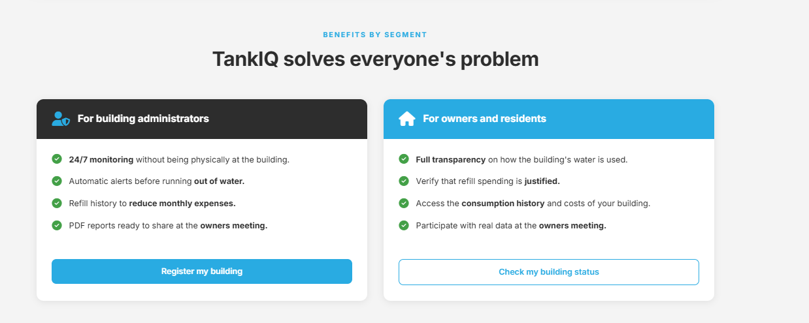
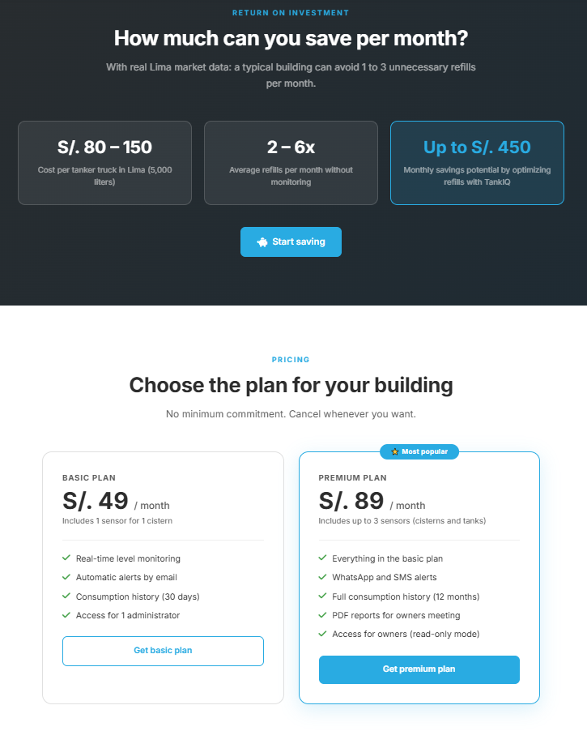
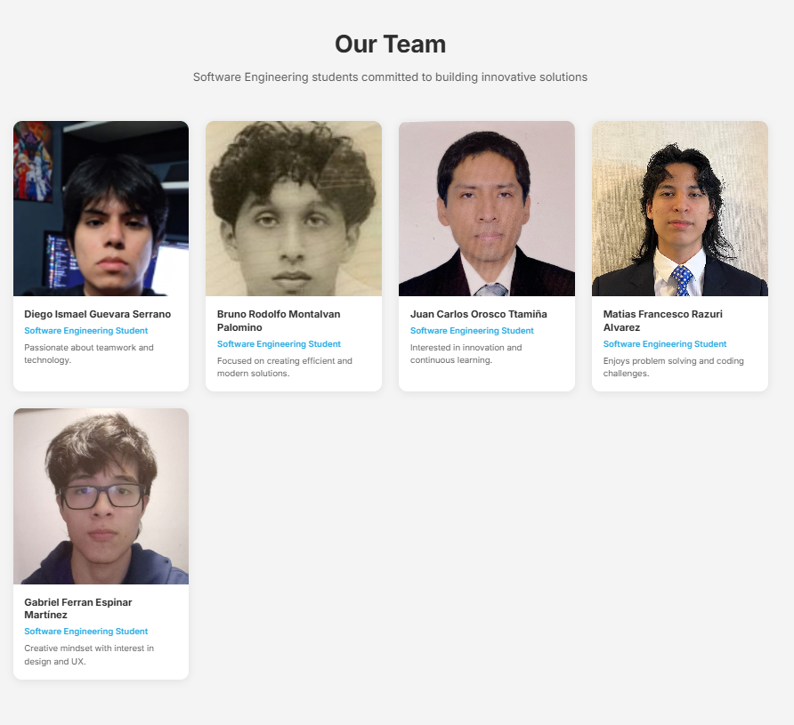

### 5.2.1.6. Services Documentation Evidence for Sprint Review.

El repositorio del Landing Page contiene una documentación exhaustiva que detalla la estructura del proyecto, las tecnologías empleadas, los requisitos de instalación y las directrices para el despliegue. En el archivo README.md del repositorio, se puede acceder a esta documentación.
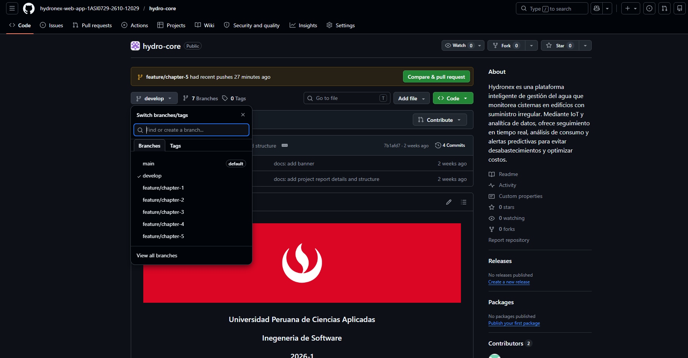

#### 5.2.1.7. Software Deployment Evidence for Sprint Review.

En esta sección se presentan las evidencias del proceso de despliegue de la Landing Page
desarrollado durante el Sprint 1. El despliegue se realizó utilizando **GitHub Pages**, una
plataforma de hosting gratuita y confiable para sitios web estáticos, que permite la
publicación automática desde el repositorio de GitHub.

**Información del Despliegue**

| Aspecto | Detalle |
|---|---|
| Plataforma de Despliegue | GitHub Pages |
| Repositorio | [Landing-Page](https://github.com/hydronex-web-app-1ASI0729-2610-12029/Landing-Page) |
| URL del Landing Page | [https://hydronex-web-app-1ASI0729-2610-12029.github.io/Landing-Page/](https://hydronex-web-app-1ASI0729-2610-12029.github.io/Landing-Page/) |
| Rama de Despliegue | main |
| Fecha de Despliegue | 25/04/2026 |
| Estado Actual | Desplegado y Funcional |
| Tipo de Sitio | Sitio Web Estático (HTML, CSS, JavaScript) |
| HTTPS | Habilitado (Certificado SSL automático) |

**Proceso de Despliegue Detallado**

**Paso 1: Preparación del Repositorio**
- Se configuró el repositorio `Landing-Page` en GitHub con la estructura completa de archivos.
- Se organizaron los archivos HTML, CSS, JavaScript e imágenes en carpetas apropiadas.
- Se aseguró que todos los archivos estuvieran consolidados en la rama `main`.

**Paso 2: Configuración de GitHub Pages**
- Se accedió a la configuración del repositorio en GitHub.
- Se habilitó GitHub Pages en la sección **Settings → Pages**.
- Se seleccionó la rama `main` como fuente del sitio.
- Se configuró la carpeta raíz (`/root`) como directorio de publicación.

Configuración de GitHub Pages
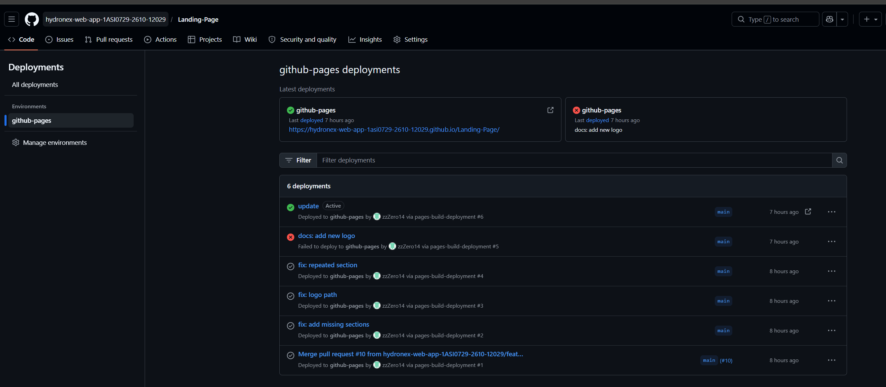

**Paso 3: Generación de la URL**
- GitHub Pages generó automáticamente la URL pública del sitio.
- La URL sigue el formato: `https://[organizacion].github.io/[repositorio]/`

**Paso 4: Verificación del Despliegue**
- Se verificó que el sitio estuviera accesible en la URL proporcionada.
- Se comprobó que el certificado SSL estuviera activo (HTTPS).
- Se validó que todos los recursos se cargaran correctamente.

Confirmación de despliegue exitoso

**Paso 5: Validación de Funcionalidad**

Se realizaron pruebas para verificar que todas las funcionalidades del Landing Page
funcionaran correctamente:

- **Navegación entre secciones:** Todos los enlaces del menú funcionan con scroll suave.
- **Diseño responsive:** El sitio se adapta correctamente a mobile, tablet y desktop.
- **Sistema de idiomas:** El toggle EN/ES funciona correctamente y persiste en localStorage.
- **Formulario de contacto:** La validación de campos y los toast notifications operan sin errores.
- **Carga de assets:** Todas las imágenes y recursos se cargan sin errores.
- **Compatibilidad:** Se probó en Chrome, Firefox, Safari y Edge.

*(Insertar captura: Landing Page desplegada en producción)*

#### 5.2.1.8. Team Collaboration Insights during Sprint.

Durante el Sprint 1, las actividades de implementación del Landing Page de TankIQ se
desarrollaron de forma colaborativa mediante **GitHub**, aplicando el flujo de trabajo
basado en ramas por feature, commits con la convención Conventional Commits y Pull
Requests con revisión mínima de un compañero antes del merge a `main`. Este proceso
garantizó trazabilidad, calidad de código y un historial claro de las contribuciones de
cada integrante.

Cada miembro del equipo asumió la responsabilidad de una o más secciones de la Landing
Page según la distribución establecida en la Matriz LACX, asegurando una participación
activa y balanceada. Las coordinaciones técnicas se realizaron mediante reuniones virtuales
por Google Meet y comunicación por WhatsApp.

A continuación se presentan las evidencias de colaboración del equipo durante el Sprint 1:

Network Graph del repositorio Landing-Page en GitHub

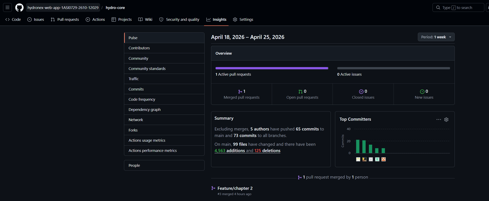

Contributors — commits por integrante

      

Historial de Pull Requests mergeados

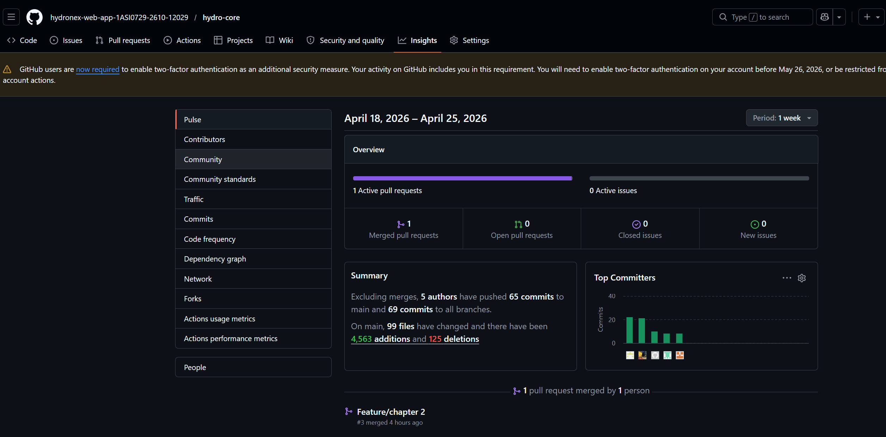

### 5.2.2. Sprint 2

Durante el Sprint 2, el equipo HydroTeam centró sus esfuerzos en el desarrollo de la primera
versión de la Web Application de TankIQ utilizando Angular como framework principal. En esta
etapa se trabajó en la configuración de la arquitectura base del proyecto, la implementación
de navegación mediante rutas, la organización modular utilizando bounded contexts y el
desarrollo de las primeras vistas funcionales del sistema. Asimismo, se realizaron mejoras
sobre los artefactos desarrollados durante el Sprint 1, corrigiendo aspectos visuales,
tipográficos y estructurales para mantener coherencia con el Design System definido
previamente.

#### 5.2.2.1. Sprint Planning 2.

#### 5.2.2.1. Sprint Planning 2.

| **Sprint #** | Sprint 2 |
|---|---|
| **Sprint Planning Background** | |
| **Date** | 2026-05-06 |
| **Time** | 08:00 PM |
| **Location** | Reunión virtual mediante Google Meet |
| **Prepared By** | HydroTeam |
| **Attendees (to planning meeting)** | Espinar Martínez, Gabriel Ferran / Guevara Serrano, Diego Ismael / Montalvan Palomino, Bruno Rodolfo / Orosco Ttamiña, Juan Carlos / Razuri Alvarez, Matias Francesco |
| **Sprint 1 – Review Summary** | Durante el Sprint 1 se completó el desarrollo inicial del Landing Page y los principales artefactos UX/UI del proyecto. Asimismo, durante la revisión se identificaron observaciones relacionadas con enlaces faltantes, visibilidad de algunas imágenes del informe y pequeños ajustes visuales de la interfaz. |
| **Sprint 1 – Retrospective Summary** | Durante la retrospectiva del Sprint 1, el equipo identificó la necesidad de mejorar la organización del trabajo colaborativo y la estructura del frontend para facilitar el desarrollo de nuevas funcionalidades. Además, se concluyó que era necesario utilizar una arquitectura más escalable y una mejor estrategia de manejo de ramas para reducir conflictos durante la integración del proyecto. |
| **Sprint Goal & User Stories** | |
| **Sprint 2 Goal** | Nuestro enfoque está en desarrollar la primera versión funcional de la Web Application de TankIQ utilizando Angular y una arquitectura modular organizada por bounded contexts. Creemos que esto permitirá integrar los primeros módulos frontend del sistema y facilitar el trabajo paralelo del equipo. Esto se confirmará cuando los usuarios puedan navegar entre las principales vistas de la aplicación y visualizar la integración inicial del dashboard y módulos base del sistema. |
| **Sprint 2 Velocity** | 40 |
| **Sum of Story Points** | 40 |

#### 5.2.2.2. Aspect Leaders and Collaborators.

Durante el Sprint 2, el equipo trabajó utilizando una estrategia basada en ramas feature para
desarrollar de manera paralela los diferentes módulos frontend de la Web Application. Cada
integrante asumió la responsabilidad principal de un bounded context específico, permitiendo
mantener una mejor organización del proyecto y facilitar la integración de funcionalidades
hacia las ramas develop y main.

La siguiente Matriz LACX muestra la distribución de responsabilidades del equipo durante el
Sprint 2.

| Team Member | GitHub Username | Landing Angular | IAM Module | Dashboard Overview | Water Monitoring | Alerts & Notifications |
|---|---|---|---|---|---|---|
| Espinar Martínez, Gabriel Ferran | zzZero14 | C | C | C | L | C |
| Guevara Serrano, Diego Ismael | digetto | L | C | C | C | C |
| Montalvan Palomino, Bruno Rodolfo | br1rodolfo | C | L | C | C | C |
| Orosco Ttamiña, Juan Carlos | juancarlosorosco59 | C | C | L | C | C |
| Razuri Alvarez, Matias Francesco | u202410772 | C | C | C | C | L |

#### 5.2.2.3. Sprint Backlog 2.

El Sprint Backlog 2 estuvo orientado al desarrollo de la primera versión de la Frontend Web
Application de TankIQ utilizando Angular. El trabajo incluyó la implementación de la
arquitectura modular del sistema, layouts reutilizables, navegación mediante Angular Router y
la estructura inicial de los diferentes módulos definidos en el Product Backlog. Además, se
realizaron mejoras visuales y técnicas sobre el Landing Page desarrollado durante el Sprint 1.

| **Sprint 2** | | | | | | | |
|---|---|---|---|---|---|---|---|
| **User Story** | | **Work-Item / Task** | | | | | |
| **User Story ID** | **Título** | **Task ID** | **Task Title** | **Description** | **Estimation (Hours)** | **Assigned To** | **Status** |
| US54 | Acceder a la Web Application | T09 | Configurar arquitectura Angular | Inicializar el proyecto Angular y organizar la estructura modular mediante bounded contexts, standalone components y lazy loading. | 4 | Orosco Ttamiña, Juan Carlos | Done |
| US55 | Navegar entre módulos del sistema | T10 | Implementar sistema de routing | Configurar rutas principales, layouts y navegación entre Landing, Dashboard, IAM, Monitoring y Alerts. | 4 | Orosco Ttamiña, Juan Carlos | Done |
| US56 | Visualizar métricas principales del sistema | T11 | Implementar Dashboard Overview | Desarrollar la primera vista del dashboard incluyendo métricas, sidebar y componentes base del panel principal. | 5 | Orosco Ttamiña, Juan Carlos | Done |
| US57 | Acceder al Landing Page desde Angular | T12 | Migrar Landing Page | Adaptar el Landing Page desarrollado en el Sprint 1 hacia una arquitectura basada en componentes Angular reutilizables. | 4 | Guevara Serrano, Diego | Done |
| US58 | Gestionar el acceso de usuarios | T13 | Implementar módulo IAM | Crear la estructura inicial del módulo IAM incluyendo vistas de login, autenticación y navegación base. | 4 | Montalvan Palomino, Bruno | Done |
| US59 | Consultar información de monitoreo | T14 | Implementar módulo Water Monitoring | Desarrollar la estructura inicial y rutas del módulo de monitoreo de agua utilizando componentes placeholder y navegación integrada. | 3 | Espinar Martínez, Gabriel | Done |
| US60 | Visualizar alertas y notificaciones | T15 | Implementar módulo Alerts & Notifications | Crear la estructura inicial del módulo de alertas y notificaciones utilizando vistas placeholder y navegación interna. | 3 | Razuri Alvarez, Matias | Done |
| US61 | Mantener una estructura escalable del sistema | T16 | Organizar proyecto por feature branches | Configurar el flujo de trabajo basado en ramas feature y bounded contexts para permitir el desarrollo paralelo e integración del sistema. | 2 | HydroTeam | Done |
| US62 | Mantener coherencia visual en la aplicación | T17 | Ajustar estilos y layouts | Corregir tipografía, tamaños, espaciados y estilos generales para mantener consistencia visual entre Landing y Web Application. | 3 | HydroTeam | Done |

#### 5.2.2.4. Development Evidence for Sprint Review.

A continuación se presenta el registro de commits realizados en el repositorio
HydroTeam-Frontend durante el Sprint 2. Los commits reflejan el trabajo realizado por el
equipo para implementar la arquitectura Angular, organizar el proyecto mediante ramas feature
y desarrollar los diferentes módulos frontend definidos para esta primera versión de la Web
Application.

| Repository | Branch | Commit Id | Commit Message | Committed on (Date) |
|---|---|---|---|---|
| hydronex-web-app.../HydroTeam-Frontend | feature/tb1-landing | 2fc91ab | feat: migrate landing page to angular standalone components | May 08, 2026 |
| hydronex-web-app.../HydroTeam-Frontend | feature/tb1-landing | 91db61f | feat: improve navbar styles and language switcher | May 08, 2026 |
| hydronex-web-app.../HydroTeam-Frontend | feature/tb1-iam | a73ce2d | feat: add iam module structure and auth routes | May 09, 2026 |
| hydronex-web-app.../HydroTeam-Frontend | feature/tb1-iam | b81df44 | feat: implement login and register views | May 09, 2026 |
| hydronex-web-app.../HydroTeam-Frontend | feature/tb1-dashboard-overview | c92ab8e | feat: implement dashboard overview layout and metrics cards | May 10, 2026 |
| hydronex-web-app.../HydroTeam-Frontend | feature/tb1-dashboard-overview | d13ff7a | feat: add sidebar navigation and under construction views | May 10, 2026 |
| hydronex-web-app.../HydroTeam-Frontend | feature/tb1-water-monitoring | 81ca4fd | feat: create water monitoring module structure | May 11, 2026 |
| hydronex-web-app.../HydroTeam-Frontend | feature/tb1-water-monitoring | 6dc19ef | feat: add monitoring routes and placeholder views | May 11, 2026 |
| hydronex-web-app.../HydroTeam-Frontend | feature/tb1-alerts-notifications | 9ab82dc | feat: create alerts and notifications module | May 12, 2026 |
| hydronex-web-app.../HydroTeam-Frontend | feature/tb1-alerts-notifications | 5fd18aa | feat: add alerts cards and notification placeholders | May 12, 2026 |
| hydronex-web-app.../HydroTeam-Frontend | develop | 8ddf61b | merge: integrate dashboard overview feature branch | May 13, 2026 |
| hydronex-web-app.../HydroTeam-Frontend | develop | a91fd2c | merge: integrate landing angular feature branch | May 13, 2026 |
| hydronex-web-app.../HydroTeam-Frontend | develop | e71cb6f | merge: integrate iam feature branch | May 13, 2026 |
| hydronex-web-app.../HydroTeam-Frontend | develop | 62bc81a | merge: integrate alerts feature branch | May 13, 2026 |
| hydronex-web-app.../HydroTeam-Frontend | develop | 1adf2c8 | merge: integrate monitoring feature branch | May 13, 2026 |
| hydronex-web-app.../HydroTeam-Frontend | main | 91dc6f2 | fix: update responsive layouts and typography sizes | May 14, 2026 |
| hydronex-web-app.../HydroTeam-Frontend | main | 5ab2ce1 | fix: improve dashboard spacing and navigation styles | May 14, 2026 |

#### 5.2.2.5. Execution Evidence for Sprint Review.

Durante el Sprint 2, el equipo HydroTeam implementó la primera versión de la Frontend Web
Application de TankIQ utilizando Angular. El desarrollo se enfocó en establecer una
arquitectura modular y escalable, integrando navegación mediante Angular Router, layouts
reutilizables y componentes standalone para facilitar futuras integraciones del sistema.

Asimismo, se desarrollaron las primeras vistas correspondientes a los módulos Dashboard
Overview, IAM, Water Monitoring y Alerts & Notifications, manteniendo coherencia visual con
el Landing Page trabajado durante el Sprint 1.

Landing Page integrado en Angular

Dashboard Overview implementado en Angular

Sidebar y navegación interna de la aplicación

Módulo Alerts & Notifications

Módulo Water Monitoring

Módulo IAM y vistas de autenticación

#### 5.2.2.6. Services Documentation Evidence for Sprint Review.

El repositorio HydroTeam-Frontend contiene documentación relacionada con la instalación del
proyecto, ejecución de la aplicación y estructura modular implementada durante el Sprint 2.
Asimismo, el archivo README.md incluye instrucciones para configurar Angular, ejecutar builds
y trabajar colaborativamente utilizando ramas feature y flujo GitHub Flow.

Repositorio y documentación del proyecto frontend

#### 5.2.2.7. Software Deployment Evidence for Sprint Review.

En esta sección se presentan las evidencias relacionadas con el despliegue de la primera
versión de la Frontend Web Application de TankIQ. La aplicación fue publicada utilizando
Firebase Hosting, permitiendo desplegar una Single Page Application desarrollada con Angular
y habilitando soporte para rutas internas y navegación SPA.

| Aspecto | Detalle |
|---|---|
| Plataforma de Despliegue | Firebase Hosting |
| Repositorio | [HydroTeam-Frontend](https://github.com/hydronex-web-app-1ASI0729-2610-12029/HydroTeam-Frontend) |
| URL de la Web Application | [https://tankiq-frontend.web.app](https://tankiq-frontend.web.app) |
| Rama de Despliegue | main |
| Fecha de Despliegue | 16/05/2026 |
| Estado Actual | Desplegado y Funcional |
| Tipo de Aplicación | Single Page Application (Angular) |
| HTTPS | Habilitado |

Configuración de Firebase Hosting

Confirmación de despliegue exitoso

#### 5.2.2.8. Team Collaboration Insights during Sprint.

Durante el Sprint 2, el equipo HydroTeam trabajó utilizando GitHub y una estrategia basada
en ramas feature para desarrollar de manera paralela los diferentes módulos frontend de la
aplicación. Cada integrante trabajó sobre un bounded context específico, permitiendo una
mejor organización del proyecto y facilitando la integración de funcionalidades mediante Pull
Requests hacia las ramas `develop` y `main`.

Además, el equipo realizó coordinaciones constantes relacionadas con arquitectura Angular,
routing, layouts y diseño visual de la aplicación, manteniendo una comunicación continua para
resolver observaciones y unificar criterios técnicos durante el desarrollo.

Network Graph del repositorio HydroTeam-Frontend

Contributors — commits realizados por integrante

Historial de Pull Requests mergeados

## Conclusiones

1. TankIQ responde a una problemática real y frecuente en Lima Metropolitana: la falta de
   visibilidad sobre el nivel de agua en cisternas de edificios residenciales. A través del
   proceso de Needfinding, entrevistas y análisis de segmentos, se validó que tanto
   administradores de edificios como propietarios e inquilinos enfrentan consecuencias
   directas por la ausencia de información en tiempo real, lo que justifica el desarrollo de
   una solución tecnológica basada en IoT y monitoreo remoto.

2. La aplicación de Domain-Driven Design permitió al equipo estructurar la arquitectura
   de TankIQ en seis Bounded Contexts claramente delimitados, facilitando la separación de
   responsabilidades, el trabajo paralelo entre integrantes y la escalabilidad del sistema.
   Este enfoque, complementado con el C4 Model para la documentación arquitectónica,
   garantiza que la solución sea mantenible y extensible en los siguientes sprints del ciclo
   de vida del proyecto.

3. El proceso de diseño UX/UI, sustentado en User Personas, User Journey Maps, Empathy
   Maps e Impact Mapping, permitió tomar decisiones de diseño centradas en el usuario y
   no en suposiciones del equipo. El resultado fue una Landing Page que comunica
   claramente la propuesta de valor de TankIQ a ambos segmentos objetivo, con un diseño
   responsive, un sistema de internacionalización EN/ES y call-to-action diferenciados,
   evidenciando la coherencia entre el proceso de investigación y el producto implementado.

4. La adopción de prácticas de ingeniería de software colaborativa — Git Flow, Conventional
   Commits, Semantic Versioning y revisión de código mediante Pull Requests — permitió al
   equipo HydroTeam mantener un historial trazable, organizado y coherente a lo largo del
   Sprint 1. Estas prácticas sientan las bases para escalar el desarrollo hacia los siguientes
   sprints, donde se incorporará el backend en Spring Boot, la Web Application en Angular
   y la integración con servicios externos.

5. Durante el Sprint 2, el equipo logró construir la primera versión de la Web Application
   de TankIQ utilizando Angular, permitiendo pasar de una Landing Page informativa a una
   aplicación con navegación, módulos y estructura más cercana al producto final.

6. La organización del proyecto mediante bounded contexts y ramas feature facilitó que cada
   integrante pudiera trabajar en un módulo distinto sin afectar el avance general del
   sistema, ayudando a mantener una mejor estructura y orden en el desarrollo frontend.

7. La implementación de módulos como Dashboard Overview, IAM, Water Monitoring y Alerts &
   Notifications permitió integrar las primeras vistas funcionales de la aplicación y dejar
   preparada la base para futuras funcionalidades e integraciones backend.

8. Las mejoras realizadas en diseño, tipografía, layouts y navegación ayudaron a mantener
   una experiencia más consistente entre el Landing Page y la Web Application, logrando una
   interfaz más organizada, responsive y alineada con los mockups definidos por el equipo.

## Bibliografía

Conventional Commits. (2024). *Conventional Commits Specification v1.0.0*.
https://www.conventionalcommits.org/

Driessen, V. (2010). *A successful Git branching model*.
https://nvie.com/posts/a-successful-git-branching-model/

Evans, E. (2003). *Domain-Driven Design: Tackling Complexity in the Heart of Software*.
Addison-Wesley Professional.

Google. (2024). *Google HTML/CSS Style Guide*.
https://google.github.io/styleguide/htmlcssguide.html

Google. (2024). *Google Java Style Guide*.
https://google.github.io/styleguide/javaguide.html

Instituto Nacional de Estadística e Informática [INEI]. (2023). *Condiciones de vida en
el Perú: Acceso a servicios básicos*. https://www.inei.gob.pe/

---

## Anexos

### Anexo 1: Repositorios del Proyecto

Los repositorios del proyecto TankIQ se encuentran organizados bajo la organización
GitHub de HydroTeam. En ellos se evidencia el proceso de desarrollo colaborativo
aplicando Git Flow, Conventional Commits y Semantic Versioning a lo largo del ciclo
de vida del proyecto.

- **Informe del Proyecto:** https://github.com/hydronex-web-app-1ASI0729-2610-12029/hydro-core
- **Landing Page:** https://github.com/hydronex-web-app-1ASI0729-2610-12029/Landing-Page

---

### Anexo 2: Segmentación de Usuarios

Se identificaron los siguientes segmentos de usuarios principales para el sistema TankIQ:

- **Administradores de edificios:** responsables de la gestión del suministro de agua,
  el monitoreo de la cisterna, el registro de recargas y la rendición de cuentas ante la
  junta de propietarios.
- **Propietarios e inquilinos:** usuarios que requieren acceso a información clara y
  transparente sobre el nivel de agua disponible y el gasto mensual en recargas.

Esta diferenciación permitió establecer flujos de usuario específicos para cada segmento,
orientando las decisiones de diseño de la Landing Page, los wireframes y la arquitectura
de información de la Web Application.

---

### Anexo 3: Artefactos de UX/UI

- **Figma** — Wireframes, mockups y prototipo interactivo
- **UXPressia** — User Personas, Empathy Maps y User Journey Maps
- **LucidChart** — Diagramas de clases, EventStorming y flujos de usuario
