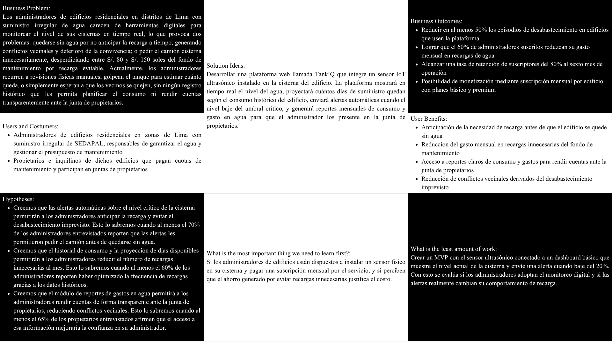

### Universidad Peruana de Ciencias Aplicadas
### Inegeneria de Software
### 2026-1

### NRC: 12029
### Docente: Hugo Allan Mori Paiva
### Informe de Trabajo Final

###  HydroTeam
###  TankIQ

   
|**Code**|**Member**|
|---------------------|--------------------|
|U202310436 |Espinar Martínez Gabriel Ferran|
|U202318951 |Guevara Serrano Diego Ismael| 
|U202411282 |Montalvan Palomino Bruno Rodolfo| 
|U202414840 |Orosco Ttamiña Juan Carlos| 
|U202410772 |Razuri Alvarez Matias Francesco| 

### Abril 2026

# **Registro de Versiones del Informe**

# **Report Version Log**

<table style="width: 100%; border-collapse: collapse;">
  <!-- ROW 0 -->
  <tr>
    <th style="text-align: center;">Versión</th>
    <th style="text-align: center;">Fecha</th>
    <th style="text-align: center;">Autor</th>
    <th style="text-align: center;">Descripción de modificación</th>
  </tr>

  <!-- ROW 1 -->
  <tr>
    <td style="text-align: center;">
      1.0.0
    </td>
    <td style="text-align: center;">
      24/04/2026
    </td>
    <td style="text-align: center;">
      Completar...
    </td>
    <td style="text-align: justify;">
     Completar...
    </td>
  </tr>
  <!-- ROW 2 -->
  <tr>
    <td style="text-align: center;">
      1.0.1
    </td>
    <td style="text-align: center;">
      24/04/2026
    </td>
    <td style="text-align: center;">
      Completar...
    </td>
    <td style="text-align: justify;">
     Completar...
    </td>
  </tr>
  <!-- ROW 3 -->
  <tr>
    <td style="text-align: center;">
      1.0.2
    </td>
    <td style="text-align: center;">
      24/04/2026
    </td>
    <td style="text-align: center;">
      Completar...
    </td>
    <td style="text-align: justify;">
      Completar...
    </td>
 <!-- ROW 4 -->
<tr>
  <td style="text-align: center;">
    1.0.3
  </td>
  <td style="text-align: center;">
    24/04/2026
  </td>
  <td style="text-align: center;">
    Completar...
  </td>
  <td style="text-align: justify;">
    Completar...
  </td>
</tr>
  <!-- ROW 5 -->
  <tr>
    <td style="text-align: center;">
      1.0.4
    </td>
    <td style="text-align: center;">
      24/04/2026
    </td>
    <td style="text-align: center;">
      Orosco Ttamiña, Juan Carlos
    </td>
    <td style="text-align: justify;">
      Se completó la etapa de especificación de requisitos. En esta fase se definieron historias de usuario para representar las principales funcionalidades según las necesidades de los usuarios. También se hizo un impact mapping para relacionar los objetivos del negocio con los usuarios y las funcionalidades del sistema. Finalmente, se organizó y priorizó el Product Backlog, estimándolo con la escala de Fibonacci para apoyar el desarrollo.
    </td>
  </tr>
</table>

# **Project Report Collaboration Insights**

**URL del Repositorio**: [https://github.com/hydronex-web-app-1ASI0729-2610-12029/hydro-core](https://github.com/hydronex-web-app-1ASI0729-2610-12029/hydro-core)

# ABET – EAC - Student Outcome 5

  Criterio: La capacidad de trabajar de manera efectiva en un equipo cuyos integrantes aportan liderazgo, crean un ambiente colaborativo e inclusivo, establecen objetivos, planifican tareas y logran cumplirlos.

<table style="width: 100%; border-collapse: collapse;">
  <!-- ROW 0 -->
  <tr>
    <th style="text-align: center;">Criterio específico</th>
    <th style="text-align: center;">Acciones realizadas</th>
    <th style="text-align: center;">Conclusiones</th>
  </tr>
  
  <!-- ROW 1 -->
  <tr>
    <td style="text-align: justify; vertical-align: top;">
      <b>
        Trabaja en equipo para proporcionar liderazgo en forma conjunta
      </b>
    </td>
    <td style="text-align: justify;">
      <b>
        Espinar Martínez Gabriel Ferran
      </b>
        
      <b><i>
        AV1
      </i></b>
       
        Completar...
        
        ------------------------------------
        
      <b>
        Guevara Serrano Diego Ismael
      </b>
        
      <b><i>
        AV1
      </i></b>
       
        Completar...
        
        ------------------------------------
        
        <b>
          Montalvan Palomino Bruno Rodolfo
        </b>
        
      <b><i>
        AV1
      </i></b>
       
        Completar...
        
        ------------------------------------
        
      <b>
        Orosco Ttamiña Juan Carlos
      </b>
        
      <b><i>
        AV1
      </i></b>
       
         Participé activamente en las reuniones del equipo y en la toma de decisiones, cumpliendo con mis responsabilidades dentro de los plazos establecidos. También colaboré en la definición de las épicas y las historias de usuario (US) a partir de la información obtenida en las entrevistas, mostrando compromiso tanto con el proyecto como con el equipo.
        
        ------------------------------------
        
      <b>
        Razuri Alvarez Matias Francesco
      </b>
        
      <b><i>
        AV1
      </i></b>
       
        Completar...
        
    </td>
    <td style="text-align: justify; vertical-align: top;">
      <b><i>
        AV1
      </i></b>
       
        Durante el AV1, el equipo trabajó con liderazgo compartido, repartiendo las tareas según las fortalezas de cada integrante y coordinando el trabajo en las partes técnica, de diseño y planificación del proyecto SafeLab. Este trabajo se vio en la gestión del repositorio, la organización de tareas, la arquitectura, el diseño UI/UX y la definición de requisitos con épicas e historias de usuario. Cada integrante aportó desde su rol y mantuvo la comunicación con el equipo, lo que permitió avanzar de manera ordenada y cumplir con los objetivos del primer entregable.
    </td>
  </tr>
  
  <!-- ROW 2 -->
  <tr>
    <td style="text-align: justify; vertical-align: top;">
      <b>
        Crea un entorno colaborativo e inclusivo, establece metas, planifica tareas y cumple objetivos.
      </b>
    </td>
    <td style="text-align: justify;">
      <b>
        Espinar Martínez Gabriel Ferran
      </b>
        
      <b><i>
        AV1
      </i></b>
       
        Completar...
        
        ------------------------------------
        
      <b>
        Guevara Serrano Diego Ismael
      </b>
        
      <b><i>
        AV1
      </i></b>
       
        Completar...
        
        ------------------------------------
        
        <b>
          Montalvan Palomino Bruno Rodolfo
        </b>
        
      <b><i>
        AV1
      </i></b>
       
        Completar...
        
        ------------------------------------
        
      <b>
        Orosco Ttamiña Juan Carlos
      </b>
        
      <b><i>
        AV1
      </i></b>
       
         Durante esta fase, mantuvimos un ambiente de trabajo colaborativo, usando WhatsApp y Discord para coordinarnos y GitHub para trabajar en paralelo. Desde el inicio definimos objetivos, organizamos las tareas y trabajamos en equipo para cumplirlos. Además, mi apoyo en la elaboración del informe ayudó a que el proceso fuera más ordenado y a mantener al equipo alineado.
        
        ------------------------------------
        
      <b>
        Razuri Alvarez Matias Francesco
      </b>
        
      <b><i>
        AV1
      </i></b>
       
        Completar...
        
    </td>
    <td style="text-align: justify; vertical-align: top;">
      <b><i>
        AV1
      </i></b>
       
        Durante el AV1, el equipo trabajó de manera colaborativa, manteniendo una comunicación constante y compartiendo ideas y retroalimentación de forma continua. Se utilizaron herramientas como GitHub, Trello, WhatsApp y Discord para coordinar las actividades. Asimismo, se establecieron objetivos y etapas claras para el diseño, la arquitectura, la documentación y la investigación, asignando responsabilidades según las habilidades de cada integrante. Gracias a esta organización y al trabajo en equipo, fue posible integrar adecuadamente todos los entregables y cumplir con los objetivos planteados para el primer avance del proyecto.
    </td>
  </tr>
</table>

## Contenido

- [ Informe Trabajo Final ](#-informe-trabajo-final-)
    - [Universidad Peruana de Ciencias Aplicadas ](#universidad-peruana-de-ciencias-aplicadas-)
    - [Registro de versiones del Informe](#registro-de-versiones-del-informe)
    - [Project Report Collaboration Insights](#project-report-collaboration-insights)
    - [Contenido](#contenido)
    - [Student Outcome](#student-outcome)
- [Capítulo I: Introducción](#capítulo-i-introducción)
    - [1.1. Startup Profile](#11-startup-profile)
    - [1.1.1. Descripción de la Startup](#111-descripción-de-la-startup)
    - [1.1.2 Perfiles de integrantes del equipo](#112-perfiles-de-integrantes-del-equipo)
    - [1.2. Solution Profile](#12-solution-profile)
    - [1.2.1 Antecedentes y problemática](#121-antecedentes-y-problemática)
    - [1.2.2 Lean Ux Process](#122-lean-ux-process)
    - [1.2.2.1. Lean UX Problem Statements](#1221-lean-ux-problem-statements)
    - [1.2.2.2. Lean UX Assumptions](#1222-lean-ux-assumptions)
    - [1.2.2.3. Lean UX Hypothesis Statements](#1223-lean-ux-hypothesis-statements)
    - [1.2.2.4. Lean UX Canvas](#1224-lean-ux-canvas)
    - [Segmentos Objetivos](#segmentos-objetivos)
- [Capítulo II: Requeriments Elicitation \& Analysis](#capítulo-ii-requeriments-elicitation--analysis)
    - [2.1. Competidores](#21-competidores)
    - [2.1.1. Análisis competitivo](#211-análisis-competitivo)
    - [2.1.2. Estrategias y tácticas frente a competidores](#212-estrategias-y-tácticas-frente-a-competidores)
    - [2.2. Entrevistas ](#22-entrevistas-)
    - [2.2.1. Diseño de entrevistas](#221-diseño-de-entrevistas)
    - [2.2.2. Registro de entrevistas](#222-registro-de-entrevistas)
    - [2.2.3. Análisis de entrevistas](#223-análisis-de-entrevistas)
    - [2.3. Needfinding](#23-needfinding)
    - [2.3.1. User Personas](#231-user-personas)
    - [2.3.2. User Task Matrix](#232-user-task-matrix)
    - [2.3.3. User Journey Mapping](#233-user-journey-mapping)
    - [2.3.4. Empathy Mapping](#234-empathy-mapping)
    - [2.4. Big Picture EventStorming](#24-big-picture-evenstorming)
    - [2.5. Ubiquitous Language](#25-ubiquitous-language)
- [Capítulo III: Requeriments Specification](#capítulo-iii-requeriments-specification)
    - [3.1. User Stories](#31-user-stories)
    - [3.2. Impact Mapping](#32-impact-mapping)
    - [3.3. Product Backlog](#33-product-backlog)
- [Capítulo IV: Product Desing](#capítulo-iv-product-desing)
    - [4.1. Style Guidelines](#41-style-guidelines)
    - [4.1.1. General Style Guidelines](#411-general-style-guidelines)
    - [4.1.2. Web Style Guidelines](#412-web-style-guidelines)
    - [4.2. Information Architecture](#42-information-architecture)
    - [4.2.1. Organization Systems](#421-organization-systems)
    - [4.2.2. Labeling Systems](#422-labeling-systems)
    - [4.2.3. SEO Tags and Meta Tags](#423-seo-tags-and-meta-tags)
    - [4.2.4. Searching Systems](#424-searching-systems)
    - [4.2.5. Navigation Systems](#425-navigation-systems)
    - [4.3. Landing Page UI Desing](#43-landing-page-ui-desing)
    - [4.3.1. Landing Page Wireframes](#431-landing-page-wireframes)
    - [4.3.2. Landing Page Mock-Up](#432-landing-page-mock-up)
    - [4.4. Web Applications UX/UI Desing](#44-web-applications-uxui-desing)
    - [4.4.1. Web Applications Wireframes](#441-web-applications-wireframes)
    - [4.4.2. Web Applications Wireflow Diagrams](#442-web-applications-wireflow-diagrams)
    -[4.4.3. Web Applications Mock-ups](#443-web-applications-mock-ups-diagrams)
    - [4.4.4. Web Applications User Flow Diagrams](#444-web-applications-user-flow-diagrams)
    - [4.5. Web Applications Prototyping](#45-web-applications-prototyping)
    - [4.6.1. Design-Level EventStorming](#461-design-level-eventstorming)
    - [4.6.2. Software Architecture Context Diagram](#462-software-architecture-context-diagram)
    - [4.6.3. Software Architecture Container Diagram](#463-software-architecture-container-diagram)
    - [4.6.4. Software Architecture Components Diagram](#464-software-architecture-components-diagram)
    - [4.7. Software Object-Oriented Desing](#47-software-object-oriented-desing)
    - [4.7.1. Class Diagram](#471-class-diagram)
    - [4.8. Database Desing](#48-database-desing)
    - [4.8.1. Database Diagrams](#481-database-diagrams)
- [Capítulo V: Product Implementation, Validation \& Deployment](#capítulo-v-product-implementation-validation--deployment)
    - [5.1. Software Configuration Management](#51-software-configuration-management)
    - [5.1.1. Software Development Environment Configuration](#511-software-development-environment-configuration)
    - [5.1.2. Source Code Management](#512-source-code-management)
    - [5.1.3. Source Code Style Guide \& Conventions](#513-source-code-style-guide--conventions)
    - [5.1.4. Software Deployment Configuration](#514-software-deployment-configuration)
    - [5.2. Landing Page, Service \& Applications Implementation](#52-landing-page-service--applications-implementation)
    - [5.2.1. Sprint](#52x-sprint)
    -  [5.2.1.1. Sprint Planning 1](#5211-Sprint-Planning1)
    -  [5.2.1.2. Aspect Leaders and Collaborators](#5212-Aspect-Leaders-and-Collaborators)
    -  [5.2.1.3. Sprint Backlog 1](#5213-Sprint-Backlog-1)
    -  [5.2.1.4. Development Evidence for Sprint Review](#5214-Development-Evidence-for-Sprint-Review)
    -  [5.2.1.5. Execution Evidence for Sprint Review](#5215-Execution-Evidence-for-Sprint-Review)
    -  [5.2.1.6. Services Documentation Evidence for Sprint Review](#5216-Services-Documentation-Evidence-for-Sprint-Review)
    -  [5.2.1.7. Software Deployment Evidence for Sprint Review](#5217-Software-Deployment-Evidence-for-Sprint-Review)
    -  [5.2.1.8. Team Collaboration Insights during Sprint](#5218-Team-Collaboration-Insights-during-Sprint)
    -  [Conclusiones](#Conclusiones)
    -  [Bibliografía](#Bibliografía)
    -  [Anexos](#Anexos)

# Capítulo 1: Introducción

## 1.1. Startup Profile

### 1.1.1. Descripción de la Startup

Nos encargamos de brindar una solución tecnológica accesible para la gestión inteligente del suministro de agua en edificios residenciales que dependen de cisternas ante el servicio irregular de SEDAPAL. Nuestro objetivo es eliminar el desabastecimiento imprevisto y el gasto innecesario en recargas de agua, dos problemas que afectan cotidianamente a miles de edificios en Lima Metropolitana.

- **Nombre:** HydroTeam
- **Rubro:** Desarrollo de software / IoT
- **Visión:** Convertirnos en la plataforma de referencia para la gestión inteligente de recursos hídricos en edificios residenciales de Lima Metropolitana.
- **Misión:** Brindar a los administradores y propietarios de edificios una herramienta accesible y confiable que les permita tomar decisiones informadas sobre la gestión del agua, reduciendo costos innecesarios y garantizando el suministro continuo.

### 1.1.2. Perfiles de integrantes del equipo

<table align="center" border="1" width="70%" style="text-align:center;">
    <tr align="center">
        <td rowspan="3">
            
        </td>
        <td align="left">
            <b>Nombre y Apellido:</b>
             
            [Apellido, Nombre]
        </td>
    </tr>
    <tr>
        <td align="left">
        <b>Carrera:</b>
         
        Ingeniería de Software
        </td>
    </tr>
    <tr>
        <td align="left">
        <b>Acerca de:</b>
         
        [Descripción personal del integrante]
        </td>
    </tr>
    <tr align="center">
        <td rowspan="3">
            
        </td>
        <td align="left">
            <b>Nombre y Apellido:</b>
             
            [Apellido, Nombre]
        </td>
    </tr>
    <tr>
        <td align="left">
        <b>Carrera:</b>
         
        Ingeniería de Software
        </td>
    </tr>
    <tr>
        <td align="left">
        <b>Acerca de:</b>
         
        [Descripción personal del integrante]
        </td>
    </tr>
    <tr align="center">
        <td rowspan="3">
            
        </td>
        <td align="left">
            <b>Nombre y Apellido:</b>
             
            [Apellido, Nombre]
        </td>
    </tr>
    <tr>
        <td align="left">
        <b>Carrera:</b>
         
        Ingeniería de Software
        </td>
    </tr>
    <tr>
        <td align="left">
        <b>Acerca de:</b>
         
        [Descripción personal del integrante]
        </td>
    </tr>
    <tr align="center">
        <td rowspan="3">
            
        </td>
        <td align="left">
            <b>Nombre y Apellido:</b>
             
            Orosco, Juan
        </td>
    </tr>
    <tr>
        <td align="left">
        <b>Carrera:</b>
         
        Ingeniería de Software
        </td>
    </tr>
    <tr>
        <td align="left">
        <b>Acerca de:</b>
         
        Soy Juan Orosco, tengo 21 años y soy estudiante de Ingeniería de Software, interesado en la creación de aplicaciones y el desarrollo de soluciones tecnológicas. Me motiva enfrentar nuevos retos técnicos que me permitan seguir aprendiendo.
        </td>
    </tr>
    <tr align="center">
        <td rowspan="3">
            
        </td>
        <td align="left">
            <b>Nombre y Apellido:</b>
             
            Razuri, Matias
        </td>
    </tr>
    <tr>
        <td align="left">
        <b>Carrera:</b>
         
        Ingeniería de Software
        </td>
    </tr>
    <tr>
        <td align="left">
        <b>Acerca de:</b>
         
        Soy Matias Razuri, tengo 19 años a la fecha, y soy un estudiante de la carrera de Ing. de Software. Me considero una persona responsable y participativa en lo que respecta a cualquier proyecto de trabajo. Todos mis conocimientos de programacion se basan en C++, CSS, HTML, y Python.
        </td>
    </tr>
</table>

## 1.2. Solution Profile

### 1.2.1 Antecedentes y problemática

El acceso irregular al agua es una realidad cotidiana para millones de limeños. Según el Instituto Nacional de Estadística e Informática (INEI), más del 30% de los hogares de Lima Metropolitana no reciben agua potable las 24 horas del día. Esta situación es especialmente crítica en distritos de Lima Norte, Lima Este y Lima Sur —como San Juan de Lurigancho, Ate, Villa María del Triunfo, Carabayllo y Comas— donde el servicio de SEDAPAL puede interrumpirse entre uno y cuatro días por semana.

Ante esta realidad, los edificios residenciales de estas zonas dependen de cisternas como reservorio principal de agua. Sin embargo, la gestión de estas cisternas se realiza de manera completamente manual e informal: el administrador del edificio revisa físicamente el nivel del agua, estima cuántos días quedan de suministro y decide —muchas veces por intuición— cuándo llamar al servicio de camión cisterna. Este proceso genera dos tipos de pérdidas económicas recurrentes: quedarse sin agua antes de la recarga, o llamar al camión cisterna cuando aún hay reserva suficiente, pagando una recarga innecesaria que incrementa los gastos comunes del edificio.

A nivel tecnológico, no existe en el mercado peruano una plataforma accesible, en español, orientada a edificios de entre 6 y 40 departamentos, que combine monitoreo IoT con proyección de consumo y transparencia financiera para las juntas de propietarios.

**5 'W's + 2 'H's**

- **What?**

¿Cuál es el problema?

Los administradores de edificios residenciales en Lima no cuentan con ninguna herramienta para monitorear en tiempo real el nivel de su cisterna. Gestionan el agua de forma manual e intuitiva, lo que genera recargas innecesarias (gasto excesivo) o desabastecimiento imprevisto (pérdida de calidad de servicio y conflictos entre vecinos). Adicionalmente, las juntas de propietarios no tienen visibilidad sobre el gasto mensual en agua, lo que genera desconfianza hacia el administrador.

- **When?**

¿Cuándo sucede el problema?

El problema se manifiesta de manera recurrente cada semana. Ocurre cuando SEDAPAL no abastece con normalidad, cuando el nivel de la cisterna baja sin que nadie lo note a tiempo, y al momento de rendir cuentas en las juntas de propietarios, cuando no hay registros claros del gasto en agua.

- **Where?**

¿Dónde ocurre el problema?

En edificios residenciales de distritos de Lima con suministro de agua irregular de SEDAPAL, principalmente en Lima Norte (Los Olivos, Comas, Carabayllo, Independencia), Lima Este (San Juan de Lurigancho, Ate, Santa Anita) y Lima Sur (Villa María del Triunfo, Villa El Salvador), así como en zonas intermedias como Breña, Jesús María, Lince y Pueblo Libre donde los edificios en pisos altos sufren presión insuficiente.

- **Why?**

¿Por qué ocurre el problema?

Ocurre porque la gestión de cisternas en edificios residenciales pequeños y medianos no ha sido digitalizada. No existen herramientas económicamente accesibles para este segmento. Los administradores muchas veces vecinos del mismo edificio sin formación técnica recurren a métodos manuales como varas de medición o golpear el tanque para escuchar cuánto queda. La ausencia de datos históricos impide cualquier tipo de planificación del consumo.

- **Who?**

¿Quiénes están involucrados?

Administradores de edificios residenciales en zonas de Lima con suministro de agua irregular, responsables de garantizar el suministro y gestionar el presupuesto de mantenimiento.

Propietarios e inquilinos de los mismos edificios, quienes sufren directamente el desabastecimiento y pagan las cuotas de mantenimiento sin acceso a información sobre en qué se gasta su dinero.

- **How?**

¿Cómo se presenta el problema?

El proceso actual funciona de la siguiente manera: SEDAPAL corta o reduce el suministro la cisterna comienza a vaciarse el administrador no tiene alerta hasta que un vecino se queja o él mismo hace una revisión física el administrador llama al servicio de camión cisterna en muchos casos el camión tarda entre 12 y 48 horas en llegar el edificio se queda sin agua. Alternativamente, el administrador llama al camión por precaución cuando aún hay reserva suficiente, generando un gasto innecesario que se cobra en las cuotas de mantenimiento.

- **How much?**

¿Qué tan severo es el problema?

El precio promedio de un camión cisterna de 5,000 litros en Lima oscila entre S/. 80 y S/. 150 soles. Un edificio de 15 a 20 departamentos puede requerir entre 2 y 6 recargas al mes dependiendo de la frecuencia de cortes de SEDAPAL. Una sola recarga innecesaria al mes representa entre S/. 80 y S/. 150 soles desperdiciados del fondo de mantenimiento. Multiplicado por los meses del año, esto equivale a entre S/. 960 y S/. 1,800 soles anuales en gastos evitables por edificio. A ello se suma el impacto en la convivencia vecinal: el desabastecimiento imprevisto es una de las principales fuentes de conflicto en edificios residenciales, con consecuencias directas en la morosidad de cuotas y la rotación de administradores.

### 1.2.2 Lean UX Process.

### 1.2.2.1. Lean UX Problem Statements.

Hemos notado que los administradores de edificios residenciales en Lima que dependen de cisternas no cuentan con ninguna herramienta digital para monitorear el nivel del agua en tiempo real. Un factor crítico que agrava este problema es la total ausencia de datos históricos de consumo, lo que impide al administrador anticipar cuándo será necesaria una recarga y lo obliga a tomar decisiones reactivas que generan desabastecimiento o gasto innecesario.

¿Cómo podemos brindar a los administradores de edificios una solución accesible que les permita monitorear su cisterna en tiempo real y anticipar la necesidad de recarga antes de que el edificio se quede sin agua?

Hemos notado que los propietarios e inquilinos de edificios residenciales en zonas con suministro irregular de agua no tienen ninguna visibilidad sobre el estado del suministro de su edificio ni sobre el gasto mensual en recargas de agua. Un factor crítico es que este déficit de transparencia genera desconfianza hacia el administrador, conflictos en las juntas de propietarios y dificultades para aprobar el presupuesto de mantenimiento.

¿Cómo podemos ofrecer a los propietarios e inquilinos acceso claro y actualizado a la información sobre el suministro de agua y los gastos asociados, fortaleciendo la transparencia y la convivencia en el edificio?

### 1.2.2.2. Lean UX Assumptions.

**Assumptions Worksheet**

- ¿Quién es el usuario?

*Tenemos dos tipos de usuario: los administradores de edificios residenciales y los propietarios e inquilinos de dichos edificios.*

- ¿Dónde encaja nuestro producto en su trabajo o vida?

*Nuestro producto se integra en la rutina semanal del administrador para la gestión del mantenimiento del edificio, y en las reuniones mensuales de la junta de propietarios cuando se rinden cuentas sobre los gastos comunes.*

- ¿Qué problemas resuelve nuestro producto?

*El producto resuelve el problema de la falta de control sobre el nivel de la cisterna, eliminando el desabastecimiento imprevisto y las recargas innecesarias que afectan el presupuesto del edificio.*

- ¿Cuándo y cómo es usado nuestro producto?

*El administrador consulta la plataforma diariamente o recibe alertas automáticas cuando el nivel de la cisterna baja del umbral crítico. Los propietarios la consultan mensualmente para revisar el historial de gastos en agua.*

- ¿Qué características son importantes?

    - *Para el segmento administradores: monitoreo en tiempo real del nivel de la cisterna, alertas automáticas, proyección de días de agua disponibles según consumo histórico y registro de recargas.*
    - *Para el segmento propietarios: acceso al historial de consumo y gastos en agua, reportes mensuales para la junta de propietarios.*

- ¿Cómo debe verse nuestro producto y cómo comportarse?

*Nuestro producto deberá transmitir confianza y simplicidad. Debe ser accesible desde cualquier dispositivo móvil, con una interfaz clara que pueda ser utilizada sin dificultad por personas sin formación técnica.*

**Business Assumptions**

- Creemos que nuestros clientes necesitan una manera de monitorear en tiempo real el nivel de la cisterna de su edificio para anticipar la recarga y evitar el desabastecimiento.
- Estas necesidades se pueden resolver mediante una plataforma web integrada con un sensor IoT ultrasónico instalado en la cisterna, que envía datos en tiempo real a un dashboard accesible desde cualquier dispositivo.
- Nuestros clientes iniciales serán administradores de edificios residenciales de entre 6 y 40 departamentos, ubicados en distritos de Lima con suministro de agua irregular.
- El valor #1 que nuestros clientes obtendrán es la capacidad de anticipar la necesidad de recarga y evitar quedarse sin agua, eliminando el principal dolor de cabeza de la gestión del edificio.
- Los clientes también obtendrán como beneficio adicional un registro histórico de consumo y gastos en agua que les permitirá rendir cuentas de forma transparente ante la junta de propietarios.
- Obtendremos la mayoría de nuestros clientes mediante recomendación entre administradores de edificios y difusión en grupos de WhatsApp de juntas vecinales y de propietarios.
- Haremos dinero a través de un modelo de suscripción mensual por edificio, con un plan básico y un plan premium que incluye reportes avanzados y notificaciones por WhatsApp.
- Nuestra competencia principal son las soluciones manuales actuales (revisión física, vara de medición) y soluciones industriales de monitoreo de tanques que no están adaptadas al contexto de edificios residenciales pequeños en Lima.
- Los superaremos al ofrecer una solución económicamente accesible, en español, simple de instalar y de usar, diseñada específicamente para el contexto de los edificios residenciales de Lima.
- Nuestro mayor riesgo es que los administradores no estén dispuestos a instalar un sensor físico en la cisterna por desconfianza hacia la tecnología o resistencia al cambio.
- Lo resolveremos ofreciendo una instalación sencilla, sin necesidad de obras ni conocimientos técnicos, acompañada de soporte y una prueba gratuita del servicio durante el primer mes.

### 1.2.2.3. Lean UX Hypothesis Statements.

- "Creemos que reducir los episodios de desabastecimiento de agua en edificios residenciales se logrará si los administradores de edificios obtienen alertas automáticas en tiempo real sobre el nivel crítico de la cisterna con el módulo de monitoreo y alertas de nuestra plataforma."

- "Creemos que reducir el gasto mensual en recargas innecesarias de camión cisterna se logrará si los administradores de edificios obtienen una proyección de días de agua disponibles basada en el consumo histórico del edificio con el módulo de proyección de consumo de nuestra plataforma."

- "Creemos que mejorar la transparencia y la confianza en la gestión del edificio se logrará si los propietarios e inquilinos obtienen acceso a un historial claro de consumo y gastos en agua con el módulo de reportes para juntas de propietarios de nuestra plataforma."

- "Creemos que lograr la adopción del producto por parte de administradores sin formación técnica se logrará si dichos administradores pueden instalar el sensor y usar la plataforma sin asistencia técnica con una guía de instalación paso a paso y una interfaz simple e intuitiva. Sabremos que estamos teniendo éxito cuando el 80% de los administradores entrevistados logren completar las tareas principales en su primera sesión de uso sin ayuda."

- "Creemos que el modelo de suscripción mensual es viable si los administradores de edificios perciben que el ahorro generado por evitar recargas innecesarias supera el costo de la suscripción. Sabremos que estamos teniendo éxito cuando al menos el 60% de los administradores entrevistados en validación afirmen que estarían dispuestos a pagar una suscripción mensual por el servicio."

### 1.2.2.4. Lean UX Canvas.

    

## 1.3. Segmentos objetivo.

Nuestra aplicación está dirigida a dos segmentos objetivos los cuales son:

- **Administradores de edificios residenciales:** son aquellas personas responsables de la gestión y mantenimiento de edificios multifamiliares de entre 6 y 40 departamentos, ubicados en distritos de Lima Metropolitana con suministro de agua irregular o insuficiente por parte de SEDAPAL. Pueden ser administradores contratados o vecinos del mismo edificio elegidos por la junta de propietarios. Se trata principalmente de personas entre los 30 y 65 años, de nivel socioeconómico B y C, con un nivel de digitalización básico a intermedio.

- **Propietarios e inquilinos de edificios residenciales:** son aquellas personas que residen en edificios multifamiliares en zonas de Lima con suministro de agua irregular, que pagan cuotas de mantenimiento y tienen derecho a participar en las juntas de propietarios. Se trata de personas entre los 25 y 60 años, de nivel socioeconómico B y C, usuarios habituales de smartphones, que buscan transparencia en la gestión del presupuesto del edificio y confiabilidad en el suministro de agua.

    
# Capítulo II: Requirements Elicitation & Analysis
    
## 2.1. Competidores.
    
### 2.1.1. Análisis competitivo.
    
### 2.1.2. Estrategias y tácticas frente a competidores.
    
## 2.2. Entrevistas.
    
### 2.2.1. Diseño de entrevistas.
    
### 2.2.2. Registro de entrevistas.
    
### 2.2.3. Análisis de entrevistas.
    
## 2.3. Needfinding.
    
### 2.3.1. User Personas.
    
### 2.3.2. User Task Matrix.

### 2.3.3. User Journey Mapping.

### 2.3.4. Empathy Mapping.
    
## 2.4. Big Picture EventStorming.
    
## 2.5. Ubiquitous Language.
    
# Capítulo III: Requirements Specification
  
## 3.1. User Stories.
   
## 3.2. Impact Mapping.
    
## 3.3. Product Backlog.
    
# Capítulo IV: Product Design
   
## 4.1. Style Guidelines.
   
### 4.1.1. General Style Guidelines.
    
### 4.1.2. Web Style Guidelines.
    
## 4.2. Information Architecture.
    
### 4.2.1. Organization Systems.
    
### 4.2.2. Labeling Systems.
    
### 4.2.3. SEO Tags and Meta Tags
    
### 4.2.4. Searching Systems.
    
### 4.2.5. Navigation Systems.
    
## 4.3. Landing Page UI Design.
    
### 4.3.1. Landing Page Wireframe.
    
### 4.3.2. Landing Page Mock-up.
    
## 4.4. Web Applications UX/UI Design.
    
### 4.4.1. Web Applications Wireframes.
    
### 4.4.2. Web Applications Wireflow Diagrams.
    
### 4.4.2. Web Applications Mock-ups.
    
### 4.4.3. Web Applications User Flow Diagrams.
    
## 4.5. Web Applications Prototyping.
   
## 4.6. Domain-Driven Software Architecture.
    
### 4.6.1. Design-Level EventStorming.
    
### 4.6.2. Software Architecture Context Diagram.
    
### 4.6.3. Software Architecture Container Diagrams.
    
### 4.6.4. Software Architecture Components Diagrams.
    
## 4.7. Software Object-Oriented Design.
    
### 4.7.1. Class Diagrams.
    
## 4.8. Database Design.
    
### 4.8.1. Database Diagrams.
    
# Capítulo V: Product Implementation, Validation & Deployment
    
## 5.1. Software Configuration Management.
    
### 5.1.1. Software Development Environment Configuration.
    
### 5.1.2. Source Code Management.
    
### 5.1.3. Source Code Style Guide & Conventions.
    
### 5.1.4. Software Deployment Configuration.
    
## 5.2. Landing Page, Services & Applications Implementation.
    
## 5.2.1. Sprint n
    
### 5.2.1.1. Sprint Planning n.
    
### 5.2.1.2. Aspect Leaders and Collaborators.
    
### 5.2.1.3. Sprint Backlog n.
    
### 5.2.1.4. Development Evidence for Sprint Review.
    
### 5.2.1.5. Execution Evidence for Sprint Review.
    
### 5.2.1.6. Services Documentation Evidence for Sprint Review.
    
### 5.2.1.7. Software Deployment Evidence for Sprint Review.
    
### 5.2.1.8. Team Collaboration Insights during Sprint.

## Conclusiones

## Bibliografía

## Anexos
