# Capítulo IV: Product Design

## 4.1. Style Guidelines

### 4.1.1. General Style Guidelines

**Branding**

TankIQ es una plataforma orientada a la gestión inteligente del suministro de agua en edificios residenciales. La identidad visual debe transmitir confianza, modernidad y simplicidad, valores esenciales para un producto dirigido a administradores de edificios y propietarios que no necesariamente tienen formación técnica. El nombre TankIQ combina la idea de "tanque" (cisterna) con "IQ" (inteligencia), reflejando la propuesta de valor central: llevar inteligencia a un proceso que hoy se gestiona de forma manual e intuitiva.

    

**Colores**

La paleta de colores de TankIQ está construida sobre la combinación de gris oscuro y celeste, transmitiendo profesionalismo, modernidad y una asociación directa con el agua como recurso central del producto. Adicionalmente se definen colores de estado que comunican de forma intuitiva el nivel de riesgo del suministro de agua, elemento central de la experiencia de usuario.

A continuación se presentan los colores que conforman la paleta principal:

**Celeste Principal: `#29ABE2`**
Color de marca principal. Se utiliza en botones primarios, íconos destacados, enlaces activos y elementos que requieren llamar la atención del usuario. Representa el agua y la tecnología.

    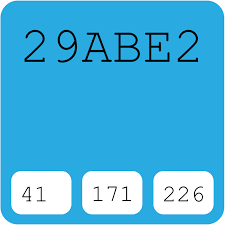

**Gris Oscuro: `#2D2D2D`**
Color base para texto principal, encabezados y el fondo del navbar. Aporta seriedad y contraste sin recurrir al negro puro, lo que suaviza la experiencia visual.

    

**Gris Medio: `#5A5A5A`**
Se utiliza para texto secundario, subtítulos y etiquetas. Mantiene la jerarquía visual sin competir con el texto principal.

    

**Gris Claro: `#F4F4F4`**
Color de fondo para secciones, tarjetas y áreas de contenido. Genera separación visual entre bloques sin recurrir a bordes marcados.

    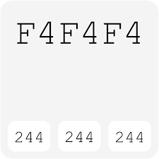

**Rojo Alerta: `#E53935`**
Reservado exclusivamente para alertas críticas, nivel de cisterna bajo y mensajes de error. Su uso está restringido a situaciones que requieren atención inmediata del usuario.

    

**Verde Estado: `#43A047`**
Se utiliza para indicar estado normal u óptimo del nivel de la cisterna, confirmaciones y acciones completadas exitosamente.

    

**Tipografía**

Utilizamos **Inter** como tipografía principal para todos los productos digitales. Inter es una fuente sans serif moderna diseñada específicamente para interfaces digitales, con excelente legibilidad en pantallas de distintos tamaños y en contextos de uso con poca luz, característica relevante dado que muchos administradores de edificios consultarán la plataforma desde sus teléfonos en condiciones variadas.

Los títulos principales (H1) se presentan en Inter Bold a 32px, los títulos secundarios (H2) en Inter SemiBold a 24px y los títulos terciarios (H3) en Inter SemiBold a 20px. El cuerpo de texto utiliza Inter Regular a 14px, mientras que las etiquetas y textos de apoyo utilizan Inter Regular a 12px. Los botones utilizan Inter Medium a 14px para mantener legibilidad y diferenciación respecto al texto corrido.

**Espaciado**

El sistema de espaciado de TankIQ está basado en múltiplos de 8px, siguiendo las convenciones de Material Design. Esto garantiza consistencia visual y facilita la implementación por parte del equipo de desarrollo. Los valores definidos van desde 4px para separaciones mínimas entre elementos muy cercanos, hasta 48px para la separación entre secciones principales del Landing Page. El espaciado estándar de padding interno en tarjetas y secciones es de 16px.

**Tono de comunicación**

TankIQ adopta un tono **cercano y simple**, orientado a usuarios que no necesariamente tienen formación técnica. El lenguaje se dirige directamente al usuario de forma empática, usando términos del día a día del administrador de edificios en lugar de jerga tecnológica. Aunque el tono es cercano, se mantiene un registro profesional que transmite confianza y seriedad.

Las cuatro dimensiones del tono de TankIQ son las siguientes. Primero, **cercano y no distante**: los mensajes empatizan con la situación cotidiana del usuario, usando "tú" en lugar de "usted". Segundo, **simple y no técnico**: se evita exponer al usuario a términos de ingeniería o IoT; la plataforma habla en términos del problema que resuelve, no de la tecnología que usa. Tercero, **sereno y no alarmista**: incluso en alertas críticas, el lenguaje es claro y orientado a la acción. Cuarto, **profesional y no informal**: se evitan coloquialismos o expresiones demasiado informales que puedan restar credibilidad al producto.

Por ejemplo, cuando la cisterna llega a un nivel crítico, TankIQ no muestra "ERROR CRÍTICO: Nivel de agua insuficiente detectado", sino "Tu cisterna está al 15%. Es momento de pedir una recarga." Cuando el usuario abre el dashboard, en lugar de "Sistema de monitoreo IoT inicializado correctamente", TankIQ muestra "Todo en orden. Aquí está el estado de tu cisterna hoy."

### 4.1.2. Web Style Guidelines

**Componentes de UI**

TankIQ utiliza **Angular Material** como biblioteca de componentes de interfaz, adaptando su tema visual a la paleta de colores y tipografía definidas. Los botones primarios tienen fondo celeste (`#29ABE2`), texto blanco y border radius de 8px. Los botones secundarios tienen borde celeste y fondo transparente. Las tarjetas utilizan fondo blanco con sombra suave y border radius de 12px. Los campos de formulario siguen el estilo outlined de Angular Material con color de foco celeste. La iconografía proviene de la biblioteca **Material Icons** de Google en tamaño estándar de 24px.

**Indicadores de estado de cisterna**

Dado que el estado de la cisterna es el elemento central de la experiencia de usuario, se define un sistema de indicadores visuales específico basado en el nivel de agua. Cuando el nivel se encuentra entre 60% y 100% se muestra en verde (`#43A047`) indicando nivel óptimo. Entre 30% y 59% se muestra en celeste (`#29ABE2`) indicando nivel normal. Entre 15% y 29% se muestra en naranja (`#FB8C00`) indicando nivel bajo. Por debajo del 15% se muestra en rojo (`#E53935`) indicando nivel crítico y disparando una alerta automática al administrador.

**Layout y grilla**

Se utiliza el sistema de grilla de 12 columnas de Angular Material. El contenido principal no supera los 1200px de ancho en pantallas grandes, centrado horizontalmente. El navbar tiene una altura fija de 64px en desktop y 56px en mobile. Los márgenes laterales del contenido son de 16px en mobile y 24px en tablet y desktop.

## 4.2. Information Architecture

### 4.2.1. Organization Systems

La arquitectura de información de TankIQ organiza el contenido en función de los dos segmentos objetivo y sus necesidades específicas, diferenciando claramente entre la experiencia del administrador del edificio y la del propietario o inquilino.

Para el **Landing Page**, el contenido se organiza de forma **secuencial**, guiando al visitante a través de un recorrido lógico que va desde la identificación del problema hasta la llamada a la acción. La secuencia es: presentación del problema (el dolor del desabastecimiento), propuesta de solución (TankIQ y el sensor IoT), beneficios concretos por segmento, demostración del producto y finalmente los planes de suscripción con los call to action diferenciados por segmento.

Para la **Web Application**, el contenido se organiza de forma **jerárquica**, con el dashboard principal como punto de entrada que concentra la información más crítica (nivel actual de la cisterna, proyección de días disponibles y alertas activas), desde el cual el usuario puede navegar hacia secciones de mayor detalle como el historial de consumo, el registro de recargas y los reportes para la junta de propietarios. Esta jerarquía responde directamente a la frecuencia de uso: el administrador consulta el nivel de la cisterna varias veces por semana, pero accede al historial de gastos principalmente al preparar la rendición de cuentas mensual.

El contenido de la Web Application se categoriza **por audiencia**, dado que los administradores y los propietarios tienen accesos diferenciados. El administrador accede al panel completo de monitoreo y gestión, mientras que los propietarios acceden a una vista simplificada de solo lectura con el historial de consumo y gastos.

### 4.2.2. Labeling Systems

El sistema de etiquetado de TankIQ prioriza la simplicidad y el lenguaje cotidiano, evitando términos técnicos que puedan resultar confusos para administradores de edificios sin formación tecnológica.

En el **navbar** de la Web Application las secciones principales se etiquetan como: **Inicio** (dashboard con el estado actual de la cisterna), **Historial** (registro de consumo y recargas), **Reportes** (documentos para la junta de propietarios) y **Configuración** (datos del edificio y umbrales de alerta).

En las **tarjetas de estado** se usan etiquetas directas como "Nivel actual", "Días estimados", "Última recarga" y "Próxima alerta", evitando términos como "porcentaje de capacidad volumétrica" o "timestamp de última sincronización". Los botones de acción usan verbos en infinitivo que indican claramente la acción: "Pedir recarga", "Ver historial", "Descargar reporte" y "Configurar alerta".

En el **Landing Page**, las secciones se etiquetan por beneficio y no por funcionalidad: "¿Cómo funciona?", "¿Cuánto puedes ahorrar?", "Para administradores" y "Para propietarios", reflejando el tono cercano y orientado al usuario definido en los style guidelines.

### 4.2.3. SEO Tags and Meta Tags

**Landing Page**

- **Title:** : TankIQ: Tu monitoreo inteligente de cisternas para edificios en Lima
- **Meta Description:** TankIQ te avisa cuándo tu cisterna está por agotarse. Sensor IoT + plataforma web para administradores de edificios en Lima. Evita el desabastecimiento y reduce gastos innecesarios.
- **Meta Keywords:**: monitoreo cisterna, sensor cisterna Lima, gestión agua edificios, alerta cisterna, administrador edificio Lima, SEDAPAL suministro irregular
- **Meta Author:**: HydroTeam
- **Meta Robots:**: index, follow
- **Open Graph Title:**: TankIQ: Nunca más te quedes sin agua
- **Open Graph Description:**: Plataforma IoT para monitorear el nivel de tu cisterna en tiempo real. Para administradores de edificios en Lima.

**Web Application: Dashboard**

- **Title:**: Dashboard: TankIQ
- **Meta Description:** Monitorea el nivel de tu cisterna en tiempo real, recibe alertas automáticas y gestiona el historial de consumo de tu edificio
- **Meta Robots:** noindex, nofollow
- **Meta Author:** HydroTeam

**Web Application: Reportes**

- **Title:** Reportes de consumo
- **Meta Description:** Accede al historial de gastos en agua de tu edificio y genera reportes para tu junta de propietarios.
- **Meta Robots:** noindex, nofollow
- **Meta Author:** HydroTeam

### 4.2.4. Searching Systems

En el **Landing Page** no se implementa un sistema de búsqueda, dado que el volumen de contenido es reducido y la navegación secuencial es suficiente para que el visitante encuentre la información que necesita.

En la **Web Application**, se implementan los siguientes mecanismos de búsqueda y filtrado orientados a las tareas principales de cada segmento:

El administrador puede filtrar el **historial de recargas** por rango de fechas (última semana, último mes, últimos 3 meses, rango personalizado) y por monto, lo que le permite identificar meses con mayor gasto y justificar variaciones ante la junta de propietarios. El historial de **alertas** puede filtrarse por tipo (nivel bajo, nivel crítico, consumo anómalo) y por estado (resueltas o pendientes). Los **reportes generados** pueden buscarse por mes y año.

Los resultados de búsqueda se presentan en orden cronológico inverso por defecto (más reciente primero), dado que el usuario generalmente busca información reciente. Cuando una búsqueda no arroja resultados, la plataforma muestra un mensaje contextual que explica el motivo en lenguaje simple, por ejemplo: "No hay recargas registradas en este período. Puedes registrar una nueva recarga desde el botón de arriba."

### 4.2.5. Navigation Systems

El sistema de navegación de TankIQ está diseñado para minimizar la cantidad de pasos necesarios para que el administrador llegue a la información más crítica, reconociendo que muchas consultas se realizan de forma rápida desde el teléfono móvil.

En el **Landing Page**, la navegación es lineal con un **navbar fijo** en la parte superior que contiene anclas a las secciones principales de la página. En mobile, el navbar colapsa en un menú hamburguesa. Los call to action de cada segmento en el Landing Page redirigen directamente a la vista correspondiente en la Web Application: el CTA del administrador lleva al formulario de registro de edificio, y el CTA del propietario lleva a la vista de acceso con código de edificio.

En la **Web Application**, la navegación principal se implementa mediante un **sidebar** en desktop y una **bottom navigation bar** en mobile, ambos con las cuatro secciones principales: Inicio, Historial, Reportes y Configuración. Esta decisión responde al patrón de uso móvil donde el pulgar alcanza fácilmente la barra inferior. Se utiliza **navegación por breadcrumbs** en las vistas de detalle para que el usuario siempre sepa en qué parte de la jerarquía se encuentra y pueda regresar sin usar el botón atrás del navegador.

### 4.3.1. Landing Page Wireframe

El diseño de nuestros wireframes sigue la organización secuencial definida en la sección 4.2.1 y el enfoque Mobile First establecido en 4.1.2.  Las secciones de nuestra Landing Page en orden son: navbar fijo con logotipo y CTA de sesión, Hero con titular principal y dos CTAs diferenciados por segmento (administrador y propietario), sección de problemas en tres columnas, sección "¿Cómo funciona?" con tres pasos numerados, beneficios diferenciados por segmento en dos columnas, sección de ahorro estimado con datos reales del mercado limeño, planes de suscripción y footer.

**Desktop:**

**Sección Hero:** Encabezado principal con navbar fijo, titular de beneficio central, dos call to action diferenciados por segmento y vista previa del dashboard de TankIQ.

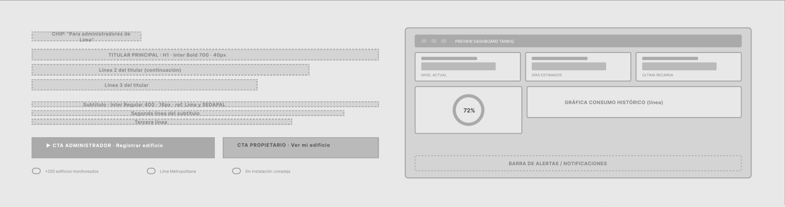

**Sección Problema:** Tres columnas que presentan los principales problemas que enfrentan los administradores de edificios en Lima con el suministro de agua de SEDAPAL.

**Sección ¿Cómo funciona?:** Secuencia de tres pasos numerados que explica el funcionamiento de TankIQ, desde la instalación del sensor hasta la recepción de alertas.

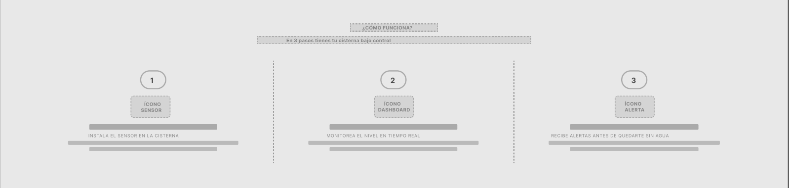

**Sección Beneficios por segmento:** Dos columnas diferenciadas, una para administradores de edificios y otra para propietarios e inquilinos, cada una con su respectivo call to action.

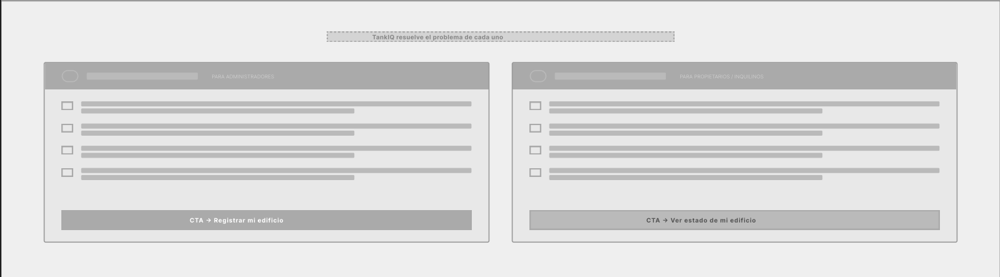

**Sección ¿Cuánto puedes ahorrar?:** Bloque con tres métricas clave basadas en datos reales del mercado limeño y un call to action de conversión central.

**Sección Planes:** Dos tarjetas de suscripción (plan básico y plan premium) con sus características y botones de contratación diferenciados.

**Footer:** Logotipo, descripción de HydroTeam, enlaces de navegación, sección legal con términos y condiciones, y datos de contacto.

**Mobile:**

**Sección Hero:**

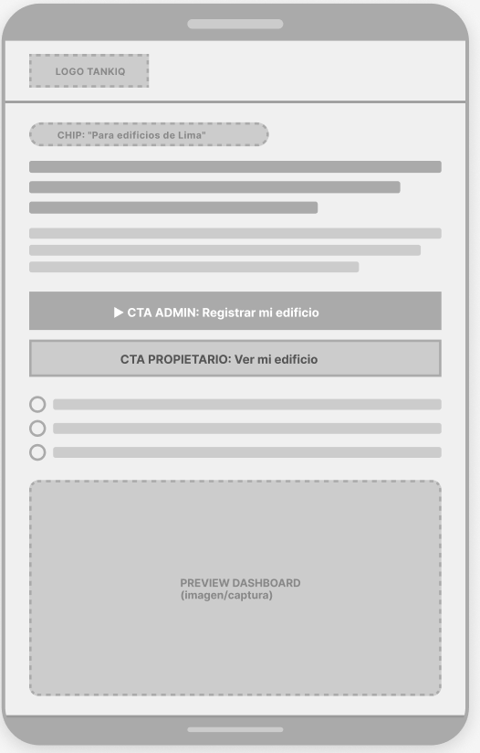

**Sección Problema:**

**Sección ¿Cómo funciona?:**

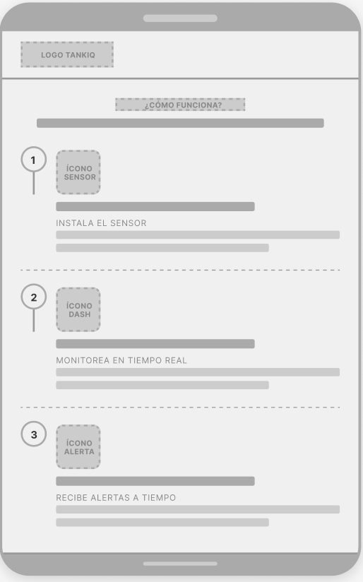

**Sección Beneficios por segmento:**

**Sección ¿Cuánto puedes ahorrar?:**

**Sección Planes:**

**Footer:**

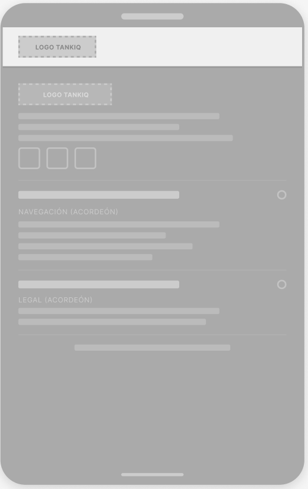

### 4.3.2. Landing Page Mock-up

En esta sección se presenta el diseño de alta fidelidad del Landing Page de TankIQ con el Design System completo aplicado: paleta de colores institucional con celeste principal `#29ABE2`, tipografía Inter en sus variantes de peso, espaciado en múltiplos de 8px y componentes de Angular Material con el tema personalizado de HydroTeam. La experiencia visual es consistente con la Web Application, de modo que el usuario que llegue a la aplicación desde el Landing Page reconozca de inmediato la misma identidad visual.

**Desktop:**

**Sección Hero:** Titular principal en Inter Bold 700, subtítulo en Gris Medio `#5A5A5A`, botón primario celeste para administradores y botón secundario con borde celeste para propietarios. Fondo con degradado hacia `#e8f6fc` y preview funcional del dashboard.

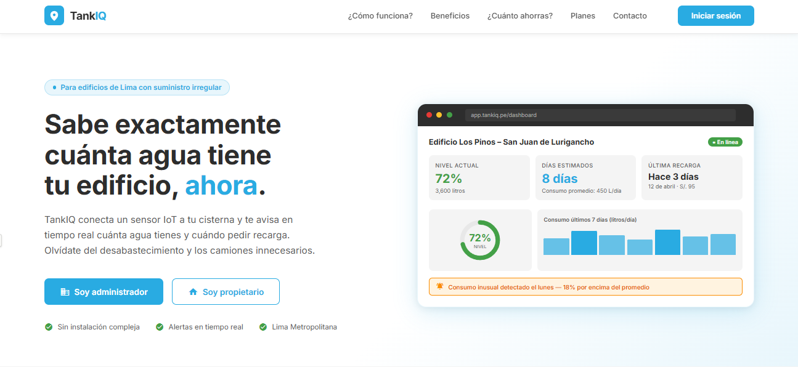

**Sección Problema:** Tarjetas con fondo Gris Claro `#F4F4F4`, borde izquierdo celeste de 4px como acento visual, íconos de Material Icons en celeste y texto en Gris Oscuro `#2D2D2D`.

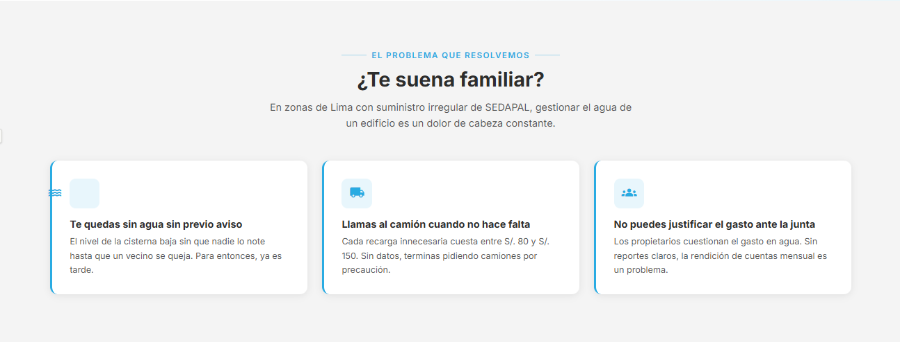

**Sección ¿Cómo funciona?:** Burbujas numeradas con fondo celeste y sombra `rgba(41,171,226,.35)`. Iconos de pasos en cuadros con fondo `#e8f6fc`. Conectados por una línea degradada horizontal en desktop.

**Sección Beneficios por segmento:** Encabezado oscuro `#2D2D2D` con ícono celeste para la columna de administradores; encabezado celeste `#29ABE2` para la columna de propietarios. Ítems con ícono `check_circle` en Verde Estado `#43A047`.

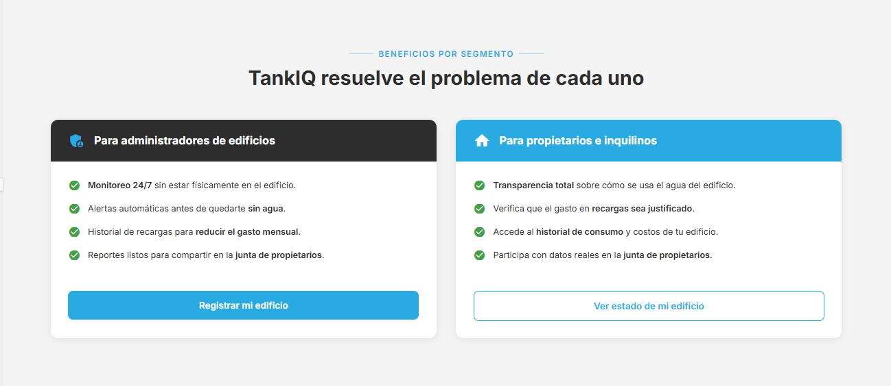

**Sección ¿Cuánto puedes ahorrar?:** Fondo oscuro `#2D2D2D` con degradado. Métricas en tarjetas con borde sutil. La tarjeta de ahorro máximo lleva borde celeste y texto en `#29ABE2` para destacarla.

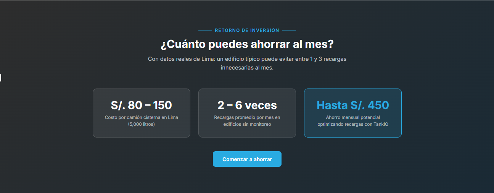

**Sección Planes:** Tarjetas con borde estándar para el plan básico y borde celeste de 2px con sombra `rgba(41,171,226,.18)` para el plan premium. Badge "Más elegido" con fondo celeste sobre el plan recomendado.

**Footer:** Fondo Gris Oscuro `#2D2D2D`, texto en `rgba(255,255,255,.5)`, logo con variante blanca, íconos de redes sociales con borde sutil y enlaces en hover celeste.

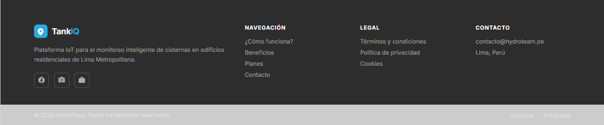

**Mobile:**

**Sección Hero:**

**Sección Problema:**

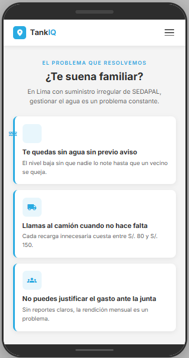

**Sección ¿Cómo funciona?:**

**Sección Beneficios por segmento:**

**Sección ¿Cuánto puedes ahorrar?:**

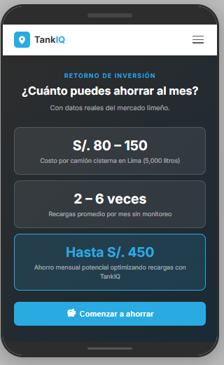

**Sección Planes:**

**Footer:**

## 4.4. Web Applications UX/UI Design

### 4.4.1. Web Applications Wireframes

Los wireframes representan la estructura y distribución de los elementos de la Web Application de TankIQ en baja fidelidad, sin aplicación de color ni tipografía definitiva. Su propósito es validar la arquitectura de información, la jerarquía de contenido y la navegación antes del diseño de alta fidelidad. La aplicación incluye nueve pantallas principales organizadas bajo un layout con sidebar de 240px para el segmento administrador, y un topbar simplificado para el segmento propietario/inquilino.

**Pantalla 01: Inicio de sesión**

**Pantalla 02: Registro de administrador**

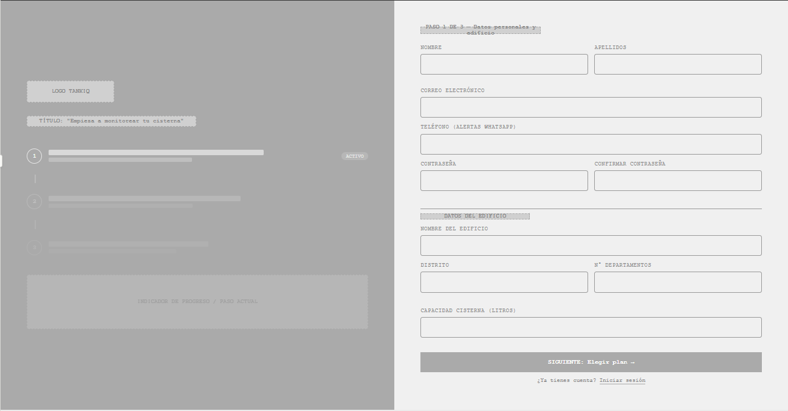

**Pantalla 03: Dashboard administrador**

**Pantalla 04: Alertas**

**Pantalla 05: Perfil del administrador**

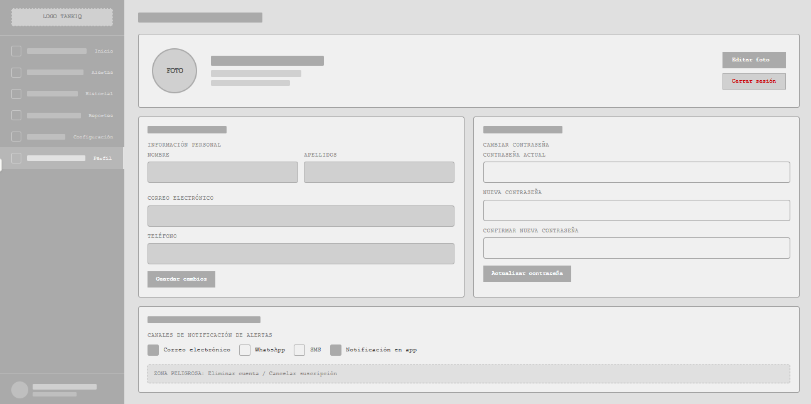

**Pantalla 06: Reportes para junta de propietarios**

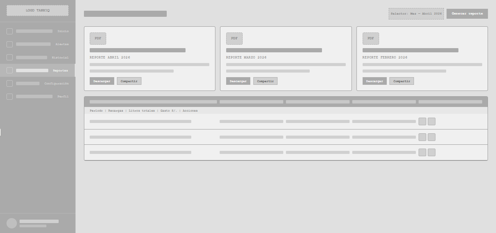

**Pantalla 07: Historial de recargas y consumo**

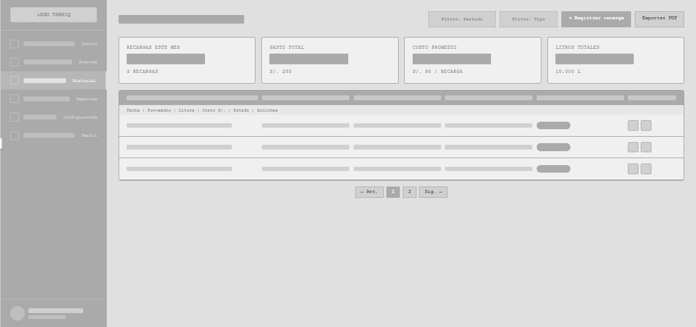

**Pantalla 08: Configuración de edificio y alertas**

**Pantalla 09: Vista de solo lectura (propietario / inquilino)**

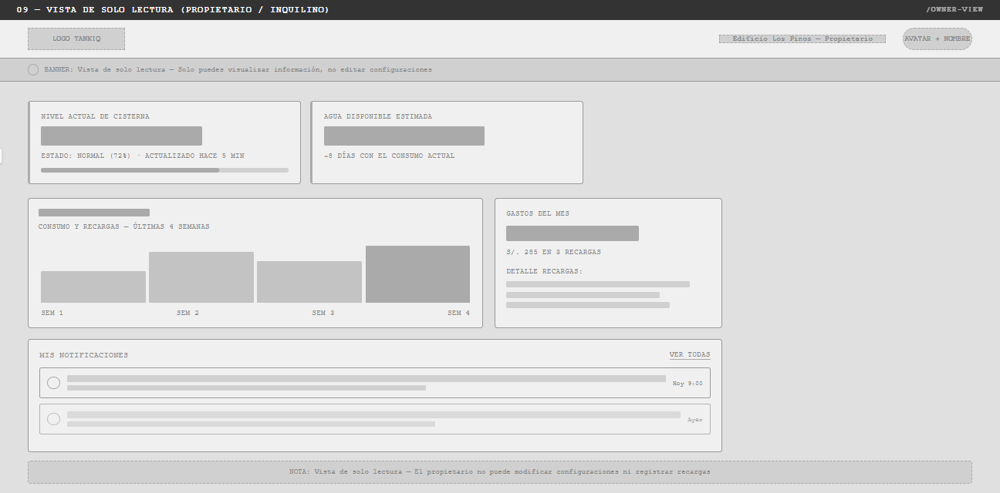

---

### 4.4.2. Web Applications Wireflow Diagrams

Los Wireflow Diagrams muestran la secuencia de pantallas que recorre el usuario para cumplir cada User Goal, conectadas mediante flechas que indican la dirección del flujo. Se presentan diez User Goals, seis correspondientes al segmento administrador y cuatro al segmento propietario/inquilino.

**Segmento: Administrador de edificio**

***User Goal 1:*** Como administrador del edificio, quiero visualizar el nivel actual de agua de la cisterna en tiempo real, para conocer cuánta agua disponible hay en cada momento y tomar decisiones oportunas.

*Descripción:* El administrador inicia sesión desde la Pantalla 01 (Login), ingresa sus credenciales y es redirigido directamente a la Pantalla 03 (Dashboard), donde visualiza el nivel actual en el indicador circular, las tres tarjetas de estado y el gráfico de consumo diario actualizado en tiempo real.

***User Goal 2:*** Como administrador del edificio, quiero recibir alertas cuando el nivel de la cisterna sea crítico, para evitar quedarme sin agua y actuar antes de que ocurra un desabastecimiento.

*Descripción:* Cuando el sensor detecta que el nivel bajó del umbral crítico configurado, aparece un badge de notificación en el ícono de campana del navbar. El administrador hace clic en el badge desde cualquier pantalla y es dirigido a la Pantalla 04 (Alertas), donde ve la alerta crítica destacada en rojo con su descripción y botón "Resolver".

***User Goal 3:*** Como administrador del edificio, quiero visualizar una estimación de los días restantes de agua, para anticipar cuándo será necesario solicitar una recarga.

*Descripción:* Desde la Pantalla 03 (Dashboard), el administrador observa la tarjeta "Días de agua estimados" con la proyección calculada en base al consumo histórico. Para mayor detalle, navega a la Pantalla 07 (Historial), donde puede revisar el consumo diario de los últimos periodos y validar la estimación.

***User Goal 4:*** Como administrador del edificio, quiero contar con información clara sobre consumo y nivel actual, para decidir el momento adecuado para solicitar una recarga y evitar gastos innecesarios.

*Descripción:* El administrador consulta el Dashboard (Pantalla 03) para ver el nivel actual y los días estimados. Luego navega al Historial (Pantalla 07) para revisar el consumo de las últimas semanas y comparar con meses anteriores. Con esa información decide si solicitar o posponer la recarga.

***User Goal 5:*** Como administrador del edificio, quiero registrar cada recarga de agua realizada, para mantener un historial actualizado del consumo y abastecimiento.

*Descripción:* Desde el Dashboard (Pantalla 03) o el Historial (Pantalla 07), el administrador hace clic en "+ Registrar recarga". Se abre un modal con campos de fecha, proveedor, litros y costo. Al confirmar, el nivel de la cisterna se actualiza en el indicador circular y el registro queda guardado en la Pantalla 07 (Historial).

***User Goal 6:*** Como administrador del edificio, quiero definir el porcentaje de nivel en el que se generan alertas, para adaptar las notificaciones a las necesidades específicas del edificio.

*Descripción:* El administrador navega a la Pantalla 08 (Configuración) desde el sidebar. En la sección "Alertas" ajusta los sliders de "Alerta nivel bajo" y "Alerta nivel crítico" a los porcentajes deseados y presiona "Guardar cambios". Las alertas de la Pantalla 04 se dispararán a partir de ese momento con los nuevos umbrales.

**Segmento: Propietario / Inquilino**

***User Goal 7:*** Como propietario o inquilino, quiero consultar el estado actual del nivel de agua de la cisterna, para saber si el edificio cuenta con suministro suficiente.

*Descripción:* El propietario accede desde el Landing Page haciendo clic en "Soy propietario" o desde el Login usando el código de edificio (Pantalla 01). Es redirigido directamente a la Pantalla 09 (Vista propietario), donde visualiza el nivel actual y los días de agua estimados en modo solo lectura.

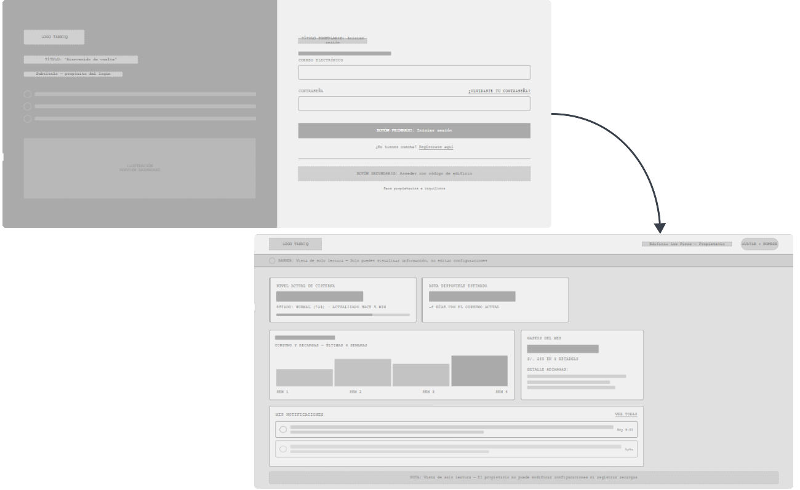

***User Goal 8:*** Como propietario o inquilino, quiero visualizar el consumo histórico de agua del edificio, para entender cómo se está utilizando el recurso a lo largo del tiempo.

*Descripción:* Desde la Pantalla 09 (Vista propietario), el propietario observa el gráfico de consumo de las últimas 4 semanas. Puede cambiar el período del gráfico seleccionando entre semanas o meses para ver la evolución histórica del consumo.

***User Goal 9:*** Como propietario o inquilino, quiero revisar los gastos asociados a las recargas de agua, para comprender en qué se está invirtiendo el dinero del mantenimiento.

*Descripción:* En la Pantalla 09 (Vista propietario), el propietario consulta la tarjeta de "Gastos del mes" con el desglose de recargas, proveedor y costo de cada una. Esta información le permite verificar que los cobros en la cuota de mantenimiento son coherentes con el uso real registrado.

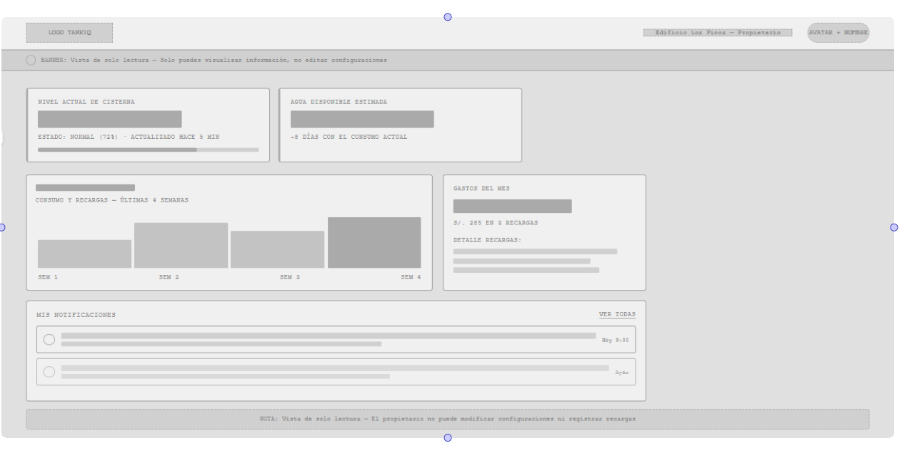

***User Goal 10:*** Como propietario o inquilino, quiero recibir notificaciones sobre eventos relevantes del suministro de agua, para estar informado ante posibles problemas o cortes.

*Descripción:* Cuando ocurre un evento relevante (nivel crítico, recarga realizada, consumo anómalo), el propietario recibe una notificación visible en el badge de la campana en la Pantalla 09. Al hacer clic, ve la lista de sus notificaciones personales con la descripción del evento y la fecha.

---

### 4.4.3. Web Applications Mock-ups

Los mock-ups aplican el Design System completo de TankIQ sobre la estructura definida en los wireframes. El sidebar usa el Gris Oscuro `#2D2D2D` con ítem activo resaltado en celeste `#29ABE2` y borde derecho de 3px. Las tarjetas de estado llevan borde izquierdo de color según el indicador de estado. Los botones primarios tienen fondo celeste con border radius de 8px. Los indicadores circulares SVG cambian de color según el nivel: verde `#43A047` (óptimo), celeste `#29ABE2` (normal), naranja `#FB8C00` (bajo), rojo `#E53935` (crítico).

**Pantalla 01: Inicio de sesión**

**Pantalla 02: Registro de administrador**

**Pantalla 03: Dashboard administrador**

**Pantalla 04: Alertas**

**Pantalla 05: Perfil del administrador**

**Pantalla 06: Reportes para junta de propietarios**

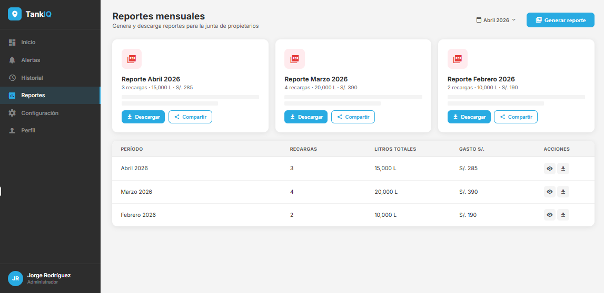

**Pantalla 07: Historial de recargas y consumo**

**Pantalla 08: Configuración de edificio y alertas**

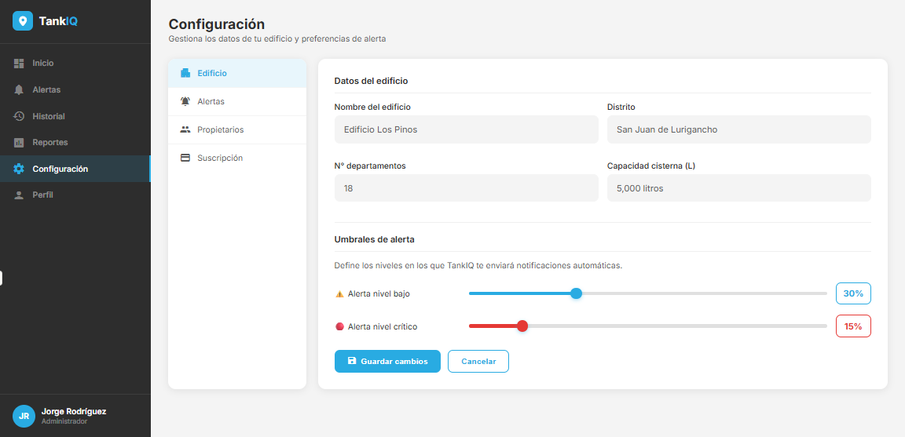

**Pantalla 09: Vista de solo lectura (propietario / inquilino)**

### 4.4.4. Web Applications Wireflow Diagrams

Los Wireflow Diagrams muestran la secuencia de pantallas que recorre el usuario para cumplir cada User Goal, conectadas mediante flechas que indican la dirección del flujo. Se presentan diez User Goals, seis correspondientes al segmento administrador y cuatro al segmento propietario/inquilino.

**Segmento: Administrador de edificio**

***User Goal 1:*** Como administrador del edificio, quiero visualizar el nivel actual de agua de la cisterna en tiempo real, para conocer cuánta agua disponible hay en cada momento y tomar decisiones oportunas.

*Descripción:* El administrador inicia sesión desde la Pantalla 01 (Login), ingresa sus credenciales y es redirigido directamente a la Pantalla 03 (Dashboard), donde visualiza el nivel actual en el indicador circular, las tres tarjetas de estado y el gráfico de consumo diario actualizado en tiempo real.

***User Goal 2:*** Como administrador del edificio, quiero recibir alertas cuando el nivel de la cisterna sea crítico, para evitar quedarme sin agua y actuar antes de que ocurra un desabastecimiento.

*Descripción:* Cuando el sensor detecta que el nivel bajó del umbral crítico configurado, aparece un badge de notificación en el ícono de campana del navbar. El administrador hace clic en el badge desde cualquier pantalla y es dirigido a la Pantalla 04 (Alertas), donde ve la alerta crítica destacada en rojo con su descripción y botón "Resolver".

***User Goal 3:*** Como administrador del edificio, quiero visualizar una estimación de los días restantes de agua, para anticipar cuándo será necesario solicitar una recarga.

*Descripción:* Desde la Pantalla 03 (Dashboard), el administrador observa la tarjeta "Días de agua estimados" con la proyección calculada en base al consumo histórico. Para mayor detalle, navega a la Pantalla 07 (Historial), donde puede revisar el consumo diario de los últimos periodos y validar la estimación.

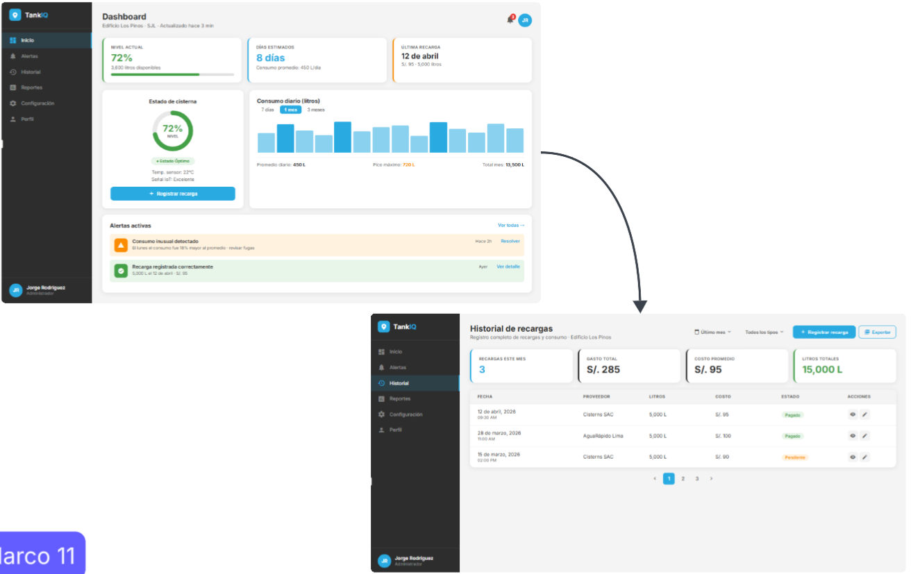

***User Goal 4:*** Como administrador del edificio, quiero contar con información clara sobre consumo y nivel actual, para decidir el momento adecuado para solicitar una recarga y evitar gastos innecesarios.

*Descripción:* El administrador consulta el Dashboard (Pantalla 03) para ver el nivel actual y los días estimados. Luego navega al Historial (Pantalla 07) para revisar el consumo de las últimas semanas y comparar con meses anteriores. Con esa información decide si solicitar o posponer la recarga.

***User Goal 5:*** Como administrador del edificio, quiero registrar cada recarga de agua realizada, para mantener un historial actualizado del consumo y abastecimiento.

*Descripción:* Desde el Dashboard (Pantalla 03) o el Historial (Pantalla 07), el administrador hace clic en "+ Registrar recarga". Se abre un modal con campos de fecha, proveedor, litros y costo. Al confirmar, el nivel de la cisterna se actualiza en el indicador circular y el registro queda guardado en la Pantalla 07 (Historial).

***User Goal 6:*** Como administrador del edificio, quiero definir el porcentaje de nivel en el que se generan alertas, para adaptar las notificaciones a las necesidades específicas del edificio.

*Descripción:* El administrador navega a la Pantalla 08 (Configuración) desde el sidebar. En la sección "Alertas" ajusta los sliders de "Alerta nivel bajo" y "Alerta nivel crítico" a los porcentajes deseados y presiona "Guardar cambios". Las alertas de la Pantalla 04 se dispararán a partir de ese momento con los nuevos umbrales.

**Segmento: Propietario / Inquilino**

***User Goal 7:*** Como propietario o inquilino, quiero consultar el estado actual del nivel de agua de la cisterna, para saber si el edificio cuenta con suministro suficiente.

*Descripción:* El propietario accede desde el Landing Page haciendo clic en "Soy propietario" o desde el Login usando el código de edificio (Pantalla 01). Es redirigido directamente a la Pantalla 09 (Vista propietario), donde visualiza el nivel actual y los días de agua estimados en modo solo lectura.

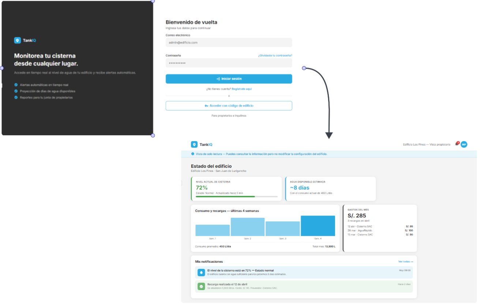

***User Goal 8:*** Como propietario o inquilino, quiero visualizar el consumo histórico de agua del edificio, para entender cómo se está utilizando el recurso a lo largo del tiempo.

*Descripción:* Desde la Pantalla 09 (Vista propietario), el propietario observa el gráfico de consumo de las últimas 4 semanas. Puede cambiar el período del gráfico seleccionando entre semanas o meses para ver la evolución histórica del consumo.

***User Goal 9:*** Como propietario o inquilino, quiero revisar los gastos asociados a las recargas de agua, para comprender en qué se está invirtiendo el dinero del mantenimiento.

*Descripción:* En la Pantalla 09 (Vista propietario), el propietario consulta la tarjeta de "Gastos del mes" con el desglose de recargas, proveedor y costo de cada una. Esta información le permite verificar que los cobros en la cuota de mantenimiento son coherentes con el uso real registrado.

***User Goal 10:*** Como propietario o inquilino, quiero recibir notificaciones sobre eventos relevantes del suministro de agua, para estar informado ante posibles problemas o cortes.

*Descripción:* Cuando ocurre un evento relevante (nivel crítico, recarga realizada, consumo anómalo), el propietario recibe una notificación visible en el badge de la campana en la Pantalla 09. Al hacer clic, ve la lista de sus notificaciones personales con la descripción del evento y la fecha.

## 4.5. Web Applications Prototyping.

## 4.6. Domain-Driven Software Architecture.

Para modelar la arquitectura de TankIQ se aplicó Domain-Driven Design, partiendo de los resultados del Big Picture Event Storming para identificar Bounded Contexts, aggregates, eventos y comandos. A partir de ese modelo se derivaron los diagramas de arquitectura utilizando el C4 Model.

### 4.6.1. Design-Level EventStorming.

El equipo realizó una sesión de Design-Level Event Storming de 90 minutos para refinar el modelo de dominio de TankIQ. 
Se identificaron Domain Events, Commands, Aggregates, Policies, Read Models, External Systems y Actors. Se modelaron 
seis flujos: monitoreo, gestión de recargas, generación de reportes, alertas, suscripción, sensor, y Identity & Access Management.

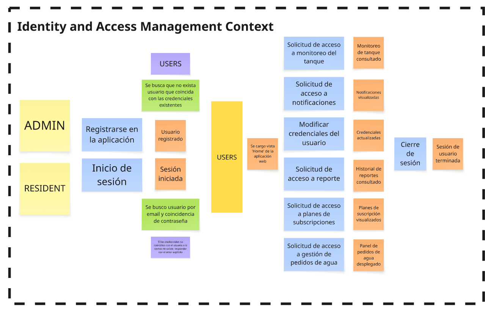

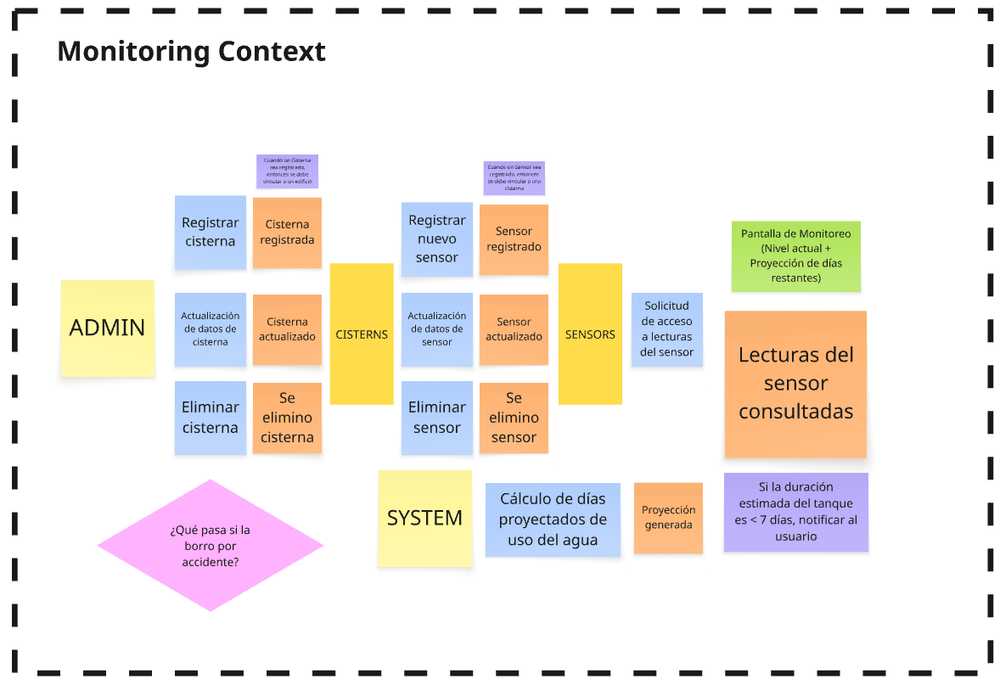

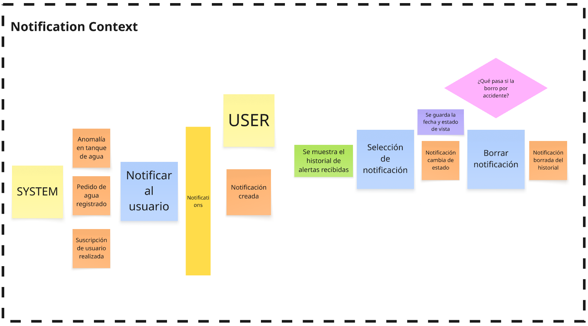

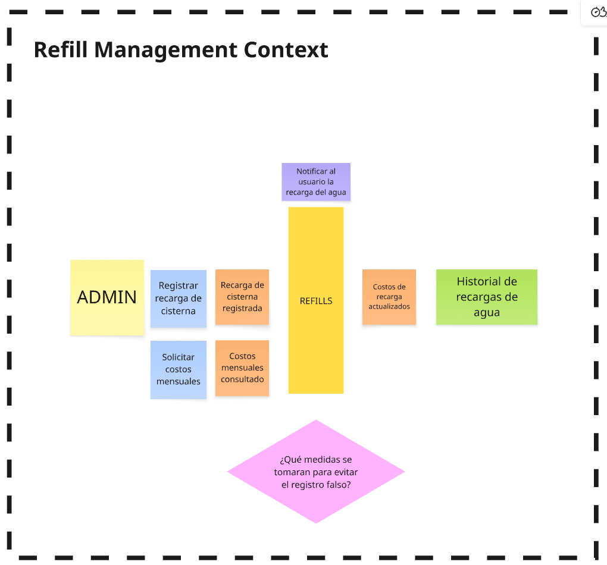

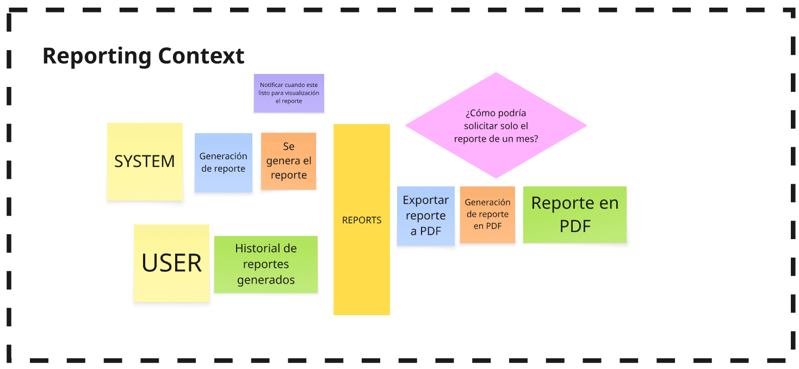

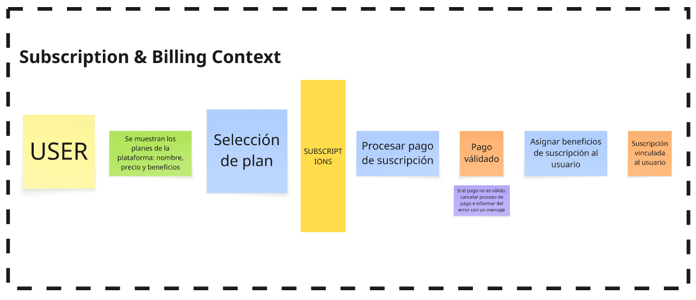

### 4.6.2. Software Architecture Context Diagram.

El Context Diagram muestra a TankIQ como sistema central rodeado por sus actores y sistemas externos, correspondiendo al nivel 1 del C4 Model. Los actores son el Administrador de Edificio y el Propietario / Inquilino. Los sistemas externos son el Sensor IoT Ultrasónico (simula lecturas vía HTTP en el contexto académico) y el Servicio de Correo SendGrid / SMTP (envío de alertas automáticas ante niveles críticos).

  

### 4.6.3. Software Architecture Container Diagrams.

El Container Diagram corresponde al nivel 2 del C4 Model y muestra los contenedores de TankIQ con sus tecnologías y comunicaciones. Los contenedores son: Landing Page (HTML/CSS/JS estático), Web Application (Angular SPA, comunica con la API vía HTTPS/JSON), RESTful API (Spring Boot, implementa todos los Bounded Contexts), Base de Datos, IoT Simulator (envía lecturas HTTP al API) y SendGrid / SMTP (sistema externo para notificaciones por correo).

  

### 4.6.4. Software Architecture Components Diagrams.

Los Component Diagrams corresponden al nivel 3 del C4 Model y descomponen los dos contenedores con lógica interna compleja. Los demás contenedores (Landing Page, IoT Simulator y base de datos) no presentan componentes que ameriten este nivel de detalle.

**Componentes del RESTful API (Spring Boot)**

El API se organiza en seis componentes por Bounded Context: IAM Component (AuthController, UserService, JwtTokenProvider), Monitoring Component (TankController, TankService, AlertThresholdEvaluator), Refill Management Component** (RefillController, RefillService), Reporting Component (ReportController, ReportService), Subscription Component (SubscriptionController, SubscriptionService) y Notification Component (NotificationService, EmailGateway). Todos persisten datos en MySQL vía JPA/Hibernate.

  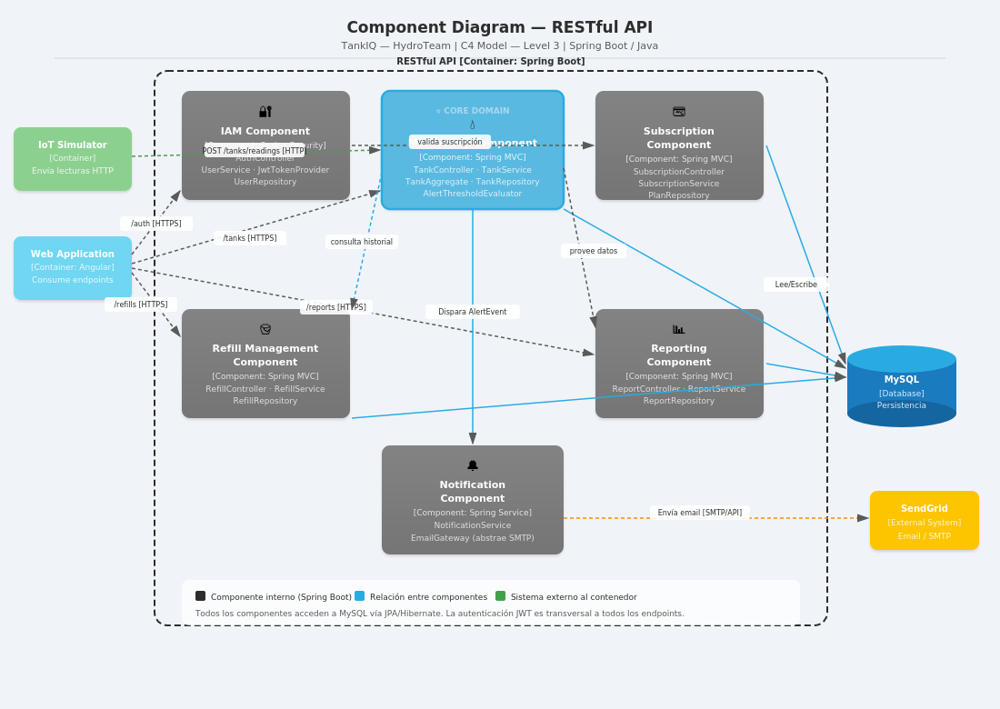

**Componentes de la Web Application (Angular)**

La Web Application se organiza en cinco módulos lazy-loaded: Auth Module (LoginComponent, AuthService, AuthGuard), Dashboard Module (TankStatusCardComponent, DaysProjectionComponent, AlertBannerComponent), Refill Module** (RefillListComponent, RefillFormComponent), Reports Module** (ReportGeneratorComponent) y Settings Module (AlertThresholdComponent). El Shared Module provee componentes transversales: NavbarComponent, SidebarComponent, interceptor HTTP para JWT y servicio i18n.

  

## 4.7. Software Object-Oriented Design.

El diseño orientado a objetos de TankIQ se deriva directamente de los Bounded Contexts identificados en el proceso de DDD. El diagrama de clase presentado a continuación describen las entidades, interfaces, enumeraciones y relaciones de cada contexto del dominio, con el nivel de detalle necesario para guiar la implementación en Spring Boot.

### 4.7.1. Class Diagrams.

El Class Diagram de TankIQ está organizado por Bounded Context e incluye clases, interfaces, enumeraciones, atributos con scope y tipo, métodos con parámetros y tipo de retorno, y relaciones con nombre, dirección y multiplicidad. 

```plantuml
@startuml

scale 1/4

title Diagrama de Clases por Bounded Contexts

skinparam monochrome false
skinparam shadowing true
skinparam linetype ortho
skinparam class {
    BackgroundColor<<AggregateRoot>> #EBF5FB
    BackgroundColor<<Entity>> #FFFFFF
    BackgroundColor<<ValueObject>> #F9EBEA
    BackgroundColor<<Repository>> #E8F8F5
    BorderColor #2C3E50
}

' ==========================================================
' 1. IDENTITY & ACCESS MANAGEMENT CONTEXT
' ==========================================================
package "Identity & Access Management Context" {
    class User <<AggregateRoot>> {
        + id: UUID
        + name: String
        + email: String
        + passwordHash: String
        + phoneNumber: String
        + createdAt: DateTime
    }

    class UserBuilding <<Entity>> {
        + userId: UUID
        + buildingId: UUID
        + role: UserRole
        + apartmentNumber: String
    }

    enum UserRole {
        ADMIN
        RESIDENT
    }

    interface IUserRepository <<Repository>> {
        + findById(id: UUID): User
        + findByEmail(email: String): User
        + save(user: User): void
    }
    
    User "1" --{ UserBuilding
    UserBuilding ..> UserRole
    ' Conexión de Dependencia del Repositorio al Agregado
    IUserRepository ..> User : "manages"
}

' ==========================================================
' 2. MONITORING CONTEXT
' ==========================================================
package "Monitoring Context" {
    class Building <<AggregateRoot>> {
        + id: UUID
        + name: String
        + address: String
        + district: String
    }

    class Cistern <<Entity>> {
        + id: UUID
        + capacityLiters: Double
        + currentLevelPercent: Double
        + buildingId: UUID
    }

    class Sensor <<Entity>> {
        + id: UUID
        + hardwareId: String
        + type: SensorType
        + status: SensorStatus
        + cisternId: UUID
    }

    class WaterLevelReading <<Entity>> {
        + id: UUID
        + levelPercent: Double
        + volumeLiters: Double
        + recordedAt: DateTime
        + sensorId: UUID
    }

    enum SensorType {
        ULTRASONIC
        PRESSURE
    }

    enum SensorStatus {
        ACTIVE
        MAINTENANCE
        OFFLINE
    }

    interface IBuildingRepository <<Repository>> {
        + findById(id: UUID): Building
        + save(building: Building): void
    }

    Building "1" --{ Cistern
    Cistern "1" --{ Sensor
    Sensor "1" --{ WaterLevelReading
    Sensor ..> SensorType
    Sensor ..> SensorStatus
    
    ' Conexión de Dependencia del Repositorio al Agregado
    IBuildingRepository ..> Building : "manages"
}

' ==========================================================
' 3. REFILL MANAGEMENT CONTEXT
' ==========================================================
package "Refill Management Context" {
    class Refill <<AggregateRoot>> {
        + id: UUID
        + refillDate: DateTime
        + liters: Double
        + costSoles: Double
        + supplierName: String
        + invoiceNumber: String
        + buildingId: UUID
        + registeredByUserId: UUID
    }

    interface IRefillRepository <<Repository>> {
        + findByBuildingId(buildingId: UUID): List<Refill>
        + save(refill: Refill): void
    }

    ' Conexión de Dependencia del Repositorio al Agregado
    IRefillRepository ..> Refill : "manages"
}

' ==========================================================
' 4. NOTIFICATION CONTEXT
' ==========================================================
package "Notification Context" {
    class Alert <<AggregateRoot>> {
        + id: UUID
        + type: AlertType
        + message: String
        + status: AlertStatus
        + cisternId: UUID
    }

    enum AlertType {
        CRITICAL_LOW
        SENSOR_OFFLINE
        HIGH_USAGE
    }

    enum AlertStatus {
        PENDING
        IN_PROGRESS
        RESOLVED
    }

    interface IAlertRepository <<Repository>> {
        + findActiveByCisternId(cisternId: UUID): List<Alert>
        + save(alert: Alert): void
    }

    Alert ..> AlertType
    Alert ..> AlertStatus
    ' Conexión de Dependencia del Repositorio al Agregado
    IAlertRepository ..> Alert : "manages"
}

' ==========================================================
' 5. REPORTING CONTEXT
' ==========================================================
package "Reporting Context" {
    class WaterConsumption <<Entity>> {
        + id: UUID
        + period: Period
        + avgDailyLiters: Double
        + totalPeriodLiters: Double
        + buildingId: UUID
    }

    class Report <<AggregateRoot>> {
        + id: UUID
        + periodMonth: Integer
        + periodYear: Integer
        + totalCostSoles: Double
        + totalWaterLiters: Double
        + buildingId: UUID
        + generatedByUserId: UUID
    }

    class Period <<ValueObject>> {
        + start: Date
        + end: Date
    }

    interface IReportRepository <<Repository>> {
        + findByBuildingId(buildingId: UUID): List<Report>
        + save(report: Report): void
    }

    WaterConsumption *--> Period
    ' Conexión de Dependencia del Repositorio al Agregado
    IReportRepository ..> Report : "manages"
}

' ==========================================================
' 6. SUBSCRIPTION & BILLING CONTEXT
' ==========================================================
package "Subscription & Billing Context" {
    class Plan <<AggregateRoot>> {
        + id: UUID
        + name: PlanName
        + priceSoles: Double
        + maxSensors: Integer
    }

    class Subscription <<Entity>> {
        + id: UUID
        + startDate: Date
        + endDate: Date
        + status: SubscriptionStatus
        + buildingId: UUID
        + planId: UUID
    }

    enum PlanName {
        BASIC
        PREMIUM
    }

    enum SubscriptionStatus {
        ACTIVE
        EXPIRED
        CANCELLED
    }

    interface IPlanRepository <<Repository>> {
        + findByName(name: PlanName): Plan
    }

    Plan "1" --{ Subscription
    Plan ..> PlanName
    Subscription ..> SubscriptionStatus
    ' Conexión de Dependencia del Repositorio al Agregado
    IPlanRepository ..> Plan : "manages"
}

' --- RELACIONES INTER-CONTEXTOS (ENTIDADES) ---
User "1" --{ UserBuilding
Building "1" --{ UserBuilding
Building "1" --{ Refill
User "1" --{ Refill
Cistern "1" --{ Alert
Building "1" --{ WaterConsumption
Building "1" --{ Report
User "1" --{ Report
Building "1" --{ Subscription

@enduml
```

#### Diccionario de Clases

<table style="width: 100%; border-collapse: collapse; font-family: sans-serif; font-size: 13px; color: #333333; margin: 20px 0; border: 1px solid #dddddd;">
  <thead>
    <tr style="background-color: #f2f2f2; text-align: left; border-bottom: 2px solid #dddddd;">
      <th style="padding: 10px; border: 1px solid #dddddd; text-align: center; width: 5%;">N°</th>
      <th style="padding: 10px; border: 1px solid #dddddd; width: 12%;">Clase / Entidad</th>
      <th style="padding: 10px; border: 1px solid #dddddd; width: 15%;">Atributo</th>
      <th style="padding: 10px; border: 1px solid #dddddd; width: 25%;">Definición</th>
      <th style="padding: 10px; border: 1px solid #dddddd; width: 12%;">Tipo de Dato</th>
      <th style="padding: 10px; border: 1px solid #dddddd; text-align: center; width: 8%;">Rango</th>
      <th style="padding: 10px; border: 1px solid #dddddd; text-align: center; width: 8%;">Unidad</th>
      <th style="padding: 10px; border: 1px solid #dddddd; width: 15%;">Valores Restringidos / Reglas</th>
    </tr>
  </thead>
  <tbody>
    <tr style="border-bottom: 1px solid #dddddd;">
      <td style="padding: 10px; border: 1px solid #dddddd; text-align: center;">1</td>
      <td style="padding: 10px; border: 1px solid #dddddd; font-weight: bold;">User</td>
      <td style="padding: 10px; border: 1px solid #dddddd; font-family: monospace;">id</td>
      <td style="padding: 10px; border: 1px solid #dddddd;">Identificador único del usuario en la plataforma.</td>
      <td style="padding: 10px; border: 1px solid #dddddd;">UUID</td>
      <td style="padding: 10px; border: 1px solid #dddddd; text-align: center;">n/a</td>
      <td style="padding: 10px; border: 1px solid #dddddd; text-align: center;">n/a</td>
      <td style="padding: 10px; border: 1px solid #dddddd;">No nulo, único.</td>
    </tr>
    <tr style="border-bottom: 1px solid #dddddd;">
      <td style="padding: 10px; border: 1px solid #dddddd; text-align: center;">1</td>
      <td style="padding: 10px; border: 1px solid #dddddd;">User</td>
      <td style="padding: 10px; border: 1px solid #dddddd; font-family: monospace;">name</td>
      <td style="padding: 10px; border: 1px solid #dddddd;">Nombre y apellido completo del usuario.</td>
      <td style="padding: 10px; border: 1px solid #dddddd;">String</td>
      <td style="padding: 10px; border: 1px solid #dddddd; text-align: center;">n/a</td>
      <td style="padding: 10px; border: 1px solid #dddddd; text-align: center;">n/a</td>
      <td style="padding: 10px; border: 1px solid #dddddd;">No nulo, sin caracteres especiales.</td>
    </tr>
    <tr style="border-bottom: 1px solid #dddddd;">
      <td style="padding: 10px; border: 1px solid #dddddd; text-align: center;">1</td>
      <td style="padding: 10px; border: 1px solid #dddddd;">User</td>
      <td style="padding: 10px; border: 1px solid #dddddd; font-family: monospace;">email</td>
      <td style="padding: 10px; border: 1px solid #dddddd;">Correo electrónico para credenciales y autenticación.</td>
      <td style="padding: 10px; border: 1px solid #dddddd;">String</td>
      <td style="padding: 10px; border: 1px solid #dddddd; text-align: center;">n/a</td>
      <td style="padding: 10px; border: 1px solid #dddddd; text-align: center;">n/a</td>
      <td style="padding: 10px; border: 1px solid #dddddd;">Formato email válido, único.</td>
    </tr>
    <tr style="border-bottom: 1px solid #dddddd;">
      <td style="padding: 10px; border: 1px solid #dddddd; text-align: center;">1</td>
      <td style="padding: 10px; border: 1px solid #dddddd;">User</td>
      <td style="padding: 10px; border: 1px solid #dddddd; font-family: monospace;">passwordHash</td>
      <td style="padding: 10px; border: 1px solid #dddddd;">Contraseña de acceso encriptada (BCrypt).</td>
      <td style="padding: 10px; border: 1px solid #dddddd;">String</td>
      <td style="padding: 10px; border: 1px solid #dddddd; text-align: center;">n/a</td>
      <td style="padding: 10px; border: 1px solid #dddddd; text-align: center;">n/a</td>
      <td style="padding: 10px; border: 1px solid #dddddd;">Texto encriptado, no nulo.</td>
    </tr>
    <tr style="border-bottom: 1px solid #dddddd;">
      <td style="padding: 10px; border: 1px solid #dddddd; text-align: center;">1</td>
      <td style="padding: 10px; border: 1px solid #dddddd;">User</td>
      <td style="padding: 10px; border: 1px solid #dddddd; font-family: monospace;">phoneNumber</td>
      <td style="padding: 10px; border: 1px solid #dddddd;">Número telefónico móvil para contacto o alertas SMS.</td>
      <td style="padding: 10px; border: 1px solid #dddddd;">String</td>
      <td style="padding: 10px; border: 1px solid #dddddd; text-align: center;">n/a</td>
      <td style="padding: 10px; border: 1px solid #dddddd; text-align: center;">n/a</td>
      <td style="padding: 10px; border: 1px solid #dddddd;">Solo dígitos (9 caracteres).</td>
    </tr>
    <tr style="border-bottom: 1px solid #dddddd; background-color: #fafafa;">
      <td style="padding: 10px; border: 1px solid #dddddd; text-align: center;">2</td>
      <td style="padding: 10px; border: 1px solid #dddddd; font-weight: bold;">UserBuilding</td>
      <td style="padding: 10px; border: 1px solid #dddddd; font-family: monospace;">userId</td>
      <td style="padding: 10px; border: 1px solid #dddddd;">Clave foránea que referencia al usuario asociado.</td>
      <td style="padding: 10px; border: 1px solid #dddddd;">UUID</td>
      <td style="padding: 10px; border: 1px solid #dddddd; text-align: center;">n/a</td>
      <td style="padding: 10px; border: 1px solid #dddddd; text-align: center;">n/a</td>
      <td style="padding: 10px; border: 1px solid #dddddd;">No nulo. Clave compuesta.</td>
    </tr>
    <tr style="background-color: #fafafa;">
      <td style="padding: 10px; border: 1px solid #dddddd; text-align: center;">2</td>
      <td style="padding: 10px; border: 1px solid #dddddd;">UserBuilding</td>
      <td style="padding: 10px; border: 1px solid #dddddd; font-family: monospace;">buildingId</td>
      <td style="padding: 10px; border: 1px solid #dddddd;">Clave foránea que referencia al inmueble residencial.</td>
      <td style="padding: 10px; border: 1px solid #dddddd;">UUID</td>
      <td style="padding: 10px; border: 1px solid #dddddd; text-align: center;">n/a</td>
      <td style="padding: 10px; border: 1px solid #dddddd; text-align: center;">n/a</td>
      <td style="padding: 10px; border: 1px solid #dddddd;">No nulo. Clave compuesta.</td>
    </tr>
    <tr style="background-color: #fafafa;">
      <td style="padding: 10px; border: 1px solid #dddddd; text-align: center;">2</td>
      <td style="padding: 10px; border: 1px solid #dddddd;">UserBuilding</td>
      <td style="padding: 10px; border: 1px solid #dddddd; font-family: monospace;">role</td>
      <td style="padding: 10px; border: 1px solid #dddddd;">Rol asignado al usuario exclusivamente para este edificio.</td>
      <td style="padding: 10px; border: 1px solid #dddddd;">Enum</td>
      <td style="padding: 10px; border: 1px solid #dddddd; text-align: center;">n/a</td>
      <td style="padding: 10px; border: 1px solid #dddddd; text-align: center;">n/a</td>
      <td style="padding: 10px; border: 1px solid #dddddd;">ADMIN, RESIDENT</td>
    </tr>
    <tr style="border-bottom: 1px solid #dddddd; background-color: #fafafa;">
      <td style="padding: 10px; border: 1px solid #dddddd; text-align: center;">2</td>
      <td style="padding: 10px; border: 1px solid #dddddd;">UserBuilding</td>
      <td style="padding: 10px; border: 1px solid #dddddd; font-family: monospace;">apartmentNumber</td>
      <td style="padding: 10px; border: 1px solid #dddddd;">Número o código de departamento asignado.</td>
      <td style="padding: 10px; border: 1px solid #dddddd;">String</td>
      <td style="padding: 10px; border: 1px solid #dddddd; text-align: center;">n/a</td>
      <td style="padding: 10px; border: 1px solid #dddddd; text-align: center;">n/a</td>
      <td style="padding: 10px; border: 1px solid #dddddd;">Alfanumérico. Mandatorio si el rol es RESIDENT.</td>
    </tr>
    <tr style="border-bottom: 1px solid #dddddd;">
      <td style="padding: 10px; border: 1px solid #dddddd; text-align: center;">3</td>
      <td style="padding: 10px; border: 1px solid #dddddd; font-weight: bold;">Building</td>
      <td style="padding: 10px; border: 1px solid #dddddd; font-family: monospace;">id</td>
      <td style="padding: 10px; border: 1px solid #dddddd;">Identificador único del inmueble residencial.</td>
      <td style="padding: 10px; border: 1px solid #dddddd;">UUID</td>
      <td style="padding: 10px; border: 1px solid #dddddd; text-align: center;">n/a</td>
      <td style="padding: 10px; border: 1px solid #dddddd; text-align: center;">n/a</td>
      <td style="padding: 10px; border: 1px solid #dddddd;">No nulo, único.</td>
    </tr>
    <tr style="border-bottom: 1px solid #dddddd;">
      <td style="padding: 10px; border: 1px solid #dddddd; text-align: center;">3</td>
      <td style="padding: 10px; border: 1px solid #dddddd;">Building</td>
      <td style="padding: 10px; border: 1px solid #dddddd; font-family: monospace;">name</td>
      <td style="padding: 10px; border: 1px solid #dddddd;">Nombre o alias identificativo del condominio.</td>
      <td style="padding: 10px; border: 1px solid #dddddd;">String</td>
      <td style="padding: 10px; border: 1px solid #dddddd; text-align: center;">n/a</td>
      <td style="padding: 10px; border: 1px solid #dddddd; text-align: center;">n/a</td>
      <td style="padding: 10px; border: 1px solid #dddddd;">No nulo.</td>
    </tr>
    <tr style="border-bottom: 1px solid #dddddd;">
      <td style="padding: 10px; border: 1px solid #dddddd; text-align: center;">3</td>
      <td style="padding: 10px; border: 1px solid #dddddd;">Building</td>
      <td style="padding: 10px; border: 1px solid #dddddd; font-family: monospace;">address</td>
      <td style="padding: 10px; border: 1px solid #dddddd;">Dirección física completa del edificio.</td>
      <td style="padding: 10px; border: 1px solid #dddddd;">String</td>
      <td style="padding: 10px; border: 1px solid #dddddd; text-align: center;">n/a</td>
      <td style="padding: 10px; border: 1px solid #dddddd; text-align: center;">n/a</td>
      <td style="padding: 10px; border: 1px solid #dddddd;">No nulo.</td>
    </tr>
    <tr style="border-bottom: 1px solid #dddddd;">
      <td style="padding: 10px; border: 1px solid #dddddd; text-align: center;">3</td>
      <td style="padding: 10px; border: 1px solid #dddddd;">Building</td>
      <td style="padding: 10px; border: 1px solid #dddddd; font-family: monospace;">district</td>
      <td style="padding: 10px; border: 1px solid #dddddd;">Distrito donde se ubica el edificio.</td>
      <td style="padding: 10px; border: 1px solid #dddddd;">String</td>
      <td style="padding: 10px; border: 1px solid #dddddd; text-align: center;">n/a</td>
      <td style="padding: 10px; border: 1px solid #dddddd; text-align: center;">n/a</td>
      <td style="padding: 10px; border: 1px solid #dddddd;">Debe corresponder a un distrito válido de Lima.</td>
    </tr>
    <tr style="border-bottom: 1px solid #dddddd; background-color: #fafafa;">
      <td style="padding: 10px; border: 1px solid #dddddd; text-align: center;">4</td>
      <td style="padding: 10px; border: 1px solid #dddddd; font-weight: bold;">Cistern</td>
      <td style="padding: 10px; border: 1px solid #dddddd; font-family: monospace;">id</td>
      <td style="padding: 10px; border: 1px solid #dddddd;">Identificador único de la cisterna física.</td>
      <td style="padding: 10px; border: 1px solid #dddddd;">UUID</td>
      <td style="padding: 10px; border: 1px solid #dddddd; text-align: center;">n/a</td>
      <td style="padding: 10px; border: 1px solid #dddddd; text-align: center;">n/a</td>
      <td style="padding: 10px; border: 1px solid #dddddd;">No nulo, único.</td>
    </tr>
    <tr style="background-color: #fafafa;">
      <td style="padding: 10px; border: 1px solid #dddddd; text-align: center;">4</td>
      <td style="padding: 10px; border: 1px solid #dddddd;">Cistern</td>
      <td style="padding: 10px; border: 1px solid #dddddd; font-family: monospace;">capacityLiters</td>
      <td style="padding: 10px; border: 1px solid #dddddd;">Capacidad máxima total de almacenamiento de agua.</td>
      <td style="padding: 10px; border: 1px solid #dddddd;">Double</td>
      <td style="padding: 10px; border: 1px solid #dddddd; text-align: center;">500 - 100000</td>
      <td style="padding: 10px; border: 1px solid #dddddd; text-align: center;">Litros</td>
      <td style="padding: 10px; border: 1px solid #dddddd;">Estrictamente positivo, mayor a cero.</td>
    </tr>
    <tr style="background-color: #fafafa;">
      <td style="padding: 10px; border: 1px solid #dddddd; text-align: center;">4</td>
      <td style="padding: 10px; border: 1px solid #dddddd;">Cistern</td>
      <td style="padding: 10px; border: 1px solid #dddddd; font-family: monospace;">currentLevelPercent</td>
      <td style="padding: 10px; border: 1px solid #dddddd;">Nivel de llenado actual expresado en porcentaje.</td>
      <td style="padding: 10px; border: 1px solid #dddddd;">Double</td>
      <td style="padding: 10px; border: 1px solid #dddddd; text-align: center;">0.0 - 100.0</td>
      <td style="padding: 10px; border: 1px solid #dddddd; text-align: center;">%</td>
      <td style="padding: 10px; border: 1px solid #dddddd;">No puede salir del rango 0-100.</td>
    </tr>
    <tr style="border-bottom: 1px solid #dddddd; background-color: #fafafa;">
      <td style="padding: 10px; border: 1px solid #dddddd; text-align: center;">4</td>
      <td style="padding: 10px; border: 1px solid #dddddd;">Cistern</td>
      <td style="padding: 10px; border: 1px solid #dddddd; font-family: monospace;">alertThresholdPercent</td>
      <td style="padding: 10px; border: 1px solid #dddddd;">Límite mínimo para disparar alertas de desabastecimiento.</td>
      <td style="padding: 10px; border: 1px solid #dddddd;">Double</td>
      <td style="padding: 10px; border: 1px solid #dddddd; text-align: center;">10.0 - 40.0</td>
      <td style="padding: 10px; border: 1px solid #dddddd; text-align: center;">%</td>
      <td style="padding: 10px; border: 1px solid #dddddd;">Valor por defecto establecido en 20.0%.</td>
    </tr>
    <tr style="border-bottom: 1px solid #dddddd;">
      <td style="padding: 10px; border: 1px solid #dddddd; text-align: center;">5</td>
      <td style="padding: 10px; border: 1px solid #dddddd; font-weight: bold;">Sensor</td>
      <td style="padding: 10px; border: 1px solid #dddddd; font-family: monospace;">id</td>
      <td style="padding: 10px; border: 1px solid #dddddd;">Identificador lógico único del sensor en el sistema.</td>
      <td style="padding: 10px; border: 1px solid #dddddd;">UUID</td>
      <td style="padding: 10px; border: 1px solid #dddddd; text-align: center;">n/a</td>
      <td style="padding: 10px; border: 1px solid #dddddd; text-align: center;">n/a</td>
      <td style="padding: 10px; border: 1px solid #dddddd;">No nulo, único.</td>
    </tr>
    <tr style="border-bottom: 1px solid #dddddd;">
      <td style="padding: 10px; border: 1px solid #dddddd; text-align: center;">5</td>
      <td style="padding: 10px; border: 1px solid #dddddd;">Sensor</td>
      <td style="padding: 10px; border: 1px solid #dddddd; font-family: monospace;">hardwareId</td>
      <td style="padding: 10px; border: 1px solid #dddddd;">Identificador físico de fábrica del dispositivo IoT (MAC o Serial).</td>
      <td style="padding: 10px; border: 1px solid #dddddd;">String</td>
      <td style="padding: 10px; border: 1px solid #dddddd; text-align: center;">n/a</td>
      <td style="padding: 10px; border: 1px solid #dddddd; text-align: center;">n/a</td>
      <td style="padding: 10px; border: 1px solid #dddddd;">Único a nivel global en hardware. No nulo.</td>
    </tr>
    <tr style="border-bottom: 1px solid #dddddd;">
      <td style="padding: 10px; border: 1px solid #dddddd; text-align: center;">5</td>
      <td style="padding: 10px; border: 1px solid #dddddd;">Sensor</td>
      <td style="padding: 10px; border: 1px solid #dddddd; font-family: monospace;">type</td>
      <td style="padding: 10px; border: 1px solid #dddddd;">Tecnología física empleada para la medición.</td>
      <td style="padding: 10px; border: 1px solid #dddddd;">Enum</td>
      <td style="padding: 10px; border: 1px solid #dddddd; text-align: center;">n/a</td>
      <td style="padding: 10px; border: 1px solid #dddddd; text-align: center;">n/a</td>
      <td style="padding: 10px; border: 1px solid #dddddd;">ULTRASONIC, PRESSURE</td>
    </tr>
    <tr style="border-bottom: 1px solid #dddddd;">
      <td style="padding: 10px; border: 1px solid #dddddd; text-align: center;">5</td>
      <td style="padding: 10px; border: 1px solid #dddddd;">Sensor</td>
      <td style="padding: 10px; border: 1px solid #dddddd; font-family: monospace;">status</td>
      <td style="padding: 10px; border: 1px solid #dddddd;">Estado operativo actual del dispositivo.</td>
      <td style="padding: 10px; border: 1px solid #dddddd;">Enum</td>
      <td style="padding: 10px; border: 1px solid #dddddd; text-align: center;">n/a</td>
      <td style="padding: 10px; border: 1px solid #dddddd; text-align: center;">n/a</td>
      <td style="padding: 10px; border: 1px solid #dddddd;">ACTIVE, MAINTENANCE, OFFLINE</td>
    </tr>
    <tr style="border-bottom: 1px solid #dddddd; background-color: #fafafa;">
      <td style="padding: 10px; border: 1px solid #dddddd; text-align: center;">6</td>
      <td style="padding: 10px; border: 1px solid #dddddd; font-weight: bold;">WaterLevelReading</td>
      <td style="padding: 10px; border: 1px solid #dddddd; font-family: monospace;">id</td>
      <td style="padding: 10px; border: 1px solid #dddddd;">Identificador único de la telemetría registrada.</td>
      <td style="padding: 10px; border: 1px solid #dddddd;">UUID</td>
      <td style="padding: 10px; border: 1px solid #dddddd; text-align: center;">n/a</td>
      <td style="padding: 10px; border: 1px solid #dddddd; text-align: center;">n/a</td>
      <td style="padding: 10px; border: 1px solid #dddddd;">No nulo, único.</td>
    </tr>
    <tr style="background-color: #fafafa;">
      <td style="padding: 10px; border: 1px solid #dddddd; text-align: center;">6</td>
      <td style="padding: 10px; border: 1px solid #dddddd;">WaterLevelReading</td>
      <td style="padding: 10px; border: 1px solid #dddddd; font-family: monospace;">levelPercent</td>
      <td style="padding: 10px; border: 1px solid #dddddd;">Porcentaje de nivel de agua medido por el sensor.</td>
      <td style="padding: 10px; border: 1px solid #dddddd;">Double</td>
      <td style="padding: 10px; border: 1px solid #dddddd; text-align: center;">0.0 - 100.0</td>
      <td style="padding: 10px; border: 1px solid #dddddd; text-align: center;">%</td>
      <td style="padding: 10px; border: 1px solid #dddddd;">Captura continua de datos.</td>
    </tr>
    <tr style="background-color: #fafafa;">
      <td style="padding: 10px; border: 1px solid #dddddd; text-align: center;">6</td>
      <td style="padding: 10px; border: 1px solid #dddddd;">WaterLevelReading</td>
      <td style="padding: 10px; border: 1px solid #dddddd; font-family: monospace;">volumeLiters</td>
      <td style="padding: 10px; border: 1px solid #dddddd;">Volumen de agua calculado en litros netos.</td>
      <td style="padding: 10px; border: 1px solid #dddddd;">Double</td>
      <td style="padding: 10px; border: 1px solid #dddddd; text-align: center;">0.0 - 100000.0</td>
      <td style="padding: 10px; border: 1px solid #dddddd; text-align: center;">Litros</td>
      <td style="padding: 10px; border: 1px solid #dddddd;">Calculado automáticamente (porcentaje * capacidad).</td>
    </tr>
    <tr style="border-bottom: 1px solid #dddddd; background-color: #fafafa;">
      <td style="padding: 10px; border: 1px solid #dddddd; text-align: center;">6</td>
      <td style="padding: 10px; border: 1px solid #dddddd;">WaterLevelReading</td>
      <td style="padding: 10px; border: 1px solid #dddddd; font-family: monospace;">recordedAt</td>
      <td style="padding: 10px; border: 1px solid #dddddd;">Fecha y hora exacta del registro de la lectura.</td>
      <td style="padding: 10px; border: 1px solid #dddddd;">DateTime</td>
      <td style="padding: 10px; border: 1px solid #dddddd; text-align: center;">n/a</td>
      <td style="padding: 10px; border: 1px solid #dddddd; text-align: center;">n/a</td>
      <td style="padding: 10px; border: 1px solid #dddddd;">No puede ser fecha futura.</td>
    </tr>
    <tr style="border-bottom: 1px solid #dddddd;">
      <td style="padding: 10px; border: 1px solid #dddddd; text-align: center;">7</td>
      <td style="padding: 10px; border: 1px solid #dddddd; font-weight: bold;">Refill</td>
      <td style="padding: 10px; border: 1px solid #dddddd; font-family: monospace;">id</td>
      <td style="padding: 10px; border: 1px solid #dddddd;">Identificador único del registro de recarga.</td>
      <td style="padding: 10px; border: 1px solid #dddddd;">UUID</td>
      <td style="padding: 10px; border: 1px solid #dddddd; text-align: center;">n/a</td>
      <td style="padding: 10px; border: 1px solid #dddddd; text-align: center;">n/a</td>
      <td style="padding: 10px; border: 1px solid #dddddd;">No nulo, único.</td>
    </tr>
    <tr style="border-bottom: 1px solid #dddddd;">
      <td style="padding: 10px; border: 1px solid #dddddd; text-align: center;">7</td>
      <td style="padding: 10px; border: 1px solid #dddddd;">Refill</td>
      <td style="padding: 10px; border: 1px solid #dddddd; font-family: monospace;">refillDate</td>
      <td style="padding: 10px; border: 1px solid #dddddd;">Fecha y hora en que se realizó la recarga de agua.</td>
      <td style="padding: 10px; border: 1px solid #dddddd;">DateTime</td>
      <td style="padding: 10px; border: 1px solid #dddddd; text-align: center;">n/a</td>
      <td style="padding: 10px; border: 1px solid #dddddd; text-align: center;">n/a</td>
      <td style="padding: 10px; border: 1px solid #dddddd;">No puede ser fecha futura.</td>
    </tr>
    <tr style="border-bottom: 1px solid #dddddd;">
      <td style="padding: 10px; border: 1px solid #dddddd; text-align: center;">7</td>
      <td style="padding: 10px; border: 1px solid #dddddd;">Refill</td>
      <td style="padding: 10px; border: 1px solid #dddddd; font-family: monospace;">liters</td>
      <td style="padding: 10px; border: 1px solid #dddddd;">Volumen de agua cargado en la cisterna.</td>
      <td style="padding: 10px; border: 1px solid #dddddd;">Double</td>
      <td style="padding: 10px; border: 1px solid #dddddd; text-align: center;">1000 - 50000</td>
      <td style="padding: 10px; border: 1px solid #dddddd; text-align: center;">Litros</td>
      <td style="padding: 10px; border: 1px solid #dddddd;">Debe ser un valor positivo razonable.</td>
    </tr>
    <tr style="border-bottom: 1px solid #dddddd;">
      <td style="padding: 10px; border: 1px solid #dddddd; text-align: center;">7</td>
      <td style="padding: 10px; border: 1px solid #dddddd;">Refill</td>
      <td style="padding: 10px; border: 1px solid #dddddd; font-family: monospace;">costSoles</td>
      <td style="padding: 10px; border: 1px solid #dddddd;">Costo pagado por la recarga en soles peruanos.</td>
      <td style="padding: 10px; border: 1px solid #dddddd;">Double</td>
      <td style="padding: 10px; border: 1px solid #dddddd; text-align: center;">50.00 - 2000.00</td>
      <td style="padding: 10px; border: 1px solid #dddddd; text-align: center;">S/. (Soles)</td>
      <td style="padding: 10px; border: 1px solid #dddddd;">Mayor o igual a cero.</td>
    </tr>
    <tr style="border-bottom: 1px solid #dddddd;">
      <td style="padding: 10px; border: 1px solid #dddddd; text-align: center;">7</td>
      <td style="padding: 10px; border: 1px solid #dddddd;">Refill</td>
      <td style="padding: 10px; border: 1px solid #dddddd; font-family: monospace;">supplierName</td>
      <td style="padding: 10px; border: 1px solid #dddddd;">Nombre de la empresa distribuidora del camión de agua.</td>
      <td style="padding: 10px; border: 1px solid #dddddd;">String</td>
      <td style="padding: 10px; border: 1px solid #dddddd; text-align: center;">n/a</td>
      <td style="padding: 10px; border: 1px solid #dddddd; text-align: center;">n/a</td>
      <td style="padding: 10px; border: 1px solid #dddddd;">No nulo.</td>
    </tr>
    <tr style="border-bottom: 1px solid #dddddd;">
      <td style="padding: 10px; border: 1px solid #dddddd; text-align: center;">7</td>
      <td style="padding: 10px; border: 1px solid #dddddd;">Refill</td>
      <td style="padding: 10px; border: 1px solid #dddddd; font-family: monospace;">invoiceNumber</td>
      <td style="padding: 10px; border: 1px solid #dddddd;">Código alfanumérico correlativo del comprobante de pago físico.</td>
      <td style="padding: 10px; border: 1px solid #dddddd;">String</td>
      <td style="padding: 10px; border: 1px solid #dddddd; text-align: center;">n/a</td>
      <td style="padding: 10px; border: 1px solid #dddddd; text-align: center;">n/a</td>
      <td style="padding: 10px; border: 1px solid #dddddd;">Obligatorio para auditorías internas.</td>
    </tr>
    <tr style="border-bottom: 1px solid #dddddd; background-color: #fafafa;">
      <td style="padding: 10px; border: 1px solid #dddddd; text-align: center;">8</td>
      <td style="padding: 10px; border: 1px solid #dddddd; font-weight: bold;">Alert</td>
      <td style="padding: 10px; border: 1px solid #dddddd; font-family: monospace;">id</td>
      <td style="padding: 10px; border: 1px solid #dddddd;">Identificador único de la alerta generada.</td>
      <td style="padding: 10px; border: 1px solid #dddddd;">UUID</td>
      <td style="padding: 10px; border: 1px solid #dddddd; text-align: center;">n/a</td>
      <td style="padding: 10px; border: 1px solid #dddddd; text-align: center;">n/a</td>
      <td style="padding: 10px; border: 1px solid #dddddd;">No nulo, único.</td>
    </tr>
    <tr style="background-color: #fafafa;">
      <td style="padding: 10px; border: 1px solid #dddddd; text-align: center;">8</td>
      <td style="padding: 10px; border: 1px solid #dddddd;">Alert</td>
      <td style="padding: 10px; border: 1px solid #dddddd; font-family: monospace;">type</td>
      <td style="padding: 10px; border: 1px solid #dddddd;">Tipo o criticidad del incidente detectado en la cisterna.</td>
      <td style="padding: 10px; border: 1px solid #dddddd;">Enum</td>
      <td style="padding: 10px; border: 1px solid #dddddd; text-align: center;">n/a</td>
      <td style="padding: 10px; border: 1px solid #dddddd; text-align: center;">n/a</td>
      <td style="padding: 10px; border: 1px solid #dddddd;">CRITICAL_LOW, SENSOR_OFFLINE, HIGH_USAGE</td>
    </tr>
    <tr style="background-color: #fafafa;">
      <td style="padding: 10px; border: 1px solid #dddddd; text-align: center;">8</td>
      <td style="padding: 10px; border: 1px solid #dddddd;">Alert</td>
      <td style="padding: 10px; border: 1px solid #dddddd; font-family: monospace;">message</td>
      <td style="padding: 10px; border: 1px solid #dddddd;">Mensaje descriptivo enviado al usuario.</td>
      <td style="padding: 10px; border: 1px solid #dddddd;">String</td>
      <td style="padding: 10px; border: 1px solid #dddddd; text-align: center;">n/a</td>
      <td style="padding: 10px; border: 1px solid #dddddd; text-align: center;">n/a</td>
      <td style="padding: 10px; border: 1px solid #dddddd;">No nulo.</td>
    </tr>
    <tr style="background-color: #fafafa;">
      <td style="padding: 10px; border: 1px solid #dddddd; text-align: center;">8</td>
      <td style="padding: 10px; border: 1px solid #dddddd;">Alert</td>
      <td style="padding: 10px; border: 1px solid #dddddd; font-family: monospace;">status</td>
      <td style="padding: 10px; border: 1px solid #dddddd;">Estado de atención de la alerta por el administrador.</td>
      <td style="padding: 10px; border: 1px solid #dddddd;">Enum</td>
      <td style="padding: 10px; border: 1px solid #dddddd; text-align: center;">n/a</td>
      <td style="padding: 10px; border: 1px solid #dddddd; text-align: center;">n/a</td>
      <td style="padding: 10px; border: 1px solid #dddddd;">PENDING, IN_PROGRESS, RESOLVED</td>
    </tr>
    <tr style="border-bottom: 1px solid #dddddd; background-color: #fafafa;">
      <td style="padding: 10px; border: 1px solid #dddddd; text-align: center;">8</td>
      <td style="padding: 10px; border: 1px solid #dddddd;">Alert</td>
      <td style="padding: 10px; border: 1px solid #dddddd; font-family: monospace;">triggeredAt</td>
      <td style="padding: 10px; border: 1px solid #dddddd;">Fecha y hora en que se generó automáticamente la alerta.</td>
      <td style="padding: 10px; border: 1px solid #dddddd;">DateTime</td>
      <td style="padding: 10px; border: 1px solid #dddddd; text-align: center;">n/a</td>
      <td style="padding: 10px; border: 1px solid #dddddd; text-align: center;">n/a</td>
      <td style="padding: 10px; border: 1px solid #dddddd;">No nulo.</td>
    </tr>
    <tr style="border-bottom: 1px solid #dddddd;">
      <td style="padding: 10px; border: 1px solid #dddddd; text-align: center;">9</td>
      <td style="padding: 10px; border: 1px solid #dddddd; font-weight: bold;">WaterConsumption</td>
      <td style="padding: 10px; border: 1px solid #dddddd; font-family: monospace;">id</td>
      <td style="padding: 10px; border: 1px solid #dddddd;">Identificador único del registro estadístico de consumo.</td>
      <td style="padding: 10px; border: 1px solid #dddddd;">UUID</td>
      <td style="padding: 10px; border: 1px solid #dddddd; text-align: center;">n/a</td>
      <td style="padding: 10px; border: 1px solid #dddddd; text-align: center;">n/a</td>
      <td style="padding: 10px; border: 1px solid #dddddd;">No nulo, único.</td>
    </tr>
    <tr style="border-bottom: 1px solid #dddddd;">
      <td style="padding: 10px; border: 1px solid #dddddd; text-align: center;">9</td>
      <td style="padding: 10px; border: 1px solid #dddddd;">WaterConsumption</td>
      <td style="padding: 10px; border: 1px solid #dddddd; font-family: monospace;">avgDailyLiters</td>
      <td style="padding: 10px; border: 1px solid #dddddd;">Promedio de litros consumidos por día calculados en el período.</td>
      <td style="padding: 10px; border: 1px solid #dddddd;">Double</td>
      <td style="padding: 10px; border: 1px solid #dddddd; text-align: center;">0 - 50000</td>
      <td style="padding: 10px; border: 1px solid #dddddd; text-align: center;">Litros/Día</td>
      <td style="padding: 10px; border: 1px solid #dddddd;">Post-calculado. No negativo.</td>
    </tr>
    <tr style="border-bottom: 1px solid #dddddd;">
      <td style="padding: 10px; border: 1px solid #dddddd; text-align: center;">9</td>
      <td style="padding: 10px; border: 1px solid #dddddd;">WaterConsumption</td>
      <td style="padding: 10px; border: 1px solid #dddddd; font-family: monospace;">totalPeriodLiters</td>
      <td style="padding: 10px; border: 1px solid #dddddd;">Suma total de litros consumidos en el intervalo de tiempo.</td>
      <td style="padding: 10px; border: 1px solid #dddddd;">Double</td>
      <td style="padding: 10px; border: 1px solid #dddddd; text-align: center;">0 - 1500000</td>
      <td style="padding: 10px; border: 1px solid #dddddd; text-align: center;">Litros</td>
      <td style="padding: 10px; border: 1px solid #dddddd;">Post-calculado. No negativo.</td>
    </tr>
    <tr style="border-bottom: 1px solid #dddddd; background-color: #fafafa;">
      <td style="padding: 10px; border: 1px solid #dddddd; text-align: center;">10</td>
      <td style="padding: 10px; border: 1px solid #dddddd; font-weight: bold;">Report</td>
      <td style="padding: 10px; border: 1px solid #dddddd; font-family: monospace;">id</td>
      <td style="padding: 10px; border: 1px solid #dddddd;">Identificador único del reporte de rendición de cuentas.</td>
      <td style="padding: 10px; border: 1px solid #dddddd;">UUID</td>
      <td style="padding: 10px; border: 1px solid #dddddd; text-align: center;">n/a</td>
      <td style="padding: 10px; border: 1px solid #dddddd; text-align: center;">n/a</td>
      <td style="padding: 10px; border: 1px solid #dddddd;">No nulo, único.</td>
    </tr>
    <tr style="background-color: #fafafa;">
      <td style="padding: 10px; border: 1px solid #dddddd; text-align: center;">10</td>
      <td style="padding: 10px; border: 1px solid #dddddd;">Report</td>
      <td style="padding: 10px; border: 1px solid #dddddd; font-family: monospace;">periodMonth</td>
      <td style="padding: 10px; border: 1px solid #dddddd;">Mes calendario al que corresponde el reporte mensual.</td>
      <td style="padding: 10px; border: 1px solid #dddddd;">Integer</td>
      <td style="padding: 10px; border: 1px solid #dddddd; text-align: center;">1 - 12</td>
      <td style="padding: 10px; border: 1px solid #dddddd; text-align: center;">Meses</td>
      <td style="padding: 10px; border: 1px solid #dddddd;">Restringido del 1 al 12 (Ene-Dic).</td>
    </tr>
    <tr style="background-color: #fafafa;">
      <td style="padding: 10px; border: 1px solid #dddddd; text-align: center;">10</td>
      <td style="padding: 10px; border: 1px solid #dddddd;">Report</td>
      <td style="padding: 10px; border: 1px solid #dddddd; font-family: monospace;">totalCostSoles</td>
      <td style="padding: 10px; border: 1px solid #dddddd;">Gasto económico total acumulado en soles en dicho mes.</td>
      <td style="padding: 10px; border: 1px solid #dddddd;">Double</td>
      <td style="padding: 10px; border: 1px solid #dddddd; text-align: center;">n/a</td>
      <td style="padding: 10px; border: 1px solid #dddddd; text-align: center;">S/. (Soles)</td>
      <td style="padding: 10px; border: 1px solid #dddddd;">Sumatoria total de los costes de Refills del mes.</td>
    </tr>
    <tr style="border-bottom: 1px solid #dddddd; background-color: #fafafa;">
      <td style="padding: 10px; border: 1px solid #dddddd; text-align: center;">10</td>
      <td style="padding: 10px; border: 1px solid #dddddd;">Report</td>
      <td style="padding: 10px; border: 1px solid #dddddd; font-family: monospace;">generatedAt</td>
      <td style="padding: 10px; border: 1px solid #dddddd;">Fecha y hora del cierre y emisión del documento.</td>
      <td style="padding: 10px; border: 1px solid #dddddd;">DateTime</td>
      <td style="padding: 10px; border: 1px solid #dddddd; text-align: center;">n/a</td>
      <td style="padding: 10px; border: 1px solid #dddddd; text-align: center;">n/a</td>
      <td style="padding: 10px; border: 1px solid #dddddd;">Autogenerado al emitirse el reporte.</td>
    </tr>
    <tr style="border-bottom: 1px solid #dddddd;">
      <td style="padding: 10px; border: 1px solid #dddddd; text-align: center;">11</td>
      <td style="padding: 10px; border: 1px solid #dddddd; font-weight: bold;">Plan</td>
      <td style="padding: 10px; border: 1px solid #dddddd; font-family: monospace;">id</td>
      <td style="padding: 10px; border: 1px solid #dddddd;">Identificador maestro de la plantilla comercial ofertada.</td>
      <td style="padding: 10px; border: 1px solid #dddddd;">UUID</td>
      <td style="padding: 10px; border: 1px solid #dddddd; text-align: center;">n/a</td>
      <td style="padding: 10px; border: 1px solid #dddddd; text-align: center;">n/a</td>
      <td style="padding: 10px; border: 1px solid #dddddd;">No nulo, único.</td>
    </tr>
    <tr style="border-bottom: 1px solid #dddddd;">
      <td style="padding: 10px; border: 1px solid #dddddd; text-align: center;">11</td>
      <td style="padding: 10px; border: 1px solid #dddddd;">Plan</td>
      <td style="padding: 10px; border: 1px solid #dddddd; font-family: monospace;">name</td>
      <td style="padding: 10px; border: 1px solid #dddddd;">Nombre del tipo de plan comercial.</td>
      <td style="padding: 10px; border: 1px solid #dddddd;">Enum</td>
      <td style="padding: 10px; border: 1px solid #dddddd; text-align: center;">n/a</td>
      <td style="padding: 10px; border: 1px solid #dddddd; text-align: center;">n/a</td>
      <td style="padding: 10px; border: 1px solid #dddddd;">BASIC, PREMIUM.</td>
    </tr>
    <tr style="border-bottom: 1px solid #dddddd;">
      <td style="padding: 10px; border: 1px solid #dddddd; text-align: center;">11</td>
      <td style="padding: 10px; border: 1px solid #dddddd;">Plan</td>
      <td style="padding: 10px; border: 1px solid #dddddd; font-family: monospace;">maxSensors</td>
      <td style="padding: 10px; border: 1px solid #dddddd;">Límite máximo de hardware IoT admitido en el plan.</td>
      <td style="padding: 10px; border: 1px solid #dddddd;">Integer</td>
      <td style="padding: 10px; border: 1px solid #dddddd; text-align: center;">1 - 10</td>
      <td style="padding: 10px; border: 1px solid #dddddd; text-align: center;">Sensores</td>
      <td style="padding: 10px; border: 1px solid #dddddd;">Plan BASIC restringe a 1. PREMIUM admite más.</td>
    </tr>
    <tr style="border-bottom: 1px solid #dddddd; background-color: #fafafa;">
      <td style="padding: 10px; border: 1px solid #dddddd; text-align: center;">12</td>
      <td style="padding: 10px; border: 1px solid #dddddd; font-weight: bold;">Subscription</td>
      <td style="padding: 10px; border: 1px solid #dddddd; font-family: monospace;">id</td>
      <td style="padding: 10px; border: 1px solid #dddddd;">Identificador único del contrato de suscripción del edificio.</td>
      <td style="padding: 10px; border: 1px solid #dddddd;">UUID</td>
      <td style="padding: 10px; border: 1px solid #dddddd; text-align: center;">n/a</td>
      <td style="padding: 10px; border: 1px solid #dddddd; text-align: center;">n/a</td>
      <td style="padding: 10px; border: 1px solid #dddddd;">No nulo, único.</td>
    </tr>
    <tr style="background-color: #fafafa;">
      <td style="padding: 10px; border: 1px solid #dddddd; text-align: center;">12</td>
      <td style="padding: 10px; border: 1px solid #dddddd;">Subscription</td>
      <td style="padding: 10px; border: 1px solid #dddddd; font-family: monospace;">status</td>
      <td style="padding: 10px; border: 1px solid #dddddd;">Estado del ciclo de facturación y acceso al servicio.</td>
      <td style="padding: 10px; border: 1px solid #dddddd;">Enum</td>
      <td style="padding: 10px; border: 1px solid #dddddd; text-align: center;">n/a</td>
      <td style="padding: 10px; border: 1px solid #dddddd; text-align: center;">n/a</td>
      <td style="padding: 10px; border: 1px solid #dddddd;">ACTIVE, EXPIRED, CANCELLED.</td>
    </tr>
    <tr style="background-color: #fafafa;">
      <td style="padding: 10px; border: 1px solid #dddddd; text-align: center;">12</td>
      <td style="padding: 10px; border: 1px solid #dddddd;">Subscription</td>
      <td style="padding: 10px; border: 1px solid #dddddd; font-family: monospace;">startDate</td>
      <td style="padding: 10px; border: 1px solid #dddddd;">Fecha de inicio de vigencia de la suscripción.</td>
      <td style="padding: 10px; border: 1px solid #dddddd;">Date</td>
      <td style="padding: 10px; border: 1px solid #dddddd; text-align: center;">n/a</td>
      <td style="padding: 10px; border: 1px solid #dddddd; text-align: center;">n/a</td>
      <td style="padding: 10px; border: 1px solid #dddddd;">No nulo.</td>
    </tr>
    <tr style="border-bottom: 1px solid #dddddd; background-color: #fafafa;">
      <td style="padding: 10px; border: 1px solid #dddddd; text-align: center;">12</td>
      <td style="padding: 10px; border: 1px solid #dddddd;">Subscription</td>
      <td style="padding: 10px; border: 1px solid #dddddd; font-family: monospace;">endDate</td>
      <td style="padding: 10px; border: 1px solid #dddddd;">Fecha de vencimiento programada de los servicios.</td>
      <td style="padding: 10px; border: 1px solid #dddddd;">Date</td>
      <td style="padding: 10px; border: 1px solid #dddddd; text-align: center;">n/a</td>
      <td style="padding: 10px; border: 1px solid #dddddd; text-align: center;">n/a</td>
      <td style="padding: 10px; border: 1px solid #dddddd;">Debe ser estrictamente posterior a 'startDate'.</td>
    </tr>
  </tbody>
</table>

## 4.8. Database Design.

Para asegurar una arquitectura de software limpia y escalable que responda con precisión
a las necesidades de nuestro negocio, se optó por diseñar el diseño de nuestra base de datos
empaquetandola y tomando de guía nuestros Bounded Context, desarrollados en el Domain-Driven Design (DDD).

### 4.8.1. Database Diagrams.

```plantuml
@startuml

scale 1/3

title Diagrama Entidad-Relación por Bounded Contexts

' --- CONFIGURACIÓN DE ESTILOS VISUALES (DDD TEMÁTICO) ---
skinparam monochrome false
skinparam shadowing true
skinparam linetype ortho

skinparam package {
    BackgroundColor<<IdentityAccess>> #EBF5FB
    BackgroundColor<<Monitoring>> #E8F8F5
    BackgroundColor<<RefillMgmt>> #FEF9E7
    BackgroundColor<<Notification>> #FADBD8
    BackgroundColor<<Reporting>> #EAEDED
    BackgroundColor<<BillingSub>> #F5EEF8
}

' ==========================================================
' 1. IDENTITY & ACCESS MANAGEMENT BOUNDED CONTEXT
' ==========================================================
package "Identity & Access Management" <<IdentityAccess>> {
    entity "users" as users {
        * id : UUID <<PK>>
        ---
        - name : VARCHAR
        - email : VARCHAR <<UNIQUE>>
        - password_hash : VARCHAR
        - phone_number : VARCHAR
        - created_at : TIMESTAMP
    }

    entity "user_buildings" as user_buildings {
        * user_id : UUID <<FK>>
        * building_id : UUID <<FK>>
        ---
        - role : VARCHAR ' (ADMIN, RESIDENT)
        - apartment_number : VARCHAR 
        - associated_at : TIMESTAMP
    }
}

' ==========================================================
' 2. MONITORING BOUNDED CONTEXT
' ==========================================================
package "Monitoring Context" <<Monitoring>> {
    entity "buildings" as buildings {
        * id : UUID <<PK>>
        ---
        - name : VARCHAR
        - address : VARCHAR
        - district : VARCHAR
        - created_at : TIMESTAMP
    }

    entity "cisterns" as cisterns {
        * id : UUID <<PK>>
        ---
        - capacity_liters : DECIMAL
        - current_level_percent : DECIMAL
        - alert_threshold_percent : DECIMAL
        - building_id : UUID <<FK>>
    }

    entity "sensors" as sensors {
        * id : UUID <<PK>>
        ---
        - hardware_id : VARCHAR <<UNIQUE>>
        - type : VARCHAR ' (ULTRASONIC, PRESSURE)
        - status : VARCHAR ' (ACTIVE, MAINTENANCE, OFFLINE)
        - last_sync_at : TIMESTAMP
        - cistern_id : UUID <<FK>>
    }

    entity "water_level_readings" as water_level_readings {
        * id : UUID <<PK>>
        ---
        - level_percent : DECIMAL
        - volume_liters : DECIMAL
        - recorded_at : TIMESTAMP
        - sensor_id : UUID <<FK>>
    }
}

' ==========================================================
' 3. REFILL MANAGEMENT BOUNDED CONTEXT
' ==========================================================
package "Refill Management Context" <<RefillMgmt>> {
    entity "refills" as refills {
        * id : UUID <<PK>>
        ---
        - refill_date : TIMESTAMP
        - liters : DECIMAL
        - cost_soles : DECIMAL
        - supplier_name : VARCHAR
        - invoice_number : VARCHAR 
        - building_id : UUID <<FK>>
        - registered_by_user_id : UUID <<FK>>
    }
}

' ==========================================================
' 4. NOTIFICATION BOUNDED CONTEXT
' ==========================================================
package "Notification Context" <<Notification>> {
    entity "alerts" as alerts {
        * id : UUID <<PK>>
        ---
        - type : VARCHAR ' (CRITICAL_LOW, SENSOR_OFFLINE, HIGH_USAGE)
        - message : TEXT
        - status : VARCHAR ' (PENDING, IN_PROGRESS, RESOLVED)
        - triggered_at : TIMESTAMP
        - resolved_at : TIMESTAMP
        - cistern_id : UUID <<FK>>
    }
}

' ==========================================================
' 5. REPORTING BOUNDED CONTEXT
' ==========================================================
package "Reporting Context" <<Reporting>> {
    entity "water_consumptions" as water_consumptions {
        * id : UUID <<PK>>
        ---
        - period_start : DATE
        - period_end : DATE
        - avg_daily_liters : DECIMAL
        - total_period_liters : DECIMAL
        - building_id : UUID <<FK>>
    }

    entity "reports" as reports {
        * id : UUID <<PK>>
        ---
        - period_month : INT
        - period_year : INT
        - total_cost_soles : DECIMAL
        - total_water_liters : DECIMAL
        - generated_at : TIMESTAMP
        - building_id : UUID <<FK>> 
        - generated_by_user_id : UUID <<FK>>
    }
}

' ==========================================================
' 6. SUBSCRIPTION & BILLING BOUNDED CONTEXT
' ==========================================================
package "Subscription & Billing Context" <<BillingSub>> {
    entity "plans" as plans {
        * id : UUID <<PK>>
        ---
        - name : VARCHAR ' (BASIC, PREMIUM)
        - price_soles : DECIMAL
        - features : TEXT
        - max_sensors : INT
    }

    entity "subscriptions" as subscriptions {
        * id : UUID <<PK>>
        ---
        - start_date : DATE
        - end_date : DATE
        - status : VARCHAR ' (ACTIVE, EXPIRED, CANCELLED)
        - building_id : UUID <<FK>>
        - plan_id : UUID <<FK>>
    }
}

' --- DEFINICIÓN DE RELACIONES ENTRE CONTEXTOS ---

' Identity & Access a Core/Monitoring
users ||--{ user_buildings
buildings --{ user_buildings

' Relaciones Internas de Monitoring (Infraestructura IoT)
buildings --{ cisterns
cisterns --{ sensors
sensors --{ water_level_readings

' Monitoring hacia Contexto de Notificaciones (Eventos de alerta en cisternas)
cisterns --{ alerts

' Monitoring hacia Contexto de Gestión de Recargas (Logística de camión cisterna)
buildings --{ refills

' Monitoring hacia Contexto de Reportes e Historial (Analítica agregada)
buildings --{ water_consumptions
buildings --{ reports

' Auditoría del contexto Identity cruzando hacia Refills y Reports (Validación de Negocio)
users --{ refills : "registra"
users --{ reports : "genera"

' Relaciones del contexto de Monetización hacia Infraestructura
plans --{ subscriptions
buildings --{ subscriptions

@enduml
```