# Capítulo V: Product Implementation, Validation & Deployment

## 5.1. Software Configuration Management.

### 5.1.1. Software Development Environment Configuration.

En este punto detallaremos todas las herramientas de software usadas para el desarrollo
del proyecto TankIQ:

**Gestión del proyecto**

- **WhatsApp**: [LINK WhatsApp](https://www.whatsapp.com/)  
  Usamos WhatsApp como nuestro principal canal para comunicarnos, la coordinación de
  tareas, los tiempos de entrega, las nuevas ideas y brindar soporte a otros miembros
  que tengan dificultades.

- **Google Meet**: [LINK Google Meet](https://meet.google.com/)  
  Utilizado para las reuniones virtuales de planificación de sprints y coordinación
  general del equipo.

- **Jira**: [LINK Jira](https://hydroteam12.atlassian.net/jira/software/projects/SCRUM/boards/1)  
  Usamos Jira para seguir y evaluar el progreso y flujo de las actividades del proyecto
  entre todos los miembros durante todo el proceso del trabajo.

**Diseño UX/UI del Producto**

- **Figma**: [LINK Figma](https://www.figma.com/es-es/)  
  Plataforma para crear nuestros diseños, principalmente los wireframes, mockups y
  prototipo interactivo de la Landing Page.

- **UXPressia**: [LINK UXPressia](https://uxpressia.com/)  
  Se utilizó esta herramienta para la creación del Impact Mapping, Empathy Mapping y
  el User Journey Mapping.

**Software Development**

- **IntelliJ IDEA**: [LINK IntelliJ IDEA](https://www.jetbrains.com/idea/)  
  IDE principal para el desarrollo del backend en Spring Boot (Java).

- **HTML**: [Más información sobre HTML](https://developer.mozilla.org/es/docs/Web/HTML)  
  Lenguaje de marcado estándar utilizado para estructurar el contenido de la Landing
  Page, compatible con todos los navegadores modernos.

- **CSS**: [Más información sobre CSS](https://developer.mozilla.org/es/docs/Web/CSS)  
  Lenguaje de hojas de estilo que define la apariencia visual de la Landing Page,
  permitiendo controlar diseño, colores y tipografías.

- **JavaScript**: [Más información sobre JavaScript](https://developer.mozilla.org/es/docs/Web/JavaScript)  
  Lenguaje de programación que añade interactividad y lógica a la Landing Page,
  incluyendo el sistema de idiomas y las animaciones de scroll.

**Despliegue del software**

- **Git**: [LINK Git](https://git-scm.com/)  
  Sistema de control de versiones distribuido que permite gestionar cambios en el
  código, colaborar en equipo y mantener un historial completo del proyecto.

**Documentación del proyecto**

- **GitHub**: [LINK GitHub](https://github.com/)  
  Plataforma para alojar repositorios, colaborar y revisar contribuciones del equipo
  mediante Pull Requests y el flujo Git Flow.

### 5.1.2. Source Code Management.

El proyecto TankIQ se desarrolla bajo un enfoque profesional que prioriza las buenas prácticas
de control de versiones, la colaboración estructurada en equipo y la trazabilidad del código
fuente a lo largo de cada sprint. La gestión del código se realiza mediante **GitHub**, dentro
de la organización

[hydronex-web-app-1ASI0729-2610-12029](https://github.com/hydronex-web-app-1ASI0729-2610-12029),

donde se alojan los repositorios correspondientes a cada artefacto del sistema: el backend
desarrollado en Spring Boot, la Web Application en Angular y la Landing Page estática.

Para la gestión de ramas, el equipo adoptó **Git Flow** como modelo de ramificación. La rama
**`main`** contiene únicamente el código estable desplegado en producción y solo recibe merges
al cierre de cada sprint tras revisión grupal. La rama **`develop`** funciona como rama de
integración continua, donde todos los integrantes consolidan sus avances mediante Pull Requests
antes de pasar a producción. Las ramas **`feature/<nombre>`** se crean desde `develop` para el
desarrollo de cada funcionalidad de forma aislada y se integran mediante Pull Request con revisión
mínima de un compañero, como `feature/tank-monitoring`, `feature/alert-system` o
`feature/jwt-auth`. Las ramas **`fix/<nombre>`** se utilizan para la corrección de errores,
como `fix/estimated-days-formula`, y las ramas **`release/<versión>`** se crean al cierre de
cada sprint para preparar la entrega antes del merge a `main`.

Para la redacción de los mensajes de commit, el equipo siguió la convención
**Conventional Commits**, lo que permitió mantener un historial claro y semánticamente
significativo. Los prefijos utilizados fueron: `feat:` para nuevas funcionalidades, `fix:`
para corrección de errores, `chore:` para tareas de mantenimiento, `docs:` para documentación,
`refactor:` para reestructuración de código y `test:` para adición de pruebas. Ejemplos de
commits del proyecto incluyen: `feat: add cistern water level monitoring endpoint`,
`feat: implement JWT authentication for admin users` y
`fix: correct estimated days calculation formula`.

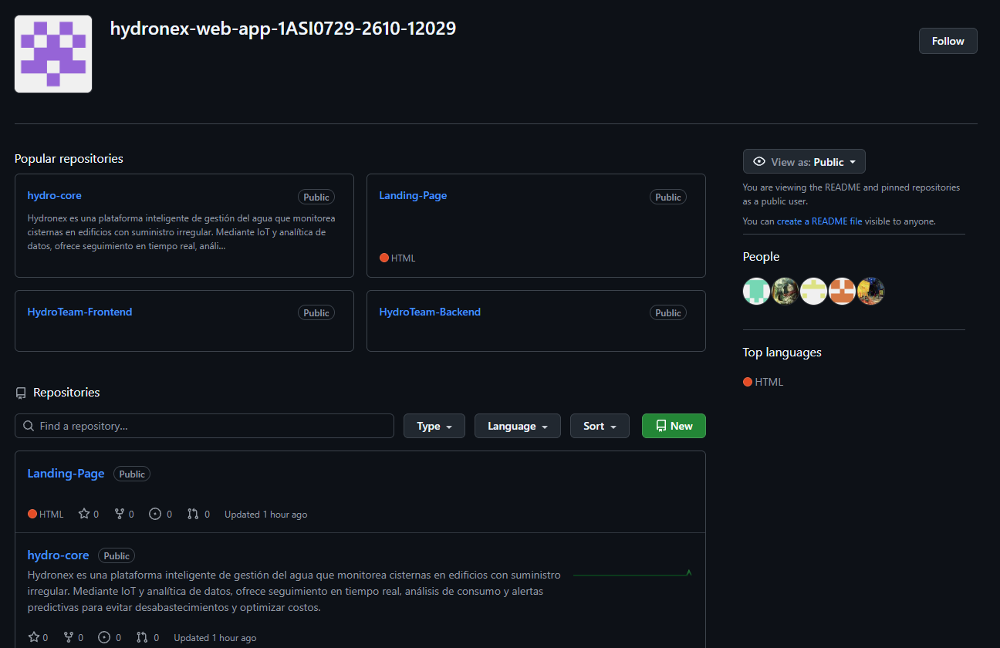

### 5.1.3. Source Code Style Guide & Conventions.

El uso de un estilo de código unificado es clave para asegurar la consistencia, legibilidad y
colaboración efectiva durante el desarrollo de TankIQ. Para la entrega del Sprint 1, el trabajo
se centró en la implementación de la Landing Page estática, por lo que las convenciones
establecidas en esta sección corresponden a las tecnologías utilizadas: HTML, CSS y JavaScript.

**HTML**

La estructura del HTML sigue las convenciones del Google HTML/CSS Style Guide. Se utiliza
sangría de 2 espacios, todos los atributos se escriben en minúsculas y entre comillas dobles,
y todos los elementos de imagen incluyen el atributo `alt` para garantizar accesibilidad. Los
identificadores y clases se nombran en inglés y de forma descriptiva, reflejando el propósito
del elemento. Se utilizan atributos personalizados `data-lang` para gestionar el sistema de
internacionalización y `data-placeholder-es` para los inputs con soporte bilingüe.

**CSS**

Las clases CSS se nombran siguiendo la convención kebab-case (`.hero-section`, `.plan-card`,
`.navbar-fixed`, `.problema-card`), en concordancia con las recomendaciones del Google
HTML/CSS Style Guide. El diseño sigue un enfoque **Mobile First**, definiendo primero los
estilos base para dispositivos móviles y luego aplicando media queries para pantallas más
grandes. La paleta de colores, tipografía y espaciado respetan el Design System definido en
el Capítulo IV: color principal celeste `#29ABE2`, gris oscuro `#2D2D2D`, tipografía Inter
y espaciado en múltiplos de 8px. Las animaciones de entrada se gestionan mediante las clases
`.fade-in` y `.visible`, controladas por JavaScript al detectar visibilidad en el viewport.

**JavaScript**

El código JavaScript sigue las convenciones del Google JavaScript Style Guide y se organiza
en módulos funcionales claramente delimitados mediante comentarios de sección. Las funciones
se nombran en camelCase con nombres descriptivos que reflejan su responsabilidad:
`initLanguageSystem()`, `initMobileMenu()`, `initScrollAnimations()`, `initContactForm()`.
Se utiliza `const` y `let` en lugar de `var`, y cada función tiene una única responsabilidad
definida. El sistema de idiomas gestiona inglés y español mediante la clase `lang-es` sobre
el `body`, persistiendo la preferencia del usuario en `localStorage`. Para optimizar el
rendimiento, los eventos de scroll utilizan una función `throttle()` que limita la frecuencia
de ejecución. El código se escribe en inglés para todos los identificadores y comentarios
técnicos, a excepción de los textos visibles al usuario que forman parte del sistema bilingüe.

### 5.1.4. Software Deployment Configuration.

Para el despliegue de la Landing Page de TankIQ, el equipo HydroTeam utilizó **GitHub Pages**
como plataforma de publicación, aprovechando su integración directa con el repositorio de
GitHub. Esta decisión permite que cada actualización consolidada en la rama `main` se refleje
de forma automática en el entorno público, sin necesidad de configuración adicional de
infraestructura.

El proceso de configuración seguido fue el siguiente: en primer lugar, se accedió a la
configuración del repositorio de la Landing Page desde GitHub. Posteriormente, en la sección
**Pages**, se seleccionó la rama `main` como fuente de despliegue y se indicó la carpeta raíz
(`/root`) como directorio de publicación. GitHub Pages procesó automáticamente los archivos
estáticos (`index.html`, `styles.css`, `script.js`) y habilitó HTTPS por defecto mediante
sus certificados propios.

El entorno de producción de la Landing Page de TankIQ está accesible públicamente en la
siguiente URL: https://hydronex-web-app-1asi0729-2610-12029.github.io/Landing-Page/

## 5.2. Landing Page, Services & Applications Implementation.

### 5.2.1. Sprint 1

Durante el Sprint 1, el equipo HydroTeam centró sus esfuerzos en establecer la presencia
inicial del producto TankIQ mediante la implementación de la Landing Page. El trabajo incluyó
la estructuración de las secciones principales, el diseño visual alineado con el Design System
definido en el Capítulo IV, la responsividad Mobile First y la integración de los
call-to-action diferenciados por segmento objetivo. A continuación se detallan la planificación
del Sprint, el backlog trabajado, las evidencias de desarrollo y los aspectos de colaboración
del equipo.

### 5.2.1.1. Sprint Planning 1.

<table border="1" cellpadding="8" cellspacing="0" style="border-collapse: collapse; width: 100%; font-family: sans-serif; font-size: 14px;">
  <thead>
    <tr style="text-align: left;">
      <th style="width: 30%;">Sprint # / Campo</th>
      <th>Sprint 1 / Detalle</th>
    </tr>
  </thead>
  <tbody>
    <tr>
      <td><strong>Sprint Planning Background</strong></td>
      <td></td>
    </tr>
    <tr>
      <td><strong>Fecha</strong></td>
      <td>23/04/2026</td>
    </tr>
    <tr>
      <td><strong>Hora</strong></td>
      <td>20:00 pm (GMT-5)</td>
    </tr>
    <tr>
      <td><strong>Ubicación</strong></td>
      <td>Reunión virtual por Google Meet</td>
    </tr>
    <tr>
      <td><strong>Preparado por</strong></td>
      <td>HydroTeam</td>
    </tr>
    <tr>
      <td><strong>Participantes</strong></td>
      <td>
        • Espinar Martínez, Gabriel Ferran 
        • Guevara Serrano, Diego Ismael 
        • Montalvan Palomino, Bruno Rodolfo 
        • Orosco Ttamiña, Juan Carlos 
        • Razuri Alvarez, Matias Francesco
      </td>
    </tr>
    <tr>
      <td><strong>Sprint Goal & User Stories</strong></td>
      <td style="text-align: justify;">
        Nuestro enfoque está en entregar la Landing Page de TankIQ con diseño completo, responsivo y alineado con la identidad visual del producto. Creemos que esto establecerá la presencia pública del producto y comunicará la propuesta de valor a ambos segmentos objetivo. Esto se confirmará cuando los visitantes puedan navegar todas las secciones, identificar los beneficios por segmento y acceder al formulario de contacto desde cualquier dispositivo.
      </td>
    </tr>
    <tr>
      <td><strong>Velocidad del Sprint 1</strong></td>
      <td>25</td>
    </tr>
    <tr>
      <td><strong>Suma de Story Points</strong></td>
      <td>25</td>
    </tr>
  </tbody>
</table>

### 5.2.1.2. Aspect Leaders and Collaborators.

En este apartado se describen los aspectos funcionales trabajados durante el Sprint 1 del
proyecto TankIQ. Cada aspecto representa una sección clave de la Landing Page, desde la
estructura de navegación y el hero hasta el footer y la responsividad. Para cada aspecto se
designó un **Líder (L)**, responsable de la dirección técnica y la implementación principal,
y **Colaboradores (C)**, encargados de apoyar en el desarrollo, revisión e integración.

La **Matriz LACX** (Leadership and Collaboration Matrix) permite visualizar de manera clara
la distribución de responsabilidades del equipo durante el Sprint 1.

| Team Member                       | GitHub Username    | Navbar & Hero | Problema & Cómo funciona | Beneficios & Ahorro | Planes & Integrantes | Contacto & Footer | Responsividad |
|-----------------------------------|--------------------|---------------|--------------------------|---------------------|----------------------|-------------------|---------------|
| Espinar Martínez, Gabriel Ferran  | zzZero14           | C             | C                        | C                   | L                    | C                 | C             |
| Guevara Serrano, Diego Ismael     | digetto            | L             | C                        | C                   | C                    | C                 | C             |
| Montalvan Palomino, Bruno Rodolfo | br1rodolfo         | C             | L                        | C                   | C                    | C                 | C             |
| Orosco Ttamiña, Juan Carlos       | juancarlosorosco59 | C             | C                        | C                   | C                    | L                 | C             |
| Razuri Alvarez, Matias Francesco  | u202410772         | C             | C                        | L                   | C                    | C                 | L             |

### 5.2.1.3. Sprint Backlog 1.

El Sprint Backlog 1 se orienta a implementar la Landing Page completa de TankIQ, garantizando
que comunique la propuesta de valor de forma clara y diferenciada para los segmentos de
administradores de edificios y propietarios/inquilinos. El objetivo es que la primera versión
publicada sea responsive, visualmente alineada con el Design System definido en el Capítulo IV
y funcional en todos los navegadores modernos.

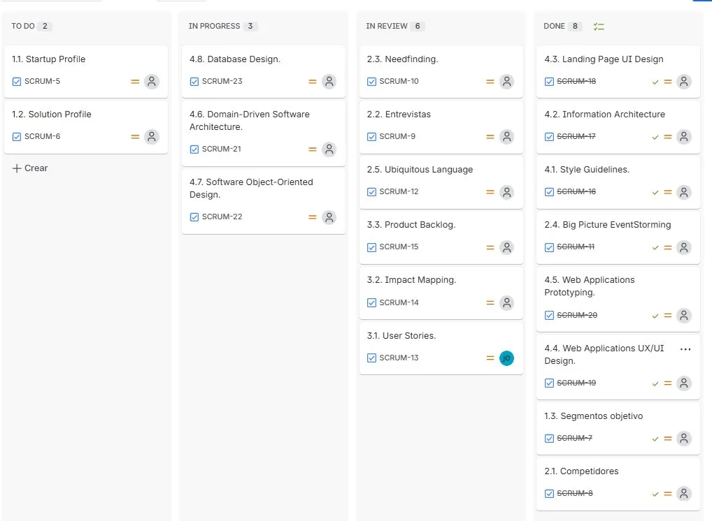

<table style="width: 100%; border-collapse: collapse; font-family: -apple-system, BlinkMacSystemFont, 'Segoe UI', Roboto, Helvetica, Arial, sans-serif; font-size: 13px; color: #333333; background-color: #ffffff; box-shadow: 0 4px 6px rgba(0,0,0,0.05); border-radius: 8px; overflow: hidden; margin: 20px 0;">
  <thead>
    <!-- Cabecera Principal del Sprint -->
    <tr style="background-color: #1e293b; color: #ffffff;">
      <th colspan="8" style="padding: 12px 16px; font-size: 14px; font-weight: bold; letter-spacing: 0.5px; border-bottom: 1px solid #334155;">
        SPRINT 1 - BACKLOG & TASKS
      </th>
    </tr>
    <!-- Cabecera de Columnas -->
    <tr style="background-color: #334155; color: #f8fafc; text-align: left;">
      <th style="padding: 10px 14px; font-weight: 600; font-size: 11px; text-transform: uppercase; width: 60px; text-align: center;">US ID</th>
      <th style="padding: 10px 14px; font-weight: 600; font-size: 11px; text-transform: uppercase; width: 160px;">User Story Título</th>
      <th style="padding: 10px 14px; font-weight: 600; font-size: 11px; text-transform: uppercase; width: 60px; text-align: center; color: #38bdf8;">Task ID</th>
      <th style="padding: 10px 14px; font-weight: 600; font-size: 11px; text-transform: uppercase; color: #38bdf8; width: 180px;">Task Title</th>
      <th style="padding: 10px 14px; font-weight: 600; font-size: 11px; text-transform: uppercase;">Description</th>
      <th style="padding: 10px 14px; font-weight: 600; font-size: 11px; text-transform: uppercase; width: 70px; text-align: center;">Estim.</th>
      <th style="padding: 10px 14px; font-weight: 600; font-size: 11px; text-transform: uppercase; width: 160px;">Assigned To</th>
      <th style="padding: 10px 14px; font-weight: 600; font-size: 11px; text-transform: uppercase; width: 75px; text-align: center;">Status</th>
    </tr>
  </thead>
  <tbody>
    <!-- US46 -->
    <tr style="border-bottom: 1px solid #e2e8f0;">
      <td style="padding: 12px 14px; text-align: center; font-weight: bold; color: #475569; background-color: #f8fafc;">US46</td>
      <td style="padding: 12px 14px; font-weight: 500; color: #1e293b;">Navegar por secciones del landing</td>
      <td style="padding: 12px 14px; text-align: center; font-family: monospace; font-weight: bold; color: #0284c7;">T01</td>
      <td style="padding: 12px 14px; font-weight: 600; color: #0f172a;">Implementar navbar con navegación por anclas</td>
      <td style="padding: 12px 14px; color: #475569;">Desarrollar la barra de navegación fija con enlaces a todas las secciones de la Landing Page y menú hamburguesa para mobile.</td>
      <td style="padding: 12px 14px; text-align: center;">3h</td>
      <td style="padding: 12px 14px; color: #334155;">Guevara Serrano, Diego</td>
      <td style="padding: 12px 14px; text-align: center;">DONE</td>
    </tr>
    <!-- US47 -->
    <tr style="border-bottom: 1px solid #e2e8f0; background-color: #fcfcfc;">
      <td style="padding: 12px 14px; text-align: center; font-weight: bold; color: #475569; background-color: #f8fafc;">US47</td>
      <td style="padding: 12px 14px; font-weight: 500; color: #1e293b;">Visualizar propuesta de valor</td>
      <td style="padding: 12px 14px; text-align: center; font-family: monospace; font-weight: bold; color: #0284c7;">T02</td>
      <td style="padding: 12px 14px; font-weight: 600; color: #0f172a;">Implementar sección Hero con CTAs</td>
      <td style="padding: 12px 14px; color: #475569;">Diseñar e implementar el hero con titular principal, descripción, botones diferenciados por segmento y dashboard preview animado.</td>
      <td style="padding: 12px 14px; text-align: center;">4h</td>
      <td style="padding: 12px 14px; color: #334155;">Guevara Serrano, Diego</td>
      <td style="padding: 12px 14px; text-align: center;">DONE</td>
    </tr>
    <!-- US48 -->
    <tr style="border-bottom: 1px solid #e2e8f0;">
      <td style="padding: 12px 14px; text-align: center; font-weight: bold; color: #475569; background-color: #f8fafc;">US48</td>
      <td style="padding: 12px 14px; font-weight: 500; color: #1e293b;">Identificar problemas del sistema</td>
      <td style="padding: 12px 14px; text-align: center; font-family: monospace; font-weight: bold; color: #0284c7;">T03</td>
      <td style="padding: 12px 14px; font-weight: 600; color: #0f172a;">Implementar sección Problema</td>
      <td style="padding: 12px 14px; color: #475569;">Desarrollar la sección con tres tarjetas que presentan los problemas principales del suministro de agua irregular en Lima.</td>
      <td style="padding: 12px 14px; text-align: center;">3h</td>
      <td style="padding: 12px 14px; color: #334155;">Montalvan Palomino, Bruno</td>
      <td style="padding: 12px 14px; text-align: center;">DONE</td>
    </tr>
    <!-- US49 -->
    <tr style="border-bottom: 1px solid #e2e8f0; background-color: #fcfcfc;">
      <td style="padding: 12px 14px; text-align: center; font-weight: bold; color: #475569; background-color: #f8fafc;">US49</td>
      <td style="padding: 12px 14px; font-weight: 500; color: #1e293b;">Comprender funcionamiento</td>
      <td style="padding: 12px 14px; text-align: center; font-family: monospace; font-weight: bold; color: #0284c7;">T04</td>
      <td style="padding: 12px 14px; font-weight: 600; color: #0f172a;">Implementar sección Cómo funciona</td>
      <td style="padding: 12px 14px; color: #475569;">Crear la sección con tres pasos numerados (sensor → plataforma → alertas) con íconos y conectores visuales.</td>
      <td style="padding: 12px 14px; text-align: center;">3h</td>
      <td style="padding: 12px 14px; color: #334155;">Montalvan Palomino, Bruno</td>
      <td style="padding: 12px 14px; text-align: center;">DONE</td>
    </tr>
    <!-- US50 -->
    <tr style="border-bottom: 1px solid #e2e8f0;">
      <td style="padding: 12px 14px; text-align: center; font-weight: bold; color: #475569; background-color: #f8fafc;">US50</td>
      <td style="padding: 12px 14px; font-weight: 500; color: #1e293b;">Visualizar beneficios</td>
      <td style="padding: 12px 14px; text-align: center; font-family: monospace; font-weight: bold; color: #0284c7;">T05</td>
      <td style="padding: 12px 14px; font-weight: 600; color: #0f172a;">Implementar sección Beneficios y Ahorro</td>
      <td style="padding: 12px 14px; color: #475569;">Desarrollar la sección con dos columnas diferenciadas por segmento y el bloque de métricas de ahorro estimado.</td>
      <td style="padding: 12px 14px; text-align: center;">4h</td>
      <td style="padding: 12px 14px; color: #334155;">Razuri Alvarez, Matias</td>
      <td style="padding: 12px 14px; text-align: center;">DONE</td>
    </tr>
    <!-- US51 -->
    <tr style="border-bottom: 1px solid #e2e8f0; background-color: #fcfcfc;">
      <td style="padding: 12px 14px; text-align: center; font-weight: bold; color: #475569; background-color: #f8fafc;">US51</td>
      <td style="padding: 12px 14px; font-weight: 500; color: #1e293b;">Consultar planes</td>
      <td style="padding: 12px 14px; text-align: center; font-family: monospace; font-weight: bold; color: #0284c7;">T06</td>
      <td style="padding: 12px 14px; font-weight: 600; color: #0f172a;">Implementar sección Planes</td>
      <td style="padding: 12px 14px; color: #475569;">Diseñar las tarjetas de plan Básico y Premium con características, precios y botones de contratación.</td>
      <td style="padding: 12px 14px; text-align: center;">3h</td>
      <td style="padding: 12px 14px; color: #334155;">Espinar Martínez, Gabriel</td>
      <td style="padding: 12px 14px; text-align: center;">DONE</td>
    </tr>
    <!-- US52 -->
    <tr style="border-bottom: 1px solid #e2e8f0;">
      <td style="padding: 12px 14px; text-align: center; font-weight: bold; color: #475569; background-color: #f8fafc;">US52</td>
      <td style="padding: 12px 14px; font-weight: 500; color: #1e293b;">Enviar contacto</td>
      <td style="padding: 12px 14px; text-align: center; font-family: monospace; font-weight: bold; color: #0284c7;">T07</td>
      <td style="padding: 12px 14px; font-weight: 600; color: #0f172a;">Implementar formulario de contacto</td>
      <td style="padding: 12px 14px; color: #475569;">Desarrollar el formulario con validación de campos, integración de toast notifications y soporte bilingüe.</td>
      <td style="padding: 12px 14px; text-align: center;">5h</td>
      <td style="padding: 12px 14px; color: #334155;">Orosco Ttamiña, Juan Carlos</td>
      <td style="padding: 12px 14px; text-align: center;">DONE</td>
    </tr>
    <!-- US53 -->
    <tr style="border-bottom: 1px solid #e2e8f0; background-color: #fcfcfc;">
      <td style="padding: 12px 14px; text-align: center; font-weight: bold; color: #475569; background-color: #f8fafc;">US53</td>
      <td style="padding: 12px 14px; font-weight: 500; color: #1e293b;">Acceder a contacto desde botones</td>
      <td style="padding: 12px 14px; text-align: center; font-family: monospace; font-weight: bold; color: #0284c7;">T08</td>
      <td style="padding: 12px 14px; font-weight: 600; color: #0f172a;">Implementar CTAs con scroll suave</td>
      <td style="padding: 12px 14px; color: #475569;">Conectar todos los botones de la Landing Page al formulario de contacto mediante scroll suave con JavaScript.</td>
      <td style="padding: 12px 14px; text-align: center;">2h</td>
      <td style="padding: 12px 14px; color: #334155;">Orosco Ttamiña, Juan Carlos</td>
      <td style="padding: 12px 14px; text-align: center;">DONE</td>
    </tr>
  </tbody>
</table>

### 5.2.1.4. Development Evidence for Sprint Review.

A continuación se presenta el registro de commits realizados en el repositorio de la Landing
Page de TankIQ durante el Sprint 1. Cada entrada incluye el identificador del commit, su
mensaje descriptivo y la fecha de consolidación, reflejando la evolución del proyecto desde
la estructura base hasta la versión publicada. Los commits siguen la convención Conventional
Commits y evidencian cómo la Landing Page fue construida sección por sección mediante un
flujo de trabajo basado en ramas por feature, Pull Requests y revisión entre compañeros.

| Repository | Branch | Commit Id | Commit Message | Committed on (Date) |
|---|---|---|---|---|
| hydronex-web-app.../Landing-Page | feature/navbar | f10e69c | feat: add navbar with logo, navigation links and language toggle | Apr 25, 2026 |
| hydronex-web-app.../Landing-Page | feature/hero | c4faaf8 | feat: add hero section with dual CTA buttons for admin and resident | Apr 25, 2026 |
| hydronex-web-app.../Landing-Page | feature/navbar | 5807bc3 | feat: add primary, secondary and size button styles | Apr 25, 2026 |
| hydronex-web-app.../Landing-Page | feature/navbar | fdd7b62 | feat: add section headers and highlight styles | Apr 25, 2026 |
| hydronex-web-app.../Landing-Page | feature/navbar | cf2c61c | feat: add footer layout, newsletter and social links styles | Apr 25, 2026 |
| hydronex-web-app.../Landing-Page | feature/navbar | efffc37 | feat: implement bilingual language system with localStorage persistence | Apr 25, 2026 |
| hydronex-web-app.../Landing-Page | feature/navbar | b8f70be | feat: add mobile hamburger menu toggle functionality | Apr 25, 2026 |
| hydronex-web-app.../Landing-Page | feature/problema | 0e9e646 | feat: add problema section in index.html | Apr 25, 2026 |
| hydronex-web-app.../Landing-Page | feature/problema | d2898de | feat: add problema css section to landing page | Apr 25, 2026 |
| hydronex-web-app.../Landing-Page | feature/como-funciona | 2fd502b | feat: add Como Funciona section in index.html | Apr 25, 2026 |
| hydronex-web-app.../Landing-Page | feature/como-funciona | 2a8d052 | feat: add como funciona css section to landing page | Apr 25, 2026 |
| hydronex-web-app.../Landing-Page | feature/beneficios | 8591d3f | feat: update benefits section in landing page | Apr 25, 2026 |
| hydronex-web-app.../Landing-Page | feature/beneficios | ac015b6 | feat: add beneficios section in styles.css | Apr 25, 2026 |
| hydronex-web-app.../Landing-Page | feature/ahorro | 5c708db | feat: add "ahorro" section to landing page | Apr 25, 2026 |
| hydronex-web-app.../Landing-Page | feature/ahorro | 7e0e8c9 | feat: add ahorro css section to landing page | Apr 25, 2026 |
| hydronex-web-app.../Landing-Page | feature/navbar | f67cdc5 | feat: add NAVBAR section in styles.css | Apr 25, 2026 |
| hydronex-web-app.../Landing-Page | feature/navbar | 9d1d091 | feat: add HERO section in styles.css | Apr 25, 2026 |
| hydronex-web-app.../Landing-Page | feature/beneficios | bc2b4b7 | feat: add animaciones fade-in al hacer scroll section to script.js | Apr 25, 2026 |
| hydronex-web-app.../Landing-Page | feature/beneficios | 35fbbb2 | feat: add efecto 3D en tarjetas section to script.js | Apr 25, 2026 |
| hydronex-web-app.../Landing-Page | feature/navbar | 53f921a | feat: add scroll suave, efecto navbar al hacer scroll, inicialización in script.js | Apr 25, 2026 |
| hydronex-web-app.../Landing-Page | develop | 88dad8a | Merge pull request #1 from feature/equipo | Apr 25, 2026 |
| hydronex-web-app.../Landing-Page | develop | 42cadec | Merge pull request #2 from feature/contacto | Apr 25, 2026 |
| hydronex-web-app.../Landing-Page | develop | c1eb79a | Merge pull request #3 from feature/planes | Apr 25, 2026 |
| hydronex-web-app.../Landing-Page | develop | 5c4102d | Merge pull request #4 from feature/footer | Apr 25, 2026 |
| hydronex-web-app.../Landing-Page | develop | 62bd1df | Merge pull request #5 from feature/problema | Apr 25, 2026 |
| hydronex-web-app.../Landing-Page | develop | a6ec12f | Merge pull request #6 from feature/como-funciona | Apr 25, 2026 |
| hydronex-web-app.../Landing-Page | develop | e415003 | Merge pull request #7 from feature/ahorro | Apr 25, 2026 |
| hydronex-web-app.../Landing-Page | develop | f1e3595 | Merge pull request #8 from feature/beneficios | Apr 25, 2026 |
| hydronex-web-app.../Landing-Page | develop | 6305494 | Merge pull request #9 from feature/hero | Apr 25, 2026 |
| hydronex-web-app.../Landing-Page | develop | 2502c74 | Merge pull request #10 from feature/navbar | Apr 25, 2026 |
| hydronex-web-app.../Landing-Page | main | fea1002 | fix: add missing sections | Apr 25, 2026 |
| hydronex-web-app.../Landing-Page | main | 062f041 | fix: logo path | Apr 25, 2026 |
| hydronex-web-app.../Landing-Page | main | dfdf8e2 | fix: repeated section | Apr 25, 2026 |
| hydronex-web-app.../Landing-Page | main | f1c4264 | docs: add new logo | Apr 25, 2026 |
| hydronex-web-app.../Landing-Page | main | 2a1e28f | update | Apr 25, 2026 |.

### 5.2.1.5. Execution Evidence for Sprint Review.

Durante el Sprint 1, el equipo HydroTeam implementó la Landing Page completa de TankIQ.
El desarrollo priorizó la experiencia visual, la responsividad Mobile First y la coherencia
con el Design System definido en el Capítulo IV. Se implementó además un sistema de
internacionalización (i18n) que permite alternar entre inglés y español, persistiendo la
preferencia del usuario en localStorage.

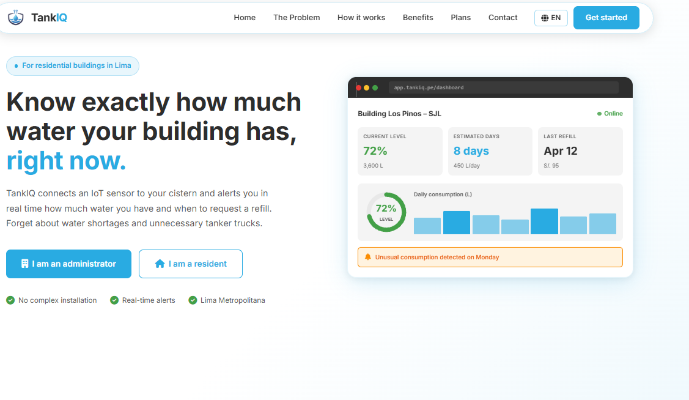

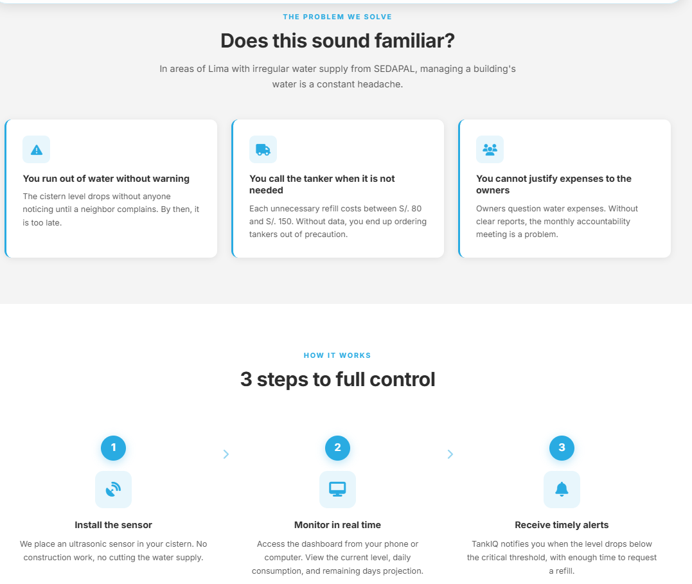

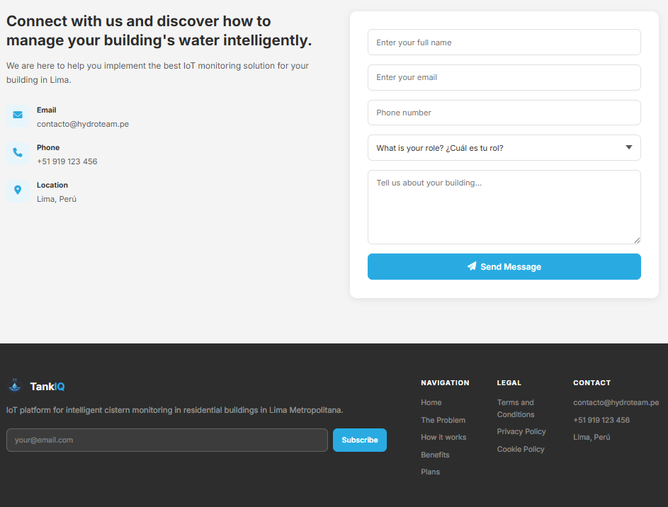

### 5.2.1.6. Services Documentation Evidence for Sprint Review.

El repositorio del Landing Page contiene una documentación exhaustiva que detalla la estructura del proyecto, las tecnologías empleadas, los requisitos de instalación y las directrices para el despliegue. En el archivo README.md del repositorio, se puede acceder a esta documentación.

### 5.2.1.7. Software Deployment Evidence for Sprint Review.

En esta sección se presentan las evidencias del proceso de despliegue de la Landing Page
desarrollado durante el Sprint 1. El despliegue se realizó utilizando **GitHub Pages**, una
plataforma de hosting gratuita y confiable para sitios web estáticos, que permite la
publicación automática desde el repositorio de GitHub.

**Información del Despliegue**

| Aspecto | Detalle |
|---|---|
| Plataforma de Despliegue | GitHub Pages |
| Repositorio | [Landing-Page](https://github.com/hydronex-web-app-1ASI0729-2610-12029/Landing-Page) |
| URL del Landing Page | [https://hydronex-web-app-1ASI0729-2610-12029.github.io/Landing-Page/](https://hydronex-web-app-1ASI0729-2610-12029.github.io/Landing-Page/) |
| Rama de Despliegue | main |
| Fecha de Despliegue | 25/04/2026 |
| Estado Actual | Desplegado y Funcional |
| Tipo de Sitio | Sitio Web Estático (HTML, CSS, JavaScript) |
| HTTPS | Habilitado (Certificado SSL automático) |

**Proceso de Despliegue Detallado**

**Paso 1: Preparación del Repositorio**
- Se configuró el repositorio `Landing-Page` en GitHub con la estructura completa de archivos.
- Se organizaron los archivos HTML, CSS, JavaScript e imágenes en carpetas apropiadas.
- Se aseguró que todos los archivos estuvieran consolidados en la rama `main`.

**Paso 2: Configuración de GitHub Pages**
- Se accedió a la configuración del repositorio en GitHub.
- Se habilitó GitHub Pages en la sección **Settings → Pages**.
- Se seleccionó la rama `main` como fuente del sitio.
- Se configuró la carpeta raíz (`/root`) como directorio de publicación.

Configuración de GitHub Pages

**Paso 3: Generación de la URL**
- GitHub Pages generó automáticamente la URL pública del sitio.
- La URL sigue el formato: `https://[organizacion].github.io/[repositorio]/`

**Paso 4: Verificación del Despliegue**
- Se verificó que el sitio estuviera accesible en la URL proporcionada.
- Se comprobó que el certificado SSL estuviera activo (HTTPS).
- Se validó que todos los recursos se cargaran correctamente.

Confirmación de despliegue exitoso

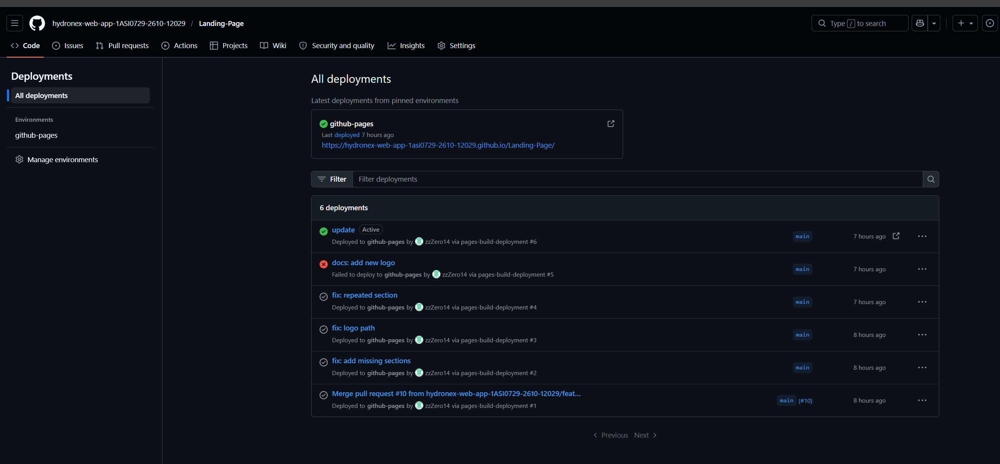

**Paso 5: Validación de Funcionalidad**

Se realizaron pruebas para verificar que todas las funcionalidades del Landing Page
funcionaran correctamente:

- **Navegación entre secciones:** Todos los enlaces del menú funcionan con scroll suave.
- **Diseño responsive:** El sitio se adapta correctamente a mobile, tablet y desktop.
- **Sistema de idiomas:** El toggle EN/ES funciona correctamente y persiste en localStorage.
- **Formulario de contacto:** La validación de campos y los toast notifications operan sin errores.
- **Carga de assets:** Todas las imágenes y recursos se cargan sin errores.
- **Compatibilidad:** Se probó en Chrome, Firefox, Safari y Edge.

*(Insertar captura: Landing Page desplegada en producción)*

### 5.2.1.8. Team Collaboration Insights during Sprint.

Durante el Sprint 1, las actividades de implementación del Landing Page de TankIQ se
desarrollaron de forma colaborativa mediante **GitHub**, aplicando el flujo de trabajo
basado en ramas por feature, commits con la convención Conventional Commits y Pull
Requests con revisión mínima de un compañero antes del merge a `main`. Este proceso
garantizó trazabilidad, calidad de código y un historial claro de las contribuciones de
cada integrante.

Cada miembro del equipo asumió la responsabilidad de una o más secciones de la Landing
Page según la distribución establecida en la Matriz LACX, asegurando una participación
activa y balanceada. Las coordinaciones técnicas se realizaron mediante reuniones virtuales
por Google Meet y comunicación por WhatsApp.

A continuación se presentan las evidencias de colaboración del equipo durante el Sprint 1:

Network Graph del repositorio Landing-Page en GitHub

Contributors — commits por integrante

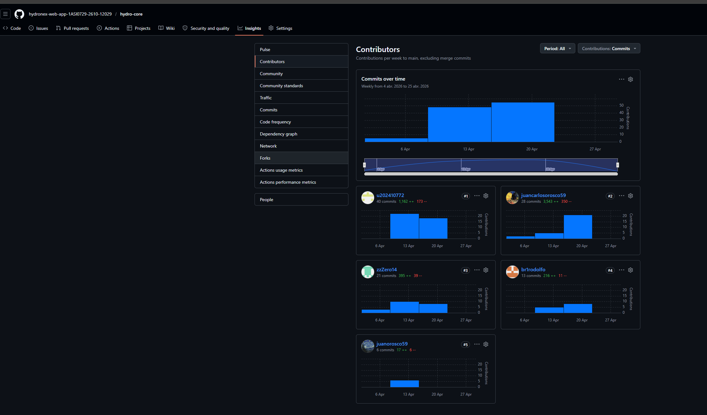

Historial de Pull Requests mergeados

### 5.2.2. Sprint 2

Durante el Sprint 2, el equipo HydroTeam centró sus esfuerzos en el desarrollo de la primera
versión de la Web Application de TankIQ utilizando Angular como framework principal. En esta
etapa se trabajó en la configuración de la arquitectura base del proyecto, la implementación
de navegación mediante rutas, la organización modular utilizando bounded contexts y el
desarrollo de las primeras vistas funcionales del sistema. Asimismo, se realizaron mejoras
sobre los artefactos desarrollados durante el Sprint 1, corrigiendo aspectos visuales,
tipográficos y estructurales para mantener coherencia con el Design System definido
previamente.

### 5.2.2.1. Sprint Planning 2.

### 5.2.2.1. Sprint Planning 2.

| **Sprint #** | Sprint 2 |
|---|---|
| **Sprint Planning Background** | |
| **Date** | 2026-05-06 |
| **Time** | 08:00 PM |
| **Location** | Reunión virtual mediante Google Meet |
| **Prepared By** | HydroTeam |
| **Attendees (to planning meeting)** | Espinar Martínez, Gabriel Ferran / Guevara Serrano, Diego Ismael / Montalvan Palomino, Bruno Rodolfo / Orosco Ttamiña, Juan Carlos / Razuri Alvarez, Matias Francesco |
| **Sprint 1 – Review Summary** | Durante el Sprint 1 se completó el desarrollo inicial del Landing Page y los principales artefactos UX/UI del proyecto. Asimismo, durante la revisión se identificaron observaciones relacionadas con enlaces faltantes, visibilidad de algunas imágenes del informe y pequeños ajustes visuales de la interfaz. |
| **Sprint 1 – Retrospective Summary** | Durante la retrospectiva del Sprint 1, el equipo identificó la necesidad de mejorar la organización del trabajo colaborativo y la estructura del frontend para facilitar el desarrollo de nuevas funcionalidades. Además, se concluyó que era necesario utilizar una arquitectura más escalable y una mejor estrategia de manejo de ramas para reducir conflictos durante la integración del proyecto. |
| **Sprint Goal & User Stories** | |
| **Sprint 2 Goal** | Nuestro enfoque está en desarrollar la primera versión funcional de la Web Application de TankIQ utilizando Angular y una arquitectura modular organizada por bounded contexts. Creemos que esto permitirá integrar los primeros módulos frontend del sistema y facilitar el trabajo paralelo del equipo. Esto se confirmará cuando los usuarios puedan navegar entre las principales vistas de la aplicación y visualizar la integración inicial del dashboard y módulos base del sistema. |
| **Sprint 2 Velocity** | 40 |
| **Sum of Story Points** | 40 |

### 5.2.2.2. Aspect Leaders and Collaborators.

Durante el Sprint 2, el equipo trabajó utilizando una estrategia basada en ramas feature para
desarrollar de manera paralela los diferentes módulos frontend de la Web Application. Cada
integrante asumió la responsabilidad principal de un bounded context específico, permitiendo
mantener una mejor organización del proyecto y facilitar la integración de funcionalidades
hacia las ramas develop y main.

La siguiente Matriz LACX muestra la distribución de responsabilidades del equipo durante el
Sprint 2.

| Team Member | GitHub Username | Landing Angular | IAM Module | Dashboard Overview | Water Monitoring | Alerts & Notifications |
|---|---|---|---|---|---|---|
| Espinar Martínez, Gabriel Ferran | zzZero14 | C | C | C | L | C |
| Guevara Serrano, Diego Ismael | digetto | L | C | C | C | C |
| Montalvan Palomino, Bruno Rodolfo | br1rodolfo | C | L | C | C | C |
| Orosco Ttamiña, Juan Carlos | juancarlosorosco59 | C | C | L | C | C |
| Razuri Alvarez, Matias Francesco | u202410772 | C | C | C | C | L |

### 5.2.2.3. Sprint Backlog 2.

El Sprint Backlog 2 estuvo orientado al desarrollo de la primera versión de la Frontend Web
Application de TankIQ utilizando Angular. El trabajo incluyó la implementación de la
arquitectura modular del sistema, layouts reutilizables, navegación mediante Angular Router y
la estructura inicial de los diferentes módulos definidos en el Product Backlog. Además, se
realizaron mejoras visuales y técnicas sobre el Landing Page desarrollado durante el Sprint 1.

| **Sprint 2** | | | | | | | |
|---|---|---|---|---|---|---|---|
| **User Story** | | **Work-Item / Task** | | | | | |
| **User Story ID** | **Título** | **Task ID** | **Task Title** | **Description** | **Estimation (Hours)** | **Assigned To** | **Status** |
| US54 | Acceder a la Web Application | T09 | Configurar arquitectura Angular | Inicializar el proyecto Angular y organizar la estructura modular mediante bounded contexts, standalone components y lazy loading. | 4 | Orosco Ttamiña, Juan Carlos | Done |
| US55 | Navegar entre módulos del sistema | T10 | Implementar sistema de routing | Configurar rutas principales, layouts y navegación entre Landing, Dashboard, IAM, Monitoring y Alerts. | 4 | Orosco Ttamiña, Juan Carlos | Done |
| US56 | Visualizar métricas principales del sistema | T11 | Implementar Dashboard Overview | Desarrollar la primera vista del dashboard incluyendo métricas, sidebar y componentes base del panel principal. | 5 | Orosco Ttamiña, Juan Carlos | Done |
| US57 | Acceder al Landing Page desde Angular | T12 | Migrar Landing Page | Adaptar el Landing Page desarrollado en el Sprint 1 hacia una arquitectura basada en componentes Angular reutilizables. | 4 | Guevara Serrano, Diego | Done |
| US58 | Gestionar el acceso de usuarios | T13 | Implementar módulo IAM | Crear la estructura inicial del módulo IAM incluyendo vistas de login, autenticación y navegación base. | 4 | Montalvan Palomino, Bruno | Done |
| US59 | Consultar información de monitoreo | T14 | Implementar módulo Water Monitoring | Desarrollar la estructura inicial y rutas del módulo de monitoreo de agua utilizando componentes placeholder y navegación integrada. | 3 | Espinar Martínez, Gabriel | Done |
| US60 | Visualizar alertas y notificaciones | T15 | Implementar módulo Alerts & Notifications | Crear la estructura inicial del módulo de alertas y notificaciones utilizando vistas placeholder y navegación interna. | 3 | Razuri Alvarez, Matias | Done |
| US61 | Mantener una estructura escalable del sistema | T16 | Organizar proyecto por feature branches | Configurar el flujo de trabajo basado en ramas feature y bounded contexts para permitir el desarrollo paralelo e integración del sistema. | 2 | HydroTeam | Done |
| US62 | Mantener coherencia visual en la aplicación | T17 | Ajustar estilos y layouts | Corregir tipografía, tamaños, espaciados y estilos generales para mantener consistencia visual entre Landing y Web Application. | 3 | HydroTeam | Done |

### 5.2.2.4. Development Evidence for Sprint Review.

A continuación se presenta el registro de commits realizados en el repositorio
HydroTeam-Frontend durante el Sprint 2. Los commits reflejan el trabajo realizado por el
equipo para implementar la arquitectura Angular, organizar el proyecto mediante ramas feature
y desarrollar los diferentes módulos frontend definidos para esta primera versión de la Web
Application.

  <h1>
    HydroTeam Frontend - Commit History Evidence
  </h1>

| Repository | Branch | Commit Id | Commit Message | Committed on (Date) |
|---|---|---|---|---|
| HydroTeam-Frontend | develop | f3f7102 | update | May 14, 2026 |
| HydroTeam-Frontend | develop | 32b1b83 | Update | May 14, 2026 |
| HydroTeam-Frontend | develop | 4b5ec38 | Fix import path for AlertsApiEndpoint | May 14, 2026 |
| HydroTeam-Frontend | develop | c40abdd | Delete | May 14, 2026 |
| HydroTeam-Frontend | develop | 14d48bf | feat: add model and entity | May 14, 2026 |
| HydroTeam-Frontend | develop | 981e216 | fix: remove unnecessary closing braces in alerts.store.ts | May 14, 2026 |
| HydroTeam-Frontend | develop | 4b52499 | fix: refactor monitoring component to use signals | May 14, 2026 |
| HydroTeam-Frontend | develop | d33b86b | fix: html section | May 14, 2026 |
| HydroTeam-Frontend | develop | 13d0cca | fix: refactor CSS for monitoring page layout and styles | May 14, 2026 |
| HydroTeam-Frontend | develop | 03393bf | Merge pull request #2 from hydronex-web-app-1ASI0729-2610-12029/feature/tb1-alerts-notifications | May 14, 2026 |
| HydroTeam-Frontend | develop | 21ba2c1 | Merge pull request #1 from hydronex-web-app-1ASI0729-2610-12029/feature/tb1-water-monitoring | May 14, 2026 |
| HydroTeam-Frontend | develop | d6b94ac | Merge branch 'feature/tb1-dashboard-overview' into develop | May 14, 2026 |
| HydroTeam-Frontend | develop | 5d09c3e | Merge branch 'feature/tb1-iam' into develop | May 14, 2026 |
| HydroTeam-Frontend | develop | 202936a | Fix IAM routing and CommonModule imports | May 14, 2026 |
| HydroTeam-Frontend | develop | e224ed3 | feat: fix style | May 14, 2026 |
| HydroTeam-Frontend | develop | cc5097a | feat: add water monitoring modules | May 14, 2026 |
| HydroTeam-Frontend | develop | d777343 | feat(landing): improve public landing page | May 14, 2026 |
| HydroTeam-Frontend | develop | 8652f14 | fix(iam): remove auth guard from app routes | May 14, 2026 |
| HydroTeam-Frontend | develop | b024a91 | feat(iam): protect dashboard routes with auth guard | May 14, 2026 |
| HydroTeam-Frontend | develop | 50702de | feat(iam): add sign-up route | May 14, 2026 |
| HydroTeam-Frontend | develop | f33c39f | feat(iam): update login component | May 14, 2026 |
| HydroTeam-Frontend | develop | af5e51d | feat(iam): update login template | May 14, 2026 |
| HydroTeam-Frontend | develop | 342e579 | feat(iam): update login styles | May 14, 2026 |
| HydroTeam-Frontend | develop | e4aab9a | feat(iam): add sign-up view | May 14, 2026 |
| HydroTeam-Frontend | develop | 82ebb82 | docs(iam): update authentication store | May 14, 2026 |
| HydroTeam-Frontend | develop | fb830d1 | docs(iam): update login component | May 14, 2026 |
| HydroTeam-Frontend | develop | 0f2f990 | feat(iam): add authentication store | May 14, 2026 |
| HydroTeam-Frontend | develop | 383a1d5 | feat(iam): add auth guard | May 14, 2026 |
| HydroTeam-Frontend | develop | 4e6a7e2 | feat(iam): add infrastructure layer | May 14, 2026 |
| HydroTeam-Frontend | develop | 4a9e67a | feat(iam): add user entity | May 14, 2026 |
| HydroTeam-Frontend | develop | a3b3f19 | feat(iam): add i18n keys for login, sign-up and validation in Spanish | May 14, 2026 |
| HydroTeam-Frontend | develop | 2dfcdf3 | feat(iam): add i18n keys for login, sign-up and validation in English | May 14, 2026 |
| HydroTeam-Frontend | develop | 34504c2 | feat: add matt-icon | May 14, 2026 |
| HydroTeam-Frontend | develop | 9631ba7 | feat: add component | May 14, 2026 |
| HydroTeam-Frontend | develop | 81d5173 | feat: add component | May 14, 2026 |
| HydroTeam-Frontend | develop | c49c987 | feat: add component | May 14, 2026 |
| HydroTeam-Frontend | develop | 4703329 | feat: add infrastructure | May 14, 2026 |
| HydroTeam-Frontend | develop | 864a764 | feat: add entities | May 14, 2026 |
| HydroTeam-Frontend | develop | e9fca61 | feat: create alerts-response.ts and define Alert DTOs and API response interfaces | May 13, 2026 |
| HydroTeam-Frontend | develop | cc9a028 | feat: create alerts-api.ts with CRUD operations | May 13, 2026 |
| HydroTeam-Frontend | develop | 380f1a3 | feat: create alerts-api-endpoints.ts | May 13, 2026 |
| HydroTeam-Frontend | develop | f8f1220 | feat: create alert-assembler.ts for data mapping between layers | May 13, 2026 |
| HydroTeam-Frontend | develop | b59bba7 | feat: create alert.entity.ts and define Alert domain entity and types | May 13, 2026 |
| HydroTeam-Frontend | develop | 5750144 | feat: create alerts.store.ts | May 13, 2026 |
| HydroTeam-Frontend | develop | 84f9895 | feat: add MatIcon to alerts css | May 13, 2026 |
| HydroTeam-Frontend | develop | b767c65 | feat: implement layout and control flow for alerts view | May 13, 2026 |
| HydroTeam-Frontend | develop | e4512bd | feat: add background color to alert card icons | May 13, 2026 |
| HydroTeam-Frontend | develop | 7944895 | merge: resolve README conflict | May 13, 2026 |
| HydroTeam-Frontend | develop | 1c7c294 | feat: initialize frontend base project | May 13, 2026 |
| HydroTeam-Frontend | develop | ccc907a | Initial commit | Apr 11, 2026 |

### 5.2.2.5. Execution Evidence for Sprint Review.

Durante el Sprint 2, el equipo HydroTeam implementó la primera versión de la Frontend Web
Application de TankIQ utilizando Angular. El desarrollo se enfocó en establecer una
arquitectura modular y escalable, integrando navegación mediante Angular Router, layouts
reutilizables y componentes standalone para facilitar futuras integraciones del sistema.

Asimismo, se desarrollaron las primeras vistas correspondientes a los módulos Dashboard
Overview, IAM, Water Monitoring y Alerts & Notifications, manteniendo coherencia visual con
el Landing Page trabajado durante el Sprint 1.

Landing Page integrado en Angular

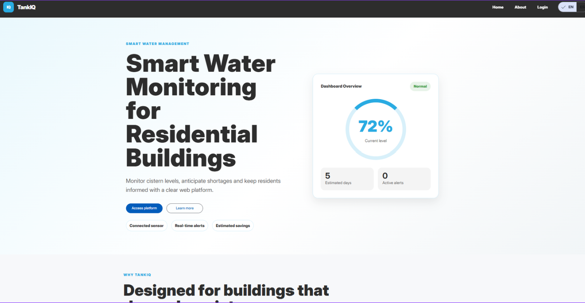

Dashboard Overview implementado en Angular

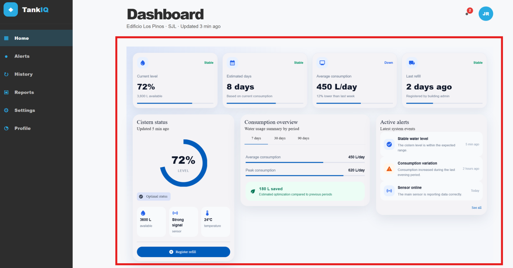

Módulo Alerts & Notifications

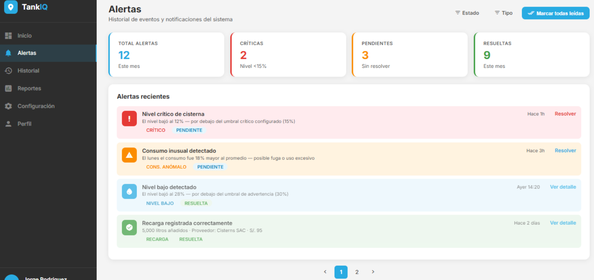

Módulo Water Monitoring

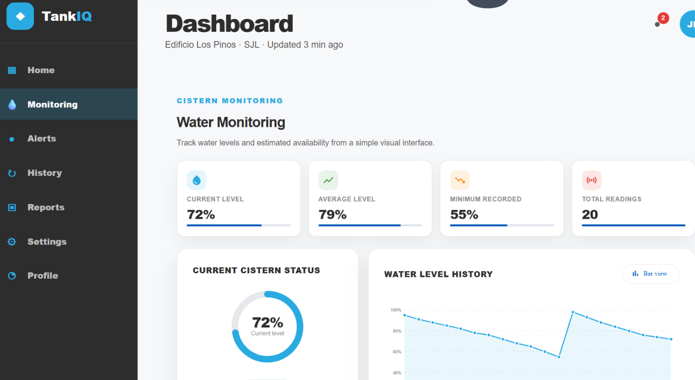

Módulo IAM y vistas de autenticación

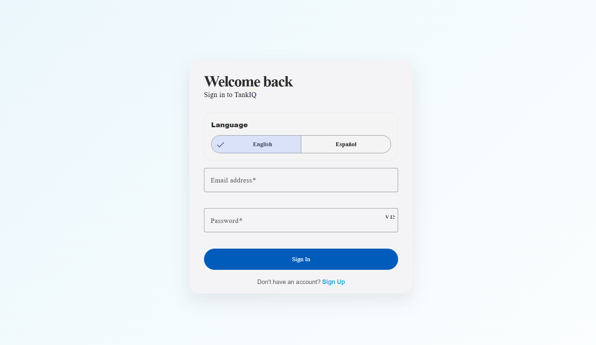

### 5.2.2.6. Services Documentation Evidence for Sprint Review.

El repositorio HydroTeam-Frontend contiene documentación relacionada con la instalación del
proyecto, ejecución de la aplicación y estructura modular implementada durante el Sprint 2.
Asimismo, el archivo README.md incluye instrucciones para configurar Angular, ejecutar builds
y trabajar colaborativamente utilizando ramas feature y flujo GitHub Flow.

Repositorio y documentación del proyecto frontend

### 5.2.2.7. Software Deployment Evidence for Sprint Review.

En esta sección se detallan las evidencias correspondientes al despliegue 
de la primera versión de la aplicación web frontend de TankIQ. La arquitectura 
de la solución contempla una Single Page Application (SPA) desarrollada sobre el 
framework Angular, optimizada para el alojamiento en Firebase Hosting con soporte
integral para enrutamiento interno y navegación fluida.

Cabe precisar que, debido a priorizaciones en el cronograma del Sprint 2, la fase 
de deployment final no fue concluida en el periodo actual. No obstante, se ha 
establecido como un entregable crítico y de alta prioridad para el Sprint 3, asegurando 
así la disponibilidad de la plataforma en el próximo ciclo de desarrollo.

### 5.2.2.8. Team Collaboration Insights during Sprint.

Durante el Sprint 2, el equipo HydroTeam trabajó utilizando GitHub y una estrategia basada
en ramas feature para desarrollar de manera paralela los diferentes módulos frontend de la
aplicación. Cada integrante trabajó sobre un bounded context específico, permitiendo una
mejor organización del proyecto y facilitando la integración de funcionalidades mediante Pull
Requests hacia las ramas `develop` y `main`.

Además, el equipo realizó coordinaciones constantes relacionadas con arquitectura Angular,
routing, layouts y diseño visual de la aplicación, manteniendo una comunicación continua para
resolver observaciones y unificar criterios técnicos durante el desarrollo.

Network Graph del repositorio HydroTeam-Frontend

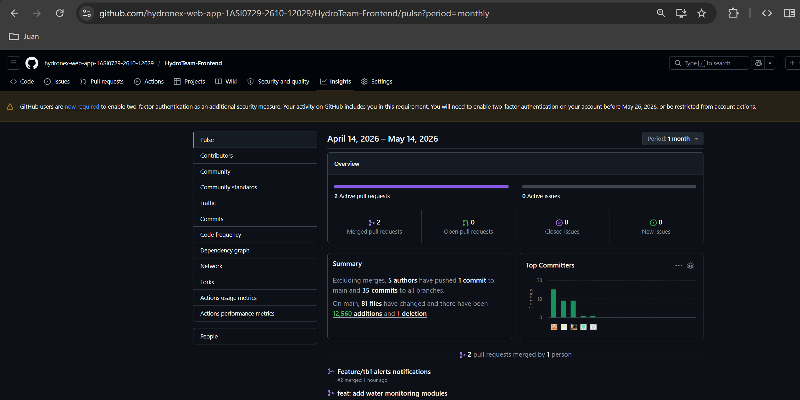

Contributors — commits realizados por integrante

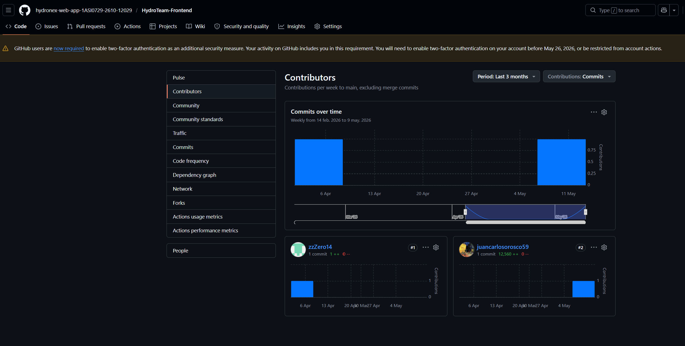

### 5.2.3. Sprint 3

Durante el Sprint 3, el equipo HydroTeam enfocó sus esfuerzos en la evolución integral de la plataforma mediante la optimización 
del Frontend y el diseño arquitectónico del Backend. En el lado del cliente, se implementaron mejoras de rendimiento y refinamiento 
de la interfaz de usuario. En el backend, se sentaron las bases del sistema adoptando el patrón CQRS (Command Query Responsibility Segregation) 
y una arquitectura limpia basada en Capas de DDD (Domain-Driven Design) para garantizar la escalabilidad y mantenibilidad del negocio.

### 5.2.3.1. Sprint Planning 3

- Planificación de la Primera Mitad del Sprint 3: Optimización del Frontend

| **Sprint #** | Sprint 3 - Parte 1 |
|---|---|
| **Sprint Planning Background** | |
| **Date** | 2026-05-25 |
| **Time** | 08:00 PM |
| **Location** | Reunión virtual mediante Google Meet |
| **Prepared By** | HydroTeam |
| **Attendees (to planning meeting)** | Espinar Martínez, Gabriel Ferran / Guevara Serrano, Diego Ismael / Montalvan Palomino, Bruno Rodolfo / Orosco Ttamiña, Juan Carlos / Razuri Alvarez, Matias Francesco / Retuerto Rodriguez, Jorge Manuel|
| **Sprint 2 – Review Summary** | Durante el Sprint 2 se completó con éxito la primera versión funcional de la Web Application en Angular bajo una estructura modular. En la revisión se sugirieron mejoras puntuales en la fluidez de las transiciones, el manejo de estados locales en el dashboard y el rendimiento general de carga en dispositivos móviles. |
| **Sprint 2 – Retrospective Summary** | El equipo concluyó que la arquitectura por *bounded contexts* facilitó el trabajo en paralelo, pero identificó cuellos de botella en la reutilización de componentes UI y ciertos estilos CSS globales. Se acordó dedicar la primera fase del Sprint 3 a refactorizar y optimizar el rendimiento del lado del cliente antes de iniciar la lógica pesada del servidor. |
| **Sprint Goal & User Stories** | |
| **Sprint 3.1 Goal** | Nuestro enfoque está en optimizar el rendimiento y la experiencia de usuario del frontend de TankIQ, refactorizando componentes críticos y puliendo la interfaz bajo estándares de carga eficiente. Creemos que esto asegurará una base de cliente sólida y escalable para las futuras integraciones de datos. Esto se confirmará cuando el dashboard e interfaces base logren una navegación fluida sin re-renderizados innecesarios y pasen las pruebas de rendimiento visual. |
| **Sprint 3.1 Velocity** | 24 |
| **Sum of Story Points** | 24 |

---

- Planificación de la Segunda Mitad del Sprint 3: Fundaciones del Backend (CQRS y DDD)

| **Sprint #** | Sprint 3 - Parte 2 |
|---|---|
| **Sprint Planning Background** | |
| **Date** | 2026-06-06 |
| **Time** | 08:00 PM |
| **Location** | Reunión virtual mediante Google Meet |
| **Prepared By** | HydroTeam |
| **Attendees (to planning meeting)** | Espinar Martínez, Gabriel Ferran / Guevara Serrano, Diego Ismael / Montalvan Palomino, Bruno Rodolfo / Orosco Ttamiña, Juan Carlos / Razuri Alvarez, Matias Francesco / Retuerto Rodriguez, Jorge Manuel|
| **Sprint 3.1 – Review Summary** | Se revisó la optimización del Frontend, logrando una interfaz mucho más fluida, modular y con tiempos de respuesta locales mejorados. Las observaciones técnicas apuntaron a dejar listos los servicios de Angular para empezar a consumir los endpoints que proveerá el nuevo backend estructurado. |
| **Sprint 3.1 – Retrospective Summary** | El equipo evaluó positivamente el orden visual alcanzado en el frontend. Para afrontar la complejidad del procesamiento de datos de TankIQ, se determinó la necesidad estricta de aislar la lógica de negocio del almacenamiento. Por ello, se definió adoptar formalmente el patrón CQRS y la división por capas de Domain-Driven Design (DDD) desde el primer día de desarrollo del backend. |
| **Sprint Goal & User Stories** | |
| **Sprint 3.2 Goal** | Nuestro enfoque está en diseñar y construir la arquitectura base del backend de TankIQ aplicando capas de DDD y el patrón CQRS para separar de manera limpia los comandos (escritura) de las consultas (lectura). Creemos que esto garantizará el rendimiento y la alta disponibilidad del sistema al procesar la telemetría de los tanques. Esto se confirmará cuando los primeros endpoints expongan la lógica del dominio de manera correcta y se completen con éxito las pruebas de persistencia base. |
| **Sprint 3.2 Velocity** | 32 |
| **Sum of Story Points** | 32 |

### 5.2.3.2. Aspect Leaders and Collaborators

En este apartado se describen los aspectos técnicos y funcionales trabajados durante 
el Sprint 3 del proyecto TankIQ. El alcance de este ciclo se dividió estratégicamente 
en dos frentes: la optimización del rendimiento y modularización del **Frontend** (Angular), 
y el diseño e implementación de la arquitectura base del **Backend** guiada por el dominio (**DDD Layers**) 
y la segregación de responsabilidades de lectura y escritura (**CQRS**).

Para cada aspecto arquitectónico y funcional se designó un **Líder (L)**, responsable del cada bounded context del negocio,
el diseño de la solución y la implementación principal, y **Colaboradores (C)**, encargados de apoyar en el desarrollo, 
pruebas unitarias, refactorización e integración en el repositorio.

La **Matriz LACX** (Leadership and Collaboration Matrix) permite visualizar de manera clara la distribución 
de responsabilidades del equipo HydroTeam durante el Sprint 3.

- Front End

| Team Member                       | GitHub Username    | Billing Context | IAM Context | Monitoring Management | Notification Management | Reporting Management | Refill Management |
|-----------------------------------|--------------------|-----------------|-------------|-----------------------|-------------------------|----------------------|-------------------|
| Espinar Martínez, Gabriel Ferran  | zzZero14           | C               | C           | L                     | C                       | L                    | C                 |
| Guevara Serrano, Diego Ismael     | digetto            | C               | C           | C                     | C                       | C                    | L                 |
| Montalvan Palomino, Bruno Rodolfo | br1rodolfo         | C               | L           | C                     | C                       | C                    | C                 |
| Orosco Ttamiña, Juan Carlos       | juancarlosorosco59 | C               | C           | C                     | C                       | C                    | C                 |
| Razuri Alvarez, Matias Francesco  | u202410772         | C               | C           | C                     | L                       | C                    | C                 |
| Retuerto Rodriguez, Jorge Maneul  | Calin1407          | L               | C           | C                     | C                       | C                    | C                 |

- Back End

| Team Member                       | GitHub Username    | Billing Context | IAM Context | Monitoring Management | Notification Management | Reporting Management | Refill Management |
|-----------------------------------|--------------------|-----------------|-------------|-----------------------|-------------------------|----------------------|-------------------|
| Espinar Martínez, Gabriel Ferran  | zzZero14           | C               | C           | L                     | C                       | L                    | C                 |
| Guevara Serrano, Diego Ismael     | digetto            | C               | C           | C                     | C                       | C                    | L                 |
| Montalvan Palomino, Bruno Rodolfo | br1rodolfo         | C               | L           | C                     | C                       | C                    | C                 |
| Orosco Ttamiña, Juan Carlos       | juancarlosorosco59 | C               | C           | C                     | C                       | C                    | C                 |
| Razuri Alvarez, Matias Francesco  | u202410772         | C               | C           | C                     | L                       | C                    | C                 |
| Retuerto Rodriguez, Jorge Maneul  | Calin1407          | L               | C           | C                     | C                       | C                    | C                 |

### 5.2.3.3. Sprint Backlog 3

El Sprint Backlog 3 se orienta a consolidar la madurez técnica de la plataforma TankIQ mediante la optimización avanzada del Frontend 
y la construcción de un núcleo de Backend altamente escalable. El trabajo del lado del cliente se enfoca en refactorizar componentes 
modulares y pulir el rendimiento de la aplicación en Angular, garantizando una navegación fluida y eficiente. En el lado del servidor, 
el objetivo es establecer los cimientos de la arquitectura de software aplicando Diseño Guiado por el Dominio (DDD Layers) e implementando 
el patrón CQRS para desacoplar de forma limpia las operaciones de comandos y consultas, asegurando una base robusta, mantenible y preparada 
para el procesamiento de telemetría en tiempo real.

<table style="width: 100%; border-collapse: collapse; font-family: -apple-system, BlinkMacSystemFont, 'Segoe UI', Roboto, Helvetica, Arial, sans-serif; font-size: 13px; color: #333333; background-color: #ffffff; box-shadow: 0 4px 6px rgba(0,0,0,0.05); border-radius: 8px; overflow: hidden; margin: 20px 0;">
  <thead>
    <tr style="background-color: #1e293b; color: #ffffff;">
      <th colspan="8" style="padding: 12px 16px; font-size: 14px; font-weight: bold; letter-spacing: 0.5px; border-bottom: 1px solid #334155; text-align: left;">
        SPRINT 3 - BACKLOG COMPLETO & TASKS
      </th>
    </tr>
    <tr style="background-color: #334155; color: #f8fafc; text-align: left;">
      <th style="padding: 10px 14px; font-weight: 600; font-size: 11px; text-transform: uppercase; width: 60px; text-align: center;">US ID</th>
      <th style="padding: 10px 14px; font-weight: 600; font-size: 11px; text-transform: uppercase; width: 160px;">User Story Título</th>
      <th style="padding: 10px 14px; font-weight: 600; font-size: 11px; text-transform: uppercase; width: 60px; text-align: center; color: #38bdf8;">Task ID</th>
      <th style="padding: 10px 14px; font-weight: 600; font-size: 11px; text-transform: uppercase; color: #38bdf8; width: 180px;">Task Title</th>
      <th style="padding: 10px 14px; font-weight: 600; font-size: 11px; text-transform: uppercase;">Description</th>
      <th style="padding: 10px 14px; font-weight: 600; font-size: 11px; text-transform: uppercase; width: 70px; text-align: center;">Estim.</th>
      <th style="padding: 10px 14px; font-weight: 600; font-size: 11px; text-transform: uppercase; width: 160px;">Assigned To</th>
      <th style="padding: 10px 14px; font-weight: 600; font-size: 11px; text-transform: uppercase; width: 75px; text-align: center;">Status</th>
    </tr>
  </thead>
  <tbody>
    <tr style="border-bottom: 1px solid #e2e8f0;">
      <td rowspan="2" style="padding: 12px 14px; text-align: center; font-weight: bold; color: #475569; background-color: #f8fafc; vertical-align: middle;">HU26</td>
      <td rowspan="2" style="padding: 12px 14px; font-weight: 500; color: #1e293b; vertical-align: middle;">Consultar gasto mensual</td>
      <td style="padding: 12px 14px; text-align: center; font-family: monospace; font-weight: bold; color: #0284c7;">T01</td>
      <td style="padding: 12px 14px; font-weight: 600; color: #0f172a;">Diseño de Widget Monetario</td>
      <td style="padding: 12px 14px; color: #475569;">HU26-01: Diseñar un panel widget destacado ("Card") en la cabecera del módulo para resaltar de manera visual y clara el monto acumulado del mes monetario con un gráfico rápido de gasto contra presupuesto. [cite: 3]</td>
      <td style="padding: 12px 14px; text-align: center;">4h</td>
      <td style="padding: 12px 14px; color: #334155;">Espinar M., Gabriel</td>
      <td style="padding: 12px 14px; text-align: center;">DONE</td>
    </tr>
    <tr style="border-bottom: 1px solid #e2e8f0;">
      <td style="padding: 12px 14px; text-align: center; font-family: monospace; font-weight: bold; color: #0284c7;">T02</td>
      <td style="padding: 12px 14px; font-weight: 600; color: #0f172a;">Integración API Gasto</td>
      <td style="padding: 12px 14px; color: #475569;">HU26-02: Consumir el servicio dinámico (GET /api/v1/expenses/balance/monthly), mapear el string o número retornado para renderizarlo inmediatamente en el widget de balance financiero principal. [cite: 4]</td>
      <td style="padding: 12px 14px; text-align: center;">3h</td>
      <td style="padding: 12px 14px; color: #334155;">Espinar M., Gabriel</td>
      <td style="padding: 12px 14px; text-align: center;">DONE</td>
    </tr>
    <tr style="border-bottom: 1px solid #e2e8f0; background-color: #fcfcfc;">
      <td rowspan="2" style="padding: 12px 14px; text-align: center; font-weight: bold; color: #475569; background-color: #f8fafc; vertical-align: middle;">HU25</td>
      <td rowspan="2" style="padding: 12px 14px; font-weight: 500; color: #1e293b; vertical-align: middle;">Carga de consumos financieros</td>
      <td style="padding: 12px 14px; text-align: center; font-family: monospace; font-weight: bold; color: #0284c7;">T03</td>
      <td style="padding: 12px 14px; font-weight: 600; color: #0f172a;">Formulario Carga Financiera</td>
      <td style="padding: 12px 14px; color: #475569;">HU25-01: Elaborar el sub-formulario para la carga financiera con campos estrictamente validados en formato numérico decimal para el costo y un selector de comprobante. [cite: 6]</td>
      <td style="padding: 12px 14px; text-align: center;">4h</td>
      <td style="padding: 12px 14px; color: #334155;">Guevara S., Diego</td>
      <td style="padding: 12px 14px; text-align: center;">DONE</td>
    </tr>
    <tr style="border-bottom: 1px solid #e2e8f0; background-color: #fcfcfc;">
      <td style="padding: 12px 14px; text-align: center; font-family: monospace; font-weight: bold; color: #0284c7;">T04</td>
      <td style="padding: 12px 14px; font-weight: 600; color: #0f172a;">Envío Asíncrono POST</td>
      <td style="padding: 12px 14px; color: #475569;">HU25-02: Programar el envío asíncronico a través de la API (POST /api/v1/expenses/refills), controlando de manera reactiva la inhabilitación del botón de envío. [cite: 5]</td>
      <td style="padding: 12px 14px; text-align: center;">3h</td>
      <td style="padding: 12px 14px; color: #334155;">Guevara S., Diego</td>
      <td style="padding: 12px 14px; text-align: center;">DONE</td>
    </tr>
    <tr style="border-bottom: 1px solid #e2e8f0;">
      <td rowspan="2" style="padding: 12px 14px; text-align: center; font-weight: bold; color: #475569; background-color: #f8fafc; vertical-align: middle;">HU24</td>
      <td rowspan="2" style="padding: 12px 14px; font-weight: 500; color: #1e293b; vertical-align: middle;">Filtrado por periodos</td>
      <td style="padding: 12px 14px; text-align: center; font-family: monospace; font-weight: bold; color: #0284c7;">T05</td>
      <td style="padding: 12px 14px; font-weight: 600; color: #0f172a;">Barra de Herramientas UI</td>
      <td style="padding: 12px 14px; color: #475569;">HU24-01: Diseñar una barra de herramientas superior equipada con selectores desplegables para seleccionar un selector de meses. [cite: 8]</td>
      <td style="padding: 12px 14px; text-align: center;">3h</td>
      <td style="padding: 12px 14px; color: #334155;">Montalvan P., Bruno</td>
      <td style="padding: 12px 14px; text-align: center;">DONE</td>
    </tr>
    <tr style="border-bottom: 1px solid #e2e8f0;">
      <td style="padding: 12px 14px; text-align: center; font-family: monospace; font-weight: bold; color: #0284c7;">T06</td>
      <td style="padding: 12px 14px; font-weight: 600; color: #0f172a;">Sincronización URL Params</td>
      <td style="padding: 12px 14px; color: #475569;">HU24-02: Vincular las elecciones del administrador directamente con los parámetros de la URL. [cite: 7]</td>
      <td style="padding: 12px 14px; text-align: center;">2h</td>
      <td style="padding: 12px 14px; color: #334155;">Montalvan P., Bruno</td>
      <td style="padding: 12px 14px; text-align: center;">DONE</td>
    </tr>
    <tr style="border-bottom: 1px solid #e2e8f0; background-color: #fcfcfc;">
      <td rowspan="2" style="padding: 12px 14px; text-align: center; font-weight: bold; color: #475569; background-color: #f8fafc; vertical-align: middle;">HU23</td>
      <td rowspan="2" style="padding: 12px 14px; font-weight: 500; color: #1e293b; vertical-align: middle;">Compartir reportes de consumo</td>
      <td style="padding: 12px 14px; text-align: center; font-family: monospace; font-weight: bold; color: #0284c7;">T07</td>
      <td style="padding: 12px 14px; font-weight: 600; color: #0f172a;">Modal de Destinatarios</td>
      <td style="padding: 12px 14px; color: #475569;">HU23-01: Construir un cuadro de diálogo emergente (Modal) con un selector de lista múltiple de los correos de la junta o propietarios. [cite: 10]</td>
      <td style="padding: 12px 14px; text-align: center;">3h</td>
      <td style="padding: 12px 14px; color: #334155;">Razuri A., Matias</td>
      <td style="padding: 12px 14px; text-align: center;">DONE</td>
    </tr>
    <tr style="border-bottom: 1px solid #e2e8f0; background-color: #fcfcfc;">
      <td style="padding: 12px 14px; text-align: center; font-family: monospace; font-weight: bold; color: #0284c7;">T08</td>
      <td style="padding: 12px 14px; font-weight: 600; color: #0f172a;">Integración POST Share</td>
      <td style="padding: 12px 14px; color: #475569;">HU23-02: Desarrollar la integración con el método HTTP POST /api/v1/reports/:id/share. [cite: 9]</td>
      <td style="padding: 12px 14px; text-align: center;">3h</td>
      <td style="padding: 12px 14px; color: #334155;">Razuri A., Matias</td>
      <td style="padding: 12px 14px; text-align: center;">DONE</td>
    </tr>
    <tr style="border-bottom: 1px solid #e2e8f0;">
      <td rowspan="2" style="padding: 12px 14px; text-align: center; font-weight: bold; color: #475569; background-color: #f8fafc; vertical-align: middle;">HU22</td>
      <td rowspan="2" style="padding: 12px 14px; font-weight: 500; color: #1e293b; vertical-align: middle;">Historial de documentos</td>
      <td style="padding: 12px 14px; text-align: center; font-family: monospace; font-weight: bold; color: #0284c7;">T09</td>
      <td style="padding: 12px 14px; font-weight: 600; color: #0f172a;">Vista de Cuadrícula UI</td>
      <td style="padding: 12px 14px; color: #475569;">HU22-01: Crear la interfaz del repositorio histórico de documentos utilizando un formato de cuadrícula. [cite: 12]</td>
      <td style="padding: 12px 14px; text-align: center;">4h</td>
      <td style="padding: 12px 14px; color: #334155;">Espinar M., Gabriel</td>
      <td style="padding: 12px 14px; text-align: center;">DONE</td>
    </tr>
    <tr style="border-bottom: 1px solid #e2e8f0;">
      <td style="padding: 12px 14px; text-align: center; font-family: monospace; font-weight: bold; color: #0284c7;">T10</td>
      <td style="padding: 12px 14px; font-weight: 600; color: #0f172a;">Carga Esquelética (Skeleton)</td>
      <td style="padding: 12px 14px; color: #475569;">HU22-02: Programar el consumo del servicio mapping de respuesta integrando una pantalla de carga esquelética. [cite: 11]</td>
      <td style="padding: 12px 14px; text-align: center;">3h</td>
      <td style="padding: 12px 14px; color: #334155;">Espinar M., Gabriel</td>
      <td style="padding: 12px 14px; text-align: center;">DONE</td>
    </tr>
    <tr style="border-bottom: 1px solid #e2e8f0; background-color: #fcfcfc;">
      <td rowspan="2" style="padding: 12px 14px; text-align: center; font-weight: bold; color: #475569; background-color: #f8fafc; vertical-align: middle;">HU21</td>
      <td rowspan="2" style="padding: 12px 14px; font-weight: 500; color: #1e293b; vertical-align: middle;">Descargar reportes</td>
      <td style="padding: 12px 14px; text-align: center; font-family: monospace; font-weight: bold; color: #0284c7;">T11</td>
      <td style="padding: 12px 14px; font-weight: 600; color: #0f172a;">Botones de Descarga UI</td>
      <td style="padding: 12px 14px; color: #475569;">HU21-01: Agregar los botones de interacción de descarga en la barra de herramientas de reportes. [cite: 14]</td>
      <td style="padding: 12px 14px; text-align: center;">2h</td>
      <td style="padding: 12px 14px; color: #334155;">Guevara S., Diego</td>
      <td style="padding: 12px 14px; text-align: center;">DONE</td>
    </tr>
    <tr style="border-bottom: 1px solid #e2e8f0; background-color: #fcfcfc;">
      <td style="padding: 12px 14px; text-align: center; font-family: monospace; font-weight: bold; color: #0284c7;">T12</td>
      <td style="padding: 12px 14px; font-weight: 600; color: #0f172a;">Lógica de Captura Endpoint</td>
      <td style="padding: 12px 14px; color: #475569;">HU21-02: Desarrollar la lógica cliente encargada de capturar la respuesta del endpoint. [cite: 13]</td>
      <td style="padding: 12px 14px; text-align: center;">3h</td>
      <td style="padding: 12px 14px; color: #334155;">Guevara S., Diego</td>
      <td style="padding: 12px 14px; text-align: center;">DONE</td>
    </tr>
    <tr style="border-bottom: 1px solid #e2e8f0;">
      <td style="padding: 12px 14px; text-align: center; font-weight: bold; color: #475569; background-color: #f8fafc; vertical-align: middle;">HU20</td>
      <td style="padding: 12px 14px; font-weight: 500; color: #1e293b; vertical-align: middle;">Simulación de reporte visual</td>
      <td style="padding: 12px 14px; text-align: center; font-family: monospace; font-weight: bold; color: #0284c7;">T13</td>
      <td style="padding: 12px 14px; font-weight: 600; color: #0f172a;">Hoja Virtual de Reporte</td>
      <td style="padding: 12px 14px; color: #475569;">HU20-01: Diseñar un panel o contenedor visual estructurado que simule la hoja del reporte en pantalla. [cite: 15]</td>
      <td style="padding: 12px 14px; text-align: center;">4h</td>
      <td style="padding: 12px 14px; color: #334155;">Montalvan P., Bruno</td>
      <td style="padding: 12px 14px; text-align: center;">DONE</td>
    </tr>
    <tr style="border-bottom: 1px solid #e2e8f0; background-color: #fcfcfc;">
      <td rowspan="2" style="padding: 12px 14px; text-align: center; font-weight: bold; color: #475569; background-color: #f8fafc; vertical-align: middle;">HU12</td>
      <td rowspan="2" style="padding: 12px 14px; font-weight: 500; color: #1e293b; vertical-align: middle;">Eliminar registros de recargas</td>
      <td style="padding: 12px 14px; text-align: center; font-family: monospace; font-weight: bold; color: #0284c7;">T14</td>
      <td style="padding: 12px 14px; font-weight: 600; color: #0f172a;">Modal de Confirmación Segura</td>
      <td style="padding: 12px 14px; color: #475569;">HU12-01: Crear una ventana modal de confirmación de seguridad para evitar eliminaciones accidentales. [cite: 17]</td>
      <td style="padding: 12px 14px; text-align: center;">3h</td>
      <td style="padding: 12px 14px; color: #334155;">Razuri A., Matias</td>
      <td style="padding: 12px 14px; text-align: center;">DONE</td>
    </tr>
    <tr style="border-bottom: 1px solid #e2e8f0; background-color: #fcfcfc;">
      <td style="padding: 12px 14px; text-align: center; font-family: monospace; font-weight: bold; color: #0284c7;">T15</td>
      <td style="padding: 12px 14px; font-weight: 600; color: #0f172a;">Integración HTTP DELETE</td>
      <td style="padding: 12px 14px; color: #475569;">HU12-02: Implementar el disparo del método HTTP Delete (DELETE /api/v1/refills/:id). [cite: 16]</td>
      <td style="padding: 12px 14px; text-align: center;">3h</td>
      <td style="padding: 12px 14px; color: #334155;">Razuri A., Matias</td>
      <td style="padding: 12px 14px; text-align: center;">DONE</td>
    </tr>
    <tr style="border-bottom: 1px solid #e2e8f0;">
      <td rowspan="2" style="padding: 12px 14px; text-align: center; font-weight: bold; color: #475569; background-color: #f8fafc; vertical-align: middle;">HU11</td>
      <td rowspan="2" style="padding: 12px 14px; font-weight: 500; color: #1e293b; vertical-align: middle;">Editar recargas</td>
      <td style="padding: 12px 14px; text-align: center; font-family: monospace; font-weight: bold; color: #0284c7;">T16</td>
      <td style="padding: 12px 14px; font-weight: 600; color: #0f172a;">Reutilización de Formulario</td>
      <td style="padding: 12px 14px; color: #475569;">HU11-01: Implementar un componente modal emergente que reutilice el formulario de registro para editar la recarga. [cite: 19]</td>
      <td style="padding: 12px 14px; text-align: center;">3h</td>
      <td style="padding: 12px 14px; color: #334155;">Espinar M., Gabriel</td>
      <td style="padding: 12px 14px; text-align: center;">DONE</td>
    </tr>
    <tr style="border-bottom: 1px solid #e2e8f0;">
      <td style="padding: 12px 14px; text-align: center; font-family: monospace; font-weight: bold; color: #0284c7;">T17</td>
      <td style="padding: 12px 14px; font-weight: 600; color: #0f172a;">Cliente HTTP PUT</td>
      <td style="padding: 12px 14px; color: #475569;">HU11-02: Desarrollar el cliente HTTP para enviar la solicitud de actualización (PUT /api/v1/refills/:id) con los campos modificados. [cite: 18]</td>
      <td style="padding: 12px 14px; text-align: center;">3h</td>
      <td style="padding: 12px 14px; color: #334155;">Espinar M., Gabriel</td>
      <td style="padding: 12px 14px; text-align: center;">DONE</td>
    </tr>
    <tr style="border-bottom: 1px solid #e2e8f0; background-color: #fcfcfc;">
      <td rowspan="2" style="padding: 12px 14px; text-align: center; font-weight: bold; color: #475569; background-color: #f8fafc; vertical-align: middle;">HU10</td>
      <td rowspan="2" style="padding: 12px 14px; font-weight: 500; color: #1e293b; vertical-align: middle;">Listar recargas realizadas</td>
      <td style="padding: 12px 14px; text-align: center; font-family: monospace; font-weight: bold; color: #0284c7;">T18</td>
      <td style="padding: 12px 14px; font-weight: 600; color: #0f172a;">Tabla Responsiva & Paginación</td>
      <td style="padding: 12px 14px; color: #475569;">HU10-01: Diseñar una tabla de datos responsiva para listar las recargas realizadas, incluyendo paginación y estado "Sin datos disponibles". [cite: 21]</td>
      <td style="padding: 12px 14px; text-align: center;">4h</td>
      <td style="padding: 12px 14px; color: #334155;">Guevara S., Diego</td>
      <td style="padding: 12px 14px; text-align: center;">DONE</td>
    </tr>
    <tr style="border-bottom: 1px solid #e2e8f0; background-color: #fcfcfc;">
      <td style="padding: 12px 14px; text-align: center; font-family: monospace; font-weight: bold; color: #0284c7;">T19</td>
      <td style="padding: 12px 14px; font-weight: 600; color: #0f172a;">Conexión GET Historial</td>
      <td style="padding: 12px 14px; color: #475569;">HU10-02: Conectar el componente con el endpoint del historial (GET /api/v1/refills). [cite: 20]</td>
      <td style="padding: 12px 14px; text-align: center;">3h</td>
      <td style="padding: 12px 14px; color: #334155;">Guevara S., Diego</td>
      <td style="padding: 12px 14px; text-align: center;">DONE</td>
    </tr>
    <tr style="border-bottom: 1px solid #e2e8f0;">
      <td rowspan="2" style="padding: 12px 14px; text-align: center; font-weight: bold; color: #475569; background-color: #f8fafc; vertical-align: middle;">HU09</td>
      <td rowspan="2" style="padding: 12px 14px; font-weight: 500; color: #1e293b; vertical-align: middle;">Registrar nueva recarga</td>
      <td style="padding: 12px 14px; text-align: center; font-family: monospace; font-weight: bold; color: #0284c7;">T20</td>
      <td style="padding: 12px 14px; font-weight: 600; color: #0f172a;">Formulario de Captura UI</td>
      <td style="padding: 12px 14px; color: #475569;">HU09-01: Construir el formulario interactivo para la captura de datos de la recarga. [cite: 23]</td>
      <td style="padding: 12px 14px; text-align: center;">3h</td>
      <td style="padding: 12px 14px; color: #334155;">Montalvan P., Bruno</td>
      <td style="padding: 12px 14px; text-align: center;">DONE</td>
    </tr>
    <tr style="border-bottom: 1px solid #e2e8f0;">
      <td style="padding: 12px 14px; text-align: center; font-family: monospace; font-weight: bold; color: #0284c7;">T21</td>
      <td style="padding: 12px 14px; font-weight: 600; color: #0f172a;">Consumo POST Refills</td>
      <td style="padding: 12px 14px; color: #475569;">HU09-02: Desarrollar la función de envío que consuma el endpoint (POST /api/v1/refills). [cite: 22]</td>
      <td style="padding: 12px 14px; text-align: center;">3h</td>
      <td style="padding: 12px 14px; color: #334155;">Montalvan P., Bruno</td>
      <td style="padding: 12px 14px; text-align: center;">DONE</td>
    </tr>
    <tr style="border-bottom: 1px solid #e2e8f0; background-color: #fcfcfc;">
      <td style="padding: 12px 14px; text-align: center; font-weight: bold; color: #475569; background-color: #f8fafc; vertical-align: middle;">HU08</td>
      <td style="padding: 12px 14px; font-weight: 500; color: #1e293b; vertical-align: middle;">Visualizar alertas críticas</td>
      <td style="padding: 12px 14px; text-align: center; font-family: monospace; font-weight: bold; color: #0284c7;">T22</td>
      <td style="padding: 12px 14px; font-weight: 600; color: #0f172a;">Visualización de Alertas</td>
      <td style="padding: 12px 14px; color: #475569;">HU08-01: Visualizar notificación en la sección de alertas del sistema. [cite: 24]</td>
      <td style="padding: 12px 14px; text-align: center;">2h</td>
      <td style="padding: 12px 14px; color: #334155;">Razuri A., Matias</td>
      <td style="padding: 12px 14px; text-align: center;">DONE</td>
    </tr>
    <tr style="border-bottom: 1px solid #e2e8f0;">
      <td rowspan="2" style="padding: 12px 14px; text-align: center; font-weight: bold; color: #475569; background-color: #f8fafc; vertical-align: middle;">US40</td>
      <td rowspan="2" style="padding: 12px 14px; font-weight: 500; color: #1e293b; vertical-align: middle;">Campana de notificaciones</td>
      <td style="padding: 12px 14px; text-align: center; font-family: monospace; font-weight: bold; color: #0284c7;">T23</td>
      <td style="padding: 12px 14px; font-weight: 600; color: #0f172a;">Icono de Campana UI</td>
      <td style="padding: 12px 14px; color: #475569;">US40-01: Implementar un icono de campana en el menú superior con un contador dinámico y un panel lateral desplegable. [cite: 26]</td>
      <td style="padding: 12px 14px; text-align: center;">3h</td>
      <td style="padding: 12px 14px; color: #334155;">Espinar M., Gabriel</td>
      <td style="padding: 12px 14px; text-align: center;">DONE</td>
    </tr>
    <tr style="border-bottom: 1px solid #e2e8f0;">
      <td style="padding: 12px 14px; text-align: center; font-family: monospace; font-weight: bold; color: #0284c7;">T24</td>
      <td style="padding: 12px 14px; font-weight: 600; color: #0f172a;">Lógica de Lectura Local</td>
      <td style="padding: 12px 14px; color: #475569;">US40-02: Desarrollar la lógica en el frontend para marcar los avisos como "leídos" localmente al hacer clic sobre ellos. [cite: 25]</td>
      <td style="padding: 12px 14px; text-align: center;">2h</td>
      <td style="padding: 12px 14px; color: #334155;">Espinar M., Gabriel</td>
      <td style="padding: 12px 14px; text-align: center;">DONE</td>
    </tr>
    <tr style="border-bottom: 1px solid #e2e8f0; background-color: #fcfcfc;">
      <td style="padding: 12px 14px; text-align: center; font-weight: bold; color: #475569; background-color: #f8fafc; vertical-align: middle;">HU07</td>
      <td style="padding: 12px 14px; font-weight: 500; color: #1e293b; vertical-align: middle;">Recepción de notificaciones</td>
      <td style="padding: 12px 14px; text-align: center; font-family: monospace; font-weight: bold; color: #0284c7;">T25</td>
      <td style="padding: 12px 14px; font-weight: 600; color: #0f172a;">Inserción en Sección</td>
      <td style="padding: 12px 14px; color: #475569;">HU07-01: Recepción de notificaciones insertando dinámicamente en la sección correspondiente. [cite: 27]</td>
      <td style="padding: 12px 14px; text-align: center;">2h</td>
      <td style="padding: 12px 14px; color: #334155;">Guevara S., Diego</td>
      <td style="padding: 12px 14px; text-align: center;">DONE</td>
    </tr>
    <tr style="border-bottom: 1px solid #e2e8f0;">
      <td rowspan="2" style="padding: 12px 14px; text-align: center; font-weight: bold; color: #475569; background-color: #f8fafc; vertical-align: middle;">US06</td>
      <td rowspan="2" style="padding: 12px 14px; font-weight: 500; color: #1e293b; vertical-align: middle;">Historial general de alertas</td>
      <td style="padding: 12px 14px; text-align: center; font-family: monospace; font-weight: bold; color: #0284c7;">T26</td>
      <td style="padding: 12px 14px; font-weight: 600; color: #0f172a;">Filtros de Búsqueda UI</td>
      <td style="padding: 12px 14px; color: #475569;">US06-01: Diseñar la vista de historial utilizando una tabla con paginación, filtros de búsqueda por tipo de evento. [cite: 29]</td>
      <td style="padding: 12px 14px; text-align: center;">4h</td>
      <td style="padding: 12px 14px; color: #334155;">Montalvan P., Bruno</td>
      <td style="padding: 12px 14px; text-align: center;">DONE</td>
    </tr>
    <tr style="border-bottom: 1px solid #e2e8f0;">
      <td style="padding: 12px 14px; text-align: center; font-family: monospace; font-weight: bold; color: #0284c7;">T27</td>
      <td style="padding: 12px 14px; font-weight: 600; color: #0f172a;">Consumo Endpoint Alerts</td>
      <td style="padding: 12px 14px; color: #475569;">US06-02: Consumir el endpoint de alerts para la visualización de todas las notificaciones vinculadas al usuario. [cite: 28]</td>
      <td style="padding: 12px 14px; text-align: center;">3h</td>
      <td style="padding: 12px 14px; color: #334155;">Montalvan P., Bruno</td>
      <td style="padding: 12px 14px; text-align: center;">DONE</td>
    </tr>
    <tr style="border-bottom: 1px solid #e2e8f0; background-color: #fcfcfc;">
      <td rowspan="2" style="padding: 12px 14px; text-align: center; font-weight: bold; color: #475569; background-color: #f8fafc; vertical-align: middle;">US05</td>
      <td rowspan="2" style="padding: 12px 14px; font-weight: 500; color: #1e293b; vertical-align: middle;">Métricas críticas en tiempo real</td>
      <td style="padding: 12px 14px; text-align: center; font-family: monospace; font-weight: bold; color: #0284c7;">T28</td>
      <td style="padding: 12px 14px; font-weight: 600; color: #0f172a;">Estilizado Alerta Alta Prioridad</td>
      <td style="padding: 12px 14px; color: #475569;">US05-01: Crear un componente de notificación estilizado con colores de alta prioridad (Rojo/Alerta). [cite: 31]</td>
      <td style="padding: 12px 14px; text-align: center;">3h</td>
      <td style="padding: 12px 14px; color: #334155;">Razuri A., Matias</td>
      <td style="padding: 12px 14px; text-align: center;">DONE</td>
    </tr>
    <tr style="border-bottom: 1px solid #e2e8f0; background-color: #fcfcfc;">
      <td style="padding: 12px 14px; text-align: center; font-family: monospace; font-weight: bold; color: #0284c7;">T29</td>
      <td style="padding: 12px 14px; font-weight: 600; color: #0f172a;">Intercepción de Límites</td>
      <td style="padding: 12px 14px; color: #475569;">US05-02: Implementar la escucha en el frontend que intercepte si la métrica actual vulnera el límite crítico. [cite: 30]</td>
      <td style="padding: 12px 14px; text-align: center;">3h</td>
      <td style="padding: 12px 14px; color: #334155;">Razuri A., Matias</td>
      <td style="padding: 12px 14px; text-align: center;">DONE</td>
    </tr>
    <tr style="border-bottom: 1px solid #e2e8f0;">
      <td style="padding: 12px 14px; text-align: center; font-weight: bold; color: #475569; background-color: #f8fafc; vertical-align: middle;">US45</td>
      <td style="padding: 12px 14px; font-weight: 500; color: #1e293b; vertical-align: middle;">Última actualización de datos</td>
      <td style="padding: 12px 14px; text-align: center; font-family: monospace; font-weight: bold; color: #0284c7;">T30</td>
      <td style="padding: 12px 14px; font-weight: 600; color: #0f172a;">Etiqueta de Timestamp Telemetría</td>
      <td style="padding: 12px 14px; color: #475569;">US45-01: Añadir una etiqueta visible en la interfaz que indique la fecha y hora de la última actualización de telemetría. [cite: 32]</td>
      <td style="padding: 12px 14px; text-align: center;">2h</td>
      <td style="padding: 12px 14px; color: #334155;">Espinar M., Gabriel</td>
      <td style="padding: 12px 14px; text-align: center;">DONE</td>
    </tr>
    <tr style="border-bottom: 1px solid #e2e8f0; background-color: #fcfcfc;">
      <td rowspan="2" style="padding: 12px 14px; text-align: center; font-weight: bold; color: #475569; background-color: #f8fafc; vertical-align: middle;">US03</td>
      <td rowspan="2" style="padding: 12px 14px; font-weight: 500; color: #1e293b; vertical-align: middle;">Proyección de duración de agua</td>
      <td style="padding: 12px 14px; text-align: center; font-family: monospace; font-weight: bold; color: #0284c7;">T31</td>
      <td style="padding: 12px 14px; font-weight: 600; color: #0f172a;">Tarjeta de Días Estimados</td>
      <td style="padding: 12px 14px; color: #475569;">US03-01: Tarjeta informativa dentro del panel dedicada a mostrar la métrica de "Días estimados" del consumo de agua. [cite: 34]</td>
      <td style="padding: 12px 14px; text-align: center;">3h</td>
      <td style="padding: 12px 14px; color: #334155;">Guevara S., Diego</td>
      <td style="padding: 12px 14px; text-align: center;">DONE</td>
    </tr>
    <tr style="border-bottom: 1px solid #e2e8f0; background-color: #fcfcfc;">
      <td style="padding: 12px 14px; text-align: center; font-family: monospace; font-weight: bold; color: #0284c7;">T32</td>
      <td style="padding: 12px 14px; font-weight: 600; color: #0f172a;">Consumo Endpoint Proyecciones</td>
      <td style="padding: 12px 14px; color: #475569;">US03-02: Consumir el endpoint analítico de proyecciones e integrar de manera segura el valor devuelto. [cite: 33]</td>
      <td style="padding: 12px 14px; text-align: center;">3h</td>
      <td style="padding: 12px 14px; color: #334155;">Guevara S., Diego</td>
      <td style="padding: 12px 14px; text-align: center;">DONE</td>
    </tr>
    <tr style="border-bottom: 1px solid #e2e8f0;">
      <td rowspan="2" style="padding: 12px 14px; text-align: center; font-weight: bold; color: #475569; background-color: #f8fafc; vertical-align: middle;">US02</td>
      <td rowspan="2" style="padding: 12px 14px; font-weight: 500; color: #1e293b; vertical-align: middle;">Etiquetas de estado por color</td>
      <td style="padding: 12px 14px; text-align: center; font-family: monospace; font-weight: bold; color: #0284c7;">T33</td>
      <td style="padding: 12px 14px; font-weight: 600; color: #0f172a;">Diseño Semántico de Colores</td>
      <td style="padding: 12px 14px; color: #475569;">US02-01: Diseñar etiquetas semánticas con códigos de colores basados en el estado (Verde: Normal, Amarillo: Medio, Rojo: Crítico). [cite: 36]</td>
      <td style="padding: 12px 14px; text-align: center;">2h</td>
      <td style="padding: 12px 14px; color: #334155;">Montalvan P., Bruno</td>
      <td style="padding: 12px 14px; text-align: center;">DONE</td>
    </tr>
    <tr style="border-bottom: 1px solid #e2e8f0;">
      <td style="padding: 12px 14px; text-align: center; font-family: monospace; font-weight: bold; color: #0284c7;">T34</td>
      <td style="padding: 12px 14px; font-weight: 600; color: #0f172a;">Lógica Condicional de Estado</td>
      <td style="padding: 12px 14px; color: #475569;">US02-02: Implementar en el frontend la lógica condicional que evalúe el nivel de agua recibido frente a los umbrales. [cite: 35]</td>
      <td style="padding: 12px 14px; text-align: center;">3h</td>
      <td style="padding: 12px 14px; color: #334155;">Montalvan P., Bruno</td>
      <td style="padding: 12px 14px; text-align: center;">DONE</td>
    </tr>
    <tr style="border-bottom: 1px solid #e2e8f0; background-color: #fcfcfc;">
      <td rowspan="2" style="padding: 12px 14px; text-align: center; font-weight: bold; color: #475569; background-color: #f8fafc; vertical-align: middle;">US01</td>
      <td rowspan="2" style="padding: 12px 14px; font-weight: 500; color: #1e293b; vertical-align: middle;">Componente de volumen de agua</td>
      <td style="padding: 12px 14px; text-align: center; font-family: monospace; font-weight: bold; color: #0284c7;">T35</td>
      <td style="padding: 12px 14px; font-weight: 600; color: #0f172a;">UI Volumen & Porcentaje</td>
      <td style="padding: 12px 14px; color: #475569;">US01-01: Construir un componente visual para representar el volumen y porcentaje de agua actual. [cite: 38]</td>
      <td style="padding: 12px 14px; text-align: center;">4h</td>
      <td style="padding: 12px 14px; color: #334155;">Razuri A., Matias</td>
      <td style="padding: 12px 14px; text-align: center;">DONE</td>
    </tr>
    <tr style="border-bottom: 1px solid #e2e8f0; background-color: #fcfcfc;">
      <td style="padding: 12px 14px; text-align: center; font-family: monospace; font-weight: bold; color: #0284c7;">T36</td>
      <td style="padding: 12px 14px; font-weight: 600; color: #0f172a;">GET Water Level Readings</td>
      <td style="padding: 12px 14px; color: #475569;">US01-02: Consumir el endpoint de telemetría en tiempo real (GET /api/v1/water_level_readings), controlar el estado de carga. [cite: 37]</td>
      <td style="padding: 12px 14px; text-align: center;">4h</td>
      <td style="padding: 12px 14px; color: #334155;">Razuri A., Matias</td>
      <td style="padding: 12px 14px; text-align: center;">DONE</td>
    </tr>
    <tr style="border-bottom: 1px solid #e2e8f0;">
      <td rowspan="2" style="padding: 12px 14px; text-align: center; font-weight: bold; color: #475569; background-color: #f8fafc; vertical-align: middle;">US36</td>
      <td rowspan="2" style="padding: 12px 14px; font-weight: 500; color: #1e293b; vertical-align: middle;">Cierre de sesión</td>
      <td style="padding: 12px 14px; text-align: center; font-family: monospace; font-weight: bold; color: #0284c7;">T37</td>
      <td style="padding: 12px 14px; font-weight: 600; color: #0f172a;">Botón Logout en Home</td>
      <td style="padding: 12px 14px; color: #475569;">US36-01: Incorporar componente con botón de cierre de sesión dentro del home. [cite: 40]</td>
      <td style="padding: 12px 14px; text-align: center;">2h</td>
      <td style="padding: 12px 14px; color: #334155;">Espinar M., Gabriel</td>
      <td style="padding: 12px 14px; text-align: center;">DONE</td>
    </tr>
    <tr style="border-bottom: 1px solid #e2e8f0;">
      <td style="padding: 12px 14px; text-align: center; font-family: monospace; font-weight: bold; color: #0284c7;">T38</td>
      <td style="padding: 12px 14px; font-weight: 600; color: #0f172a;">Limpieza de Cache & Redirección</td>
      <td style="padding: 12px 14px; color: #475569;">US36-02: Limpieza de datos y redirigir al usuario a la pantalla de login. [cite: 39]</td>
      <td style="padding: 12px 14px; text-align: center;">2h</td>
      <td style="padding: 12px 14px; color: #334155;">Espinar M., Gabriel</td>
      <td style="padding: 12px 14px; text-align: center;">DONE</td>
    </tr>
    <tr style="border-bottom: 1px solid #e2e8f0; background-color: #fcfcfc;">
      <td rowspan="2" style="padding: 12px 14px; text-align: center; font-weight: bold; color: #475569; background-color: #f8fafc; vertical-align: middle;">US35</td>
      <td rowspan="2" style="padding: 12px 14px; font-weight: 500; color: #1e293b; vertical-align: middle;">Registro de usuario nuevo</td>
      <td style="padding: 12px 14px; text-align: center; font-family: monospace; font-weight: bold; color: #0284c7;">T39</td>
      <td style="padding: 12px 14px; font-weight: 600; color: #0f172a;">UI Formulario Registro</td>
      <td style="padding: 12px 14px; color: #475569;">US35-02: Diseño de componente de registro con credenciales necesarias del usuario y controlar la coincidencia de credenciales existentes. [cite: 41]</td>
      <td style="padding: 12px 14px; text-align: center;">4h</td>
      <td style="padding: 12px 14px; color: #334155;">Guevara S., Diego</td>
      <td style="padding: 12px 14px; text-align: center;">DONE</td>
    </tr>
    <tr style="border-bottom: 1px solid #e2e8f0; background-color: #fcfcfc;">
      <td style="padding: 12px 14px; text-align: center; font-family: monospace; font-weight: bold; color: #0284c7;">T40</td>
      <td style="padding: 12px 14px; font-weight: 600; color: #0f172a;">Persistencia de Credenciales</td>
      <td style="padding: 12px 14px; color: #475569;">US35-01: Desarrollo de código para la persistencia de datos del usuario. [cite: 42]</td>
      <td style="padding: 12px 14px; text-align: center;">3h</td>
      <td style="padding: 12px 14px; color: #334155;">Guevara S., Diego</td>
      <td style="padding: 12px 14px; text-align: center;">DONE</td>
    </tr>
    <tr style="border-bottom: 1px solid #e2e8f0;">
      <td rowspan="2" style="padding: 12px 14px; text-align: center; font-weight: bold; color: #475569; background-color: #f8fafc; vertical-align: middle;">US34</td>
      <td rowspan="2" style="padding: 12px 14px; font-weight: 500; color: #1e293b; vertical-align: middle;">Autenticación / Login</td>
      <td style="padding: 12px 14px; text-align: center; font-family: monospace; font-weight: bold; color: #0284c7;">T41</td>
      <td style="padding: 12px 14px; font-weight: 600; color: #0f172a;">UI Formulario Autenticación</td>
      <td style="padding: 12px 14px; color: #475569;">US34-02: Desarrollo de componentes de formulario login y validación de usuario. [cite: 43]</td>
      <td style="padding: 12px 14px; text-align: center;">3h</td>
      <td style="padding: 12px 14px; color: #334155;">Montalvan P., Bruno</td>
      <td style="padding: 12px 14px; text-align: center;">DONE</td>
    </tr>
    <tr style="border-bottom: 1px solid #e2e8f0;">
      <td style="padding: 12px 14px; text-align: center; font-family: monospace; font-weight: bold; color: #0284c7;">T42</td>
      <td style="padding: 12px 14px; font-weight: 600; color: #0f172a;">HttpService Login Connection</td>
      <td style="padding: 12px 14px; color: #475569;">US34-01: Desarrollo de conexión a endpoint, mediante HttpService. [cite: 44]</td>
      <td style="padding: 12px 14px; text-align: center;">3h</td>
      <td style="padding: 12px 14px; color: #334155;">Montalvan P., Bruno</td>
      <td style="padding: 12px 14px; text-align: center;">DONE</td>
    </tr>
    <tr style="border-bottom: 1px solid #e2e8f0; background-color: #f0f9ff;">
      <td rowspan="4" style="padding: 12px 14px; text-align: center; font-weight: bold; color: #0369a1; background-color: #e0f2fe; vertical-align: middle;">TS06</td>
      <td rowspan="4" style="padding: 12px 14px; font-weight: 600; color: #0369a1; background-color: #e0f2fe; vertical-align: middle;">Arquitectura DDD & CQRS: Billing</td>
      <td style="padding: 12px 14px; text-align: center; font-family: monospace; font-weight: bold; color: #0284c7;">T43</td>
      <td style="padding: 12px 14px; font-weight: 600; color: #0f172a;">Aggregate Root Core</td>
      <td style="padding: 12px 14px; color: #475569;">TS06-01: Implements aggregate root (Capa de Dominio del contexto acotado de facturación). [cite: 45]</td>
      <td style="padding: 12px 14px; text-align: center;">6h</td>
      <td style="padding: 12px 14px; color: #334155;">Retuerto Rodriguez, Jorge Manuel</td>
      <td style="padding: 12px 14px; text-align: center;">DONE</td>
    </tr>
    <tr style="border-bottom: 1px solid #e2e8f0; background-color: #f0f9ff;">
      <td style="padding: 12px 14px; text-align: center; font-family: monospace; font-weight: bold; color: #0284c7;">T44</td>
      <td style="padding: 12px 14px; font-weight: 600; color: #0f172a;">Infrastructure Persistence</td>
      <td style="padding: 12px 14px; color: #475569;">TS06-02: Implements infrastructure to persistence data in Billing context. [cite: 46]</td>
      <td style="padding: 12px 14px; text-align: center;">6h</td>
      <td style="padding: 12px 14px; color: #334155;">Retuerto Rodriguez, Jorge Manuel</td>
      <td style="padding: 12px 14px; text-align: center;">DONE</td>
    </tr>
    <tr style="border-bottom: 1px solid #e2e8f0; background-color: #f0f9ff;">
      <td style="padding: 12px 14px; text-align: center; font-family: monospace; font-weight: bold; color: #0284c7;">T45</td>
      <td style="padding: 12px 14px; font-weight: 600; color: #0f172a;">Commands & Queries CQRS</td>
      <td style="padding: 12px 14px; color: #475569;">TS06-03: Implements operation to do commands, queries and trigger events. [cite: 47]</td>
      <td style="padding: 12px 14px; text-align: center;">8h</td>
      <td style="padding: 12px 14px; color: #334155;">Retuerto Rodriguez, Jorge Manuel</td>
      <td style="padding: 12px 14px; text-align: center;">DONE</td>
    </tr>
    <tr style="border-bottom: 1px solid #e2e8f0; background-color: #f0f9ff;">
      <td style="padding: 12px 14px; text-align: center; font-family: monospace; font-weight: bold; color: #0284c7;">T46</td>
      <td style="padding: 12px 14px; font-weight: 600; color: #0f172a;">REST Api Presenters</td>
      <td style="padding: 12px 14px; color: #475569;">TS06-04: Implement controllers to make HTTP requests (Capa de Presentación Externa). [cite: 48]</td>
      <td style="padding: 12px 14px; text-align: center;">4h</td>
      <td style="padding: 12px 14px; color: #334155;">Retuerto Rodriguez, Jorge Manuel</td>
      <td style="padding: 12px 14px; text-align: center;">DONE</td>
    </tr>
  </tbody>
</table>

### 5.2.3.4. Development Evidence for Sprint Review

- Front End

| Repository | Branch | Commit Id | Commit Message | Commited on (Date) |
|---|---|---|---|---|
| Calin1407/hydronex-web-app-1A SI0729-2610-12029/HydroTeam-Frontend | feature/configuration-dbjson | c3db83d | feat(environment):! updated environment variables in the global project. | 04/06 |
| Calin1407/hydronex-web-app-1A SI0729-2610-12029/HydroTeam-Frontend | feature/configuration-dbjson | 413b729 | feat(db.json):! updated db json with entities from updated database diagram. | 04/06 |
| Calin1407/hydronex-web-app-1A SI0729-2610-12029/HydroTeam-Frontend | feature/av2-subscription-billing | fb8365e | feat(subscription): added core domain entities and repositories ports. | 08/06 |
| Calin1407/hydronex-web-app-1A SI0729-2610-12029/HydroTeam-Frontend | feature/av2-subscription-billing | f8c5f9e | feat(subscription): implements response & resource in bounded to representing in api and http contexts. | 08/06 |
| Calin1407/hydronex-web-app-1A SI0729-2610-12029/HydroTeam-Frontend | feature/av2-subscription-billing | d2e0ff3 | feat(subscription): implements assembler in bounded subscription to transform resource, response and entity. | 08/06 |
| Calin1407/hydronex-web-app-1A SI0729-2610-12029/HydroTeam-Frontend | feature/av2-subscription-billing | 829fa8a | chore: rename folder of bounded subscription to billing. | 09/06 |
| Calin1407/hydronex-web-app-1A SI0729-2610-12029/HydroTeam-Frontend | feature/av2-subscription-billing | ae5953a | feat(billing): integrate components with base-api-endpoint and base-api http client. | 09/06 |
| zzZero14/hydronex-web-app-1A SI0729-2610-12029/HydroTeam-Frontend | feature/av2-subscription-billing | 6e45c57 | feat(billing): implements billing store to management subscriptions and plans. | 10/06 |
| zzZero14/hydronex-web-app-1A SI0729-2610-12029/HydroTeam-Frontend | feature/av2-monitoring | 803bed2 | feat(water-monitoring): implement real-time monitoring with cistern and consumption data | 9/06 |
| zzZero14/hydronex-web-app-1A SI0729-2610-12029/HydroTeam-Frontend | feature/av2-monitoring | 406dcad | feat(water-monitoring): add sensor, cistern and consumption entities | 13/06 |

- Back End

| Repository | Branch | Commit Id | Commit Message | Commited on (Date) |
|---|---|---|---|---|
| Calin1407/hydronex-web-app-1A SI0729-2610-12029/HydroTeam-Backend | feature/av2-subscription-billing | 5db9bde | feat(billing): define repository interface, commands, queries and aggregate roots for billing. | 20/06 |
| Calin1407/hydronex-web-app-1A SI0729-2610-12029/HydroTeam-Backend | feature/av2-subscription-billing | e85b130 | feat(billing): implement jpa adapters, assemblers and initial data to database. | 20/06 |
| Calin1407/hydronex-web-app-1A SI0729-2610-12029/HydroTeam-Backend | feature/av2-subscription-billing | 62a31d2 | feat(billing): implement services and implementations of commands, queries, events and facade to interactive with other boundeds. | 20/06 |
| Calin1407/hydronex-web-app-1A SI0729-2610-12029/HydroTeam-Backend | feature/av2-subscription-billing | 89be8ff | feat(billing): expose rest endpoints for plans and subscriptions. | 20/06 |
| zzZero14/hydronex-web-app-1A SI0729-2610-12029/HydroTeam-Backend | feature/av2-monitoring | de5leba | feat(monitoring): implement Building, Sensor and WaterLevelReading full DDD stack | 20/06 |

### 5.2.3.5. Execution Evidence for Sprint Review

Durante el Sprint 3, el equipo HydroTeam implementó las funcionalidades del núcleo del negocio (Core Business) 
y los módulos avanzados de TankIQ en el Frontend. El desarrollo priorizó la arquitectura limpia mediante la separación 
de capas (entidades de dominio, puertos de repositorios y ensambladores), garantizando la coherencia con el modelo técnico 
definido en el diseño de arquitectura.

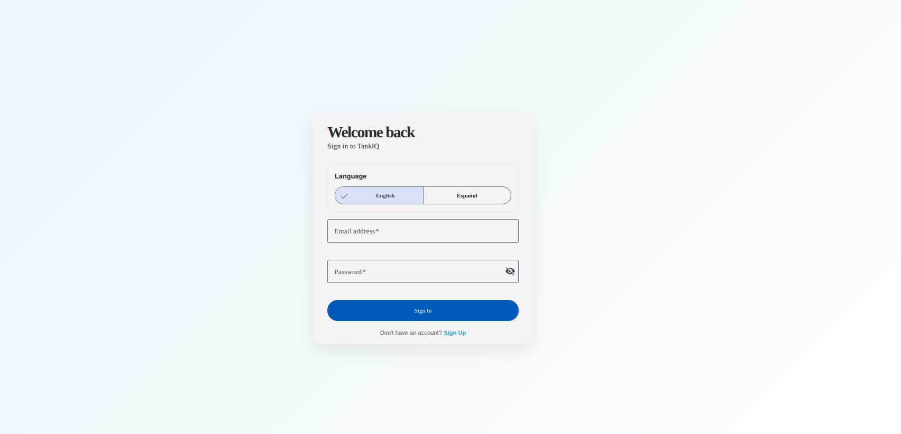

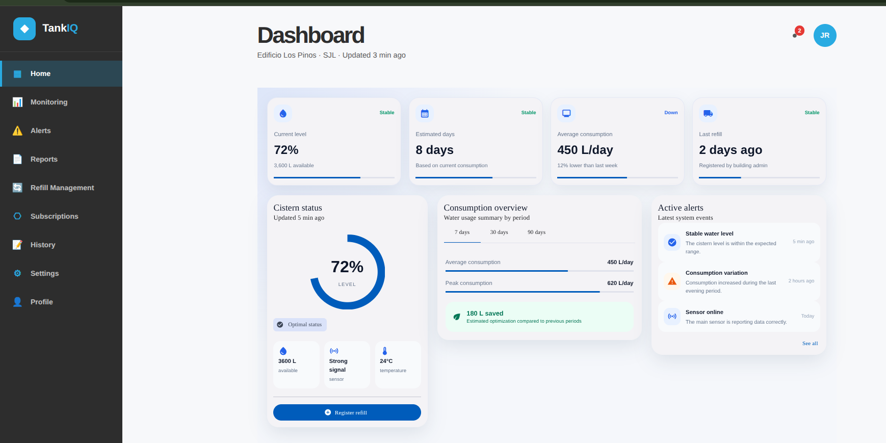

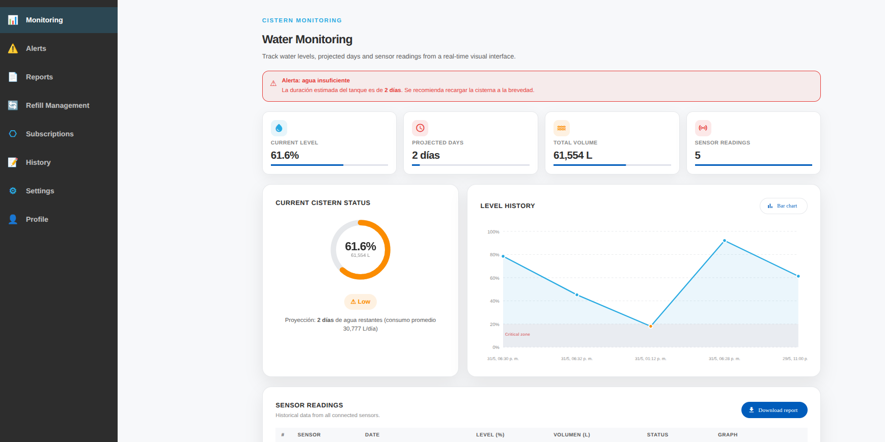

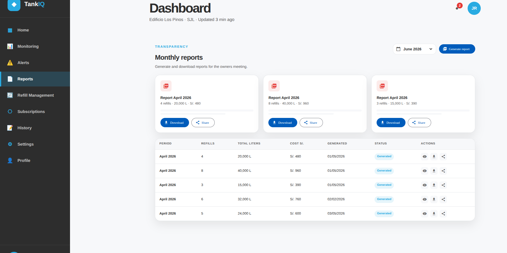

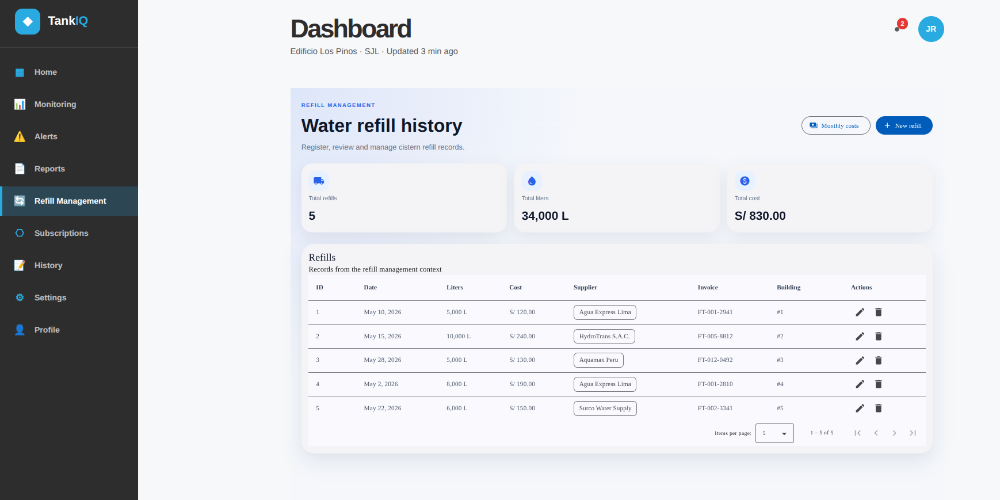

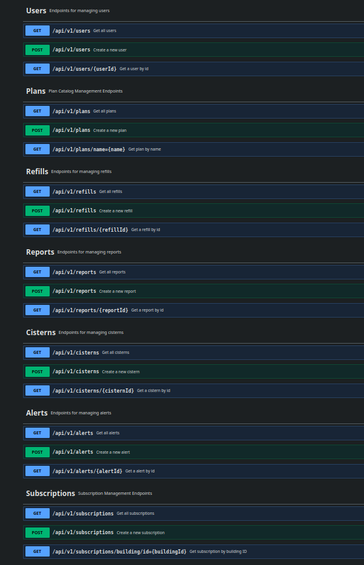

### 5.2.3.6. Services Documentation Evidence for Sprint Review

El repositorio de la aplicación web (HydroTeam-Frontend) contiene una documentación técnica exhaustiva que detalla 
la arquitectura modular del proyecto, el consumo de servicios API, la gestión de estados globales y las configuraciones
de variables de entorno.

### 5.2.3.7. Software Deployment Evidence for Sprint Review

Para el deployment de nuestro Back End usamos los servicios de render para la web service y railway para nuestra base de datos.

A continuacion, la evidencia del deployment:

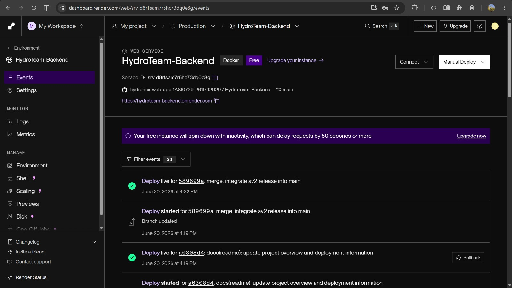

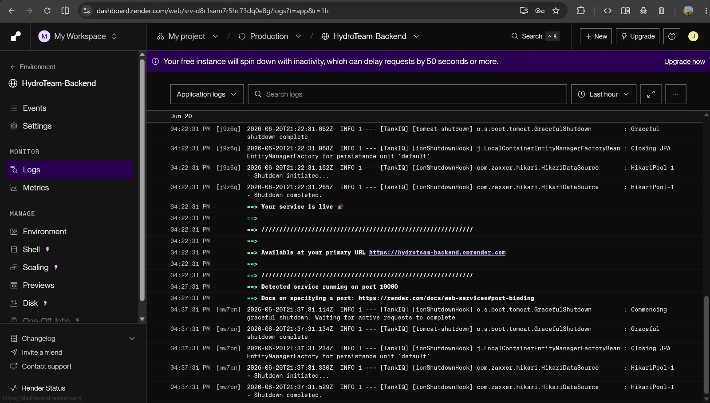

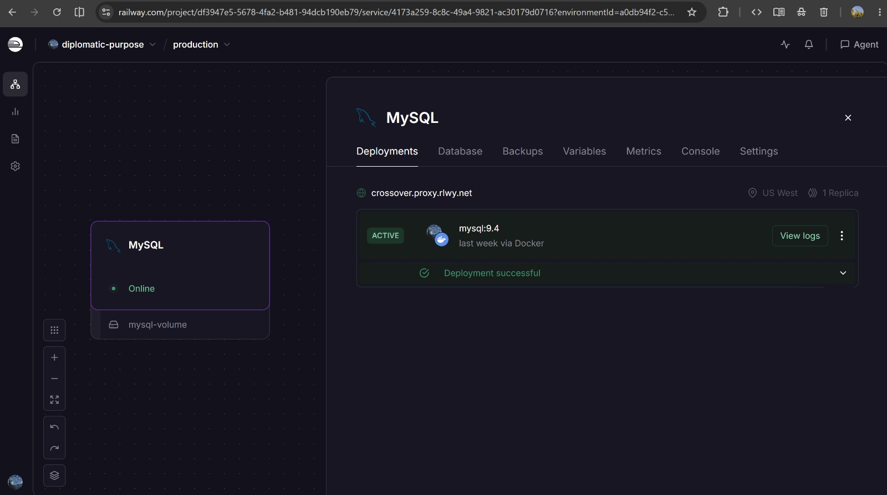

### 5.2.3.8. Team Collaboration Insights during Sprint

- Insight dentro del Front End: implementacion de mejoras.

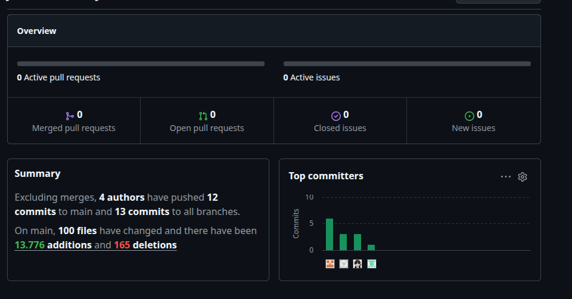

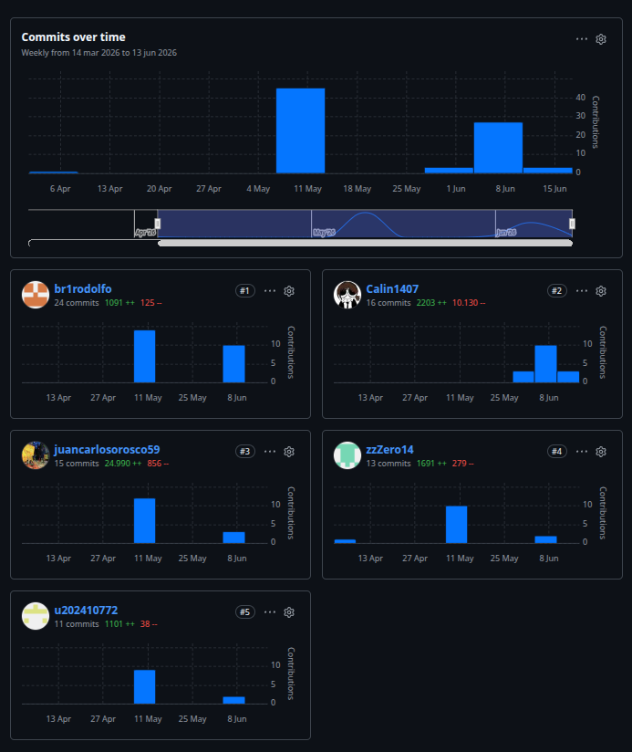

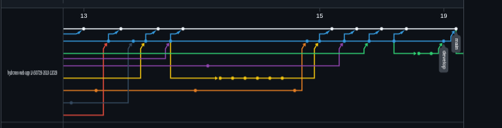

- Insight dentro del Back End: implementacion de patrones CQRS y Domain Driven Design

Debido a una latencia temporal en los servicios de indexación y sincronización de gráficos de GitHub, las visualizaciones 
de actividad del repositorio presentan un desfase respecto a los últimos commits e integraciones realizadas por el equipo. 
Por lo tanto, el reflejo de asistencia y participación actual no coincide con la ejecución real del sprint, la cual se encuentra 
debidamente respaldada en el historial de contribuciones (commit history) y en los logs de la plataforma.

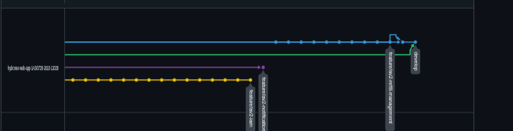

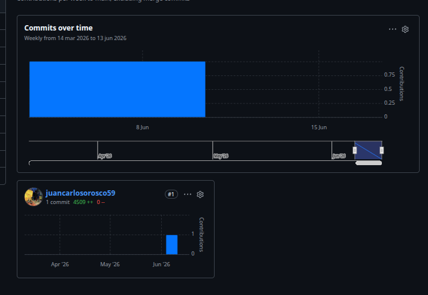

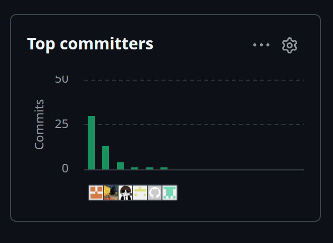

URL del ultimo deploy del Front End: https://tankiq-3c9c2.web.app/

URL del deployment del Back End: https://hydroteam-backend.onrender.com/swagger-ui/index.html 

## 5.3. Validation Interviews.

### 5.3.1. Diseño de Entrevistas.

Con el objetivo de validar la propuesta de solución, se elaboró una guía de entrevistas enfocada en los principales módulos del sistema. Las preguntas fueron diseñadas para identificar posibles problemas relacionados con consistencia visual, comprensión de la información, prevención de errores, eficiencia de uso y facilidad de aprendizaje.

#### Sección 1: Login y Acceso General

1. Cuando eliges el idioma **Español** al iniciar sesión, ¿te resulta incómodo o confuso que al ingresar al sistema algunos menús principales sigan apareciendo en inglés (*Home*, *Monitoring*, *Settings*) o consideras que son fáciles de interpretar?

2. Al escribir tus datos para ingresar a la aplicación, ¿la interfaz te avisa con claridad si cometiste un error en el formato de tu correo antes de intentar presionar el botón **Sign In**?

#### Sección 2: Home

3. Al observar la pantalla principal, ¿te confunde notar que algunos datos indican haber sido actualizados hace 3 minutos mientras que otros muestran una actualización de hace 5 minutos?

4. Si ingresas para revisar el estado actual de la cisterna, ¿te distrae o genera dudas que siga apareciendo una notificación pendiente en la parte superior de la pantalla?

#### Sección 3: Monitoring

5. En la pantalla de monitoreo aparece una tarjeta con el texto **"Sensor Readings: 5"**. ¿Te queda claro qué representa ese valor o te genera dudas sobre el funcionamiento del sensor?

6. Al revisar la gráfica del historial de agua, las fechas mostradas no siguen un orden cronológico claro. ¿Te resulta sencillo interpretar la evolución de los datos en esas condiciones?

7. Si utilizaras la aplicación por primera vez, ¿encuentras fácilmente alguna ayuda o explicación para comprender indicadores como los días estimados de agua disponible?

#### Sección 4: Alerts

8. Al revisar una alerta con el mensaje **"Telemetry sensor SN-PR-005 stopped emitting signal"**, ¿entiendes fácilmente a qué equipo o componente del edificio hace referencia?

9. Si los mensajes de alerta mezclan español e inglés, por ejemplo **"Water level dropped below critical..."**, ¿consideras que esto dificulta comprender rápidamente la situación reportada?

#### Sección 5: Reports

10. Si seleccionas el mes de junio para consultar reportes, pero los documentos mostrados corresponden a abril, ¿te genera dudas sobre si estás visualizando la información correcta?

11. Si necesitas descargar los reportes de varios meses, ¿te parece práctico hacerlo uno por uno o preferirías una opción para descargar varios archivos al mismo tiempo?

#### Sección 6: Refill Management

12. Si eliminas accidentalmente un registro de recarga, ¿esperarías que el sistema solicite una confirmación previa o permita recuperar la información eliminada?

13. En la lista de recargas, algunos nombres de proveedores aparecen dentro de recuadros grises. ¿Te resulta claro que son elementos informativos o parecen botones con alguna acción disponible?

#### Sección 7: Subscription & Billing

14. Al revisar los planes de suscripción, ¿te parece adecuada la presencia de términos como **"Count State"** o considerarías más útil una descripción alineada con el idioma seleccionado?

### 5.3.2. Registro de Entrevistas.

#### Entrevista de Validación 1

- **Nombres y apellidos:** Henry Paul Salinas Vásquez
- **Edad:** 43

- **Inicio:** 0:00
- **Duración:** 8:12
- **URL:** https://youtu.be
- **Resumen:** Henry recorrió los distintos módulos de la aplicación desde el punto de vista de un administrador. Comentó que la información relacionada con el monitoreo del agua y las alertas le parecía útil para tomar decisiones más rápido. Sin embargo, notó que algunos textos seguían apareciendo en inglés aun cuando el idioma seleccionado era español. También mencionó que ciertos mensajes de alerta utilizaban términos demasiado técnicos y que sería más práctico mostrar descripciones más claras para los administradores que no tienen conocimientos especializados. En la sección de reportes consideró útil la información disponible, aunque sugirió facilitar la descarga de varios reportes a la vez.

#### Entrevista de Validación 2

- **Nombres y apellidos:** Giancarlo Aparicio
- **Edad:** 24

- **Inicio:** 0:00
- **Duración:** 9:05
- **URL:** https://www.youtube.com/watch?v=X00zt8gJRis
- **Resumen:** Giancarlo evaluó principalmente las funcionalidades relacionadas con monitoreo, reportes y gestión de recargas. Indicó que la navegación entre módulos le resultó sencilla y que la información estaba organizada de forma lógica. Durante la validación observó que algunos datos mostraban tiempos de actualización distintos, lo que podría generar dudas sobre cuál era la información más reciente. También comentó que la descarga individual de reportes puede resultar poco práctica cuando se necesita revisar información histórica de varios meses.

#### Entrevista de Validación 3

- **Nombres y apellidos:** Matías Mamani
- **Edad:** 23

- **Inicio:** 0:00
- **Duración:** 8:28
- **URL:** https://youtu.be/OmgLlQkflGQ
- **Resumen:** Matías opinó la interfaz de la app TANKIQ. Matías logró registrarse e iniciar sesión sin problemas, pero señaló que la mezcla de inglés y español en el dashboard y en el módulo de alertas le resultaba confusa, ya que ni él ni la mayoría de vecinos de su edificio manejan inglés. Consideró claros el monitoreo, el historial de nivel del agua y la sección de refill y suscripciones, aunque sugirió renombrar "días proyectados" para mayor claridad. También detectó un error en reportes, donde eligiendo junio igual mostraba abril, y propuso generar un reporte consolidado en vez de uno por mes. En general calificó la interfaz como amigable, y al confirmar que la suscripción es por edificio y no por persona, la consideró un precio razonable..

#### Entrevista de Validación 4

- **Nombres y apellidos:** Tagwa Moharam
- **Edad:** 20

- **Inicio:** 0:00
- **Duración:** 6:07
- **URL:** [https://youtu.be](https://youtu.be/ouOLypiM6cs)
- **Resumen:** Tagwa mostró una experiencia bastante positiva en general: los menús en inglés y el mensaje mixto en las alertas no le generaron confusión, ya que logró entenderlos sin problema; valoró que la validación del correo le avisara el error de inmediato; no le pareció confuso ver distintos tiempos de actualización en el Home, ni sintió que la notificación pendiente la distrajera; en Monitoring, entendió bien la tarjeta de lecturas del sensor, siguió sin problema la gráfica del historial de agua y consideró claro el indicador de días estimados de agua disponible; en Reports, no le preocupó ver reportes de un mes distinto al seleccionado y le pareció práctico descargarlos uno por uno; en Refill Management, le gustaría una confirmación antes de eliminar un registro, aunque el proceso le pareció sencillo, y los recuadros con nombres de proveedores los percibió como claros e informativos; y en Subscription & Billing, consideró que el término en inglés es fácil de entender y que la información del plan se ve clara y bien organizada.

#### Entrevista de Validación 5
- **Nombres y apellidos:** Manolo Tapia
- **Edad:** 23

- **Inicio:** 0:00
- **Duración:** 18:55
- **URL:** [https://youtu.be](https://youtu.be/1ZBPI0POc_A)
- **Resumen:** Manolo se enfocó principalmente en optimizar la experiencia de usuario dentro de los módulos de monitoreo, alertas y gestión de recargas. Comentó que el diseño gráfico de la interfaz es bastante intuitivo y valoró la claridad del gráfico de líneas, aunque sugirió limpiar la pantalla principal moviendo las notificaciones a un ícono de campanita y añadiendo un calendario para programar los días de rellenado. Sin embargo, indicó que ciertos indicadores técnicos y comerciales resultan confusos para un usuario nuevo, por lo que propuso incluir descripciones contextuales desplegables mediante clics y usar un lenguaje más accesible y libre de "Spanglish". También pidió que se configuraran mejoras funcionales importantes, como el "download" masivo de reportes mensuales, la posibilidad de compartir mediante un "link", la funcionalidad de pago por sensor individual en las suscripciones y la implementación "mandatory" de la funcionalidad de mensajes de confirmación de seguridad antes de guardar, editar o eliminar cualquier registro.
### 5.3.3. Evaluaciones según heurísticas.

| Heurística de Nielsen | Hallazgo identificado | Evidencia obtenida |
|----------------------|----------------------|-------------------|
| Consistencia y estándares | Persisten términos en inglés dentro de módulos configurados en español. | Los participantes detectaron inconsistencias en IAM, Monitoring y Notifications. |
| Visibilidad del estado del sistema | Algunos datos muestran tiempos de actualización diferentes. | Los usuarios expresaron dudas sobre cuál información reflejaba el estado actual del sistema. |
| Correspondencia entre el sistema y el mundo real | Algunas alertas utilizan códigos o mensajes técnicos difíciles de interpretar. | Los participantes solicitaron mensajes más descriptivos y cercanos al lenguaje cotidiano. |
| Prevención de errores | No queda claro qué ocurre al eliminar ciertos registros de recargas. | Los usuarios esperaban confirmaciones antes de ejecutar acciones críticas. |
| Ayuda y documentación | Algunos indicadores carecen de explicaciones para usuarios nuevos. | Los residentes manifestaron dificultades para interpretar ciertos datos durante el primer uso. |
| Flexibilidad y eficiencia de uso | La descarga individual de reportes puede resultar tediosa para tareas administrativas. | Los administradores sugirieron opciones de descarga múltiple o exportación masiva. |
| Diseño estético y minimalista | Algunos elementos visuales pueden parecer interactivos cuando solo muestran información. | Se identificó confusión en componentes relacionados con recargas y reportes. |

A partir de las entrevistas de validación realizadas, se concluye que los usuarios consideran que la solución propuesta facilita el acceso a información relevante sobre el abastecimiento de agua y mejora la transparencia entre administradores y residentes. Asimismo, se identificaron oportunidades de mejora relacionadas con la consistencia del idioma, la claridad de algunos mensajes técnicos, la incorporación de ayudas contextuales y la optimización de ciertas funcionalidades orientadas a la gestión administrativa.

## 5.4. Video About-the-Product

En esta sección se presenta el video **About-the-Product** correspondiente al desarrollo del proyecto **TankIQ**.

El video muestra la propuesta de valor de la solución, las principales funcionalidades implementadas y los beneficios que ofrece a los usuarios para la gestión y monitoreo de recursos hídricos. Asimismo, se incluyen demostraciones de interacción con la plataforma, destacando los módulos de **Identity and Access Management (IAM)**, **Water Monitoring**, **Refill Management**, **Notifications**, **Reporting** y **Subscription & Billing**.

- **YouTube:** [Ver video en YouTube](https://youtu.be/sqquceM_tlM)
- **Microsoft Stream:** [Ver video en Microsoft Stream](https://upcedupe-my.sharepoint.com/:v:/g/personal/u202414840_upc_edu_pe/IQDmiJZY94F_SJMXyUTlQ2fOAYgmpgPkqXNgGyKReD5_eg8?nav=eyJyZWZlcnJhbEluZm8iOnsicmVmZXJyYWxBcHAiOiJPbmVEcml2ZUZvckJ1c2luZXNzIiwicmVmZXJyYWxBcHBQbGF0Zm9ybSI6IldlYiIsInJlZmVycmFsTW9kZSI6InZpZXciLCJyZWZlcnJhbFZpZXciOiJNeUZpbGVzTGlua0NvcHkifX0&e=FzewOv)

